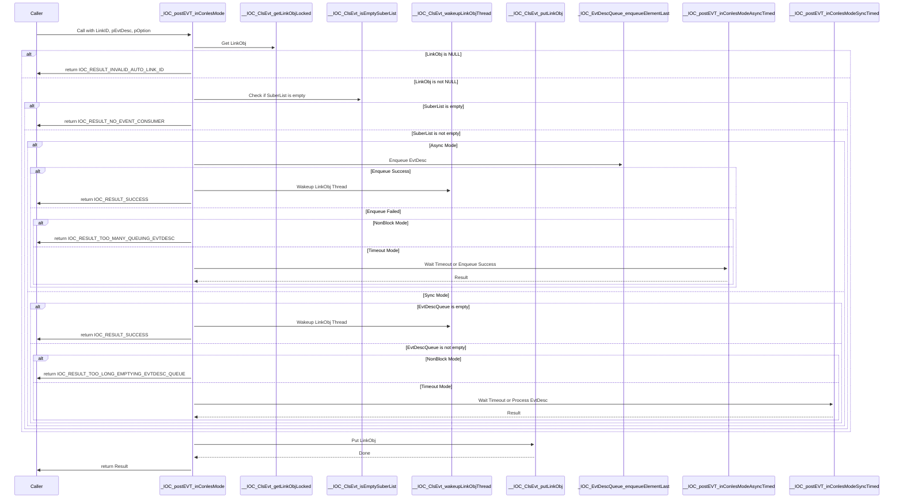

```mermaid
sequenceDiagram
    participant Caller
    participant _IOC_postEVT_inConlesMode
    participant __IOC_ClsEvt_getLinkObjLocked
    participant __IOC_ClsEvt_isEmptySuberList
    participant __IOC_ClsEvt_wakeupLinkObjThread
    participant __IOC_ClsEvt_putLinkObj
    participant _IOC_EvtDescQueue_enqueueElementLast
    participant __IOC_postEVT_inConlesModeAsyncTimed
    participant __IOC_postEVT_inConlesModeSyncTimed

    Caller->>+_IOC_postEVT_inConlesMode: Call with LinkID, pEvtDesc, pOption
    _IOC_postEVT_inConlesMode->>+__IOC_ClsEvt_getLinkObjLocked: Get LinkObj
    alt LinkObj is NULL
        _IOC_postEVT_inConlesMode->>Caller: return IOC_RESULT_INVALID_AUTO_LINK_ID
    else LinkObj is not NULL
        _IOC_postEVT_inConlesMode->>+__IOC_ClsEvt_isEmptySuberList: Check if SuberList is empty
        alt SuberList is empty
            _IOC_postEVT_inConlesMode->>Caller: return IOC_RESULT_NO_EVENT_CONSUMER
        else SuberList is not empty
            alt Async Mode
                _IOC_postEVT_inConlesMode->>+_IOC_EvtDescQueue_enqueueElementLast: Enqueue EvtDesc
                alt Enqueue Success
                    _IOC_postEVT_inConlesMode->>+__IOC_ClsEvt_wakeupLinkObjThread: Wakeup LinkObj Thread
                    _IOC_postEVT_inConlesMode->>Caller: return IOC_RESULT_SUCCESS
                else Enqueue Failed
                    alt NonBlock Mode
                        _IOC_postEVT_inConlesMode->>Caller: return IOC_RESULT_TOO_MANY_QUEUING_EVTDESC
                    else Timeout Mode
                        _IOC_postEVT_inConlesMode->>+__IOC_postEVT_inConlesModeAsyncTimed: Wait Timeout or Enqueue Success
                        __IOC_postEVT_inConlesModeAsyncTimed-->>_IOC_postEVT_inConlesMode: Result
                    end
                end
            else Sync Mode
                alt EvtDescQueue is empty
                    _IOC_postEVT_inConlesMode->>+__IOC_ClsEvt_wakeupLinkObjThread: Wakeup LinkObj Thread
                    _IOC_postEVT_inConlesMode->>Caller: return IOC_RESULT_SUCCESS
                else EvtDescQueue is not empty
                    alt NonBlock Mode
                        _IOC_postEVT_inConlesMode->>Caller: return IOC_RESULT_TOO_LONG_EMPTYING_EVTDESC_QUEUE
                    else Timeout Mode
                        _IOC_postEVT_inConlesMode->>+__IOC_postEVT_inConlesModeSyncTimed: Wait Timeout or Process EvtDesc
                        __IOC_postEVT_inConlesModeSyncTimed-->>_IOC_postEVT_inConlesMode: Result
                    end
                end
            end
        end
    end
    _IOC_postEVT_inConlesMode->>+__IOC_ClsEvt_putLinkObj: Put LinkObj
    __IOC_ClsEvt_putLinkObj-->>_IOC_postEVT_inConlesMode: Done
    _IOC_postEVT_inConlesMode->>Caller: return Result
```