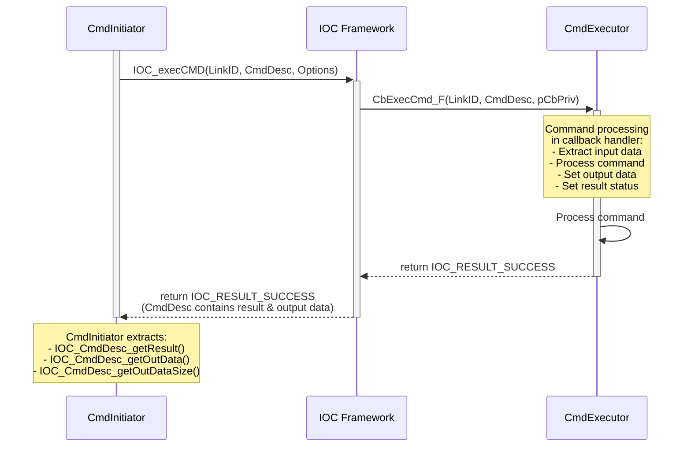
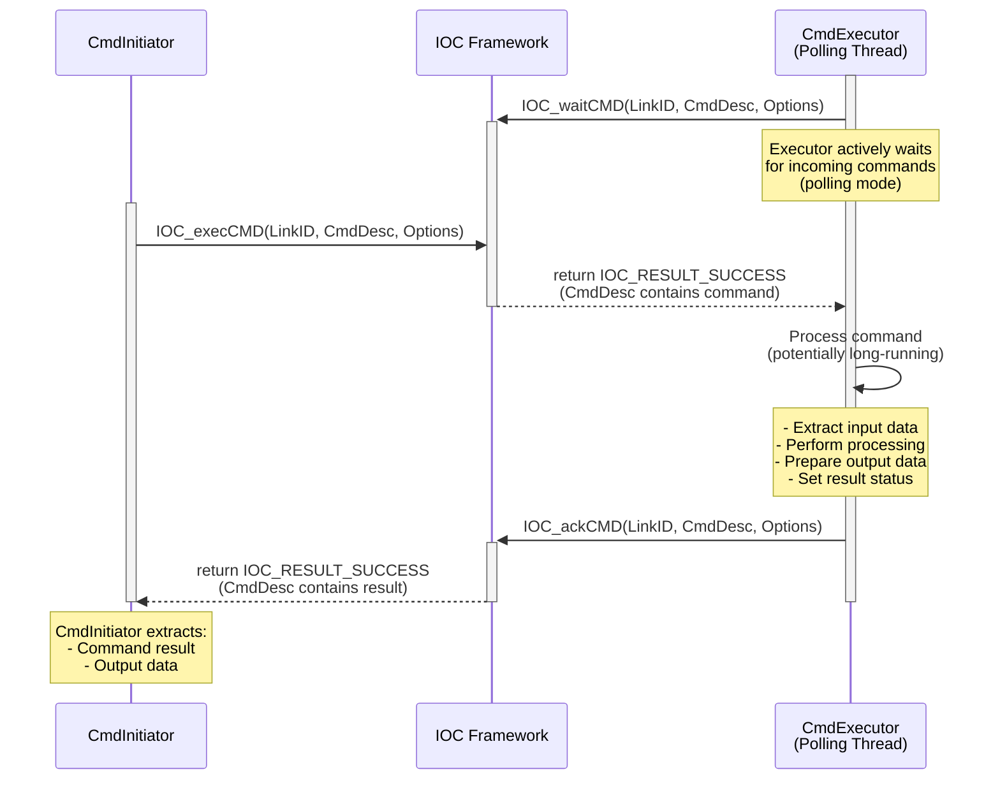
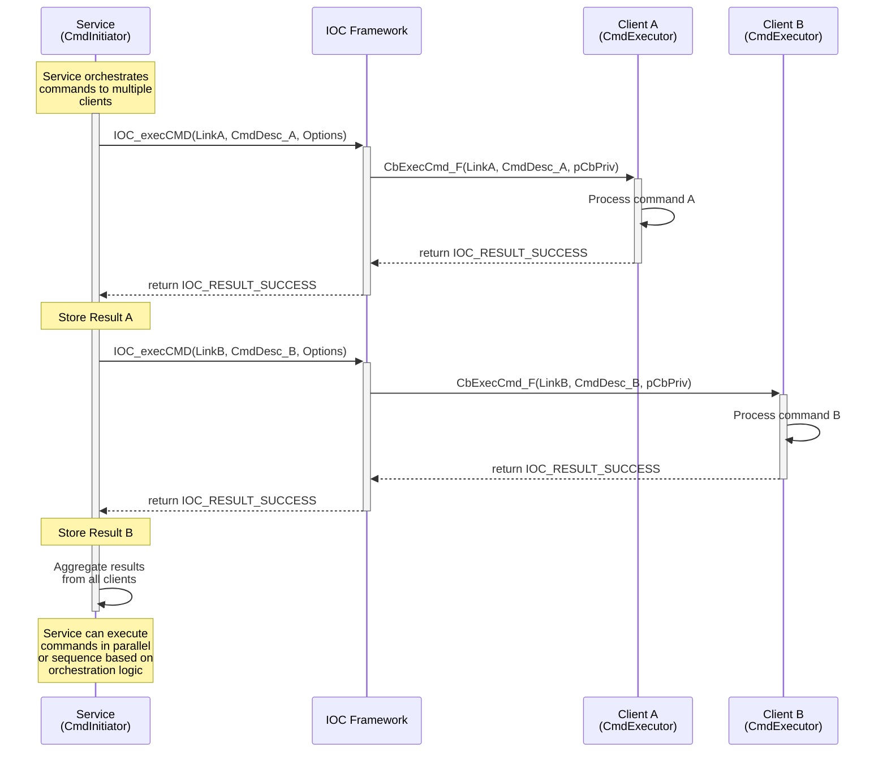

# IOC Command Execution (CMD) User Guide

## Table of Contents
- [Overview](#overview)
- [API Reference](#api-reference)
- [Command Architecture](#command-architecture)
- [Typical Usage Patterns](#typical-usage-patterns)
- [Code Examples from Test Cases](#code-examples-from-test-cases)
- [Best Practices](#best-practices)
- [Error Handling](#error-handling)
- [Performance Considerations](#performance-considerations)
- [Troubleshooting](#troubleshooting)

## Overview

The IOC Command Execution (CMD) subsystem provides synchronous, request-response communication between services and clients. CMD enables reliable command execution with guaranteed responses, supporting both callback-based and polling-based command processing patterns.

### Key Features
- **Synchronous Execution**: CmdInitiator waits for command completion and result
- **Request-Response Pattern**: Guaranteed response with result data or error information
- **Flexible Execution Modes**: Callback-based and polling-based command processing
- **NODROP Guarantee**: Reliable command delivery and response
- **Timeout Support**: Configurable timeout for command execution
- **Bi-directional Roles**: Services and clients can be either CmdInitiator or CmdExecutor

### Command Execution Roles

#### CmdInitiator
- Sends commands using `IOC_execCMD`
- Waits synchronously for command results
- Can be either service or client

#### CmdExecutor
- Receives and processes commands
- Returns results to CmdInitiator
- Supports both callback (`CbExecCmd_F`) and polling (`IOC_waitCMD + IOC_ackCMD`) modes

## API Reference

### Core APIs (from IOC_CmdAPI.h)

#### IOC_execCMD
```c
IOC_Result_T IOC_execCMD(IOC_LinkID_T LinkID, IOC_CmdDesc_pT pCmdDesc, IOC_Options_pT pOption);
```
- **Purpose**: Execute a command on the specified link
- **Usage**: CmdInitiator calls this API to send a command to CmdExecutor and get result synchronously
- **Options**: Supports IOC_OPTID_TIMEOUT, IOC_OPTID_BLOCKING_MODE, IOC_OPTID_RELIABILITY_MODE
- **Return Codes**:
  - `IOC_RESULT_SUCCESS`: Command executed successfully
  - `IOC_RESULT_NO_CMD_EXECUTOR`: No CmdExecutor registered for this command
  - `IOC_RESULT_BUSY`: CmdExecutor is busy (when immediate NONBLOCK mode)
  - `IOC_RESULT_TIMEOUT`: Command execution timeout
  - `IOC_RESULT_CMD_EXEC_FAILED`: CmdExecutor returned failure
  - `IOC_RESULT_LINK_BROKEN`: Communication link is broken during execution
  - `IOC_RESULT_INVALID_PARAM`: Invalid parameters
  - `IOC_RESULT_NOT_EXIST_LINK`: LinkID does not exist or already closed

#### IOC_waitCMD
```c
IOC_Result_T IOC_waitCMD(IOC_LinkID_T LinkID, IOC_CmdDesc_pT pCmdDesc, IOC_Options_pT pOption);
```
- **Purpose**: Wait for a command on the specified link (polling mode)
- **Usage**: CmdExecutor calls this API to actively wait for commands when using polling mode
- **Alternative**: Instead of automatic callback via CbExecCmd_F
- **Options**: Supports IOC_OPTID_TIMEOUT
- **Return Codes**:
  - `IOC_RESULT_SUCCESS`: Command received successfully
  - `IOC_RESULT_TIMEOUT`: Wait timeout (when timeout configured)
  - `IOC_RESULT_LINK_BROKEN`: Communication link is broken
  - `IOC_RESULT_INVALID_PARAM`: Invalid parameters
  - `IOC_RESULT_NOT_EXIST_LINK`: LinkID does not exist or already closed

#### IOC_ackCMD
```c
IOC_Result_T IOC_ackCMD(IOC_LinkID_T LinkID, IOC_CmdDesc_pT pCmdDesc, IOC_Options_pT pOption);
```
- **Purpose**: Acknowledge a command with result data
- **Usage**: CmdExecutor calls this API to send command result back to CmdInitiator
- **Usage Pattern**: Used with IOC_waitCMD for polling-based command processing
- **Options**: Supports IOC_OPTID_TIMEOUT
- **Return Codes**:
  - `IOC_RESULT_SUCCESS`: Command response sent successfully
  - `IOC_RESULT_ACK_CMD_FAILED`: Failed to send command response
  - `IOC_RESULT_TIMEOUT`: Ack timeout
  - `IOC_RESULT_LINK_BROKEN`: Communication link is broken
  - `IOC_RESULT_INVALID_PARAM`: Invalid parameters
  - `IOC_RESULT_NOT_EXIST_LINK`: LinkID does not exist or already closed

### Command Executor Callback Types
```c
// Command execution callback function type (defined in IOC_SrvTypes.h)
typedef IOC_Result_T (*IOC_CbExecCmd_F)(IOC_LinkID_T LinkID, IOC_CmdDesc_pT pCmdDesc, void *pCbPriv);

// Command usage arguments structure (defined in IOC_SrvTypes.h)
typedef struct {
    IOC_CbExecCmd_F CbExecCmd_F;    // Command execution callback
    void *pCbPrivData;              // Callback private context data
    ULONG_T CmdNum;                 // Number of CmdIDs that this executor handles
    IOC_CmdID_T *pCmdIDs;           // Array of CmdIDs that this executor handles
} IOC_CmdUsageArgs_T;
```

## Command Architecture

### Command Flow Patterns

#### Pattern 1: Callback-based Command Execution

The CmdInitiator sends a command and waits synchronously while the CmdExecutor automatically processes it via callback and returns the result.



#### Pattern 2: Polling-based Command Execution

The CmdInitiator sends a command and waits while the CmdExecutor actively polls for commands, processes them, and explicitly acknowledges with results.



#### Pattern 3: Service Command Orchestration

A Service acts as CmdInitiator to orchestrate commands across multiple clients (CmdExecutors), aggregating results.



## Typical Usage Patterns

### Pattern 1: Client-to-Service Command (Client as CmdInitiator)

#### Service Setup as CmdExecutor
```c
// Command execution callback for service
static IOC_Result_T ServiceCmdExecutorCallback(IOC_LinkID_T LinkID, 
                                              IOC_CmdDesc_pT pCmdDesc, 
                                              void *pCbPriv) {
    ServiceContext_T *pContext = (ServiceContext_T *)pCbPriv;
    
    switch (IOC_CmdDesc_getCmdID(pCmdDesc)) {
        case IOC_CMDID_TEST_PING:
            return handlePingCommand(pCmdDesc, pContext);
            
        case IOC_CMDID_TEST_ECHO:
            return handleEchoCommand(pCmdDesc, pContext);
            
        case IOC_CMDID_CUSTOM_PROCESS_DATA:
            return handleDataProcessingCommand(pCmdDesc, pContext);
            
        default:
            printf("Service: Unknown command ID %llu\n", IOC_CmdDesc_getCmdID(pCmdDesc));
            IOC_CmdDesc_setResult(pCmdDesc, IOC_RESULT_NOT_SUPPORTED);
            return IOC_RESULT_NOT_SUPPORTED;
    }
}

// Setup service as command executor
IOC_Result_T setupServiceAsCmdExecutor(IOC_SrvID_pT pSrvID, ServiceContext_T *pContext) {
    IOC_CmdUsageArgs_T CmdUsageArgs = {
        .CbExecCmd_F = ServiceCmdExecutorCallback,
        .pCbPrivData = pContext,
        .CmdNum = 0,      // 0 means handle all commands
        .pCmdIDs = NULL   // NULL means no specific command filter
    };
    
    IOC_SrvArgs_T SrvArgs = {0};
    IOC_Helper_initSrvArgs(&SrvArgs);
    SrvArgs.SrvURI.pProtocol = IOC_SRV_PROTO_FIFO;
    SrvArgs.SrvURI.pHost = IOC_SRV_HOST_LOCAL_PROCESS;
    SrvArgs.SrvURI.pPath = "CommandProcessorService";
    SrvArgs.SrvURI.Port = 0;
    SrvArgs.UsageCapabilites = IOC_LinkUsageCmdExecutor;
    SrvArgs.UsageArgs.pCmd = &CmdUsageArgs;  // Correct field name: pCmd not pCmdExecArgs
    SrvArgs.Flags = IOC_SRVFLAG_AUTO_ACCEPT;
    
    return IOC_onlineService(pSrvID, &SrvArgs);
}

// Command handler implementation
static IOC_Result_T handlePingCommand(IOC_CmdDesc_pT pCmdDesc, ServiceContext_T *pContext) {
    printf("Service: Processing PING command\n");
    
    // Get input data
    size_t inputSize = IOC_CmdDesc_getInDataSize(pCmdDesc);
    const void *pInputData = IOC_CmdDesc_getInData(pCmdDesc);
    
    if (inputSize > 0) {
        printf("Service: Ping with data: %.*s\n", (int)inputSize, (char*)pInputData);
    }
    
    // Prepare response
    const char *response = "PONG from service";
    IOC_CmdDesc_setOutData(pCmdDesc, (void*)response, strlen(response) + 1);
    IOC_CmdDesc_setResult(pCmdDesc, IOC_RESULT_SUCCESS);
    
    pContext->commandsProcessed++;
    
    return IOC_RESULT_SUCCESS;
}

// Client connects and executes commands
IOC_Result_T clientExecuteCommand(const char *servicePath, IOC_CmdID_T cmdID, 
                                const void *inputData, size_t inputSize,
                                void *outputBuffer, size_t outputBufferSize,
                                size_t *pOutputSize) {
    IOC_LinkID_T LinkID;
    
    // Connect to service as CmdInitiator
    IOC_ConnArgs_T ConnArgs = {0};
    IOC_Helper_initConnArgs(&ConnArgs);
    ConnArgs.SrvURI.pProtocol = IOC_SRV_PROTO_FIFO;
    ConnArgs.SrvURI.pHost = IOC_SRV_HOST_LOCAL_PROCESS;
    ConnArgs.SrvURI.pPath = servicePath;
    ConnArgs.Usage = IOC_LinkUsageCmdInitiator;
    
    IOC_Result_T result = IOC_connectService(&LinkID, &ConnArgs, NULL);
    if (result != IOC_RESULT_SUCCESS) return result;
    
    // Prepare command descriptor
    IOC_CmdDesc_T CmdDesc = {0};
    IOC_CmdDesc_init(&CmdDesc);
    IOC_CmdDesc_setCmdID(&CmdDesc, cmdID);
    IOC_CmdDesc_setStatus(&CmdDesc, IOC_CMD_STATUS_PENDING);
    
    if (inputData && inputSize > 0) {
        IOC_CmdDesc_setInData(&CmdDesc, (void*)inputData, inputSize);
    }
    
    // Execute command synchronously
    result = IOC_execCMD(LinkID, &CmdDesc, NULL);
    
    if (result == IOC_RESULT_SUCCESS) {
        // Extract result
        IOC_Result_T cmdResult = IOC_CmdDesc_getResult(&CmdDesc);
        if (cmdResult == IOC_RESULT_SUCCESS) {
            // Extract output data
            size_t outDataSize = IOC_CmdDesc_getOutDataSize(&CmdDesc);
            const void *pOutData = IOC_CmdDesc_getOutData(&CmdDesc);
            
            if (outputBuffer && pOutData && outDataSize > 0) {
                size_t copySize = (outDataSize > outputBufferSize) ? outputBufferSize : outDataSize;
                memcpy(outputBuffer, pOutData, copySize);
                if (pOutputSize) *pOutputSize = copySize;
            }
        }
        result = cmdResult;
    }
    
    IOC_closeLink(LinkID);
    return result;
}
```

### Pattern 2: Service-to-Client Command (Service as CmdInitiator)

#### Service as CmdInitiator for Client Orchestration
```c
// Service sends commands to multiple clients
IOC_Result_T serviceOrchestrateBroadcastCommand(IOC_SrvID_T SrvID, 
                                               IOC_CmdID_T cmdID,
                                               const void *commandData, 
                                               size_t dataSize) {
    // Get all connected client links (implementation depends on service design)
    IOC_LinkID_T clientLinks[MAX_CLIENTS];
    size_t clientCount = getConnectedClients(SrvID, clientLinks, MAX_CLIENTS);
    
    printf("Service: Broadcasting command %llu to %zu clients\n", cmdID, clientCount);
    
    IOC_Result_T overallResult = IOC_RESULT_SUCCESS;
    
    for (size_t i = 0; i < clientCount; i++) {
        IOC_CmdDesc_T CmdDesc = {0};
        IOC_CmdDesc_init(&CmdDesc);
        IOC_CmdDesc_setCmdID(&CmdDesc, cmdID);
        IOC_CmdDesc_setStatus(&CmdDesc, IOC_CMD_STATUS_PENDING);
        
        if (commandData && dataSize > 0) {
            IOC_CmdDesc_setInData(&CmdDesc, (void*)commandData, dataSize);
        }
        
        // Execute command on this client
        IOC_Result_T result = IOC_execCMD(clientLinks[i], &CmdDesc, NULL);
        
        if (result == IOC_RESULT_SUCCESS) {
            IOC_Result_T cmdResult = IOC_CmdDesc_getResult(&CmdDesc);
            printf("Service: Client %zu command result: %s\n", 
                   i, IOC_getResultStr(cmdResult));
                   
            if (cmdResult != IOC_RESULT_SUCCESS) {
                overallResult = cmdResult;
            }
        } else {
            printf("Service: Failed to execute command on client %zu: %s\n", 
                   i, IOC_getResultStr(result));
            overallResult = result;
        }
    }
    
    return overallResult;
}

// Client setup as CmdExecutor
IOC_Result_T setupClientAsCmdExecutor(const char *servicePath, 
                                    ClientContext_T *pClientContext) {
    IOC_LinkID_T LinkID;
    
    // Setup command execution capability
    IOC_CmdUsageArgs_T CmdUsageArgs = {
        .CbExecCmd_F = ClientCmdExecutorCallback,
        .pCbPrivData = pClientContext,
        .CmdNum = 0,
        .pCmdIDs = NULL
    };
    
    IOC_ConnArgs_T ConnArgs = {0};
    IOC_Helper_initConnArgs(&ConnArgs);
    ConnArgs.SrvURI.pProtocol = IOC_SRV_PROTO_FIFO;
    ConnArgs.SrvURI.pHost = IOC_SRV_HOST_LOCAL_PROCESS;
    ConnArgs.SrvURI.pPath = servicePath;
    ConnArgs.Usage = IOC_LinkUsageCmdExecutor;
    ConnArgs.UsageArgs.pCmd = &CmdUsageArgs;  // Correct field name: pCmd
    
    IOC_Result_T result = IOC_connectService(&LinkID, &ConnArgs, NULL);
    if (result == IOC_RESULT_SUCCESS) {
        pClientContext->linkID = LinkID;
    }
    
    return result;
}

// Client command executor callback
static IOC_Result_T ClientCmdExecutorCallback(IOC_LinkID_T LinkID, 
                                             IOC_CmdDesc_pT pCmdDesc, 
                                             void *pCbPriv) {
    ClientContext_T *pContext = (ClientContext_T *)pCbPriv;
    
    switch (IOC_CmdDesc_getCmdID(pCmdDesc)) {
        case IOC_CMDID_CLIENT_STATUS_QUERY:
            return handleStatusQuery(pCmdDesc, pContext);
            
        case IOC_CMDID_CLIENT_CONFIG_UPDATE:
            return handleConfigUpdate(pCmdDesc, pContext);
            
        case IOC_CMDID_CLIENT_SHUTDOWN:
            return handleShutdownRequest(pCmdDesc, pContext);
            
        default:
            printf("Client: Unknown command ID %llu\n", IOC_CmdDesc_getCmdID(pCmdDesc));
            IOC_CmdDesc_setResult(pCmdDesc, IOC_RESULT_NOT_SUPPORTED);
            return IOC_RESULT_NOT_SUPPORTED;
    }
}
```

### Pattern 3: Polling-based Command Processing

#### Wait-Acknowledge Pattern for Delayed Processing
```c
// Service using polling mode for command processing
typedef struct {
    IOC_LinkID_T linkID;
    bool shouldRun;
    uint32_t commandsProcessed;
    uint32_t delayMs;
    std::atomic<bool> processingComplete;
} PollingServiceContext_T;

// Polling loop for command processing
void* servicePollingThread(void *pArg) {
    PollingServiceContext_T *pContext = (PollingServiceContext_T *)pArg;
    
    printf("Service: Starting command polling loop\n");
    
    while (pContext->shouldRun) {
        IOC_CmdDesc_T CmdDesc = {0};
        IOC_CmdDesc_init(&CmdDesc);
        IOC_CmdDesc_setStatus(&CmdDesc, IOC_CMD_STATUS_PENDING);
        
        // Wait for incoming command with timeout
        IOC_Options_T waitOptions = {0};
        IOC_Option_defineTimeout(&waitOptions, 1000);  // 1 second timeout
        
        IOC_Result_T result = IOC_waitCMD(pContext->linkID, &CmdDesc, &waitOptions);
        
        if (result == IOC_RESULT_SUCCESS) {
            printf("Service: Received command %llu via polling\n", 
                   IOC_CmdDesc_getCmdID(&CmdDesc));
            
            // Simulate delayed processing
            if (pContext->delayMs > 0) {
                printf("Service: Processing command with %u ms delay\n", pContext->delayMs);
                usleep(pContext->delayMs * 1000);
            }
            
            // Process command
            IOC_Result_T processResult = processPolledCommand(&CmdDesc, pContext);
            
            // Send acknowledgment with result
            IOC_Result_T ackResult = IOC_ackCMD(pContext->linkID, &CmdDesc, NULL);
            if (ackResult != IOC_RESULT_SUCCESS) {
                printf("Service: Failed to acknowledge command: %s\n", 
                       IOC_getResultStr(ackResult));
            }
            
            pContext->commandsProcessed++;
            pContext->processingComplete = true;
            
        } else if (result == IOC_RESULT_TIMEOUT) {
            // Normal timeout, continue polling
            continue;
        } else {
            printf("Service: Wait command failed: %s\n", IOC_getResultStr(result));
            break;
        }
    }
    
    printf("Service: Exiting command polling loop\n");
    return NULL;
}

// Setup service with polling-based command processing
IOC_Result_T setupPollingService(IOC_SrvID_pT pSrvID, PollingServiceContext_T *pContext) {
    IOC_SrvArgs_T SrvArgs = {0};
    IOC_Helper_initSrvArgs(&SrvArgs);
    SrvArgs.SrvURI.pProtocol = IOC_SRV_PROTO_FIFO;
    SrvArgs.SrvURI.pHost = IOC_SRV_HOST_LOCAL_PROCESS;
    SrvArgs.SrvURI.pPath = "PollingCmdService";
    SrvArgs.SrvURI.Port = 0;
    SrvArgs.UsageCapabilites = IOC_LinkUsageCmdExecutor;
    // Note: No CbExecCmd_F callback - using polling mode
    SrvArgs.Flags = IOC_SRVFLAG_AUTO_ACCEPT;
    
    IOC_Result_T result = IOC_onlineService(pSrvID, &SrvArgs);
    if (result == IOC_RESULT_SUCCESS) {
        // Start polling thread
        pContext->shouldRun = true;
        pthread_t pollingThread;
        pthread_create(&pollingThread, NULL, servicePollingThread, pContext);
        pthread_detach(pollingThread);
    }
    
    return result;
}

static IOC_Result_T processPolledCommand(IOC_CmdDesc_pT pCmdDesc, 
                                       PollingServiceContext_T *pContext) {
    switch (IOC_CmdDesc_getCmdID(pCmdDesc)) {
        case IOC_CMDID_TEST_PING: {
            const char *response = "PONG from polling service";
            IOC_CmdDesc_setOutData(pCmdDesc, (void*)response, strlen(response) + 1);
            IOC_CmdDesc_setResult(pCmdDesc, IOC_RESULT_SUCCESS);
            return IOC_RESULT_SUCCESS;
        }
        
        case IOC_CMDID_TEST_DELAYED_PROCESS: {
            // Command requires extended processing time
            printf("Service: Starting delayed processing...\n");
            
            // Simulate complex processing
            for (int i = 0; i < 5; i++) {
                usleep(100000);  // 100ms per step
                printf("Service: Processing step %d/5\n", i + 1);
            }
            
            const char *response = "Delayed processing completed";
            IOC_CmdDesc_setOutData(pCmdDesc, (void*)response, strlen(response) + 1);
            IOC_CmdDesc_setResult(pCmdDesc, IOC_RESULT_SUCCESS);
            return IOC_RESULT_SUCCESS;
        }
        
        default:
            IOC_CmdDesc_setResult(pCmdDesc, IOC_RESULT_NOT_SUPPORTED);
            return IOC_RESULT_NOT_SUPPORTED;
    }
}
```

## Code Examples from Test Cases

### Example 1: Basic Command Execution (from UT_CommandTypical.cxx)

```c
// Basic client-to-service command execution
TEST(UT_ConetCommandTypical, verifyClientAsCmdInitiator_bySingleService_expectExecution) {
    IOC_SrvID_T SrvID = IOC_ID_INVALID;
    IOC_LinkID_T CliLinkID = IOC_ID_INVALID;
    
    // Setup service as CmdExecutor
    TypicalServicePrivateData_T SrvPrivData = {0};
    IOC_CmdExecArgs_T CmdExecArgs = {
        .CbExecCmd_F = TypicalServiceExecutorCallback,
        .pCbPrivData = &SrvPrivData
    };
    
    IOC_SrvArgs_T SrvArgs = {0};
    IOC_Helper_initSrvArgs(&SrvArgs);
    SrvArgs.SrvURI.pProtocol = IOC_SRV_PROTO_FIFO;
    SrvArgs.SrvURI.pHost = IOC_SRV_HOST_LOCAL_PROCESS;
    SrvArgs.SrvURI.pPath = "TestCmdExecutor";
    SrvArgs.UsageCapabilites = IOC_LinkUsageCmdExecutor;
    SrvArgs.UsageArgs.pCmdExecArgs = &CmdExecArgs;
    SrvArgs.Flags = IOC_SRVFLAG_AUTO_ACCEPT;
    
    ASSERT_EQ(IOC_RESULT_SUCCESS, IOC_onlineService(&SrvID, &SrvArgs));
    
    // Client connects as CmdInitiator
    IOC_ConnArgs_T ConnArgs = {0};
    IOC_Helper_initConnArgs(&ConnArgs);
    ConnArgs.SrvURI = SrvArgs.SrvURI;
    ConnArgs.Usage = IOC_LinkUsageCmdInitiator;
    
    ASSERT_EQ(IOC_RESULT_SUCCESS, IOC_connectService(&CliLinkID, &ConnArgs));
    
    // Execute command
    IOC_CmdDesc_T CmdDesc = {0};
    IOC_CmdDesc_init(&CmdDesc);
    IOC_CmdDesc_setCmdID(&CmdDesc, IOC_CMDID_TEST_PING);
    IOC_CmdDesc_setStatus(&CmdDesc, IOC_CMD_STATUS_PENDING);
    
    const char *inputData = "Hello from client";
    IOC_CmdDesc_setInData(&CmdDesc, (void*)inputData, strlen(inputData) + 1);
    
    ASSERT_EQ(IOC_RESULT_SUCCESS, IOC_execCMD(CliLinkID, &CmdDesc, NULL));
    
    // Verify command execution
    EXPECT_EQ(IOC_CMD_STATUS_SUCCESS, IOC_CmdDesc_getStatus(&CmdDesc));
    EXPECT_EQ(IOC_RESULT_SUCCESS, IOC_CmdDesc_getResult(&CmdDesc));
    
    // Verify response data
    size_t outDataSize = IOC_CmdDesc_getOutDataSize(&CmdDesc);
    const void *pOutData = IOC_CmdDesc_getOutData(&CmdDesc);
    EXPECT_GT(outDataSize, 0);
    EXPECT_STREQ("PONG response", (const char*)pOutData);
    
    // Verify service processed the command
    EXPECT_TRUE(SrvPrivData.CommandExecuted);
    EXPECT_EQ(IOC_CMDID_TEST_PING, SrvPrivData.LastCmdID);
    EXPECT_EQ(1, SrvPrivData.CommandCount);
    
    // Cleanup
    IOC_closeLink(CliLinkID);
    IOC_offlineService(SrvID);
}
```

### Example 2: Command Executor Callback (from UT_CommandTypical.cxx)

```c
typedef struct {
    bool CommandExecuted;
    IOC_CmdID_T LastCmdID;
    uint32_t CommandCount;
    char LastInputData[256];
    size_t LastInputDataSize;
} TypicalServicePrivateData_T;

static IOC_Result_T TypicalServiceExecutorCallback(IOC_LinkID_T LinkID, 
                                                  IOC_CmdDesc_pT pCmdDesc, 
                                                  void *pCbPriv) {
    TypicalServicePrivateData_T *pPrivData = (TypicalServicePrivateData_T *)pCbPriv;
    
    // Record command execution
    pPrivData->CommandExecuted = true;
    pPrivData->LastCmdID = IOC_CmdDesc_getCmdID(pCmdDesc);
    pPrivData->CommandCount++;
    
    // Extract input data
    size_t inDataSize = IOC_CmdDesc_getInDataSize(pCmdDesc);
    const void *pInData = IOC_CmdDesc_getInData(pCmdDesc);
    
    if (inDataSize > 0 && pInData) {
        pPrivData->LastInputDataSize = (inDataSize < sizeof(pPrivData->LastInputData)) ? 
                                       inDataSize : sizeof(pPrivData->LastInputData) - 1;
        memcpy(pPrivData->LastInputData, pInData, pPrivData->LastInputDataSize);
        pPrivData->LastInputData[pPrivData->LastInputDataSize] = '\0';
    }
    
    // Process command based on command ID
    switch (pPrivData->LastCmdID) {
        case IOC_CMDID_TEST_PING: {
            printf("Service: Processing PING command with data: %s\n", 
                   pPrivData->LastInputData);
                   
            const char *response = "PONG response";
            IOC_CmdDesc_setOutData(pCmdDesc, (void*)response, strlen(response) + 1);
            IOC_CmdDesc_setResult(pCmdDesc, IOC_RESULT_SUCCESS);
            break;
        }
        
        case IOC_CMDID_TEST_ECHO: {
            printf("Service: Processing ECHO command\n");
            
            // Echo back the input data
            if (inDataSize > 0 && pInData) {
                IOC_CmdDesc_setOutData(pCmdDesc, (void*)pInData, inDataSize);
            }
            IOC_CmdDesc_setResult(pCmdDesc, IOC_RESULT_SUCCESS);
            break;
        }
        
        default:
            printf("Service: Unknown command ID %llu\n", pPrivData->LastCmdID);
            IOC_CmdDesc_setResult(pCmdDesc, IOC_RESULT_NOT_SUPPORTED);
            return IOC_RESULT_NOT_SUPPORTED;
    }
    
    return IOC_RESULT_SUCCESS;
}
```

### Example 3: Wait-Acknowledge Pattern (from UT_CommandTypicalWaitAck.cxx)

```c
// Polling-based command processing with wait-acknowledge pattern
TEST(UT_ConetCommandWaitAck, verifyServicePolling_bySingleClient_expectWaitAckPattern) {
    IOC_SrvID_T SrvID = IOC_ID_INVALID;
    IOC_LinkID_T SrvLinkID = IOC_ID_INVALID;
    IOC_LinkID_T CliLinkID = IOC_ID_INVALID;
    
    // Setup service with polling mode (no callback)
    IOC_SrvArgs_T SrvArgs = {0};
    IOC_Helper_initSrvArgs(&SrvArgs);
    SrvArgs.SrvURI.pProtocol = IOC_SRV_PROTO_FIFO;
    SrvArgs.SrvURI.pHost = IOC_SRV_HOST_LOCAL_PROCESS;
    SrvArgs.SrvURI.pPath = "PollingTestService";
    SrvArgs.UsageCapabilites = IOC_LinkUsageCmdExecutor;
    // Note: No CmdExecArgs - using polling mode
    SrvArgs.Flags = IOC_SRVFLAG_AUTO_ACCEPT;
    
    ASSERT_EQ(IOC_RESULT_SUCCESS, IOC_onlineService(&SrvID, &SrvArgs));
    
    // Client connects as CmdInitiator
    IOC_ConnArgs_T ConnArgs = {0};
    IOC_Helper_initConnArgs(&ConnArgs);
    ConnArgs.SrvURI = SrvArgs.SrvURI;
    ConnArgs.Usage = IOC_LinkUsageCmdInitiator;
    
    ASSERT_EQ(IOC_RESULT_SUCCESS, IOC_connectService(&CliLinkID, &ConnArgs));
    
    // Get service's accepted link for polling
    // (In real implementation, service would track accepted links)
    SrvLinkID = CliLinkID;  // Simplified for this example
    
    // Start service polling in separate thread
    PollingServiceContext_T pollingContext = {
        .linkID = SrvLinkID,
        .shouldRun = true,
        .delayMs = 50,
        .processingComplete = false
    };
    
    std::thread pollingThread([&pollingContext]() {
        IOC_CmdDesc_T CmdDesc = {0};
        IOC_CmdDesc_init(&CmdDesc);
        IOC_CmdDesc_setStatus(&CmdDesc, IOC_CMD_STATUS_PENDING);
        
        // Wait for command
        IOC_Options_T waitOptions = {0};
        IOC_Option_defineTimeout(&waitOptions, 2000);  // 2 second timeout
        
        IOC_Result_T result = IOC_waitCMD(pollingContext.linkID, &CmdDesc, &waitOptions);
        EXPECT_EQ(IOC_RESULT_SUCCESS, result);
        
        if (result == IOC_RESULT_SUCCESS) {
            // Process command
            EXPECT_EQ(IOC_CMDID_TEST_PING, IOC_CmdDesc_getCmdID(&CmdDesc));
            
            // Simulate processing delay
            usleep(pollingContext.delayMs * 1000);
            
            // Prepare response
            const char *response = "PONG from polling service";
            IOC_CmdDesc_setOutData(&CmdDesc, (void*)response, strlen(response) + 1);
            IOC_CmdDesc_setResult(&CmdDesc, IOC_RESULT_SUCCESS);
            
            // Acknowledge command
            IOC_Result_T ackResult = IOC_ackCMD(pollingContext.linkID, &CmdDesc, NULL);
            EXPECT_EQ(IOC_RESULT_SUCCESS, ackResult);
            
            pollingContext.processingComplete = true;
        }
    });
    
    // Client executes command
    IOC_CmdDesc_T CmdDesc = {0};
    IOC_CmdDesc_init(&CmdDesc);
    IOC_CmdDesc_setCmdID(&CmdDesc, IOC_CMDID_TEST_PING);
    IOC_CmdDesc_setStatus(&CmdDesc, IOC_CMD_STATUS_PENDING);
    
    IOC_Result_T result = IOC_execCMD(CliLinkID, &CmdDesc, NULL);
    ASSERT_EQ(IOC_RESULT_SUCCESS, result);
    
    // Verify command completed successfully
    EXPECT_EQ(IOC_CMD_STATUS_SUCCESS, IOC_CmdDesc_getStatus(&CmdDesc));
    EXPECT_EQ(IOC_RESULT_SUCCESS, IOC_CmdDesc_getResult(&CmdDesc));
    
    // Verify response data
    const void *responseData = IOC_CmdDesc_getOutData(&CmdDesc);
    EXPECT_STREQ("PONG from polling service", (char*)responseData);
    
    // Wait for polling thread to complete
    pollingThread.join();
    EXPECT_TRUE(pollingContext.processingComplete);
    
    // Cleanup
    pollingContext.shouldRun = false;
    IOC_closeLink(CliLinkID);
    IOC_offlineService(SrvID);
}
```

### Example 4: Auto-Accept Command Service (from UT_CommandTypicalAutoAccept.cxx)

```c
// Service with auto-accept for multiple clients
TEST(UT_ConetCommandTypicalAutoAccept, verifyAutoAcceptClientToServiceCmd_byMultipleClients_expectIsolatedExecution) {
    const int NumClients = 3;
    IOC_SrvID_T SrvID = IOC_ID_INVALID;
    IOC_LinkID_T ClientLinks[NumClients];
    
    // Setup auto-accept service
    AutoAcceptServiceContext_T serviceContext = {0};
    IOC_CmdExecArgs_T CmdExecArgs = {
        .CbExecCmd_F = AutoAcceptServiceCallback,
        .pCbPrivData = &serviceContext
    };
    
    IOC_SrvArgs_T SrvArgs = {0};
    IOC_Helper_initSrvArgs(&SrvArgs);
    SrvArgs.SrvURI.pProtocol = IOC_SRV_PROTO_FIFO;
    SrvArgs.SrvURI.pHost = IOC_SRV_HOST_LOCAL_PROCESS;
    SrvArgs.SrvURI.pPath = "AutoAcceptCmdService";
    SrvArgs.UsageCapabilites = IOC_LinkUsageCmdExecutor;
    SrvArgs.UsageArgs.pCmdExecArgs = &CmdExecArgs;
    SrvArgs.Flags = IOC_SRVFLAG_AUTO_ACCEPT;  // Auto-accept client connections
    
    ASSERT_EQ(IOC_RESULT_SUCCESS, IOC_onlineService(&SrvID, &SrvArgs));
    
    // Multiple clients connect and execute commands
    for (int i = 0; i < NumClients; i++) {
        IOC_ConnArgs_T ConnArgs = {0};
        IOC_Helper_initConnArgs(&ConnArgs);
        ConnArgs.SrvURI = SrvArgs.SrvURI;
        ConnArgs.Usage = IOC_LinkUsageCmdInitiator;
        
        ASSERT_EQ(IOC_RESULT_SUCCESS, IOC_connectService(&ClientLinks[i], &ConnArgs));
        
        // Each client executes unique command
        IOC_CmdDesc_T CmdDesc = {0};
        IOC_CmdDesc_init(&CmdDesc);
        IOC_CmdDesc_setCmdID(&CmdDesc, IOC_CMDID_TEST_PING);
        IOC_CmdDesc_setStatus(&CmdDesc, IOC_CMD_STATUS_PENDING);
        
        // Include client ID in command data
        char clientData[32];
        snprintf(clientData, sizeof(clientData), "Client %d command", i);
        IOC_CmdDesc_setInData(&CmdDesc, clientData, strlen(clientData) + 1);
        
        ASSERT_EQ(IOC_RESULT_SUCCESS, IOC_execCMD(ClientLinks[i], &CmdDesc, NULL));
        
        // Verify command execution
        EXPECT_EQ(IOC_CMD_STATUS_SUCCESS, IOC_CmdDesc_getStatus(&CmdDesc));
        EXPECT_EQ(IOC_RESULT_SUCCESS, IOC_CmdDesc_getResult(&CmdDesc));
        
        // Verify personalized response
        const char *response = (const char*)IOC_CmdDesc_getOutData(&CmdDesc);
        char expectedResponse[64];
        snprintf(expectedResponse, sizeof(expectedResponse), "Response to Client %d", i);
        EXPECT_STREQ(expectedResponse, response);
    }
    
    // Verify service processed all commands correctly
    EXPECT_EQ(NumClients, serviceContext.totalCommandsProcessed);
    EXPECT_TRUE(serviceContext.allClientsServed);
    
    // Cleanup
    for (int i = 0; i < NumClients; i++) {
        IOC_closeLink(ClientLinks[i]);
    }
    IOC_offlineService(SrvID);
}
```

## Best Practices

### 1. Command Descriptor Management
```c
// ✅ Good: Proper command descriptor initialization and cleanup
IOC_Result_T ExecuteCommandSafely(IOC_LinkID_T linkID, IOC_CmdID_T cmdID, 
                                 const void *inputData, size_t inputSize,
                                 void **ppOutputData, size_t *pOutputSize) {
    IOC_CmdDesc_T CmdDesc = {0};
    
    // Always initialize command descriptor
    IOC_CmdDesc_init(&CmdDesc);
    IOC_CmdDesc_setCmdID(&CmdDesc, cmdID);
    IOC_CmdDesc_setStatus(&CmdDesc, IOC_CMD_STATUS_PENDING);
    
    // Set input data if provided
    if (inputData && inputSize > 0) {
        IOC_CmdDesc_setInData(&CmdDesc, (void*)inputData, inputSize);
    }
    
    // Execute command
    IOC_Result_T result = IOC_execCMD(linkID, &CmdDesc, NULL);
    
    if (result == IOC_RESULT_SUCCESS) {
        // Check command-level result
        IOC_Result_T cmdResult = IOC_CmdDesc_getResult(&CmdDesc);
        if (cmdResult == IOC_RESULT_SUCCESS) {
            // Extract output data safely
            size_t outDataSize = IOC_CmdDesc_getOutDataSize(&CmdDesc);
            const void *pOutData = IOC_CmdDesc_getOutData(&CmdDesc);
            
            if (outDataSize > 0 && pOutData) {
                // Allocate and copy output data
                *ppOutputData = malloc(outDataSize);
                if (*ppOutputData) {
                    memcpy(*ppOutputData, pOutData, outDataSize);
                    *pOutputSize = outDataSize;
                } else {
                    result = IOC_RESULT_MEMORY_ALLOC_FAILED;
                }
            }
        }
        result = cmdResult;
    }
    
    // Command descriptor is automatically cleaned up when it goes out of scope
    return result;
}
```

### 2. Timeout Management
```c
// ✅ Good: Appropriate timeout handling
IOC_Result_T ExecuteCommandWithTimeout(IOC_LinkID_T linkID, IOC_CmdDesc_pT pCmdDesc, 
                                     uint32_t timeoutMs) {
    IOC_Options_T options = {0};
    IOC_Option_defineTimeout(&options, timeoutMs);
    
    IOC_Result_T result = IOC_execCMD(linkID, pCmdDesc, &options);
    
    if (result == IOC_RESULT_TIMEOUT) {
        printf("Command %llu timed out after %u ms\n", 
               IOC_CmdDesc_getCmdID(pCmdDesc), timeoutMs);
        
        // Consider command-specific timeout handling
        switch (IOC_CmdDesc_getCmdID(pCmdDesc)) {
            case IOC_CMDID_CRITICAL_OPERATION:
                // Critical operations might need retry with longer timeout
                printf("Retrying critical operation with extended timeout\n");
                IOC_Option_defineTimeout(&options, timeoutMs * 2);
                return IOC_execCMD(linkID, pCmdDesc, &options);
                
            case IOC_CMDID_BACKGROUND_TASK:
                // Background tasks can be abandoned on timeout
                printf("Abandoning background task due to timeout\n");
                return IOC_RESULT_TIMEOUT;
                
            default:
                // Default timeout handling
                return result;
        }
    }
    
    return result;
}
```

### 3. Command Executor Error Handling
```c
// ✅ Good: Robust command executor implementation
static IOC_Result_T RobustCommandExecutor(IOC_LinkID_T LinkID, 
                                        IOC_CmdDesc_pT pCmdDesc, 
                                        void *pCbPriv) {
    MyServiceContext_T *pContext = (MyServiceContext_T *)pCbPriv;
    
    // Validate input parameters
    if (!pCmdDesc) {
        return IOC_RESULT_INVALID_PARAM;
    }
    
    IOC_CmdID_T cmdID = IOC_CmdDesc_getCmdID(pCmdDesc);
    
    try {
        switch (cmdID) {
            case IOC_CMDID_DATA_PROCESS: {
                IOC_Result_T processResult = processDataCommand(pCmdDesc, pContext);
                IOC_CmdDesc_setResult(pCmdDesc, processResult);
                return processResult;
            }
            
            case IOC_CMDID_STATUS_QUERY: {
                IOC_Result_T queryResult = handleStatusQuery(pCmdDesc, pContext);
                IOC_CmdDesc_setResult(pCmdDesc, queryResult);
                return queryResult;
            }
            
            default:
                printf("Unsupported command ID: %llu\n", cmdID);
                IOC_CmdDesc_setResult(pCmdDesc, IOC_RESULT_NOT_SUPPORTED);
                return IOC_RESULT_NOT_SUPPORTED;
        }
    } catch (const std::exception& e) {
        printf("Exception in command executor: %s\n", e.what());
        IOC_CmdDesc_setResult(pCmdDesc, IOC_RESULT_INTERNAL_ERROR);
        return IOC_RESULT_INTERNAL_ERROR;
    }
}

// Safe command processing with error recovery
static IOC_Result_T processDataCommand(IOC_CmdDesc_pT pCmdDesc, 
                                     MyServiceContext_T *pContext) {
    // Validate input data
    size_t inputSize = IOC_CmdDesc_getInDataSize(pCmdDesc);
    const void *pInputData = IOC_CmdDesc_getInData(pCmdDesc);
    
    if (inputSize == 0 || !pInputData) {
        const char *errorMsg = "Missing input data for data processing command";
        IOC_CmdDesc_setOutData(pCmdDesc, (void*)errorMsg, strlen(errorMsg) + 1);
        return IOC_RESULT_INVALID_PARAM;
    }
    
    // Validate data size limits
    if (inputSize > MAX_COMMAND_DATA_SIZE) {
        const char *errorMsg = "Input data exceeds maximum size limit";
        IOC_CmdDesc_setOutData(pCmdDesc, (void*)errorMsg, strlen(errorMsg) + 1);
        return IOC_RESULT_DATA_TOO_LARGE;
    }
    
    // Process data safely
    try {
        ProcessingResult_T result = performDataProcessing(pInputData, inputSize, pContext);
        
        if (result.success) {
            // Set successful result data
            IOC_CmdDesc_setOutData(pCmdDesc, result.outputData, result.outputSize);
            return IOC_RESULT_SUCCESS;
        } else {
            // Set error information
            IOC_CmdDesc_setOutData(pCmdDesc, (void*)result.errorMessage, 
                                  strlen(result.errorMessage) + 1);
            return result.errorCode;
        }
    } catch (const ProcessingException& e) {
        const char *errorMsg = "Data processing failed due to internal error";
        IOC_CmdDesc_setOutData(pCmdDesc, (void*)errorMsg, strlen(errorMsg) + 1);
        return IOC_RESULT_PROCESSING_FAILED;
    }
}
```

### 4. Multi-Client Command Orchestration
```c
// ✅ Good: Efficient multi-client command orchestration
typedef struct {
    IOC_LinkID_T linkID;
    IOC_CmdDesc_T cmdDesc;
    IOC_Result_T result;
    bool completed;
} ClientCommandContext_T;

IOC_Result_T OrchestrateBroadcastCommand(IOC_LinkID_T clientLinks[], 
                                       size_t clientCount,
                                       IOC_CmdID_T cmdID,
                                       const void *commandData, 
                                       size_t dataSize,
                                       uint32_t timeoutMs) {
    if (clientCount == 0) return IOC_RESULT_SUCCESS;
    
    // Prepare command contexts for all clients
    std::vector<ClientCommandContext_T> clientContexts(clientCount);
    
    for (size_t i = 0; i < clientCount; i++) {
        ClientCommandContext_T *pContext = &clientContexts[i];
        pContext->linkID = clientLinks[i];
        pContext->completed = false;
        
        // Initialize command descriptor
        IOC_CmdDesc_init(&pContext->cmdDesc);
        IOC_CmdDesc_setCmdID(&pContext->cmdDesc, cmdID);
        IOC_CmdDesc_setStatus(&pContext->cmdDesc, IOC_CMD_STATUS_PENDING);
        
        if (commandData && dataSize > 0) {
            IOC_CmdDesc_setInData(&pContext->cmdDesc, (void*)commandData, dataSize);
        }
    }
    
    // Execute commands on all clients in parallel (using threads)
    std::vector<std::thread> clientThreads;
    
    for (size_t i = 0; i < clientCount; i++) {
        clientThreads.emplace_back([&clientContexts, i, timeoutMs]() {
            ClientCommandContext_T *pContext = &clientContexts[i];
            
            IOC_Options_T options = {0};
            IOC_Option_defineTimeout(&options, timeoutMs);
            
            pContext->result = IOC_execCMD(pContext->linkID, &pContext->cmdDesc, &options);
            pContext->completed = true;
        });
    }
    
    // Wait for all commands to complete
    for (auto& thread : clientThreads) {
        thread.join();
    }
    
    // Collect results
    IOC_Result_T overallResult = IOC_RESULT_SUCCESS;
    size_t successCount = 0, failureCount = 0;
    
    for (size_t i = 0; i < clientCount; i++) {
        const ClientCommandContext_T *pContext = &clientContexts[i];
        
        if (pContext->result == IOC_RESULT_SUCCESS) {
            IOC_Result_T cmdResult = IOC_CmdDesc_getResult(&pContext->cmdDesc);
            if (cmdResult == IOC_RESULT_SUCCESS) {
                successCount++;
            } else {
                failureCount++;
                printf("Client %zu command failed: %s\n", i, IOC_getResultStr(cmdResult));
            }
        } else {
            failureCount++;
            printf("Client %zu execution failed: %s\n", i, IOC_getResultStr(pContext->result));
            overallResult = pContext->result;
        }
    }
    
    printf("Command orchestration completed: %zu successes, %zu failures\n", 
           successCount, failureCount);
    
    return (failureCount == 0) ? IOC_RESULT_SUCCESS : overallResult;
}
```

## Error Handling

### Common Error Scenarios and Solutions

#### 1. Command Execution Timeout
```c
if (result == IOC_RESULT_TIMEOUT) {
    printf("Command %llu execution timed out\n", cmdID);
    
    // Check if this is a retryable command
    if (isRetryableCommand(cmdID)) {
        printf("Retrying command with extended timeout\n");
        
        IOC_Options_T extendedOptions = {0};
        IOC_Option_defineTimeout(&extendedOptions, originalTimeout * 2);
        
        return IOC_execCMD(linkID, pCmdDesc, &extendedOptions);
    } else {
        printf("Command is not retryable, returning timeout result\n");
        return IOC_RESULT_TIMEOUT;
    }
}
```

#### 2. No Command Executor Available
```c
if (result == IOC_RESULT_NO_CMD_EXECUTOR) {
    printf("No command executor available for command %llu\n", cmdID);
    
    // Check if we can wait for executor to become available
    if (canWaitForExecutor(cmdID)) {
        printf("Waiting for command executor to become available\n");
        
        // Wait briefly and retry
        usleep(100000);  // 100ms delay
        return IOC_execCMD(linkID, pCmdDesc, pOption);
    } else {
        printf("Command executor not available and waiting not supported\n");
        return IOC_RESULT_NO_CMD_EXECUTOR;
    }
}
```

#### 3. Command Execution Failed
```c
if (result == IOC_RESULT_CMD_EXEC_FAILED) {
    // Extract detailed error information from command result
    IOC_Result_T cmdResult = IOC_CmdDesc_getResult(pCmdDesc);
    size_t errorDataSize = IOC_CmdDesc_getOutDataSize(pCmdDesc);
    const void *pErrorData = IOC_CmdDesc_getOutData(pCmdDesc);
    
    printf("Command execution failed with result: %s\n", IOC_getResultStr(cmdResult));
    
    if (errorDataSize > 0 && pErrorData) {
        printf("Error details: %.*s\n", (int)errorDataSize, (char*)pErrorData);
    }
    
    // Handle specific error types
    switch (cmdResult) {
        case IOC_RESULT_INVALID_PARAM:
            printf("Command rejected due to invalid parameters\n");
            return IOC_RESULT_INVALID_PARAM;
            
        case IOC_RESULT_INSUFFICIENT_RESOURCES:
            printf("Command failed due to insufficient resources, retrying later\n");
            usleep(500000);  // 500ms delay
            return IOC_execCMD(linkID, pCmdDesc, pOption);
            
        case IOC_RESULT_NOT_SUPPORTED:
            printf("Command not supported by executor\n");
            return IOC_RESULT_NOT_SUPPORTED;
            
        default:
            printf("Unknown command execution error\n");
            return cmdResult;
    }
}
```

#### 4. Link Broken During Command
```c
if (result == IOC_RESULT_LINK_BROKEN) {
    printf("Communication link broken during command execution\n");
    
    // Attempt link recovery
    IOC_closeLink(linkID);
    
    // Try to reconnect
    IOC_Result_T reconnectResult = IOC_connectService(&linkID, &connArgs);
    if (reconnectResult == IOC_RESULT_SUCCESS) {
        printf("Link recovered, retrying command\n");
        
        // Reset command status and retry
        IOC_CmdDesc_setStatus(pCmdDesc, IOC_CMD_STATUS_PENDING);
        return IOC_execCMD(linkID, pCmdDesc, pOption);
    } else {
        printf("Failed to recover link: %s\n", IOC_getResultStr(reconnectResult));
        return IOC_RESULT_LINK_BROKEN;
    }
}
```

## Performance Considerations

### 1. Command Execution Modes
```c
// High-priority commands: Use blocking mode with short timeout
IOC_Options_T highPriorityOptions = {0};
IOC_Option_defineBlocking(&highPriorityOptions);
IOC_Option_defineTimeout(&highPriorityOptions, 1000);  // 1 second

// Background commands: Use non-blocking mode with longer timeout
IOC_Options_T backgroundOptions = {0};
IOC_Option_defineNonBlocking(&backgroundOptions);
IOC_Option_defineTimeout(&backgroundOptions, 10000);  // 10 seconds

// Critical commands: Use NODROP reliability
IOC_Options_T criticalOptions = {0};
IOC_Option_defineReliability(&criticalOptions, IOC_RELIABILITY_NODROP);
```

### 2. Command Batching for Efficiency
```c
// Batch multiple commands for better performance
IOC_Result_T ExecuteCommandBatch(IOC_LinkID_T linkID, 
                               CommandBatch_T *pBatch) {
    IOC_Result_T overallResult = IOC_RESULT_SUCCESS;
    
    // Execute all commands in sequence
    for (size_t i = 0; i < pBatch->commandCount; i++) {
        IOC_Result_T result = IOC_execCMD(linkID, &pBatch->commands[i], NULL);
        
        if (result != IOC_RESULT_SUCCESS) {
            printf("Batch command %zu failed: %s\n", i, IOC_getResultStr(result));
            overallResult = result;
            
            // Decide whether to continue or abort batch
            if (pBatch->abortOnFailure) {
                break;
            }
        }
    }
    
    return overallResult;
}
```

### 3. Async Command Processing Pattern
```c
// Simulate asynchronous command processing using polling
typedef struct {
    IOC_LinkID_T linkID;
    std::queue<IOC_CmdDesc_T> commandQueue;
    std::mutex queueMutex;
    bool shouldRun;
} AsyncCommandProcessor_T;

void* AsyncCommandProcessingLoop(void *pArg) {
    AsyncCommandProcessor_T *pProcessor = (AsyncCommandProcessor_T *)pArg;
    
    while (pProcessor->shouldRun) {
        IOC_CmdDesc_T cmdDesc = {0};
        IOC_CmdDesc_init(&cmdDesc);
        IOC_CmdDesc_setStatus(&cmdDesc, IOC_CMD_STATUS_PENDING);
        
        // Poll for commands with timeout
        IOC_Options_T waitOptions = {0};
        IOC_Option_defineTimeout(&waitOptions, 500);  // 500ms timeout
        
        IOC_Result_T result = IOC_waitCMD(pProcessor->linkID, &cmdDesc, &waitOptions);
        
        if (result == IOC_RESULT_SUCCESS) {
            // Process command asynchronously
            std::thread([cmdDesc, pProcessor]() mutable {
                processCommandAsync(&cmdDesc);
                IOC_ackCMD(pProcessor->linkID, &cmdDesc, NULL);
            }).detach();
        }
    }
    
    return NULL;
}
```

## Troubleshooting

### Common Issues and Solutions

#### Issue: Commands Not Executing
**Symptoms**: `IOC_execCMD` returns IOC_RESULT_NO_CMD_EXECUTOR
**Solutions**:
1. Verify CmdExecutor service is online and accessible
2. Check that CmdExecArgs is properly configured in service
3. Ensure client connects with IOC_LinkUsageCmdInitiator
4. Verify command ID is supported by executor

#### Issue: Command Timeout
**Symptoms**: `IOC_execCMD` returns IOC_RESULT_TIMEOUT
**Solutions**:
1. Increase timeout value in options
2. Check executor processing time requirements
3. Verify no deadlocks in executor callback
4. Consider using polling mode for long-running commands

#### Issue: Command Data Corruption
**Symptoms**: Incorrect data in command input/output
**Solutions**:
1. Ensure data remains valid during command execution
2. Use proper data copying in command descriptors
3. Verify data size limits are not exceeded
4. Check for buffer overruns in executor

#### Issue: Memory Leaks in Command Processing
**Symptoms**: Memory usage grows over time
**Solutions**:
1. Ensure proper cleanup of command descriptors
2. Verify callback implementations don't leak memory
3. Check dynamic memory allocation/deallocation
4. Use memory debugging tools

#### Issue: Poor Command Performance
**Symptoms**: Slow command execution or high latency
**Solutions**:
1. Profile executor callback performance
2. Minimize processing time in callbacks
3. Consider polling mode for complex processing
4. Use appropriate timeout values
5. Implement command batching for high frequency operations

## Unit Test References

For comprehensive examples and validation patterns, refer to these test files:

- **UT_CommandTypical.cxx**: Basic command execution patterns and typical scenarios
- **UT_CommandTypicalWaitAck.cxx**: Polling-based command processing with wait-acknowledge pattern
- **UT_CommandTypicalAutoAccept.cxx**: Auto-accept service patterns for multiple clients
- Various boundary and performance test files for advanced command scenarios

Each test file follows the User Story → Acceptance Criteria → Test Cases methodology and provides comprehensive coverage of CMD functionality across different architectural patterns and usage scenarios.