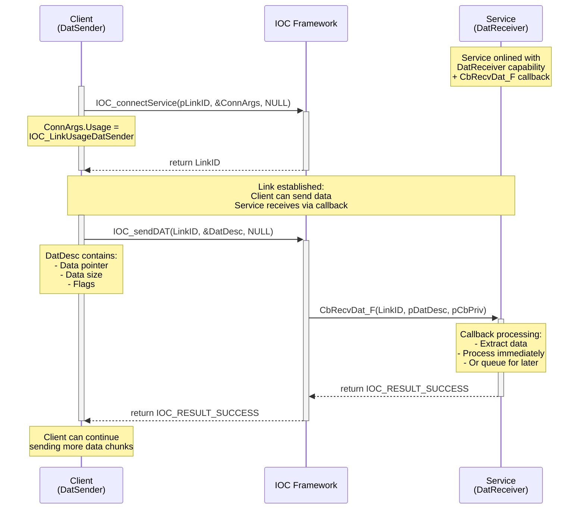
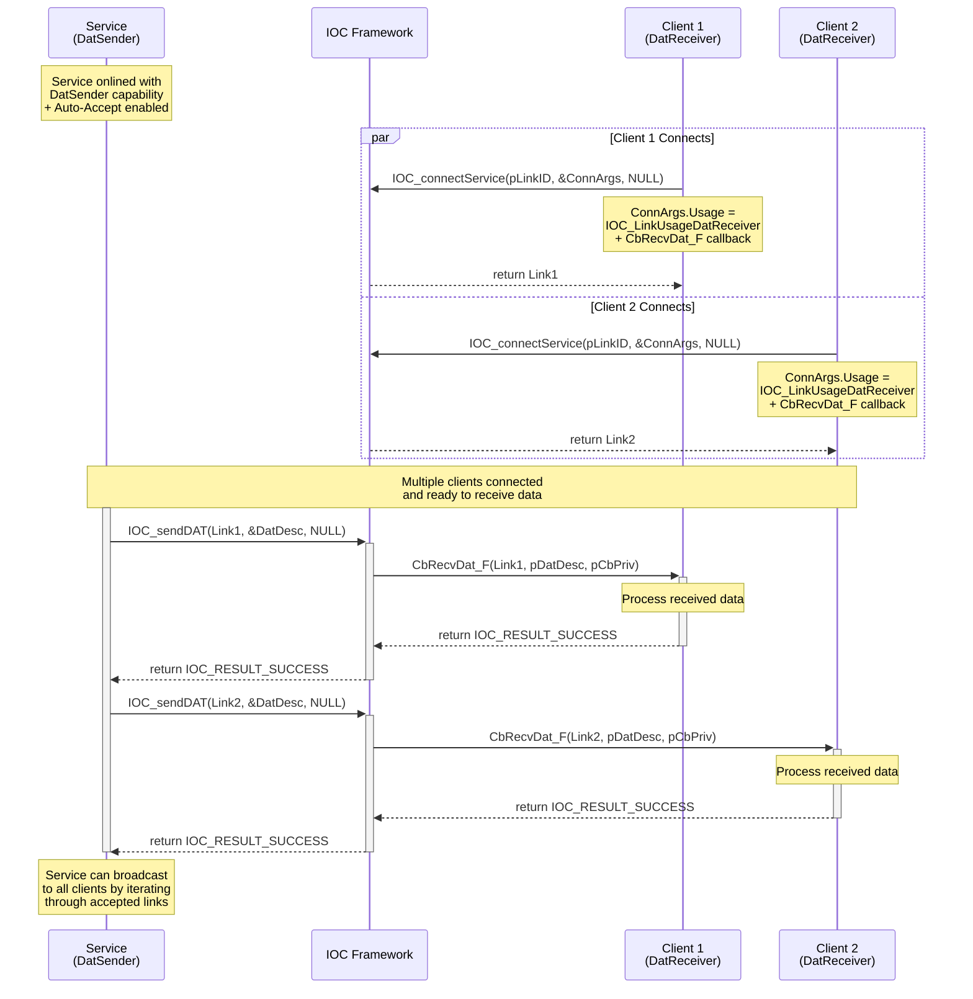
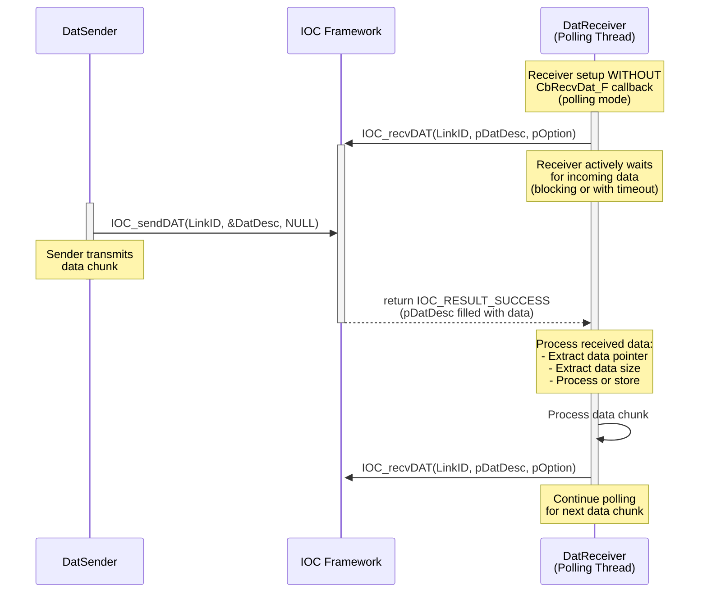

# IOC Data Transmission (DAT) User Guide

## Table of Contents
- [Overview](#overview)
- [API Reference](#api-reference)
- [Typical Usage Patterns](#typical-usage-patterns)
- [Code Examples from Test Cases](#code-examples-from-test-cases)
- [Best Practices](#best-practices)
- [Error Handling](#error-handling)
- [Performance Considerations](#performance-considerations)
- [Troubleshooting](#troubleshooting)

## Overview

The IOC Data Transmission (DAT) subsystem provides reliable, stream-based data transfer capabilities between services and clients. DAT supports two primary architectural patterns:

1. **DatReceiver Service Pattern (US-1)**: Service acts as data receiver, clients connect and send data
2. **DatSender Service Pattern (US-2)**: Service acts as data sender, clients connect and receive data

### Key Features
- **NODROP Guarantee**: Reliable data delivery with no data loss
- **Stream-based**: Support for continuous data streaming with multiple chunks
- **Flexible Modes**: Both callback-based and polling-based data reception
- **Connection-oriented**: Established links for reliable point-to-point communication

## API Reference

### Core APIs (from IOC_DatAPI.h)

#### IOC_sendDAT
```c
IOC_Result_T IOC_sendDAT(IOC_LinkID_T LinkID, IOC_DatDesc_pT pDatDesc, IOC_Options_pT pOption);
```
- **Purpose**: Send data chunk on the specified link
- **Usage**: DataSender calls this API to send data chunk to DataReceiver asynchronously
- **Return Codes**:
  - `IOC_RESULT_SUCCESS`: Data chunk queued for transmission successfully
  - `IOC_RESULT_INVALID_PARAM`: Invalid parameters (NULL pDatDesc)
  - `IOC_RESULT_NOT_EXIST_LINK`: LinkID does not exist or already closed
  - `IOC_RESULT_DATA_TOO_LARGE`: Data chunk exceeds maximum allowed size
  - `IOC_RESULT_BUFFER_FULL`: IOC buffer is full (when immediate NONBLOCK mode)
  - `IOC_RESULT_TIMEOUT`: Data transmission timeout (when NONBLOCK mode with timeout)
  - `IOC_RESULT_LINK_BROKEN`: Communication link is broken during transmission

#### IOC_recvDAT
```c
IOC_Result_T IOC_recvDAT(IOC_LinkID_T LinkID, IOC_DatDesc_pT pDatDesc, IOC_Options_pT pOption);
```
- **Purpose**: Receive data chunk on the specified link (polling mode)
- **Usage**: DataReceiver calls this API to actively wait for data chunks when using polling mode
- **Complementary**: Alternative to callback-based reception via CbRecvDat_F

#### IOC_flushDAT
```c
IOC_Result_T IOC_flushDAT(IOC_LinkID_T LinkID, IOC_Options_pT pOption);
```
- **Purpose**: Flush pending data transmissions on the specified link
- **Usage**: Ensure all queued data chunks are transmitted immediately

## Data Transmission Architecture

### Data Flow Patterns

#### Pattern 1: Service as DatReceiver (Callback Mode)

The service acts as a data receiver, automatically processing incoming data via callback as clients send data chunks.



#### Pattern 2: Service as DatSender (Callback Mode)

The service acts as a data sender, pushing data to multiple connected clients who receive it via callbacks.



#### Pattern 3: Polling-based Data Reception

Alternative to callbacks, the receiver actively polls for incoming data chunks using IOC_recvDAT.



## Typical Usage Patterns

### Pattern 1: Service as DatReceiver (US-1)

**Scenario**: Client connects to a service and sends data for processing

```c
// Service Side - Setup DatReceiver capability
IOC_Result_T setupDatReceiver(IOC_SrvID_pT pSrvID) {
    // Define data reception callback
    IOC_DatUsageArgs_T DatArgs = {
        .CbRecvDat_F = MyDataReceiveCallback,
        .pCbPrivData = &myPrivateData
    };
    
    // Setup service arguments
    IOC_SrvArgs_T SrvArgs = {0};
    IOC_Helper_initSrvArgs(&SrvArgs);
    SrvArgs.SrvURI.pProtocol = IOC_SRV_PROTO_FIFO;
    SrvArgs.SrvURI.pHost = IOC_SRV_HOST_LOCAL_PROCESS;
    SrvArgs.SrvURI.pPath = "DataProcessorService";
    SrvArgs.SrvURI.Port = 0;
    SrvArgs.UsageCapabilites = IOC_LinkUsageDatReceiver;
    SrvArgs.UsageArgs.pDat = &DatArgs;
    
    return IOC_onlineService(pSrvID, &SrvArgs);
}

// Client Side - Connect and send data
IOC_Result_T sendDataToService(const char* servicePath, const void* data, size_t dataSize) {
    IOC_LinkID_T LinkID;
    IOC_ConnArgs_T ConnArgs = {0};
    IOC_Helper_initConnArgs(&ConnArgs);
    ConnArgs.SrvURI.pProtocol = IOC_SRV_PROTO_FIFO;
    ConnArgs.SrvURI.pHost = IOC_SRV_HOST_LOCAL_PROCESS;
    ConnArgs.SrvURI.pPath = servicePath;
    ConnArgs.Usage = IOC_LinkUsageDatSender;
    
    IOC_Result_T result = IOC_connectService(&LinkID, &ConnArgs, NULL);
    if (result != IOC_RESULT_SUCCESS) return result;
    
    // Prepare data descriptor
    IOC_DatDesc_T DatDesc = {0};
    IOC_DatDesc_init(&DatDesc);
    IOC_DatDesc_setData(&DatDesc, (void*)data, dataSize);
    
    // Send data
    result = IOC_sendDAT(LinkID, &DatDesc, NULL);
    
    IOC_closeLink(LinkID);
    return result;
}
```

### Pattern 2: Service as DatSender (US-2)

**Scenario**: Service distributes data to multiple connected clients

```c
// Service Side - Setup DatSender capability
IOC_Result_T setupDatSender(IOC_SrvID_pT pSrvID) {
    IOC_SrvArgs_T SrvArgs = {0};
    IOC_Helper_initSrvArgs(&SrvArgs);
    SrvArgs.SrvURI.pProtocol = IOC_SRV_PROTO_FIFO;
    SrvArgs.SrvURI.pHost = IOC_SRV_HOST_LOCAL_PROCESS;
    SrvArgs.SrvURI.pPath = "DataBroadcastService";
    SrvArgs.SrvURI.Port = 0;
    SrvArgs.UsageCapabilites = IOC_LinkUsageDatSender;
    SrvArgs.Flags = IOC_SRVFLAG_AUTO_ACCEPT;  // Auto-accept client connections
    
    return IOC_onlineService(pSrvID, &SrvArgs);
}

// Service Side - Broadcast data to all clients
IOC_Result_T broadcastData(IOC_SrvID_T SrvID, const void* data, size_t dataSize) {
    // Get all accepted client links
    IOC_LinkID_T clientLinks[MAX_CLIENTS];
    size_t clientCount = 0;
    
    // Implementation would query active client links from service
    // This is simplified for demonstration
    
    IOC_DatDesc_T DatDesc = {0};
    IOC_DatDesc_init(&DatDesc);
    IOC_DatDesc_setData(&DatDesc, (void*)data, dataSize);
    
    IOC_Result_T result = IOC_RESULT_SUCCESS;
    for (size_t i = 0; i < clientCount; i++) {
        IOC_Result_T sendResult = IOC_sendDAT(clientLinks[i], &DatDesc, NULL);
        if (sendResult != IOC_RESULT_SUCCESS) {
            printf("Failed to send data to client %zu: %s\n", i, IOC_getResultStr(sendResult));
            result = sendResult;  // Keep track of failures
        }
    }
    
    return result;
}

// Client Side - Connect and receive data
IOC_Result_T connectAndReceiveData(const char* servicePath) {
    IOC_LinkID_T LinkID;
    
    // Setup data reception callback
    IOC_DatUsageArgs_T DatArgs = {
        .CbRecvDat_F = ClientDataReceiveCallback,
        .pCbPrivData = &clientPrivateData
    };
    
    IOC_ConnArgs_T ConnArgs = {0};
    IOC_Helper_initConnArgs(&ConnArgs);
    ConnArgs.SrvURI.pProtocol = IOC_SRV_PROTO_FIFO;
    ConnArgs.SrvURI.pHost = IOC_SRV_HOST_LOCAL_PROCESS;
    ConnArgs.SrvURI.pPath = servicePath;
    ConnArgs.Usage = IOC_LinkUsageDatReceiver;
    ConnArgs.UsageArgs.pDat = &DatArgs;
    
    return IOC_connectService(&LinkID, &ConnArgs, NULL);
}
```

## Code Examples from Test Cases

### Example 1: Basic Data Transmission (from UT_DataTypical.cxx)

```c
// Basic service-to-client data transmission
TEST(UT_ConetDataTypical, verifyServiceAsDatSender_bySingleClient_expectDelivered) {
    IOC_SrvID_T SrvID = IOC_ID_INVALID;
    IOC_LinkID_T CliLinkID = IOC_ID_INVALID;
    
    // Service setup as DatSender
    IOC_SrvArgs_T SrvArgs = {0};
    IOC_Helper_initSrvArgs(&SrvArgs);
    SrvArgs.SrvURI.pProtocol = IOC_SRV_PROTO_FIFO;
    SrvArgs.SrvURI.pHost = IOC_SRV_HOST_LOCAL_PROCESS;
    SrvArgs.SrvURI.pPath = "TestDatSender";
    SrvArgs.UsageCapabilites = IOC_LinkUsageDatSender;
    SrvArgs.Flags = IOC_SRVFLAG_AUTO_ACCEPT;
    
    ASSERT_EQ(IOC_RESULT_SUCCESS, IOC_onlineService(&SrvID, &SrvArgs));
    
    // Client connects as DatReceiver
    TypicalClientPrivateData_T ClientPriv = {0};
    IOC_DatUsageArgs_T DatArgs = {
        .CbRecvDat_F = TypicalClientRecvCallback,
        .pCbPrivData = &ClientPriv
    };
    
    IOC_ConnArgs_T ConnArgs = {0};
    IOC_Helper_initConnArgs(&ConnArgs);
    ConnArgs.SrvURI = SrvArgs.SrvURI;
    ConnArgs.Usage = IOC_LinkUsageDatReceiver;
    ConnArgs.UsageArgs.pDat = &DatArgs;
    
    ASSERT_EQ(IOC_RESULT_SUCCESS, IOC_connectService(&CliLinkID, &ConnArgs, NULL));
    
    // Send data from service to client
    const char testData[] = "Hello from service!";
    IOC_DatDesc_T DatDesc = {0};
    IOC_DatDesc_init(&DatDesc);
    IOC_DatDesc_setData(&DatDesc, (void*)testData, sizeof(testData));
    
    ASSERT_EQ(IOC_RESULT_SUCCESS, IOC_sendDAT(CliLinkID, &DatDesc, NULL));
    
    // Verify client received data
    usleep(100000);  // Allow time for callback processing
    ASSERT_TRUE(ClientPriv.DataReceived);
    ASSERT_EQ(sizeof(testData), ClientPriv.ReceivedDataSize);
    ASSERT_STREQ(testData, (char*)ClientPriv.ReceivedData);
    
    // Cleanup
    IOC_closeLink(CliLinkID);
    IOC_offlineService(SrvID);
}
```

### Example 2: Data Reception Callback (from UT_DataTypical.cxx)

```c
typedef struct {
    bool DataReceived;
    size_t ReceivedDataSize;
    uint8_t ReceivedData[1024];
    uint32_t CallbackCount;
} TypicalClientPrivateData_T;

static IOC_Result_T TypicalClientRecvCallback(IOC_LinkID_T LinkID, 
                                            IOC_DatDesc_pT pDatDesc, 
                                            void *pCbPriv) {
    TypicalClientPrivateData_T *pPrivData = (TypicalClientPrivateData_T *)pCbPriv;
    
    // Extract received data
    size_t dataSize = IOC_DatDesc_getDataSize(pDatDesc);
    const void *pData = IOC_DatDesc_getData(pDatDesc);
    
    // Store in private data structure
    pPrivData->DataReceived = true;
    pPrivData->ReceivedDataSize = dataSize;
    pPrivData->CallbackCount++;
    
    if (dataSize <= sizeof(pPrivData->ReceivedData)) {
        memcpy(pPrivData->ReceivedData, pData, dataSize);
    }
    
    printf("[CLIENT] Received %zu bytes: %.*s\n", 
           dataSize, (int)dataSize, (char*)pData);
    
    return IOC_RESULT_SUCCESS;
}
```

### Example 3: Boundary Condition Testing (from UT_DataBoundary.cxx)

```c
// Test maximum data size transmission
TEST(UT_DataBoundary, verifyDatTransmission_byMaxDataSize_expectSuccess) {
    // Query system capabilities for max data size
    IOC_ConetModeDataCapability_T DataCap = {0};
    ASSERT_EQ(IOC_RESULT_SUCCESS, IOC_getCapability(NULL, NULL, &DataCap, NULL));
    
    // Create maximum size data buffer
    size_t maxDataSize = DataCap.MaxDataQueueSize;
    std::vector<uint8_t> largeData(maxDataSize, 0x42);  // Fill with test pattern
    
    // Setup service and client as usual...
    // [Service and client setup code omitted for brevity]
    
    // Attempt to send maximum size data
    IOC_DatDesc_T DatDesc = {0};
    IOC_DatDesc_init(&DatDesc);
    IOC_DatDesc_setData(&DatDesc, largeData.data(), largeData.size());
    
    IOC_Result_T result = IOC_sendDAT(CliLinkID, &DatDesc, NULL);
    EXPECT_EQ(IOC_RESULT_SUCCESS, result) 
        << "Should successfully transmit data at maximum size boundary";
    
    // Verify data was received correctly
    usleep(200000);  // Allow extra time for large data processing
    ASSERT_TRUE(ClientPriv.DataReceived);
    ASSERT_EQ(maxDataSize, ClientPriv.ReceivedDataSize);
}
```

## Best Practices

### 1. Data Size Management
```c
// ✅ Good: Check data size before transmission
IOC_ConetModeDataCapability_T cap;
IOC_getCapability(NULL, NULL, &cap, NULL);
if (dataSize > cap.MaxDataQueueSize) {
    // Split data into smaller chunks or use streaming approach
    return splitAndSendData(linkID, data, dataSize, cap.MaxDataQueueSize);
}
```

### 2. Error Handling Pattern
```c
// ✅ Good: Comprehensive error handling
IOC_Result_T result = IOC_sendDAT(LinkID, &DatDesc, NULL);
switch (result) {
    case IOC_RESULT_SUCCESS:
        break;
    case IOC_RESULT_NOT_EXIST_LINK:
        printf("Link no longer exists, reconnecting...\n");
        return reconnectAndRetry(LinkID, &DatDesc);
    case IOC_RESULT_BUFFER_FULL:
        printf("Buffer full, retrying with backoff...\n");
        return retryWithBackoff(LinkID, &DatDesc);
    case IOC_RESULT_DATA_TOO_LARGE:
        printf("Data too large, splitting into chunks...\n");
        return splitAndSendData(LinkID, &DatDesc);
    default:
        printf("Unexpected error: %s\n", IOC_getResultStr(result));
        return result;
}
```

### 3. Callback Implementation Best Practices
```c
// ✅ Good: Non-blocking callback implementation
static IOC_Result_T DataReceiveCallback(IOC_LinkID_T LinkID, 
                                      IOC_DatDesc_pT pDatDesc, 
                                      void *pCbPriv) {
    // Keep callback processing minimal and fast
    MyPrivateData_T *pPriv = (MyPrivateData_T *)pCbPriv;
    
    // Queue data for background processing instead of processing inline
    DataPacket_T packet = {
        .linkID = LinkID,
        .dataSize = IOC_DatDesc_getDataSize(pDatDesc),
        .timestamp = getCurrentTimestamp()
    };
    
    // Copy data to queue (non-blocking)
    if (packet.dataSize <= MAX_PACKET_SIZE) {
        memcpy(packet.data, IOC_DatDesc_getData(pDatDesc), packet.dataSize);
        enqueueDataPacket(&pPriv->processingQueue, &packet);
    }
    
    return IOC_RESULT_SUCCESS;  // Return quickly
}
```

### 4. Resource Management
```c
// ✅ Good: Proper resource cleanup
void cleanupDataTransmission(IOC_LinkID_T LinkID, IOC_SrvID_T SrvID) {
    // Flush any pending data before closing
    IOC_flushDAT(LinkID, NULL);
    
    // Close link gracefully
    if (LinkID != IOC_ID_INVALID) {
        IOC_closeLink(LinkID);
    }
    
    // Offline service
    if (SrvID != IOC_ID_INVALID) {
        IOC_offlineService(SrvID);
    }
}
```

## Error Handling

### Common Error Scenarios and Solutions

#### 1. Link Broken During Transmission
```c
if (result == IOC_RESULT_LINK_BROKEN) {
    printf("Link broken, attempting recovery...\n");
    
    // Close broken link
    IOC_closeLink(LinkID);
    
    // Attempt to reconnect
    IOC_Result_T reconnectResult = IOC_connectService(&LinkID, &ConnArgs);
    if (reconnectResult == IOC_RESULT_SUCCESS) {
        // Retry transmission
        return IOC_sendDAT(LinkID, &DatDesc, pOption);
    }
    
    return IOC_RESULT_LINK_BROKEN;
}
```

#### 2. Buffer Full Conditions
```c
if (result == IOC_RESULT_BUFFER_FULL) {
    // Implement exponential backoff
    static int retryCount = 0;
    int backoffMs = (1 << retryCount) * 10;  // 10ms, 20ms, 40ms, etc.
    
    if (retryCount < MAX_RETRIES) {
        usleep(backoffMs * 1000);
        retryCount++;
        return IOC_sendDAT(LinkID, &DatDesc, pOption);
    }
    
    retryCount = 0;  // Reset for next sequence
    return IOC_RESULT_BUFFER_FULL;
}
```

#### 3. Data Too Large
```c
if (result == IOC_RESULT_DATA_TOO_LARGE) {
    // Split data into smaller chunks
    IOC_ConetModeDataCapability_T cap;
    IOC_getCapability(NULL, NULL, &cap, NULL);
    
    size_t chunkSize = cap.MaxDataQueueSize / 2;  // Use half of max for safety
    size_t totalSize = IOC_DatDesc_getDataSize(pDatDesc);
    const uint8_t *data = (const uint8_t *)IOC_DatDesc_getData(pDatDesc);
    
    for (size_t offset = 0; offset < totalSize; offset += chunkSize) {
        size_t currentChunkSize = (offset + chunkSize > totalSize) ? 
                                  (totalSize - offset) : chunkSize;
        
        IOC_DatDesc_T chunkDesc = {0};
        IOC_DatDesc_init(&chunkDesc);
        IOC_DatDesc_setData(&chunkDesc, (void*)(data + offset), currentChunkSize);
        
        IOC_Result_T chunkResult = IOC_sendDAT(LinkID, &chunkDesc, pOption);
        if (chunkResult != IOC_RESULT_SUCCESS) {
            return chunkResult;
        }
    }
    
    return IOC_RESULT_SUCCESS;
}
```

## Performance Considerations

### 1. Asynchronous Operations
- Use non-blocking mode for high-throughput scenarios
- Implement proper timeout handling
- Consider batching small data chunks

### 2. Memory Management
- Avoid unnecessary data copying in callbacks
- Use streaming for large data sets
- Monitor memory usage with large buffers

### 3. Connection Management
- Reuse connections when possible
- Implement connection pooling for multiple clients
- Monitor connection health

## Troubleshooting

### Common Issues and Solutions

#### Issue: Data Not Received
**Symptoms**: `IOC_sendDAT` returns success but receiver callback not called
**Solutions**:
1. Verify receiver callback is properly registered
2. Check that link is properly established
3. Ensure receiver is in correct state
4. Add debug logging to track data flow

#### Issue: Performance Degradation
**Symptoms**: Slow data transmission or high latency
**Solutions**:
1. Check for buffer full conditions
2. Monitor system resource usage
3. Implement non-blocking modes
4. Consider data size optimization

#### Issue: Memory Leaks
**Symptoms**: Memory usage grows over time
**Solutions**:
1. Ensure proper cleanup of data descriptors
2. Verify callback implementations don't leak
3. Monitor connection lifecycle management
4. Use memory debugging tools

## Unit Test References

For comprehensive examples and validation patterns, refer to these test files:

- **UT_DataTypical.cxx**: Basic usage patterns and typical scenarios
- **UT_DataBoundary.cxx**: Boundary conditions and error handling
- **UT_DataCapability.cxx**: System capability limits and constraints
- **UT_DataPerformance.cxx**: Performance characteristics and optimization
- **UT_DataState.cxx**: Connection and state management

Each test file follows the User Story → Acceptance Criteria → Test Cases methodology and provides comprehensive coverage of DAT functionality.