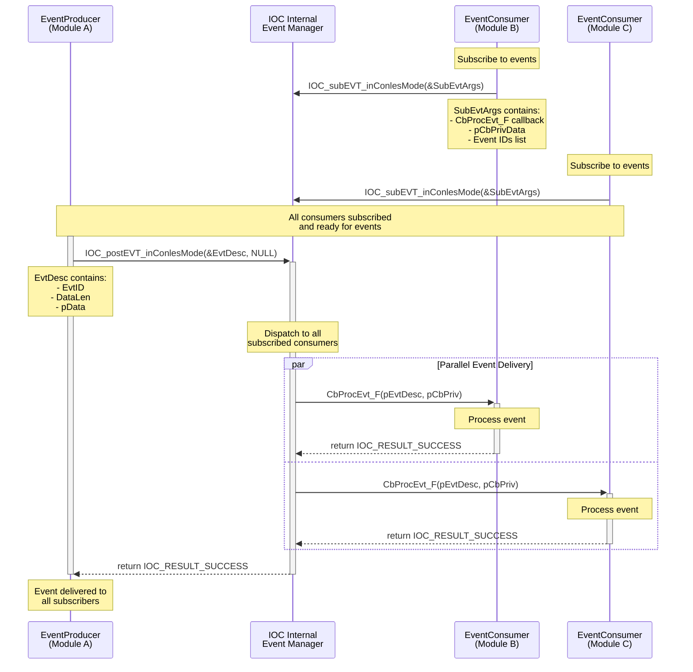
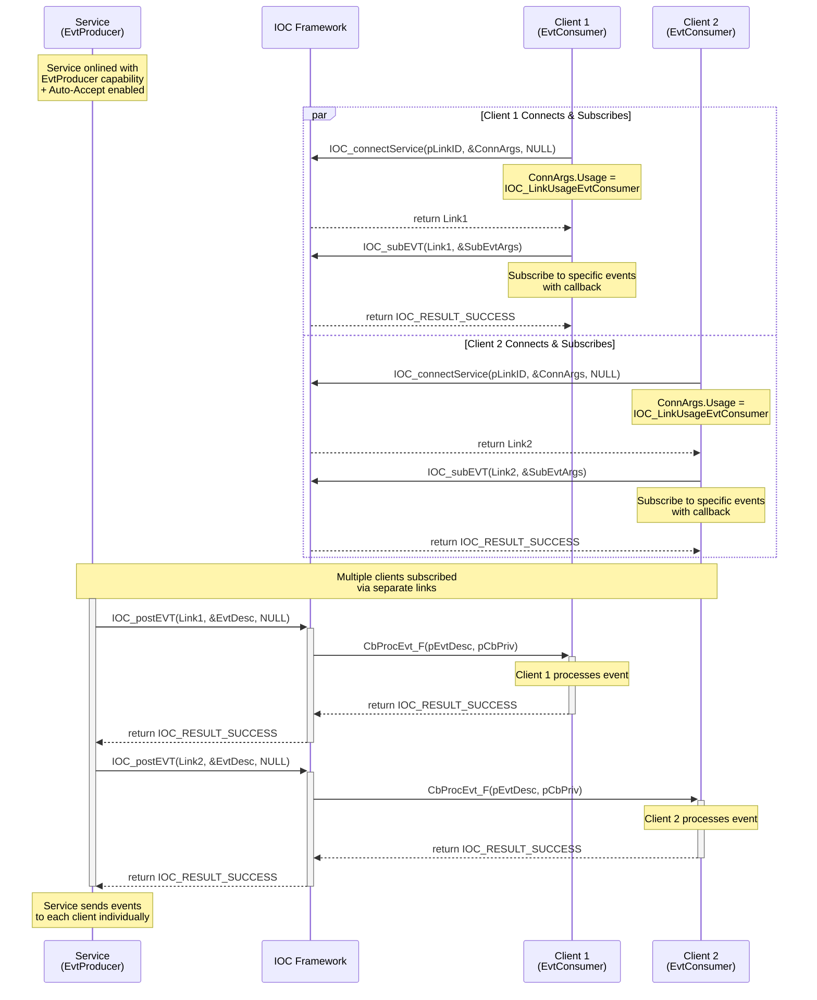
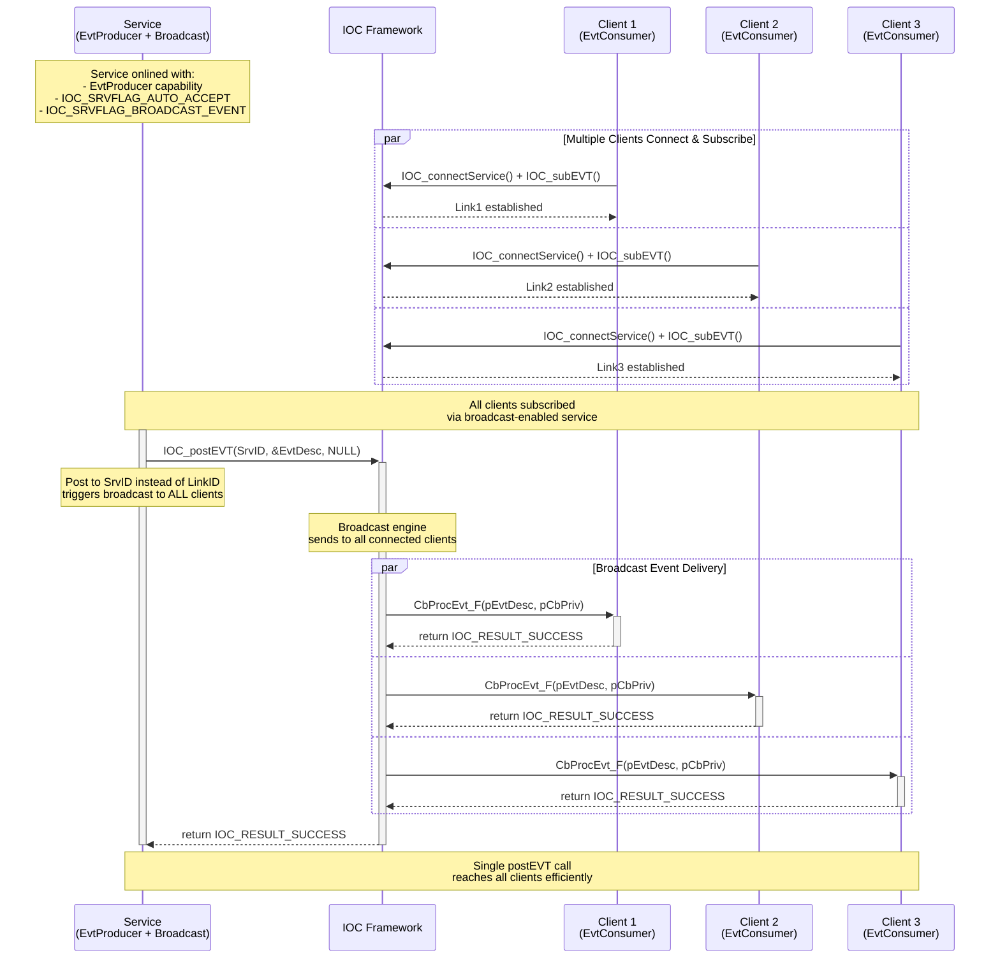

# IOC Event Handling (EVT) User Guide

## Table of Contents
- [Overview](#overview)
- [API Reference](#api-reference)
- [Event Architecture](#event-architecture)
- [Typical Usage Patterns](#typical-usage-patterns)
- [Code Examples from Test Cases](#code-examples-from-test-cases)
- [Best Practices](#best-practices)
- [Error Handling](#error-handling)
- [Performance Considerations](#performance-considerations)
- [Troubleshooting](#troubleshooting)

## Overview

The IOC Event Handling (EVT) subsystem provides flexible event-driven communication mechanisms supporting both connection-less (Conles) and connection-oriented (Conet) modes. EVT enables loosely-coupled, publish-subscribe style communication between different components of your application.

### Key Features
- **Dual Modes**: ConlesMode (connection-less) and ConetMode (connection-oriented)
- **Publish-Subscribe Pattern**: Event producers and consumers with flexible subscription management
- **Event Filtering**: Subscribe to specific event types by EventID
- **Flexible Processing**: Both callback-based and polling-based event handling
- **Performance Options**: Synchronous, asynchronous, blocking, and non-blocking modes

### Event Communication Modes

#### ConlesMode (Connection-less)
- Single-process, module-to-module communication
- Automatic internal link management
- Simplified setup and usage
- Best for: Internal application events, module coordination

#### ConetMode (Connection-oriented)
- Service-client based communication
- Explicit connection management
- Cross-process communication support
- Best for: Inter-service events, distributed systems

## API Reference

### Core APIs (from IOC_EvtAPI.h)

#### Event Subscription Types
```c
// Event callback function type (defined in IOC_EvtAPI.h)
typedef IOC_Result_T (*IOC_CbProcEvt_F)(IOC_EvtDesc_pT pEvtDesc, void *pCbPriv);

// Event subscription arguments structure (defined in IOC_EvtAPI.h)
typedef struct {
    IOC_CbProcEvt_F CbProcEvt_F;    // Callback function for processing events
    void *pCbPrivData;              // Callback private context data
    ULONG_T EvtNum;                 // Number of EventIDs to subscribe
    IOC_EvtID_T *pEvtIDs;           // Array of EventIDs to subscribe
} IOC_SubEvtArgs_T;

// Event unsubscription arguments structure (defined in IOC_EvtAPI.h)
typedef struct {
    IOC_CbProcEvt_F CbProcEvt_F;    // Callback function identifier
    void *pCbPrivData;              // Callback private context data (used as identifier)
} IOC_UnsubEvtArgs_T;
```

#### ConlesMode APIs

##### IOC_subEVT_inConlesMode
```c
IOC_Result_T IOC_subEVT_inConlesMode(IOC_SubEvtArgs_pT pSubEvtArgs);
```
- **Purpose**: Subscribe to events in connection-less mode
- **Usage**: Register callback and event IDs for automatic event delivery

##### IOC_unsubEVT_inConlesMode
```c
IOC_Result_T IOC_unsubEVT_inConlesMode(IOC_UnsubEvtArgs_pT pUnsubEvtArgs);
```
- **Purpose**: Unsubscribe from events in connection-less mode
- **Usage**: Remove event subscription using callback function as identifier

##### IOC_postEVT_inConlesMode
```c
IOC_Result_T IOC_postEVT_inConlesMode(IOC_EvtDesc_pT pEvtDesc, IOC_Options_pT pOption);
```
- **Purpose**: Post events in connection-less mode
- **Options**: Supports IOC_OPTID_TIMEOUT, IOC_OPTID_SYNC_MODE
- **Return Codes**:
  - `IOC_RESULT_SUCCESS`: Event posted successfully
  - `IOC_RESULT_NO_EVENT_CONSUMER`: No EvtConsumer for this event
  - `IOC_RESULT_TOO_MANY_QUEUING_EVTDESC`: Too many events in queue
  - `IOC_RESULT_TOO_LONG_EMPTYING_EVTDESC_QUEUE`: Queue processing timeout

##### IOC_forceProcEVT
```c
IOC_Result_T IOC_forceProcEVT(void);
```
- **Purpose**: Force immediate processing of all pending events
- **Usage**: Useful for testing and ensuring event delivery completion

#### ConetMode APIs

##### IOC_postEVT
```c
IOC_Result_T IOC_postEVT(IOC_LinkID_T LinkID, IOC_EvtDesc_pT pEvtDesc, IOC_Options_pT pOption);
```
- **Purpose**: Post event on the specified link
- **Usage**: EvtProducer sends events to specific EvtConsumer via established link

##### IOC_subEVT
```c
IOC_Result_T IOC_subEVT(IOC_LinkID_T LinkID, IOC_SubEvtArgs_pT pSubEvtArgs);
```
- **Purpose**: Subscribe to events on the specified link
- **Usage**: EvtConsumer registers for specific events from EvtProducer

##### IOC_unsubEVT
```c
IOC_Result_T IOC_unsubEVT(IOC_LinkID_T LinkID, IOC_UnsubEvtArgs_pT pUnsubEvtArgs);
```
- **Purpose**: Unsubscribe from events on the specified link

## Event Architecture

### Event Flow Patterns

#### Pattern 1: ConlesMode Publisher-Subscriber

In ConlesMode, events are posted to an internal event manager that automatically dispatches to all subscribed consumers.



#### Pattern 2: ConetMode Service as EvtProducer

The service produces events and sends them to connected client consumers via established links.



#### Pattern 3: ConetMode Broadcast Events

Using the BROADCAST flag, service can efficiently send events to all connected clients with a single API call.



## Typical Usage Patterns

### Pattern 1: ConlesMode Event Communication

#### Simple Event Publishing and Subscription
```c
// Event Consumer Setup
typedef struct {
    uint32_t keepAliveCount;
    uint32_t customEventCount;
    bool initialized;
} MyModuleContext_T;

static IOC_Result_T MyEventCallback(IOC_EvtDesc_pT pEvtDesc, void *pCbPriv) {
    MyModuleContext_T *pContext = (MyModuleContext_T *)pCbPriv;
    
    switch (pEvtDesc->EvtID) {
        case IOC_EVTID_TEST_KEEPALIVE:
            pContext->keepAliveCount++;
            printf("Module received keepalive #%u\n", pContext->keepAliveCount);
            break;
            
        case IOC_EVTID_YOUR_CUSTOM_EVENT:
            pContext->customEventCount++;
            printf("Module received custom event #%u\n", pContext->customEventCount);
            if (pEvtDesc->DataLen > 0) {
                printf("Event data: %.*s\n", pEvtDesc->DataLen, (char*)pEvtDesc->pData);
            }
            break;
            
        default:
            printf("Unknown event ID: %u\n", pEvtDesc->EvtID);
            return IOC_RESULT_BUG;
    }
    
    return IOC_RESULT_SUCCESS;
}

// Subscribe to events
IOC_Result_T setupEventConsumer(MyModuleContext_T *pContext) {
    IOC_EvtID_T subscribedEvents[] = {
        IOC_EVTID_TEST_KEEPALIVE,
        IOC_EVTID_YOUR_CUSTOM_EVENT
    };
    
    IOC_SubEvtArgs_T subArgs = {
        .CbProcEvt_F = MyEventCallback,
        .pCbPrivData = pContext,
        .EvtNum = IOC_calcArrayElmtCnt(subscribedEvents),
        .pEvtIDs = subscribedEvents
    };
    
    return IOC_subEVT_inConlesMode(&subArgs);
}

// Publish events
IOC_Result_T publishKeepAlive(void) {
    IOC_EvtDesc_T evtDesc = {
        .EvtID = IOC_EVTID_TEST_KEEPALIVE,
        .DataLen = 0,
        .pData = NULL
    };
    
    return IOC_postEVT_inConlesMode(&evtDesc, NULL);
}

IOC_Result_T publishCustomEvent(const char* message) {
    IOC_EvtDesc_T evtDesc = {
        .EvtID = IOC_EVTID_YOUR_CUSTOM_EVENT,
        .DataLen = strlen(message),
        .pData = (void*)message
    };
    
    return IOC_postEVT_inConlesMode(&evtDesc, NULL);
}
```

### Pattern 2: ConetMode Service-Client Events

#### Service as EventProducer Pattern
```c
// Service Side - Setup as Event Producer
IOC_Result_T setupEventProducerService(IOC_SrvID_pT pSrvID) {
    IOC_SrvArgs_T SrvArgs = {0};
    IOC_Helper_initSrvArgs(&SrvArgs);
    SrvArgs.SrvURI.pProtocol = IOC_SRV_PROTO_FIFO;
    SrvArgs.SrvURI.pHost = IOC_SRV_HOST_LOCAL_PROCESS;
    SrvArgs.SrvURI.pPath = "EventNotificationService";
    SrvArgs.SrvURI.Port = 0;
    SrvArgs.UsageCapabilites = IOC_LinkUsageEvtProducer;
    SrvArgs.UsageArgs.pEvt = NULL;  // No specific event configuration needed for producer
    SrvArgs.Flags = IOC_SRVFLAG_AUTO_ACCEPT;  // Auto-accept client connections
    
    return IOC_onlineService(pSrvID, &SrvArgs);
}

// Service Side - Send events to specific client
IOC_Result_T notifyClient(IOC_LinkID_T clientLinkID, IOC_EvtID_T eventID, 
                         const void* eventData, size_t dataSize) {
    IOC_EvtDesc_T evtDesc = {
        .EvtID = eventID,
        .DataLen = dataSize,
        .pData = (void*)eventData
    };
    
    return IOC_postEVT(clientLinkID, &evtDesc, NULL);
}

// Client Side - Connect and subscribe to events
IOC_Result_T connectAndSubscribeToEvents(const char* servicePath, 
                                       IOC_CbProcEvt_F callback, 
                                       void* callbackPrivateData) {
    IOC_LinkID_T LinkID;
    
    // Setup event consumer usage
    IOC_EvtUsageArgs_T EvtArgs = {
        .CbProcEvt_F = callback,
        .pCbPrivData = callbackPrivateData,
        .EvtNum = 0,      // 0 means accept all events
        .pEvtIDs = NULL   // NULL means no specific event filter
    };
    
    IOC_ConnArgs_T ConnArgs = {0};
    IOC_Helper_initConnArgs(&ConnArgs);
    ConnArgs.SrvURI.pProtocol = IOC_SRV_PROTO_FIFO;
    ConnArgs.SrvURI.pHost = IOC_SRV_HOST_LOCAL_PROCESS;
    ConnArgs.SrvURI.pPath = servicePath;
    ConnArgs.Usage = IOC_LinkUsageEvtConsumer;
    ConnArgs.UsageArgs.pEvt = &EvtArgs;
    
    IOC_Result_T result = IOC_connectService(&LinkID, &ConnArgs, NULL);
    
    IOC_Result_T result = IOC_connectService(&LinkID, &ConnArgs, NULL);
    if (result != IOC_RESULT_SUCCESS) return result;
    
    // Subscribe to specific events
    IOC_EvtID_T interestedEvents[] = {
        IOC_EVTID_SERVICE_STATUS_CHANGED,
        IOC_EVTID_DATA_AVAILABLE,
        IOC_EVTID_ERROR_OCCURRED
    };
    
    IOC_SubEvtArgs_T subArgs = {
        .CbProcEvt_F = callback,
        .pCbPrivData = callbackPrivateData,
        .EvtNum = IOC_calcArrayElmtCnt(interestedEvents),
        .pEvtIDs = interestedEvents
    };
    
    return IOC_subEVT(LinkID, &subArgs);
}
```

#### Service as EventConsumer Pattern
```c
// Service Side - Setup as Event Consumer
IOC_Result_T setupEventConsumerService(IOC_SrvID_pT pSrvID, 
                                     IOC_CbProcEvt_F eventCallback,
                                     void* callbackPrivateData) {
    IOC_EvtUsageArgs_T EvtArgs = {
        .CbProcEvt_F = eventCallback,
        .pCbPrivData = callbackPrivateData,
        .EvtNum = 0,      // 0 means accept all events
        .pEvtIDs = NULL   // NULL means no specific event filter
    };
    
    IOC_SrvArgs_T SrvArgs = {0};
    IOC_Helper_initSrvArgs(&SrvArgs);
    SrvArgs.SrvURI.pProtocol = IOC_SRV_PROTO_FIFO;
    SrvArgs.SrvURI.pHost = IOC_SRV_HOST_LOCAL_PROCESS;
    SrvArgs.SrvURI.pPath = "EventProcessorService";
    SrvArgs.SrvURI.Port = 0;
    SrvArgs.UsageCapabilites = IOC_LinkUsageEvtConsumer;
    SrvArgs.UsageArgs.pEvt = &EvtArgs;
    
    return IOC_onlineService(pSrvID, &SrvArgs);
}

// Client Side - Connect and post events to service
IOC_Result_T connectAndPostEvents(const char* servicePath) {
    IOC_LinkID_T LinkID;
    
    IOC_ConnArgs_T ConnArgs = {0};
    IOC_Helper_initConnArgs(&ConnArgs);
    ConnArgs.SrvURI.pProtocol = IOC_SRV_PROTO_FIFO;
    ConnArgs.SrvURI.pHost = IOC_SRV_HOST_LOCAL_PROCESS;
    ConnArgs.SrvURI.pPath = servicePath;
    ConnArgs.Usage = IOC_LinkUsageEvtProducer;
    
    IOC_Result_T result = IOC_connectService(&LinkID, &ConnArgs, NULL);
    if (result != IOC_RESULT_SUCCESS) return result;
    
    // Post event to service
    IOC_EvtDesc_T evtDesc = {
        .EvtID = IOC_EVTID_CLIENT_REQUEST,
        .DataLen = 0,
        .pData = NULL
    };
    
    return IOC_postEVT(LinkID, &evtDesc, NULL);
}
```

## Code Examples from Test Cases

### Example 1: Basic ConlesMode Events (from UT_ConlesEventTypical.cxx)

```c
// Multi-producer, single-consumer pattern
TEST(UT_ConlesEventTypical, Case04_verifyPostEvtNv1_byNxEvtProducerPostEvtAnd1xEvtConsumerCbProcEvt) {
    const uint32_t EvtProducerNum = 5;
    const uint32_t KeepAliveEvtCnt = 10;
    
    // Setup event consumer
    _Case02_CbPrivData_T CbPrivData = {0};
    IOC_EvtID_T SubEvtIDs[] = {IOC_EVTID_TEST_KEEPALIVE};
    IOC_SubEvtArgs_T SubEvtArgs = {
        .CbProcEvt_F = _Case04_CbProcEvt_Nv1,
        .pCbPrivData = &CbPrivData,
        .EvtNum = IOC_calcArrayElmtCnt(SubEvtIDs),
        .pEvtIDs = SubEvtIDs,
    };
    
    ASSERT_EQ(IOC_RESULT_SUCCESS, IOC_subEVT_inConlesMode(&SubEvtArgs));
    
    // Create multiple producer threads
    std::vector<std::thread> producerThreads;
    for (uint32_t i = 0; i < EvtProducerNum; i++) {
        producerThreads.emplace_back([KeepAliveEvtCnt]() {
            for (uint32_t j = 0; j < KeepAliveEvtCnt; j++) {
                IOC_EvtDesc_T EvtDesc = {
                    .EvtID = IOC_EVTID_TEST_KEEPALIVE,
                    .DataLen = 0,
                    .pData = NULL
                };
                
                IOC_Result_T result = IOC_postEVT_inConlesMode(&EvtDesc, NULL);
                EXPECT_EQ(IOC_RESULT_SUCCESS, result);
            }
        });
    }
    
    // Wait for all producers to complete
    for (auto& thread : producerThreads) {
        thread.join();
    }
    
    // Force event processing and verify results
    IOC_forceProcEVT();
    
    EXPECT_EQ(EvtProducerNum * KeepAliveEvtCnt, CbPrivData.KeepAliveCnt);
    
    // Cleanup
    IOC_UnsubEvtArgs_T UnsubEvtArgs = {
        .CbProcEvt_F = _Case04_CbProcEvt_Nv1,
        .pCbPrivData = &CbPrivData
    };
    IOC_unsubEVT_inConlesMode(&UnsubEvtArgs);
}
```

### Example 2: Event Callback Implementation (from test cases)

```c
typedef struct {
    uint32_t KeepAliveCnt;
    uint32_t HelloFromEvenCnt;
    uint32_t HelloFromOddCnt;
    bool CallbackExecuted;
} _Case02_CbPrivData_T;

static IOC_Result_T _Case04_CbProcEvt_Nv1(IOC_EvtDesc_pT pEvtDesc, void *pCbPriv) {
    _Case02_CbPrivData_T *pPrivData = (_Case02_CbPrivData_T *)pCbPriv;
    
    switch (pEvtDesc->EvtID) {
        case IOC_EVTID_TEST_KEEPALIVE:
            pPrivData->KeepAliveCnt++;
            pPrivData->CallbackExecuted = true;
            printf("[CONSUMER] Received KeepAlive event #%u\n", pPrivData->KeepAliveCnt);
            break;
            
        case IOC_EVTID_TEST_HELLO_FROM_EVEN_TO_ODD:
            pPrivData->HelloFromEvenCnt++;
            printf("[CONSUMER] Received HelloFromEven event #%u\n", pPrivData->HelloFromEvenCnt);
            break;
            
        case IOC_EVTID_TEST_HELLO_FROM_ODD_TO_EVEN:
            pPrivData->HelloFromOddCnt++;
            printf("[CONSUMER] Received HelloFromOdd event #%u\n", pPrivData->HelloFromOddCnt);
            break;
            
        default:
            printf("[CONSUMER] Unknown event ID: %u\n", pEvtDesc->EvtID);
            return IOC_RESULT_BUG;
    }
    
    return IOC_RESULT_SUCCESS;
}
```

### Example 3: ConetMode Service Events (from UT_EventTypical.cxx)

```c
// Service as Event Producer to multiple clients
TEST(UT_ConetEventTypical, verifyServiceAsEvtProducer_byMultiClientIsolation_expectPerLinkDelivery) {
    const int NumClients = 3;
    IOC_SrvID_T SrvID = IOC_ID_INVALID;
    IOC_LinkID_T ClientLinks[NumClients];
    
    // Setup service as EventProducer
    IOC_SrvArgs_T SrvArgs = {0};
    IOC_Helper_initSrvArgs(&SrvArgs);
    SrvArgs.SrvURI.pProtocol = IOC_SRV_PROTO_FIFO;
    SrvArgs.SrvURI.pHost = IOC_SRV_HOST_LOCAL_PROCESS;
    SrvArgs.SrvURI.pPath = "MultiClientEventService";
    SrvArgs.UsageCapabilites = IOC_LinkUsageEvtProducer;
    SrvArgs.Flags = IOC_SRVFLAG_AUTO_ACCEPT;
    
    ASSERT_EQ(IOC_RESULT_SUCCESS, IOC_onlineService(&SrvID, &SrvArgs));
    
    // Connect multiple clients as EventConsumers
    ClientEventContext_T clientContexts[NumClients] = {0};
    for (int i = 0; i < NumClients; i++) {
        clientContexts[i].clientID = i;
        
        IOC_EvtUsageArgs_T EvtArgs = {
            .CbProcEvt_F = ClientEventCallback,
            .pCbPrivData = &clientContexts[i]
        };
        
        IOC_ConnArgs_T ConnArgs = {0};
        IOC_Helper_initConnArgs(&ConnArgs);
        ConnArgs.SrvURI = SrvArgs.SrvURI;
        ConnArgs.Usage = IOC_LinkUsageEvtConsumer;
        ConnArgs.UsageArgs.pEvt = &EvtArgs;
        
        ASSERT_EQ(IOC_RESULT_SUCCESS, IOC_connectService(&ClientLinks[i], &ConnArgs));
        
        // Subscribe to events
        IOC_EvtID_T evtIDs[] = {IOC_EVTID_TEST_KEEPALIVE};
        IOC_SubEvtArgs_T subArgs = {
            .CbProcEvt_F = ClientEventCallback,
            .pCbPrivData = &clientContexts[i],
            .EvtNum = IOC_calcArrayElmtCnt(evtIDs),
            .pEvtIDs = evtIDs
        };
        
        ASSERT_EQ(IOC_RESULT_SUCCESS, IOC_subEVT(ClientLinks[i], &subArgs));
    }
    
    // Send unique events to each client
    for (int i = 0; i < NumClients; i++) {
        IOC_EvtDesc_T evtDesc = {
            .EvtID = IOC_EVTID_TEST_KEEPALIVE,
            .DataLen = sizeof(int),
            .pData = &i  // Send client ID as event data
        };
        
        ASSERT_EQ(IOC_RESULT_SUCCESS, IOC_postEVT(ClientLinks[i], &evtDesc, NULL));
    }
    
    // Verify each client received only their event
    usleep(100000);  // Allow processing time
    for (int i = 0; i < NumClients; i++) {
        EXPECT_EQ(1, clientContexts[i].eventsReceived);
        EXPECT_EQ(i, clientContexts[i].lastEventData);
    }
    
    // Cleanup
    for (int i = 0; i < NumClients; i++) {
        IOC_closeLink(ClientLinks[i]);
    }
    IOC_offlineService(SrvID);
}
```

### Example 4: Event Auto-Subscribe (from UT_EventTypicalAutoSubscribe.cxx)

```c
// Automatic event subscription during service connection
TEST(UT_ConetEventTypical, verifyAutoSubscribe_byServiceConnection_expectAutoEventRegistration) {
    IOC_SrvID_T SrvID = IOC_ID_INVALID;
    IOC_LinkID_T CliLinkID = IOC_ID_INVALID;
    
    // Setup auto-subscribe capability in service
    IOC_EvtUsageArgs_T SrvEvtArgs = {
        .CbProcEvt_F = ServiceAutoSubscribeCallback,
        .pCbPrivData = &serviceContext,
        .AutoSubscribe = true,  // Enable auto-subscription
        .DefaultEventMask = IOC_EVTMASK_ALL_SYSTEM_EVENTS
    };
    
    IOC_SrvArgs_T SrvArgs = {0};
    IOC_Helper_initSrvArgs(&SrvArgs);
    SrvArgs.SrvURI.pProtocol = IOC_SRV_PROTO_FIFO;
    SrvArgs.SrvURI.pHost = IOC_SRV_HOST_LOCAL_PROCESS;
    SrvArgs.SrvURI.pPath = "AutoSubscribeService";
    SrvArgs.UsageCapabilites = IOC_LinkUsageEvtConsumer;
    SrvArgs.UsageArgs.pEvt = &SrvEvtArgs;
    SrvArgs.Flags = IOC_SRVFLAG_AUTO_ACCEPT;
    
    ASSERT_EQ(IOC_RESULT_SUCCESS, IOC_onlineService(&SrvID, &SrvArgs));
    
    // Client connects as EventProducer - auto-subscription should occur
    IOC_ConnArgs_T ConnArgs = {0};
    IOC_Helper_initConnArgs(&ConnArgs);
    ConnArgs.SrvURI = SrvArgs.SrvURI;
    ConnArgs.Usage = IOC_LinkUsageEvtProducer;
    
    ASSERT_EQ(IOC_RESULT_SUCCESS, IOC_connectService(&CliLinkID, &ConnArgs, NULL));
    
    // Client posts event - should be automatically received by service
    IOC_EvtDesc_T evtDesc = {
        .EvtID = IOC_EVTID_TEST_KEEPALIVE,
        .DataLen = 0,
        .pData = NULL
    };
    
    ASSERT_EQ(IOC_RESULT_SUCCESS, IOC_postEVT(CliLinkID, &evtDesc, NULL));
    
    // Verify auto-subscription worked
    usleep(50000);
    EXPECT_TRUE(serviceContext.autoSubscribeWorked);
    EXPECT_EQ(1, serviceContext.eventsReceived);
    
    // Cleanup
    IOC_closeLink(CliLinkID);
    IOC_offlineService(SrvID);
}
```

## Best Practices

### 1. Event Callback Design
```c
// ✅ Good: Fast, non-blocking callback
static IOC_Result_T OptimalEventCallback(IOC_EvtDesc_pT pEvtDesc, void *pCbPriv) {
    MyContext_T *pContext = (MyContext_T *)pCbPriv;
    
    // Minimal processing in callback
    switch (pEvtDesc->EvtID) {
        case IOC_EVTID_HIGH_PRIORITY:
            // Handle immediately for critical events
            handleCriticalEvent(pEvtDesc);
            break;
            
        default:
            // Queue for background processing
            if (pContext->eventQueue.count < MAX_QUEUED_EVENTS) {
                QueuedEvent_T *pQueuedEvent = &pContext->eventQueue.events[pContext->eventQueue.count++];
                pQueuedEvent->eventID = pEvtDesc->EvtID;
                pQueuedEvent->dataLen = pEvtDesc->DataLen;
                if (pEvtDesc->DataLen > 0 && pEvtDesc->DataLen <= MAX_EVENT_DATA) {
                    memcpy(pQueuedEvent->data, pEvtDesc->pData, pEvtDesc->DataLen);
                }
                pQueuedEvent->timestamp = getCurrentTimestamp();
            }
            break;
    }
    
    return IOC_RESULT_SUCCESS;  // Return quickly
}
```

### 2. Event Subscription Management
```c
// ✅ Good: Centralized subscription management
typedef struct {
    IOC_EvtID_T eventID;
    bool subscribed;
    uint32_t receivedCount;
} EventSubscription_T;

typedef struct {
    EventSubscription_T subscriptions[MAX_EVENT_TYPES];
    size_t subscriptionCount;
    IOC_CbProcEvt_F callback;
    void* callbackPrivateData;
} EventManager_T;

IOC_Result_T EventManager_Subscribe(EventManager_T* pManager, 
                                   IOC_EvtID_T eventID, 
                                   bool useConlesMode) {
    // Check if already subscribed
    for (size_t i = 0; i < pManager->subscriptionCount; i++) {
        if (pManager->subscriptions[i].eventID == eventID && 
            pManager->subscriptions[i].subscribed) {
            return IOC_RESULT_SUCCESS;  // Already subscribed
        }
    }
    
    // Add new subscription
    if (pManager->subscriptionCount < MAX_EVENT_TYPES) {
        IOC_EvtID_T evtIDs[] = {eventID};
        IOC_SubEvtArgs_T subArgs = {
            .CbProcEvt_F = pManager->callback,
            .pCbPrivData = pManager->callbackPrivateData,
            .EvtNum = 1,
            .pEvtIDs = evtIDs
        };
        
        IOC_Result_T result = useConlesMode ? 
            IOC_subEVT_inConlesMode(&subArgs) :
            IOC_subEVT(/* LinkID */, &subArgs);
            
        if (result == IOC_RESULT_SUCCESS) {
            EventSubscription_T* pSub = &pManager->subscriptions[pManager->subscriptionCount++];
            pSub->eventID = eventID;
            pSub->subscribed = true;
            pSub->receivedCount = 0;
        }
        
        return result;
    }
    
    return IOC_RESULT_TOO_MANY_SUBSCRIPTIONS;
}
```

### 3. Event Data Management
```c
// ✅ Good: Safe event data handling
typedef struct {
    IOC_EvtID_T eventID;
    uint32_t dataSize;
    uint8_t data[MAX_EVENT_DATA_SIZE];
    uint64_t timestamp;
} SafeEventData_T;

static IOC_Result_T SafeEventCallback(IOC_EvtDesc_pT pEvtDesc, void *pCbPriv) {
    SafeEventData_T safeEvent = {0};
    
    // Safely copy event data
    safeEvent.eventID = pEvtDesc->EvtID;
    safeEvent.timestamp = getCurrentTimestamp();
    
    if (pEvtDesc->DataLen > 0) {
        safeEvent.dataSize = (pEvtDesc->DataLen > MAX_EVENT_DATA_SIZE) ? 
                            MAX_EVENT_DATA_SIZE : pEvtDesc->DataLen;
        memcpy(safeEvent.data, pEvtDesc->pData, safeEvent.dataSize);
        
        if (pEvtDesc->DataLen > MAX_EVENT_DATA_SIZE) {
            printf("Warning: Event data truncated from %u to %u bytes\n", 
                   pEvtDesc->DataLen, MAX_EVENT_DATA_SIZE);
        }
    }
    
    // Process safe copy
    return processEventSafely(&safeEvent);
}
```

### 4. Error Handling and Recovery
```c
// ✅ Good: Robust error handling
IOC_Result_T RobustEventPost(IOC_EvtDesc_pT pEvtDesc, bool useConlesMode, 
                           IOC_LinkID_T linkID, int maxRetries) {
    IOC_Result_T result;
    int retryCount = 0;
    
    do {
        if (useConlesMode) {
            result = IOC_postEVT_inConlesMode(pEvtDesc, NULL);
        } else {
            result = IOC_postEVT(linkID, pEvtDesc, NULL);
        }
        
        switch (result) {
            case IOC_RESULT_SUCCESS:
                return result;
                
            case IOC_RESULT_TOO_MANY_QUEUING_EVTDESC:
                // Queue full, wait and retry
                usleep(10000 * (retryCount + 1));  // Exponential backoff
                retryCount++;
                break;
                
            case IOC_RESULT_NO_EVENT_CONSUMER:
                if (useConlesMode) {
                    // No consumers, this might be normal
                    printf("Warning: No event consumers for event %u\n", pEvtDesc->EvtID);
                    return result;
                } else {
                    // Link broken, try to recover
                    printf("No event consumer on link, attempting recovery...\n");
                    return result;  // Let caller handle link recovery
                }
                
            default:
                printf("Event post failed with error: %s\n", IOC_getResultStr(result));
                return result;
        }
    } while (retryCount < maxRetries);
    
    return IOC_RESULT_TIMEOUT;  // Max retries exceeded
}
```

## Error Handling

### Common Error Scenarios and Solutions

#### 1. No Event Consumer
```c
if (result == IOC_RESULT_NO_EVENT_CONSUMER) {
    if (isConlesMode) {
        // This is normal - no subscribers for this event
        printf("Info: No subscribers for event %u\n", evtDesc.EvtID);
    } else {
        // Link-based: consumer may have disconnected
        printf("Warning: Event consumer disconnected for link %llu\n", linkID);
        // Consider reconnection logic
    }
}
```

#### 2. Event Queue Overflow
```c
if (result == IOC_RESULT_TOO_MANY_QUEUING_EVTDESC) {
    // Implement backpressure handling
    printf("Event queue full, implementing backoff...\n");
    
    // Option 1: Wait and retry
    usleep(1000);  // 1ms delay
    return IOC_postEVT_inConlesMode(pEvtDesc, NULL);
    
    // Option 2: Drop non-critical events
    if (pEvtDesc->EvtID != IOC_EVTID_CRITICAL_EVENT) {
        printf("Dropping non-critical event %u due to queue overflow\n", pEvtDesc->EvtID);
        return IOC_RESULT_SUCCESS;  // Treat as success
    }
}
```

#### 3. Event Processing Timeout
```c
if (result == IOC_RESULT_TOO_LONG_EMPTYING_EVTDESC_QUEUE) {
    printf("Event queue processing timeout, forcing immediate processing...\n");
    
    // Force immediate event processing
    IOC_Result_T forceResult = IOC_forceProcEVT();
    if (forceResult != IOC_RESULT_SUCCESS) {
        printf("Failed to force event processing: %s\n", IOC_getResultStr(forceResult));
    }
    
    // Retry original operation
    return IOC_postEVT_inConlesMode(pEvtDesc, NULL);
}
```

## Performance Considerations

### 1. Event Processing Modes
```c
// High-throughput scenario: Use asynchronous mode
IOC_Options_T asyncOptions = {0};
IOC_Option_defineAsync(&asyncOptions);
IOC_postEVT_inConlesMode(&evtDesc, &asyncOptions);

// Low-latency scenario: Use synchronous mode
IOC_Options_T syncOptions = {0};
IOC_Option_defineSync(&syncOptions);
IOC_postEVT_inConlesMode(&evtDesc, &syncOptions);

// Non-blocking scenario: Use non-blocking mode
IOC_Options_T nonBlockOptions = {0};
IOC_Option_defineNonBlock(&nonBlockOptions);
IOC_postEVT_inConlesMode(&evtDesc, &nonBlockOptions);
```

### 2. Batch Event Processing
```c
// Process multiple events efficiently
IOC_Result_T ProcessEventBatch(IOC_EvtDesc_T events[], size_t eventCount) {
    // Post all events first
    for (size_t i = 0; i < eventCount; i++) {
        IOC_Result_T result = IOC_postEVT_inConlesMode(&events[i], NULL);
        if (result != IOC_RESULT_SUCCESS) {
            return result;
        }
    }
    
    // Force processing once for all events
    return IOC_forceProcEVT();
}
```

### 3. Memory-Efficient Event Handling
```c
// Use event pooling for high-frequency events
typedef struct {
    IOC_EvtDesc_T events[EVENT_POOL_SIZE];
    bool used[EVENT_POOL_SIZE];
    size_t nextIndex;
} EventPool_T;

IOC_EvtDesc_T* EventPool_Acquire(EventPool_T* pPool) {
    for (size_t i = 0; i < EVENT_POOL_SIZE; i++) {
        size_t index = (pPool->nextIndex + i) % EVENT_POOL_SIZE;
        if (!pPool->used[index]) {
            pPool->used[index] = true;
            pPool->nextIndex = (index + 1) % EVENT_POOL_SIZE;
            return &pPool->events[index];
        }
    }
    return NULL;  // Pool exhausted
}

void EventPool_Release(EventPool_T* pPool, IOC_EvtDesc_T* pEvent) {
    size_t index = pEvent - pPool->events;
    if (index < EVENT_POOL_SIZE) {
        pPool->used[index] = false;
        memset(pEvent, 0, sizeof(IOC_EvtDesc_T));
    }
}
```

## Troubleshooting

### Common Issues and Solutions

#### Issue: Events Not Received
**Symptoms**: Events posted but callbacks not called
**Solutions**:
1. Verify subscription setup: Check `IOC_subEVT_inConlesMode` call
2. Ensure event IDs match between producer and consumer
3. Call `IOC_forceProcEVT()` to flush event queue
4. Check callback function registration

#### Issue: Event Data Corruption
**Symptoms**: Received event data differs from sent data
**Solutions**:
1. Avoid using stack variables for event data
2. Ensure data remains valid until event processing completes
3. Use static or dynamically allocated data for event payloads
4. Consider data copying in callbacks

#### Issue: Performance Degradation
**Symptoms**: Slow event processing or high latency
**Solutions**:
1. Minimize callback processing time
2. Use appropriate processing modes (sync/async)
3. Implement event batching for high-frequency events
4. Monitor event queue depth

#### Issue: Memory Leaks
**Symptoms**: Memory usage grows over time
**Solutions**:
1. Ensure proper unsubscription with `IOC_unsubEVT_inConlesMode`
2. Verify event data cleanup in callbacks
3. Use memory debugging tools to track allocations
4. Implement proper cleanup in service shutdown

## Unit Test References

For comprehensive examples and validation patterns, refer to these test files:

- **UT_ConlesEventTypical.cxx**: ConlesMode usage patterns and multi-producer scenarios
- **UT_EventTypical.cxx**: ConetMode service-client event patterns
- **UT_EventTypicalAutoSubscribe.cxx**: Automatic subscription mechanisms
- **UT_EventTypicalAutoAccept.cxx**: Auto-accept service patterns
- **UT_ConlesEventState.cxx**: Event state management and lifecycle
- **UT_ConlesEventMayBlock.cxx**: Blocking mode event processing
- **UT_ConlesEventNonBlock.cxx**: Non-blocking mode event processing
- **UT_ServiceBroadcastEvent.cxx**: Broadcast event patterns

Each test file follows the User Story → Acceptance Criteria → Test Cases methodology and provides comprehensive coverage of EVT functionality across both ConlesMode and ConetMode operations.