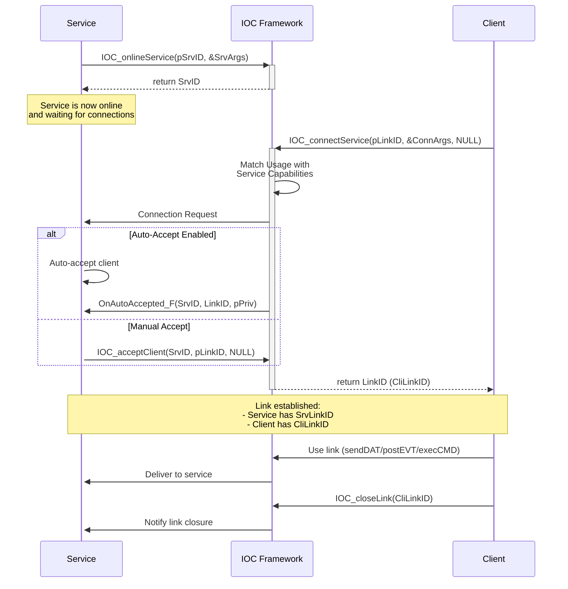
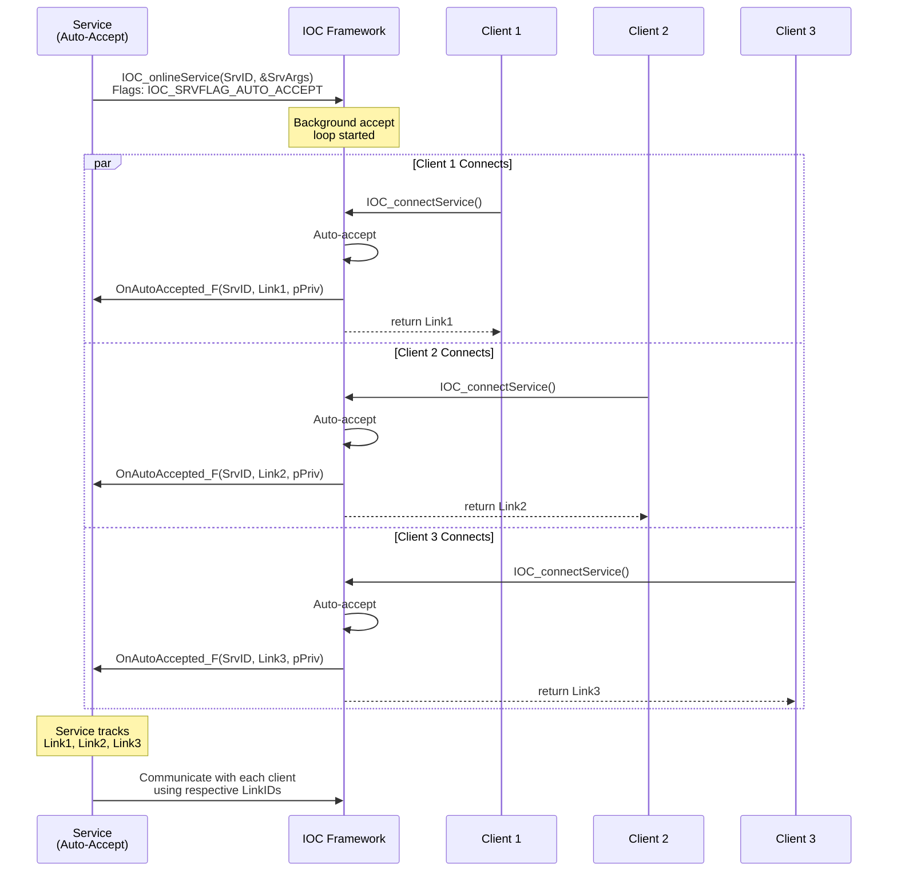
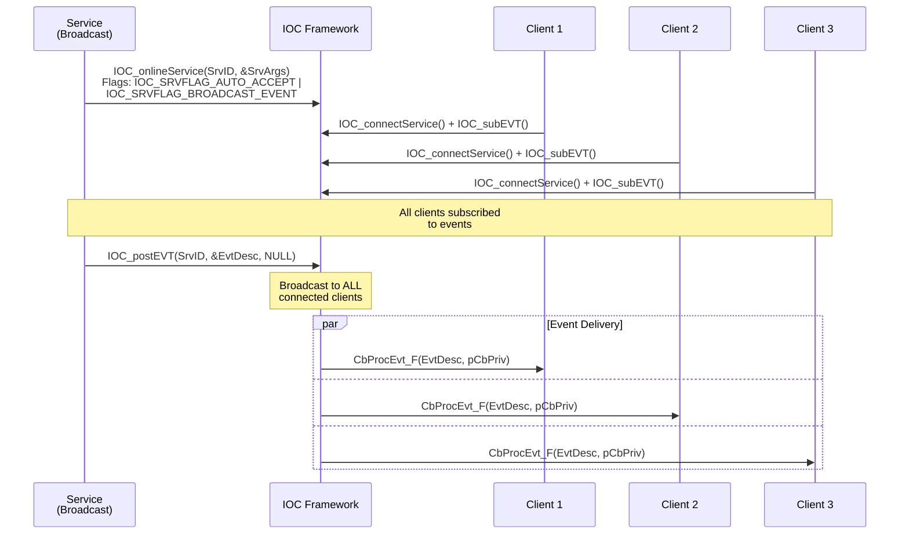

# IOC Service Management (SRV) User Guide

## Table of Contents
- [Overview](#overview)
- [API Reference](#api-reference)
- [Service Architecture](#service-architecture)
- [Typical Usage Patterns](#typical-usage-patterns)
- [Code Examples from Test Cases](#code-examples-from-test-cases)
- [Best Practices](#best-practices)
- [Error Handling](#error-handling)
- [Performance Considerations](#performance-considerations)
- [Troubleshooting](#troubleshooting)

## Overview

The IOC Service Management (SRV) subsystem provides the foundation for all IOC communication patterns. It manages service lifecycle, connection establishment, and link management between services and clients. SRV is the underlying infrastructure that enables CMD, EVT, and DAT subsystems to function.

### Key Features
- **Service Lifecycle Management**: Online/offline services with flexible configuration
- **Connection Management**: Establish and manage links between services and clients
- **Multi-Capability Services**: Single service can support multiple usage types (CMD/EVT/DAT)
- **Auto-Accept Pattern**: Automatic client connection acceptance for scalable services
- **Broadcast Support**: Efficient one-to-many event distribution
- **Protocol Abstraction**: Support for FIFO, TCP, and other transport protocols

### Service Roles

#### Service (Server Side)
- Provides capabilities: DatReceiver/DatSender, EvtProducer/EvtConsumer, CmdExecutor/CmdInitiator
- Uses `IOC_onlineService()` to start accepting connections
- Can auto-accept clients or manually accept with `IOC_acceptClient()`
- Identified by Service URI (protocol://host:port/path)

#### Client (Client Side)
- Consumes services using `IOC_connectService()`
- Specifies usage type: DatSender/DatReceiver, EvtProducer/EvtConsumer, CmdInitiator/CmdExecutor
- Must match service's complementary capability

## API Reference

### Core APIs (from IOC_SrvAPI.h)

#### IOC_onlineService
```c
IOC_Result_T IOC_onlineService(IOC_SrvID_pT pSrvID, const IOC_SrvArgs_pT pSrvArgs);
```
- **Purpose**: Start a service and make it available for client connections
- **Parameters**:
  - `pSrvID`: Output parameter receiving the service identifier
  - `pSrvArgs`: Service configuration including URI, capabilities, flags, and callbacks
- **Return Codes**:
  - `IOC_RESULT_SUCCESS`: Service started successfully
  - `IOC_RESULT_INVALID_PARAM`: Invalid service arguments
  - `IOC_RESULT_SERVICE_ALREADY_EXIST`: Service with same URI already online
  - `IOC_RESULT_PROTOCOL_NOT_SUPPORTED`: Specified protocol not available

#### IOC_offlineService
```c
IOC_Result_T IOC_offlineService(IOC_SrvID_T SrvID);
```
- **Purpose**: Stop a service and cleanup resources
- **Behavior**: 
  - By default, closes all accepted links (unless `IOC_SRVFLAG_KEEP_ACCEPTED_LINK` is set)
  - Prevents new client connections
  - Releases service resources
- **Return Codes**:
  - `IOC_RESULT_SUCCESS`: Service stopped successfully
  - `IOC_RESULT_NOT_EXIST_SERVICE`: SrvID does not exist
  - `IOC_RESULT_SERVICE_BUSY`: Service has active operations

#### IOC_connectService
```c
IOC_Result_T IOC_connectService(IOC_LinkID_pT pLinkID, const IOC_ConnArgs_pT pConnArgs, const IOC_Options_pT pOption);
```
- **Purpose**: Establish a connection from client to service
- **Parameters**:
  - `pLinkID`: Output parameter receiving the link identifier
  - `pConnArgs`: Connection arguments including URI, usage type, and callbacks
  - `pOption`: Optional connection options (timeout, etc.)
- **Key Concept**: The `Usage` field determines link capabilities:
  - `IOC_LinkUsageDatSender` → Can call `IOC_sendDAT()`
  - `IOC_LinkUsageDatReceiver` → Receives data via callback
  - `IOC_LinkUsageEvtProducer` → Can call `IOC_postEVT()`
  - `IOC_LinkUsageEvtConsumer` → Can call `IOC_subEVT()`
  - `IOC_LinkUsageCmdInitiator` → Can call `IOC_execCMD()`
  - `IOC_LinkUsageCmdExecutor` → Executes commands via callback
- **Return Codes**:
  - `IOC_RESULT_SUCCESS`: Connection established
  - `IOC_RESULT_CONNECTION_FAILED`: Unable to reach service
  - `IOC_RESULT_INCOMPATIBLE_USAGE`: Service doesn't support requested usage
  - `IOC_RESULT_TIMEOUT`: Connection timeout

#### IOC_acceptClient
```c
IOC_Result_T IOC_acceptClient(IOC_SrvID_T SrvID, IOC_LinkID_pT pLinkID, const IOC_Options_pT pOption);
```
- **Purpose**: Manually accept a pending client connection
- **Usage**: When `IOC_SRVFLAG_AUTO_ACCEPT` is NOT set
- **Return Codes**:
  - `IOC_RESULT_SUCCESS`: Client accepted
  - `IOC_RESULT_NO_PENDING_CLIENT`: No client waiting
  - `IOC_RESULT_TIMEOUT`: Accept timeout

#### IOC_closeLink
```c
IOC_Result_T IOC_closeLink(IOC_LinkID_T LinkID);
```
- **Purpose**: Close an established link (from either service or client side)
- **Return Codes**:
  - `IOC_RESULT_SUCCESS`: Link closed
  - `IOC_RESULT_NOT_EXIST_LINK`: LinkID does not exist

### Service Configuration Types

#### IOC_SrvArgs_T
```c
typedef struct {
    IOC_SrvURI_T SrvURI;              // Service address (protocol, host, port, path)
    IOC_SrvFlags_T Flags;             // Service behavior flags
    IOC_LinkUsage_T UsageCapabilites; // Supported capabilities
    
    struct {
        IOC_EvtUsageArgs_pT pEvt;  // Event configuration
        IOC_CmdUsageArgs_pT pCmd;  // Command configuration
        IOC_DatUsageArgs_pT pDat;  // Data configuration
    } UsageArgs;
    
    IOC_CbOnAutoAccepted_F OnAutoAccepted_F;  // Auto-accept callback
    void *pSrvPriv;                            // Service private data
} IOC_SrvArgs_T;
```

#### IOC_ConnArgs_T
```c
typedef struct {
    IOC_SrvURI_T SrvURI;       // Target service address
    IOC_LinkUsage_T Usage;     // Requested link usage type
    
    union {
        IOC_EvtUsageArgs_pT pEvt;  // Event configuration
        IOC_CmdUsageArgs_pT pCmd;  // Command configuration
        IOC_DatUsageArgs_pT pDat;  // Data configuration
    } UsageArgs;
} IOC_ConnArgs_T;
```

#### IOC_SrvURI_T
```c
typedef struct {
    const char *pProtocol;  // IOC_SRV_PROTO_FIFO, IOC_SRV_PROTO_TCP, etc.
    const char *pHost;      // IOC_SRV_HOST_LOCAL_PROCESS, IOC_SRV_HOST_LOCAL_HOST, IP address
    const char *pPath;      // Service name/path (e.g., "DataService", "EventHub")
    uint16_t Port;          // Port number (for TCP/UDP protocols)
} IOC_SrvURI_T;
```

### Service Flags

#### IOC_SRVFLAG_AUTO_ACCEPT
Automatically accepts client connections without manual `IOC_acceptClient()` calls.
- Starts background accept loop
- Optional `OnAutoAccepted_F` callback for immediate notification
- Stores accepted links inside service

#### IOC_SRVFLAG_BROADCAST_EVENT
Enables broadcast event posting to all connected clients.
- SrvID becomes broadcast sender to all ConnLinkIDs
- `IOC_postEVT(SrvLinkID)` → ALL clients receive event
- Efficient one-to-many event distribution

#### IOC_SRVFLAG_KEEP_ACCEPTED_LINK
Controls accepted link lifecycle during service shutdown.
- Without flag: `IOC_offlineService()` automatically closes all accepted links
- With flag: Links survive service shutdown, manual cleanup required

## Service Architecture

### Service-Client Connection Patterns

#### Pattern 1: Basic Service-Client Connection



#### Pattern 2: Auto-Accept Multi-Client Service



#### Pattern 3: Broadcast Event Service



## Typical Usage Patterns

### Pattern 1: Simple Service with Manual Accept

```c
// Service Side - Manual Accept Pattern
typedef struct {
    IOC_SrvID_T srvID;
    IOC_LinkID_T clientLinks[MAX_CLIENTS];
    size_t clientCount;
} ServiceContext_T;

IOC_Result_T setupManualAcceptService(ServiceContext_T *pContext) {
    // Configure service arguments
    IOC_SrvArgs_T SrvArgs = {0};
    IOC_Helper_initSrvArgs(&SrvArgs);
    
    // Set service URI
    SrvArgs.SrvURI.pProtocol = IOC_SRV_PROTO_FIFO;
    SrvArgs.SrvURI.pHost = IOC_SRV_HOST_LOCAL_PROCESS;
    SrvArgs.SrvURI.pPath = "ManualAcceptService";
    SrvArgs.SrvURI.Port = 0;
    
    // Define capabilities (example: Data Receiver)
    SrvArgs.UsageCapabilites = IOC_LinkUsageDatReceiver;
    
    // No auto-accept flag - manual acceptance required
    SrvArgs.Flags = IOC_SRVFLAG_NONE;
    
    // Start service
    IOC_Result_T result = IOC_onlineService(&pContext->srvID, &SrvArgs);
    if (result != IOC_RESULT_SUCCESS) {
        printf("Failed to online service: %s\n", IOC_getResultStr(result));
        return result;
    }
    
    printf("Service online, waiting for connections...\n");
    return IOC_RESULT_SUCCESS;
}

// Manually accept clients in a loop
IOC_Result_T acceptClientsManually(ServiceContext_T *pContext) {
    while (pContext->clientCount < MAX_CLIENTS) {
        IOC_LinkID_T newLinkID;
        
        // Set timeout for accept
        IOC_Options_T acceptOpts = {0};
        IOC_Option_defineTimeout(&acceptOpts, 5000000);  // 5 second timeout
        
        IOC_Result_T result = IOC_acceptClient(pContext->srvID, &newLinkID, &acceptOpts);
        
        if (result == IOC_RESULT_SUCCESS) {
            pContext->clientLinks[pContext->clientCount++] = newLinkID;
            printf("Accepted client %zu, LinkID: %llu\n", pContext->clientCount, newLinkID);
        } else if (result == IOC_RESULT_TIMEOUT) {
            printf("No client within timeout, waiting...\n");
            continue;
        } else {
            printf("Accept failed: %s\n", IOC_getResultStr(result));
            break;
        }
    }
    
    return IOC_RESULT_SUCCESS;
}

// Client Side - Connect to manual accept service
IOC_Result_T connectToManualService(const char *servicePath, IOC_LinkID_pT pLinkID) {
    IOC_ConnArgs_T ConnArgs = {0};
    IOC_Helper_initConnArgs(&ConnArgs);
    
    ConnArgs.SrvURI.pProtocol = IOC_SRV_PROTO_FIFO;
    ConnArgs.SrvURI.pHost = IOC_SRV_HOST_LOCAL_PROCESS;
    ConnArgs.SrvURI.pPath = servicePath;
    ConnArgs.Usage = IOC_LinkUsageDatSender;  // Complementary to service's DatReceiver
    
    IOC_Result_T result = IOC_connectService(pLinkID, &ConnArgs, NULL);
    if (result != IOC_RESULT_SUCCESS) {
        printf("Connection failed: %s\n", IOC_getResultStr(result));
        return result;
    }
    
    printf("Connected to service, LinkID: %llu\n", *pLinkID);
    return IOC_RESULT_SUCCESS;
}
```

### Pattern 2: Auto-Accept Service with Callback

```c
// Service context with auto-accept tracking
typedef struct {
    IOC_SrvID_T srvID;
    uint32_t totalClientsAccepted;
    IOC_LinkID_T activeClients[MAX_CLIENTS];
    pthread_mutex_t clientsMutex;
} AutoAcceptServiceContext_T;

// Auto-accept callback - called when new client connects
static void OnClientAutoAccepted(IOC_SrvID_T SrvID, IOC_LinkID_T NewLinkID, void *pSrvPriv) {
    AutoAcceptServiceContext_T *pContext = (AutoAcceptServiceContext_T *)pSrvPriv;
    
    pthread_mutex_lock(&pContext->clientsMutex);
    
    // Track new client
    if (pContext->totalClientsAccepted < MAX_CLIENTS) {
        pContext->activeClients[pContext->totalClientsAccepted] = NewLinkID;
        pContext->totalClientsAccepted++;
        
        printf("Auto-accepted client #%u, LinkID: %llu\n", 
               pContext->totalClientsAccepted, NewLinkID);
        
        // Optionally start per-client processing here
        // For example: send welcome message, initialize client state, etc.
    }
    
    pthread_mutex_unlock(&pContext->clientsMutex);
}

// Setup auto-accept service
IOC_Result_T setupAutoAcceptService(AutoAcceptServiceContext_T *pContext) {
    pthread_mutex_init(&pContext->clientsMutex, NULL);
    
    IOC_SrvArgs_T SrvArgs = {0};
    IOC_Helper_initSrvArgs(&SrvArgs);
    
    // Service URI
    SrvArgs.SrvURI.pProtocol = IOC_SRV_PROTO_FIFO;
    SrvArgs.SrvURI.pHost = IOC_SRV_HOST_LOCAL_PROCESS;
    SrvArgs.SrvURI.pPath = "AutoAcceptService";
    SrvArgs.SrvURI.Port = 0;
    
    // Define capabilities (example: Event Producer)
    SrvArgs.UsageCapabilites = IOC_LinkUsageEvtProducer;
    
    // Enable auto-accept with callback
    SrvArgs.Flags = IOC_SRVFLAG_AUTO_ACCEPT;
    SrvArgs.OnAutoAccepted_F = OnClientAutoAccepted;
    SrvArgs.pSrvPriv = pContext;
    
    IOC_Result_T result = IOC_onlineService(&pContext->srvID, &SrvArgs);
    if (result != IOC_RESULT_SUCCESS) {
        printf("Failed to online auto-accept service: %s\n", IOC_getResultStr(result));
        return result;
    }
    
    printf("Auto-accept service online, ready for clients\n");
    return IOC_RESULT_SUCCESS;
}

// Broadcast events to all auto-accepted clients
IOC_Result_T broadcastToAllClients(AutoAcceptServiceContext_T *pContext, 
                                  IOC_EvtDesc_pT pEvtDesc) {
    pthread_mutex_lock(&pContext->clientsMutex);
    
    printf("Broadcasting to %u clients\n", pContext->totalClientsAccepted);
    
    for (uint32_t i = 0; i < pContext->totalClientsAccepted; i++) {
        IOC_Result_T result = IOC_postEVT(pContext->activeClients[i], pEvtDesc, NULL);
        if (result != IOC_RESULT_SUCCESS) {
            printf("Failed to send to client %u: %s\n", i, IOC_getResultStr(result));
        }
    }
    
    pthread_mutex_unlock(&pContext->clientsMutex);
    return IOC_RESULT_SUCCESS;
}
```

### Pattern 3: Multi-Capability Service

```c
// Service supporting multiple capabilities simultaneously
typedef struct {
    IOC_SrvID_T srvID;
    uint32_t commandsExecuted;
    uint32_t eventsPosted;
    uint32_t dataReceived;
} MultiCapabilityServiceContext_T;

// Command execution callback
static IOC_Result_T MultiSvcCmdExecutor(IOC_LinkID_T LinkID, 
                                       IOC_CmdDesc_pT pCmdDesc, 
                                       void *pCbPriv) {
    MultiCapabilityServiceContext_T *pContext = (MultiCapabilityServiceContext_T *)pCbPriv;
    pContext->commandsExecuted++;
    
    printf("Executing command %llu\n", IOC_CmdDesc_getCmdID(pCmdDesc));
    
    // Process command and set result
    IOC_CmdDesc_setResult(pCmdDesc, IOC_RESULT_SUCCESS);
    return IOC_RESULT_SUCCESS;
}

// Data reception callback
static IOC_Result_T MultiSvcDataReceiver(IOC_LinkID_T LinkID, 
                                        IOC_DatDesc_pT pDatDesc, 
                                        void *pCbPriv) {
    MultiCapabilityServiceContext_T *pContext = (MultiCapabilityServiceContext_T *)pCbPriv;
    pContext->dataReceived++;
    
    size_t dataSize = IOC_DatDesc_getDataSize(pDatDesc);
    printf("Received %zu bytes of data\n", dataSize);
    
    return IOC_RESULT_SUCCESS;
}

// Setup multi-capability service
IOC_Result_T setupMultiCapabilityService(MultiCapabilityServiceContext_T *pContext) {
    // Configure command execution capability
    IOC_CmdUsageArgs_T CmdArgs = {
        .CbExecCmd_F = MultiSvcCmdExecutor,
        .pCbPrivData = pContext,
        .CmdNum = 0,      // Accept all commands
        .pCmdIDs = NULL
    };
    
    // Configure data reception capability
    IOC_DatUsageArgs_T DatArgs = {
        .CbRecvDat_F = MultiSvcDataReceiver,
        .pCbPrivData = pContext
    };
    
    IOC_SrvArgs_T SrvArgs = {0};
    IOC_Helper_initSrvArgs(&SrvArgs);
    
    // Service URI
    SrvArgs.SrvURI.pProtocol = IOC_SRV_PROTO_FIFO;
    SrvArgs.SrvURI.pHost = IOC_SRV_HOST_LOCAL_PROCESS;
    SrvArgs.SrvURI.pPath = "MultiCapabilityService";
    SrvArgs.SrvURI.Port = 0;
    
    // Combine multiple capabilities using bitwise OR
    SrvArgs.UsageCapabilites = IOC_LinkUsageCmdExecutor | 
                               IOC_LinkUsageDatReceiver | 
                               IOC_LinkUsageEvtProducer;
    
    // Assign usage-specific arguments
    SrvArgs.UsageArgs.pCmd = &CmdArgs;
    SrvArgs.UsageArgs.pDat = &DatArgs;
    // pEvt is NULL since we're only producing events (no callback needed)
    
    SrvArgs.Flags = IOC_SRVFLAG_AUTO_ACCEPT;
    
    IOC_Result_T result = IOC_onlineService(&pContext->srvID, &SrvArgs);
    if (result != IOC_RESULT_SUCCESS) {
        printf("Failed to online multi-capability service: %s\n", IOC_getResultStr(result));
        return result;
    }
    
    printf("Multi-capability service online (CMD+DAT+EVT)\n");
    return IOC_RESULT_SUCCESS;
}

// Clients can connect with different usage types to same service
IOC_Result_T connectAsCommandClient(const char *servicePath, IOC_LinkID_pT pLinkID) {
    IOC_ConnArgs_T ConnArgs = {0};
    IOC_Helper_initConnArgs(&ConnArgs);
    
    ConnArgs.SrvURI.pProtocol = IOC_SRV_PROTO_FIFO;
    ConnArgs.SrvURI.pHost = IOC_SRV_HOST_LOCAL_PROCESS;
    ConnArgs.SrvURI.pPath = servicePath;
    ConnArgs.Usage = IOC_LinkUsageCmdInitiator;  // Connect for command execution
    
    return IOC_connectService(pLinkID, &ConnArgs, NULL);
}

IOC_Result_T connectAsDataClient(const char *servicePath, IOC_LinkID_pT pLinkID) {
    IOC_ConnArgs_T ConnArgs = {0};
    IOC_Helper_initConnArgs(&ConnArgs);
    
    ConnArgs.SrvURI.pProtocol = IOC_SRV_PROTO_FIFO;
    ConnArgs.SrvURI.pHost = IOC_SRV_HOST_LOCAL_PROCESS;
    ConnArgs.SrvURI.pPath = servicePath;
    ConnArgs.Usage = IOC_LinkUsageDatSender;  // Connect for data transmission
    
    return IOC_connectService(pLinkID, &ConnArgs, NULL);
}
```

### Pattern 4: Broadcast Event Service

```c
// Broadcast service context
typedef struct {
    IOC_SrvID_T srvID;
    uint32_t eventsBroadcasted;
    uint32_t connectedConsumers;
} BroadcastServiceContext_T;

// Setup broadcast event service
IOC_Result_T setupBroadcastEventService(BroadcastServiceContext_T *pContext) {
    IOC_SrvArgs_T SrvArgs = {0};
    IOC_Helper_initSrvArgs(&SrvArgs);
    
    // Service URI
    SrvArgs.SrvURI.pProtocol = IOC_SRV_PROTO_FIFO;
    SrvArgs.SrvURI.pHost = IOC_SRV_HOST_LOCAL_PROCESS;
    SrvArgs.SrvURI.pPath = "BroadcastEventHub";
    SrvArgs.SrvURI.Port = 0;
    
    // Event producer capability
    SrvArgs.UsageCapabilites = IOC_LinkUsageEvtProducer;
    
    // Enable both auto-accept AND broadcast
    SrvArgs.Flags = IOC_SRVFLAG_AUTO_ACCEPT | IOC_SRVFLAG_BROADCAST_EVENT;
    
    IOC_Result_T result = IOC_onlineService(&pContext->srvID, &SrvArgs);
    if (result != IOC_RESULT_SUCCESS) {
        printf("Failed to online broadcast service: %s\n", IOC_getResultStr(result));
        return result;
    }
    
    printf("Broadcast event service online\n");
    return IOC_RESULT_SUCCESS;
}

// Broadcast event to ALL connected clients with single API call
IOC_Result_T broadcastEvent(BroadcastServiceContext_T *pContext, IOC_EvtID_T eventID) {
    IOC_EvtDesc_T EvtDesc = {
        .EvtID = eventID,
        .DataLen = 0,
        .pData = NULL
    };
    
    // Post to SrvID broadcasts to ALL clients automatically
    IOC_Result_T result = IOC_postEVT(pContext->srvID, &EvtDesc, NULL);
    
    if (result == IOC_RESULT_SUCCESS) {
        pContext->eventsBroadcasted++;
        printf("Broadcasted event %llu to all consumers\n", eventID);
    } else {
        printf("Broadcast failed: %s\n", IOC_getResultStr(result));
    }
    
    return result;
}

// Client connects as event consumer
IOC_Result_T connectToBroadcastService(const char *servicePath, 
                                      IOC_CbProcEvt_F callback,
                                      void *callbackPrivateData,
                                      IOC_LinkID_pT pLinkID) {
    IOC_EvtUsageArgs_T EvtArgs = {
        .CbProcEvt_F = callback,
        .pCbPrivData = callbackPrivateData,
        .EvtNum = 0,      // Subscribe to all events
        .pEvtIDs = NULL
    };
    
    IOC_ConnArgs_T ConnArgs = {0};
    IOC_Helper_initConnArgs(&ConnArgs);
    
    ConnArgs.SrvURI.pProtocol = IOC_SRV_PROTO_FIFO;
    ConnArgs.SrvURI.pHost = IOC_SRV_HOST_LOCAL_PROCESS;
    ConnArgs.SrvURI.pPath = servicePath;
    ConnArgs.Usage = IOC_LinkUsageEvtConsumer;
    ConnArgs.UsageArgs.pEvt = &EvtArgs;
    
    IOC_Result_T result = IOC_connectService(pLinkID, &ConnArgs, NULL);
    if (result != IOC_RESULT_SUCCESS) {
        printf("Failed to connect to broadcast service: %s\n", IOC_getResultStr(result));
        return result;
    }
    
    // Subscribe to events
    IOC_SubEvtArgs_T SubArgs = {
        .CbProcEvt_F = callback,
        .pCbPrivData = callbackPrivateData,
        .EvtNum = 0,
        .pEvtIDs = NULL
    };
    
    return IOC_subEVT(*pLinkID, &SubArgs);
}
```

## Code Examples from Test Cases

### Example 1: Basic Service Lifecycle (from UT_ServiceTypical.cxx)

```c
// Basic service online/offline lifecycle
TEST(UT_ServiceTypical, verifyServiceLifecycle_bySingleService_expectSuccess) {
    IOC_SrvID_T SrvID = IOC_ID_INVALID;
    
    // Setup service arguments
    IOC_SrvArgs_T SrvArgs = {0};
    IOC_Helper_initSrvArgs(&SrvArgs);
    
    SrvArgs.SrvURI.pProtocol = IOC_SRV_PROTO_FIFO;
    SrvArgs.SrvURI.pHost = IOC_SRV_HOST_LOCAL_PROCESS;
    SrvArgs.SrvURI.pPath = "BasicTestService";
    SrvArgs.SrvURI.Port = 0;
    SrvArgs.UsageCapabilites = IOC_LinkUsageEvtProducer;
    SrvArgs.Flags = IOC_SRVFLAG_NONE;
    
    // Online service
    ASSERT_EQ(IOC_RESULT_SUCCESS, IOC_onlineService(&SrvID, &SrvArgs));
    EXPECT_NE(IOC_ID_INVALID, SrvID);
    
    printf("Service onlined with SrvID: %llu\n", SrvID);
    
    // Service is now active and can accept connections
    // ... perform operations ...
    
    // Offline service
    ASSERT_EQ(IOC_RESULT_SUCCESS, IOC_offlineService(SrvID));
    
    printf("Service offlined successfully\n");
}
```

### Example 2: Service-Client Connection (from UT_ServiceTypical.cxx)

```c
// Service with single client connection
TEST(UT_ServiceTypical, verifyConnection_bySingleClientToService_expectLinksEstablished) {
    IOC_SrvID_T SrvID = IOC_ID_INVALID;
    IOC_LinkID_T SrvLinkID = IOC_ID_INVALID;
    IOC_LinkID_T CliLinkID = IOC_ID_INVALID;
    
    // Setup and online service
    IOC_SrvArgs_T SrvArgs = {0};
    IOC_Helper_initSrvArgs(&SrvArgs);
    
    SrvArgs.SrvURI.pProtocol = IOC_SRV_PROTO_FIFO;
    SrvArgs.SrvURI.pHost = IOC_SRV_HOST_LOCAL_PROCESS;
    SrvArgs.SrvURI.pPath = "ConnectionTestService";
    SrvArgs.SrvURI.Port = 0;
    SrvArgs.UsageCapabilites = IOC_LinkUsageEvtProducer;
    SrvArgs.Flags = IOC_SRVFLAG_NONE;  // Manual accept
    
    ASSERT_EQ(IOC_RESULT_SUCCESS, IOC_onlineService(&SrvID, &SrvArgs));
    
    // Client connects to service (in separate thread or async)
    std::thread clientThread([&CliLinkID, &SrvArgs]() {
        IOC_ConnArgs_T ConnArgs = {0};
        IOC_Helper_initConnArgs(&ConnArgs);
        
        ConnArgs.SrvURI = SrvArgs.SrvURI;
        ConnArgs.Usage = IOC_LinkUsageEvtConsumer;  // Complementary to producer
        
        IOC_Result_T result = IOC_connectService(&CliLinkID, &ConnArgs, NULL);
        EXPECT_EQ(IOC_RESULT_SUCCESS, result);
    });
    
    // Service accepts client connection
    IOC_Options_T acceptOpts = {0};
    IOC_Option_defineTimeout(&acceptOpts, 2000000);  // 2 second timeout
    
    ASSERT_EQ(IOC_RESULT_SUCCESS, IOC_acceptClient(SrvID, &SrvLinkID, &acceptOpts));
    
    clientThread.join();
    
    // Verify both sides have valid link IDs
    EXPECT_NE(IOC_ID_INVALID, SrvLinkID);
    EXPECT_NE(IOC_ID_INVALID, CliLinkID);
    
    printf("Connection established: SrvLinkID=%llu, CliLinkID=%llu\n", 
           SrvLinkID, CliLinkID);
    
    // Cleanup
    IOC_closeLink(SrvLinkID);
    IOC_closeLink(CliLinkID);
    IOC_offlineService(SrvID);
}
```

### Example 3: Auto-Accept Multiple Clients (from UT_ServiceTypical.cxx)

```c
// Auto-accept service with multiple clients
TEST(UT_ServiceTypical, verifyAutoAccept_byMultipleClients_expectAllAccepted) {
    const int NumClients = 5;
    IOC_SrvID_T SrvID = IOC_ID_INVALID;
    IOC_LinkID_T ClientLinks[NumClients];
    
    // Auto-accept context
    struct {
        uint32_t acceptedCount;
        IOC_LinkID_T acceptedLinks[NumClients];
    } autoAcceptContext = {0};
    
    // Auto-accept callback
    auto onAutoAccept = [](IOC_SrvID_T SrvID, IOC_LinkID_T NewLinkID, void *pPriv) {
        auto *pCtx = (decltype(autoAcceptContext)*)pPriv;
        pCtx->acceptedLinks[pCtx->acceptedCount++] = NewLinkID;
        printf("Auto-accepted client #%u, LinkID: %llu\n", pCtx->acceptedCount, NewLinkID);
    };
    
    // Setup auto-accept service
    IOC_SrvArgs_T SrvArgs = {0};
    IOC_Helper_initSrvArgs(&SrvArgs);
    
    SrvArgs.SrvURI.pProtocol = IOC_SRV_PROTO_FIFO;
    SrvArgs.SrvURI.pHost = IOC_SRV_HOST_LOCAL_PROCESS;
    SrvArgs.SrvURI.pPath = "AutoAcceptTestService";
    SrvArgs.SrvURI.Port = 0;
    SrvArgs.UsageCapabilites = IOC_LinkUsageEvtProducer;
    SrvArgs.Flags = IOC_SRVFLAG_AUTO_ACCEPT;
    SrvArgs.OnAutoAccepted_F = onAutoAccept;
    SrvArgs.pSrvPriv = &autoAcceptContext;
    
    ASSERT_EQ(IOC_RESULT_SUCCESS, IOC_onlineService(&SrvID, &SrvArgs));
    
    // Multiple clients connect
    for (int i = 0; i < NumClients; i++) {
        IOC_ConnArgs_T ConnArgs = {0};
        IOC_Helper_initConnArgs(&ConnArgs);
        
        ConnArgs.SrvURI = SrvArgs.SrvURI;
        ConnArgs.Usage = IOC_LinkUsageEvtConsumer;
        
        ASSERT_EQ(IOC_RESULT_SUCCESS, IOC_connectService(&ClientLinks[i], &ConnArgs, NULL));
    }
    
    // Allow time for auto-accept to complete
    usleep(100000);
    
    // Verify all clients were accepted
    EXPECT_EQ(NumClients, autoAcceptContext.acceptedCount);
    
    // Cleanup
    for (int i = 0; i < NumClients; i++) {
        IOC_closeLink(ClientLinks[i]);
    }
    IOC_offlineService(SrvID);
}
```

### Example 4: Broadcast Event Service (from UT_ServiceBroadcastEvent.cxx)

```c
// Broadcast events to multiple consumers
TEST(UT_ServiceBroadcastEvent, verifyBroadcast_byMultipleConsumers_expectAllReceive) {
    const int NumConsumers = 3;
    IOC_SrvID_T SrvID = IOC_ID_INVALID;
    IOC_LinkID_T ConsumerLinks[NumConsumers];
    
    // Consumer contexts to track received events
    struct ConsumerContext {
        uint32_t eventsReceived;
        IOC_EvtID_T lastEventID;
    } consumerContexts[NumConsumers] = {0};
    
    // Event callback
    auto eventCallback = [](IOC_EvtDesc_pT pEvtDesc, void *pCbPriv) -> IOC_Result_T {
        ConsumerContext *pCtx = (ConsumerContext *)pCbPriv;
        pCtx->eventsReceived++;
        pCtx->lastEventID = pEvtDesc->EvtID;
        printf("Consumer received event %llu (total: %u)\n", 
               pEvtDesc->EvtID, pCtx->eventsReceived);
        return IOC_RESULT_SUCCESS;
    };
    
    // Setup broadcast service
    IOC_SrvArgs_T SrvArgs = {0};
    IOC_Helper_initSrvArgs(&SrvArgs);
    
    SrvArgs.SrvURI.pProtocol = IOC_SRV_PROTO_FIFO;
    SrvArgs.SrvURI.pHost = IOC_SRV_HOST_LOCAL_PROCESS;
    SrvArgs.SrvURI.pPath = "BroadcastTestService";
    SrvArgs.SrvURI.Port = 0;
    SrvArgs.UsageCapabilites = IOC_LinkUsageEvtProducer;
    SrvArgs.Flags = IOC_SRVFLAG_AUTO_ACCEPT | IOC_SRVFLAG_BROADCAST_EVENT;
    
    ASSERT_EQ(IOC_RESULT_SUCCESS, IOC_onlineService(&SrvID, &SrvArgs));
    
    // Connect multiple consumers
    for (int i = 0; i < NumConsumers; i++) {
        IOC_EvtUsageArgs_T EvtArgs = {
            .CbProcEvt_F = eventCallback,
            .pCbPrivData = &consumerContexts[i],
            .EvtNum = 0,
            .pEvtIDs = NULL
        };
        
        IOC_ConnArgs_T ConnArgs = {0};
        IOC_Helper_initConnArgs(&ConnArgs);
        
        ConnArgs.SrvURI = SrvArgs.SrvURI;
        ConnArgs.Usage = IOC_LinkUsageEvtConsumer;
        ConnArgs.UsageArgs.pEvt = &EvtArgs;
        
        ASSERT_EQ(IOC_RESULT_SUCCESS, IOC_connectService(&ConsumerLinks[i], &ConnArgs, NULL));
        
        // Subscribe to events
        IOC_SubEvtArgs_T SubArgs = {
            .CbProcEvt_F = eventCallback,
            .pCbPrivData = &consumerContexts[i],
            .EvtNum = 0,
            .pEvtIDs = NULL
        };
        ASSERT_EQ(IOC_RESULT_SUCCESS, IOC_subEVT(ConsumerLinks[i], &SubArgs));
    }
    
    // Broadcast event using SrvID
    IOC_EvtDesc_T EvtDesc = {
        .EvtID = IOC_EVTID_TEST_KEEPALIVE,
        .DataLen = 0,
        .pData = NULL
    };
    
    ASSERT_EQ(IOC_RESULT_SUCCESS, IOC_postEVT(SrvID, &EvtDesc, NULL));
    
    // Force event processing
    IOC_forceProcEVT();
    
    // Verify all consumers received the broadcast
    for (int i = 0; i < NumConsumers; i++) {
        EXPECT_EQ(1, consumerContexts[i].eventsReceived);
        EXPECT_EQ(IOC_EVTID_TEST_KEEPALIVE, consumerContexts[i].lastEventID);
    }
    
    // Cleanup
    for (int i = 0; i < NumConsumers; i++) {
        IOC_closeLink(ConsumerLinks[i]);
    }
    IOC_offlineService(SrvID);
}
```

## Best Practices

### 1. Service URI Design

```c
// ✅ Good: Descriptive, hierarchical service paths
SrvArgs.SrvURI.pPath = "sensors/temperature/room101";
SrvArgs.SrvURI.pPath = "control/hvac/building_a";
SrvArgs.SrvURI.pPath = "data/processing/analytics";

// ✅ Good: Use constants for well-known services
#define SERVICE_PATH_MONITORING "monitoring/system/health"
#define SERVICE_PATH_CONFIG     "config/application/settings"

// ❌ Avoid: Generic or ambiguous names
SrvArgs.SrvURI.pPath = "service1";
SrvArgs.SrvURI.pPath = "temp";
```

### 2. Resource Cleanup Pattern

```c
// ✅ Good: Proper cleanup order and error handling
IOC_Result_T cleanupServiceAndLinks(IOC_SrvID_T srvID, 
                                   IOC_LinkID_T links[], 
                                   size_t linkCount) {
    // 1. Close all client/accepted links first
    for (size_t i = 0; i < linkCount; i++) {
        if (links[i] != IOC_ID_INVALID) {
            IOC_Result_T result = IOC_closeLink(links[i]);
            if (result != IOC_RESULT_SUCCESS) {
                printf("Warning: Failed to close link %llu: %s\n", 
                       links[i], IOC_getResultStr(result));
            }
            links[i] = IOC_ID_INVALID;
        }
    }
    
    // 2. Offline service (will close remaining links if not KEEP_ACCEPTED_LINK)
    if (srvID != IOC_ID_INVALID) {
        IOC_Result_T result = IOC_offlineService(srvID);
        if (result != IOC_RESULT_SUCCESS) {
            printf("Failed to offline service: %s\n", IOC_getResultStr(result));
            return result;
        }
    }
    
    return IOC_RESULT_SUCCESS;
}
```

### 3. Connection Retry Pattern

```c
// ✅ Good: Exponential backoff retry logic
IOC_Result_T connectWithRetry(IOC_ConnArgs_pT pConnArgs, 
                             IOC_LinkID_pT pLinkID, 
                             int maxRetries) {
    int retryCount = 0;
    IOC_Result_T result;
    
    while (retryCount < maxRetries) {
        result = IOC_connectService(pLinkID, pConnArgs, NULL);
        
        if (result == IOC_RESULT_SUCCESS) {
            printf("Connected successfully after %d retries\n", retryCount);
            return IOC_RESULT_SUCCESS;
        }
        
        if (result == IOC_RESULT_CONNECTION_FAILED || 
            result == IOC_RESULT_TIMEOUT) {
            // Exponential backoff: 100ms, 200ms, 400ms, 800ms, ...
            int delayMs = 100 * (1 << retryCount);
            printf("Connection attempt %d failed, retrying in %dms...\n", 
                   retryCount + 1, delayMs);
            usleep(delayMs * 1000);
            retryCount++;
        } else {
            // Non-retryable error
            printf("Connection failed with non-retryable error: %s\n", 
                   IOC_getResultStr(result));
            return result;
        }
    }
    
    printf("Connection failed after %d retries\n", maxRetries);
    return IOC_RESULT_CONNECTION_FAILED;
}
```

### 4. Multi-Capability Service Design

```c
// ✅ Good: Organized multi-capability service with proper separation
typedef struct {
    IOC_SrvID_T srvID;
    
    // Command-related state
    struct {
        uint32_t commandsExecuted;
        IOC_CbExecCmd_F callback;
    } cmd;
    
    // Event-related state
    struct {
        uint32_t eventsPosted;
        IOC_CbProcEvt_F callback;
    } evt;
    
    // Data-related state
    struct {
        uint32_t dataReceived;
        IOC_CbRecvDat_F callback;
    } dat;
    
} MultiCapServiceContext_T;

IOC_Result_T initMultiCapService(MultiCapServiceContext_T *pContext) {
    // Initialize callbacks
    pContext->cmd.callback = cmdExecutorCallback;
    pContext->evt.callback = evtProcessorCallback;
    pContext->dat.callback = datReceiverCallback;
    
    // Setup usage arguments
    IOC_CmdUsageArgs_T cmdArgs = {
        .CbExecCmd_F = pContext->cmd.callback,
        .pCbPrivData = &pContext->cmd,
        .CmdNum = 0,
        .pCmdIDs = NULL
    };
    
    IOC_EvtUsageArgs_T evtArgs = {
        .CbProcEvt_F = pContext->evt.callback,
        .pCbPrivData = &pContext->evt,
        .EvtNum = 0,
        .pEvtIDs = NULL
    };
    
    IOC_DatUsageArgs_T datArgs = {
        .CbRecvDat_F = pContext->dat.callback,
        .pCbPrivData = &pContext->dat
    };
    
    // Configure service
    IOC_SrvArgs_T srvArgs = {0};
    IOC_Helper_initSrvArgs(&srvArgs);
    
    srvArgs.SrvURI.pProtocol = IOC_SRV_PROTO_FIFO;
    srvArgs.SrvURI.pHost = IOC_SRV_HOST_LOCAL_PROCESS;
    srvArgs.SrvURI.pPath = "unified/service/endpoint";
    
    srvArgs.UsageCapabilites = IOC_LinkUsageCmdExecutor | 
                               IOC_LinkUsageEvtConsumer | 
                               IOC_LinkUsageDatReceiver;
    
    srvArgs.UsageArgs.pCmd = &cmdArgs;
    srvArgs.UsageArgs.pEvt = &evtArgs;
    srvArgs.UsageArgs.pDat = &datArgs;
    
    srvArgs.Flags = IOC_SRVFLAG_AUTO_ACCEPT;
    
    return IOC_onlineService(&pContext->srvID, &srvArgs);
}
```

## Error Handling

### Common Error Scenarios and Solutions

#### 1. Service Already Exists

```c
IOC_Result_T result = IOC_onlineService(&SrvID, &SrvArgs);
if (result == IOC_RESULT_SERVICE_ALREADY_EXIST) {
    printf("Service with URI %s already exists\n", 
           IOC_Helper_printSingleLineSrvURI(&SrvArgs.SrvURI, NULL, 0));
    
    // Option 1: Use different path
    SrvArgs.SrvURI.pPath = "alternative/service/path";
    result = IOC_onlineService(&SrvID, &SrvArgs);
    
    // Option 2: Offline existing service first (if you own it)
    // IOC_offlineService(existingSrvID);
    // result = IOC_onlineService(&SrvID, &SrvArgs);
    
    return result;
}
```

#### 2. Connection Failed

```c
IOC_Result_T result = IOC_connectService(&LinkID, &ConnArgs, NULL);
if (result == IOC_RESULT_CONNECTION_FAILED) {
    printf("Failed to connect to service: %s\n", 
           IOC_Helper_printSingleLineSrvURI(&ConnArgs.SrvURI, NULL, 0));
    
    // Check if service is online
    // Check if service URI is correct
    // Check if network/protocol is available
    
    // Retry with timeout
    IOC_Options_T opts = {0};
    IOC_Option_defineTimeout(&opts, 5000000);  // 5 seconds
    result = IOC_connectService(&LinkID, &ConnArgs, &opts);
    
    return result;
}
```

#### 3. Incompatible Usage

```c
IOC_Result_T result = IOC_connectService(&LinkID, &ConnArgs, NULL);
if (result == IOC_RESULT_INCOMPATIBLE_USAGE) {
    printf("Service doesn't support requested usage type\n");
    printf("Requested: %d\n", ConnArgs.Usage);
    
    // Check service capabilities and adjust client usage
    // For example, if service is DatReceiver, client should be DatSender
    
    // Usage compatibility:
    // Service: DatReceiver <-> Client: DatSender
    // Service: DatSender <-> Client: DatReceiver
    // Service: EvtProducer <-> Client: EvtConsumer
    // Service: EvtConsumer <-> Client: EvtProducer
    // Service: CmdExecutor <-> Client: CmdInitiator
    // Service: CmdInitiator <-> Client: CmdExecutor
    
    return result;
}
```

#### 4. Service Busy

```c
IOC_Result_T result = IOC_offlineService(SrvID);
if (result == IOC_RESULT_SERVICE_BUSY) {
    printf("Service has active operations, waiting...\n");
    
    // Option 1: Wait and retry
    usleep(100000);  // 100ms
    result = IOC_offlineService(SrvID);
    
    // Option 2: Force close all links first
    // closeAllServiceLinks(SrvID);
    // result = IOC_offlineService(SrvID);
    
    return result;
}
```

## Performance Considerations

### 1. Auto-Accept vs Manual Accept

```c
// Auto-Accept: Best for high-throughput, many clients
// - Lower latency for client connections
// - Automatic handling, no explicit accept loop needed
// - Use OnAutoAccepted_F for per-client initialization

SrvArgs.Flags = IOC_SRVFLAG_AUTO_ACCEPT;
SrvArgs.OnAutoAccepted_F = onClientAccepted;

// Manual Accept: Best for controlled access, authentication
// - Explicit control over which clients to accept
// - Can validate/authenticate before accepting
// - Sequential processing of connection requests

SrvArgs.Flags = IOC_SRVFLAG_NONE;
// Then call IOC_acceptClient() in loop or on-demand
```

### 2. Broadcast Events

```c
// ✅ Efficient: Single broadcast to all clients
SrvArgs.Flags = IOC_SRVFLAG_BROADCAST_EVENT;
IOC_postEVT(SrvID, &EvtDesc, NULL);  // Reaches all clients

// ❌ Inefficient: Loop through individual clients
for (size_t i = 0; i < clientCount; i++) {
    IOC_postEVT(clientLinks[i], &EvtDesc, NULL);
}
```

### 3. Connection Pooling

```c
// Maintain persistent connections for frequently used services
typedef struct {
    IOC_LinkID_T linkID;
    const char *servicePath;
    IOC_LinkUsage_T usage;
    bool connected;
    time_t lastUsed;
} ConnectionPoolEntry_T;

typedef struct {
    ConnectionPoolEntry_T entries[MAX_POOLED_CONNECTIONS];
    size_t count;
    pthread_mutex_t mutex;
} ConnectionPool_T;

IOC_LinkID_T getOrCreateConnection(ConnectionPool_T *pool, 
                                  const char *servicePath,
                                  IOC_LinkUsage_T usage) {
    pthread_mutex_lock(&pool->mutex);
    
    // Find existing connection
    for (size_t i = 0; i < pool->count; i++) {
        if (pool->entries[i].connected && 
            strcmp(pool->entries[i].servicePath, servicePath) == 0 &&
            pool->entries[i].usage == usage) {
            
            pool->entries[i].lastUsed = time(NULL);
            pthread_mutex_unlock(&pool->mutex);
            return pool->entries[i].linkID;
        }
    }
    
    // Create new connection
    IOC_LinkID_T newLinkID;
    IOC_ConnArgs_T connArgs = {0};
    IOC_Helper_initConnArgs(&connArgs);
    
    connArgs.SrvURI.pProtocol = IOC_SRV_PROTO_FIFO;
    connArgs.SrvURI.pHost = IOC_SRV_HOST_LOCAL_PROCESS;
    connArgs.SrvURI.pPath = servicePath;
    connArgs.Usage = usage;
    
    IOC_Result_T result = IOC_connectService(&newLinkID, &connArgs, NULL);
    
    if (result == IOC_RESULT_SUCCESS && pool->count < MAX_POOLED_CONNECTIONS) {
        pool->entries[pool->count].linkID = newLinkID;
        pool->entries[pool->count].servicePath = servicePath;
        pool->entries[pool->count].usage = usage;
        pool->entries[pool->count].connected = true;
        pool->entries[pool->count].lastUsed = time(NULL);
        pool->count++;
    }
    
    pthread_mutex_unlock(&pool->mutex);
    return newLinkID;
}
```

## Troubleshooting

### Common Issues and Solutions

#### Issue: Service Won't Start
**Symptoms**: `IOC_onlineService` returns error
**Solutions**:
1. Check if service URI is already in use
2. Verify protocol is supported (IOC_SRV_PROTO_FIFO, etc.)
3. Check if port is available (for TCP services)
4. Validate service arguments are properly initialized
5. Check system resource limits

#### Issue: Client Can't Connect
**Symptoms**: `IOC_connectService` fails or times out
**Solutions**:
1. Verify service is online before connecting
2. Check service URI matches exactly (protocol, host, path, port)
3. Ensure usage type is compatible with service capabilities
4. Check network connectivity (for non-local services)
5. Increase connection timeout

#### Issue: Auto-Accept Not Working
**Symptoms**: Clients connect but OnAutoAccepted_F not called
**Solutions**:
1. Verify `IOC_SRVFLAG_AUTO_ACCEPT` flag is set
2. Check OnAutoAccepted_F function pointer is valid
3. Ensure service is properly onlined
4. Check for race conditions in multi-threaded scenarios

#### Issue: Links Remain After Service Offline
**Symptoms**: Links still active after offlineService
**Solutions**:
1. Check if `IOC_SRVFLAG_KEEP_ACCEPTED_LINK` is set
2. Manually close links before offlineService if flag is set
3. Verify proper cleanup order (links first, then service)

#### Issue: Broadcast Events Not Reaching All Clients
**Symptoms**: Some clients don't receive broadcast events
**Solutions**:
1. Verify `IOC_SRVFLAG_BROADCAST_EVENT` flag is set
2. Ensure clients have subscribed to events via `IOC_subEVT()`
3. Check that clients are properly connected
4. Call `IOC_forceProcEVT()` if using synchronous processing

## Unit Test References

For comprehensive examples and validation patterns, refer to these test files:

- **UT_ServiceTypical.cxx**: Basic service lifecycle and connection patterns
- **UT_ServiceEdge.cxx**: Edge cases and edge conditions
- **UT_ServiceMisuse.cxx**: Error handling and invalid usage scenarios
- **UT_ServiceBroadcastEvent.cxx**: Broadcast event patterns
- **UT_ServiceState.cxx**: Service and link state management
- **UT_ServiceCapability.cxx**: Multi-capability service patterns

Each test file follows the User Story → Acceptance Criteria → Test Cases methodology and provides comprehensive coverage of service management functionality.
