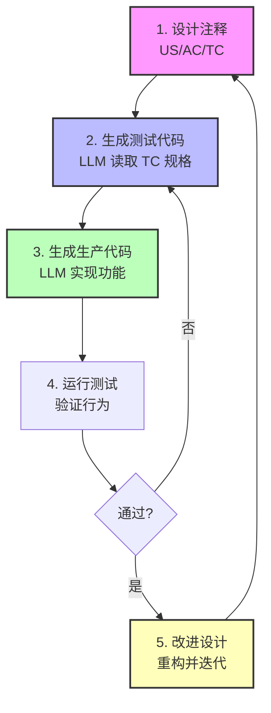
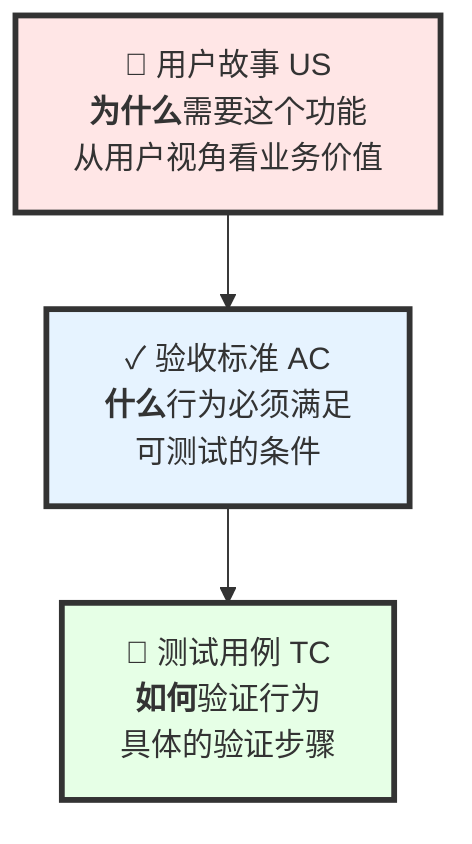
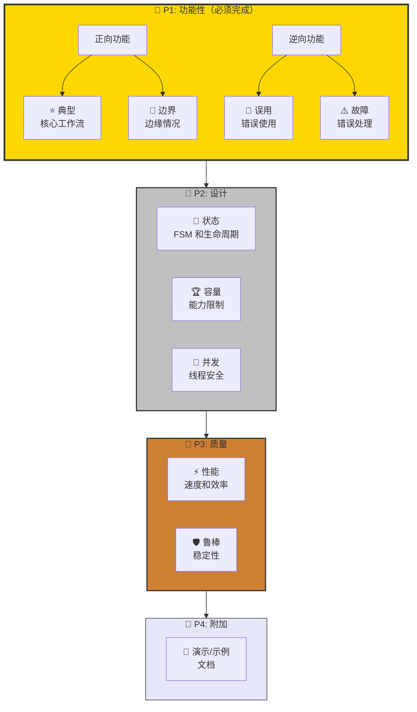
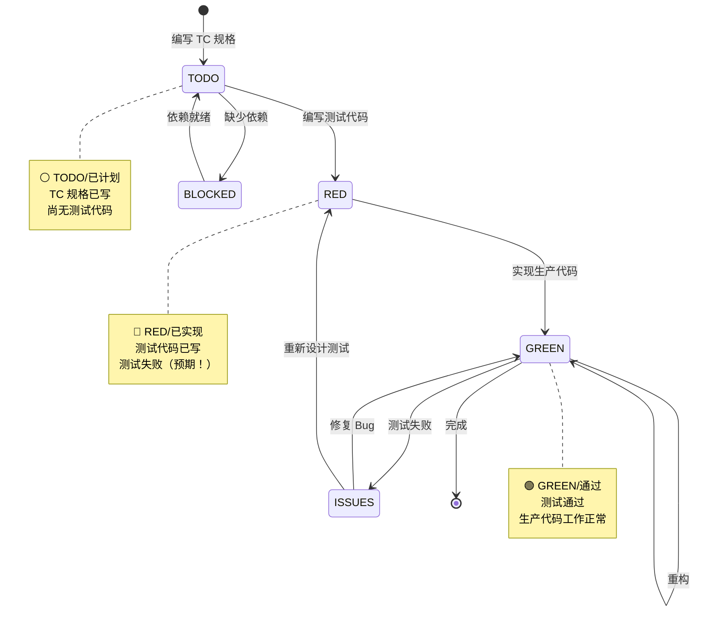
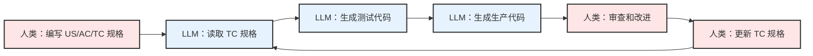

# CaTDD 用户指南 - 演示版

**面向 LLM 时代的注释永活测试驱动开发**

*EnigmaWU 创建 • 始于 2023年10月*

---

## 幻灯片 1: 标题

# 🚀 CaTDD
## 注释永活测试驱动开发

**面向 LLM 时代的 TDD 方法论**

> *"注释即验证设计。LLM 生成代码。协同向前迭代。"*

**EnigmaWU** • 2023.10 - 至今

---

## 幻灯片 2: 什么是 CaTDD？

### 🎯 定义

**CaTDD** = **Comment-alive Test-Driven Development（注释永活测试驱动开发，aka 注释驱动开发）**

一种软件开发方法论，其中：
- **结构化注释**定义验证设计（US/AC/TC）
- **LLM** 解析注释并生成测试代码 + 生产代码
- **人类 + AI** 协同向前迭代

### 💡 革命性转变

```
传统 TDD:        注释 → 文档 → 过时腐烂
CaTDD:           注释 = 验证设计 = 永远鲜活
```

**你的测试文件就是设计文档** — 人类可读、LLM 可解析、测试可验证。

---

## 幻灯片 3: 核心口号

# 💎 核心口号

> ## **"注释即验证设计。**
> ## **LLM 生成代码。**
> ## **协同向前迭代。"**

### 三大支柱

1. 📝 **注释即验证设计** — 不是文档，而是可执行的规格说明
2. 🤖 **LLM 生成代码** — AI 读取结构化注释，生成可工作的代码
3. 🔄 **协同向前迭代** — 人类设计，AI 实现，持续改进

---

## 幻灯片 4: 核心工作流循环



**关键点**：设计存在于代码中 → 测试验证行为 → LLM 加速 → 永远迭代

---

## 幻灯片 5: 为什么使用 CaTDD？

### ✅ 优势

| 传统 TDD | CaTDD |
|----------------|-------|
| 手动编写测试 | **LLM 从 TC 规格生成测试** |
| 文档分离且过时 | **注释即设计** — 永不过时 |
| 仅人工工作流 | **人类+AI 协作** — 更快迭代 |
| 设计 → 代码有鸿沟 | **测试文件中的单一真理源** |
| 反馈循环慢 | **LLM 辅助快速迭代** |

### 🎯 完美适用于

- ✅ LLM 辅助的开发团队
- ✅ 需要活文档的项目
- ✅ 测试优先的开发文化
- ✅ 需要验证设计的复杂系统
- ✅ 具有质量门的快速原型开发

---

## 幻灯片 6: 三级层次结构



### 层次详解

- **US**（用户故事）：为什么 — "作为 [角色]，我想要 [能力]，以便 [价值]"
- **AC**（验收标准）：什么 — "给定 [上下文]，当 [动作]，则 [结果]"
- **TC**（测试用例）：如何 — 具体的步骤和验证点

---

## 幻灯片 7: IOC 项目真实示例

### 来自 UT_ConlesEventTypical.cxx

```cpp
// US: 用户故事
US-1: 作为高负载场景下的事件生产者，
      我想要在队列满时非阻塞地发布事件，
      以便我的应用在负载下保持响应。

// AC: 验收标准
[@US-1] 非阻塞事件发布
 AC-1: 给定事件队列已满，
       当生产者以异步模式发布事件，
       则立即返回而不阻塞，
        并且返回 IOC_RESULT_TOO_MANY_QUEUING_EVTDESC，
        并且事件不会被排队。

// TC: 测试用例（在设计部分）
[@AC-1,US-1] 队列满时的非阻塞行为
 TC-1:
   @[Name]: verifyPostEvt1v1_byOneObjPostEvtAndAnotherObjCbProcEvt
   @[Purpose]: 验证 ConlesMode 下的 1:1 发布事件行为
   @[Steps]: ObjA 订阅，ObjB 发布 1024 个事件，验证回调次数
   @[Expect]: ObjA 恰好收到 1024 次回调
```

---

## 幻灯片 8: 测试实现结构

### 🏗️ 文件结构（来自 CaTDD_ImplTemplate.cxx）

```cpp
//======>BEGIN OF OVERVIEW=========================================
// 什么、在哪里、为什么测试这个文件

//======>BEGIN OF UNIT TESTING DESIGN=============================
// 自由草稿：头脑风暴测试想法
// 用户故事：US-1, US-2, ...
// 验收标准：AC-1, AC-2, ...
// 测试用例：TC-1, TC-2, ...（仅规格说明）

//======>BEGIN OF UNIT TESTING IMPLEMENTATION=====================
// TEST(...) { SETUP → BEHAVIOR → VERIFY → CLEANUP }
// 实际可执行的测试代码

//======>BEGIN OF TODO/TRACKING===================================
// 状态跟踪：⚪ TODO → 🔴 RED → 🟢 GREEN
```

**关键原则**：TC 规格说明位于设计部分，TEST 代码位于实现部分

---

## 幻灯片 9: 优先级框架



---

## 幻灯片 10: 优先级框架 - 详细说明

### P1 🥇 功能性测试（必须完成）

**正向功能** — 证明正确工作：
- **⭐ 典型**：核心工作流，正常路径
- **🔲 边界**：边缘情况，最小/最大值，空输入

**逆向功能** — 证明优雅失败：
- **🚫 误用**：错误的 API 使用，不正确的顺序
- **⚠️ 故障**：外部故障，资源耗尽

### P2 🥈 设计测试

- **🔄 状态**：生命周期转换，FSM 验证
- **🏆 容量**：最大容量，系统限制
- **🚀 并发**：线程安全，竞态条件

### P3 🥉 质量测试

- **⚡ 性能**：速度基准，吞吐量
- **🛡️ 鲁棒**：压力测试，长时间运行稳定性

### P4 🎯 附加测试

- **🎨 演示/示例**：端到端演示，教程

---

## 幻灯片 11: 测试状态状态机



**TDD 工作流**：TODO → RED（写测试）→ GREEN（写代码）→ 重构 → 重复

---

## 幻灯片 12: 5 步快速入门

### 1️⃣ 复制模板
```bash
cp LLM/CaTDD_ImplTemplate.cxx Test/UT_YourFeature.cxx
```

### 2️⃣ 编写用户故事
```cpp
US-1: 作为 [角色]，我想要 [能力]，以便 [价值]。
```

### 3️⃣ 定义验收标准
```cpp
[@US-1] 简要描述
 AC-1: 给定 [上下文]，当 [动作]，则 [结果]。
```

### 4️⃣ 指定测试用例（在设计部分）
```cpp
[@AC-1,US-1] 简要描述
 TC-1: @[Name]: verifyBehavior_byCondition_expectResult
       @[Purpose]: 为什么这个测试很重要
       @[Expect]: 如何验证成功
```

### 5️⃣ 让 LLM 生成测试代码
```cpp
TEST(Category, verifyBehavior_byCondition_expectResult) {
    // SETUP → BEHAVIOR → VERIFY → CLEANUP
}
```

---

## 幻灯片 13: 命名约定

### 测试命名模式

```
verifyBehavior_byCondition_expectResult
      验证行为    通过条件      期望结果
         ↑           ↑            ↑
    什么功能      上下文      预期结果
```

### IOC 项目的真实示例

✅ **好的命名**：
- `verifyPostEvt1v1_byOneObjPostEvtAndAnotherObjCbProcEvt`
- `verifyServiceRegistration_byValidName_expectSuccess`
- `verifyEventPost_byFullQueue_expectNonBlockReturn`
- `verifyCommandExec_byMultipleClients_expectIsolatedExecution`
- `verifyStateTransition_byInvalidSequence_expectError`

❌ **不好的命名**：
- `test1`, `test2`, `testBasic`
- `testCommand`（关于命令的什么？）
- `checkQueue`（不清楚验证什么）

---

## 幻灯片 14: 四阶段测试结构

### 标准模式（SETUP → BEHAVIOR → VERIFY → CLEANUP）

```cpp
TEST(EventPosting, verifyPostEvt1v1_byOneObjPostEvtAndAnotherObjCbProcEvt) {
    //===SETUP===（设置）
    // 1. 准备测试夹具，初始化对象
    _Case01_CbPrivData_T ObjA_CbPrivData = {.KeepAliveEvtCnt = 0};
    IOC_Result_T Result = IOC_subEVT_inConlesMode(&ObjA_SubEvtArgs);
    ASSERT_EQ(IOC_RESULT_SUCCESS, Result);  // 检查点

    //===BEHAVIOR===（行为）
    // 2. 执行被测试的行为
    for (uint32_t i = 0; i < 1024; i++) {
        Result = IOC_postEVT_inConlesMode(&ObjB_EvtDesc, NULL);
        ASSERT_TRUE(Result == IOC_RESULT_SUCCESS);  // 检查点
    }
    IOC_forceProcEVT();

    //===VERIFY===（验证）
    // 3. 断言预期结果（≤3 个关键断言）
    ASSERT_EQ(1024, ObjA_CbPrivData.KeepAliveEvtCnt);  // 关键验证点

    //===CLEANUP===（清理）
    // 4. 释放资源，恢复状态
    Result = IOC_unsubEVT_inConlesMode(&ObjA_UnsubEvtArgs);
    ASSERT_EQ(IOC_RESULT_SUCCESS, Result);  // 检查点
}
```

---

## 幻灯片 15: 验证最佳实践

### 🎯 关键原则：每个测试 ≤3 个断言

**为什么？** 测试应该用少数关键点验证一个行为。

### IOC 项目自定义宏

```cpp
// 来自 _UT_IOC_Common.h
VERIFY_KEYPOINT_EQ(actual, expected, "描述")
VERIFY_KEYPOINT_NE(actual, expected, "描述")
VERIFY_KEYPOINT_TRUE(condition, "描述")
VERIFY_KEYPOINT_FALSE(condition, "描述")
VERIFY_KEYPOINT_NULL(ptr, "描述")
VERIFY_KEYPOINT_NOT_NULL(ptr, "描述")
VERIFY_KEYPOINT_LT(val1, val2, "描述")
VERIFY_KEYPOINT_LE(val1, val2, "描述")
VERIFY_KEYPOINT_GT(val1, val2, "描述")
VERIFY_KEYPOINT_GE(val1, val2, "描述")
```

**输出**：`🔑 [关键验证点] 描述：实际值 vs 期望值`

### 使用示例

```cpp
//===VERIFY===
VERIFY_KEYPOINT_EQ(result, IOC_RESULT_SUCCESS, "服务注册成功");
VERIFY_KEYPOINT_NOT_NULL(handle, "返回有效句柄");
VERIFY_KEYPOINT_EQ(callbackCount, 1024, "所有事件已处理");
```

---

## 幻灯片 16: 真实示例 - 状态测试

### 来自 UT_CommandStateTCP.cxx

```cpp
/**
 * @brief TCP 特定的命令状态测试框架
 *
 * 🔄 测试范围：TCP 协议 × 命令状态集成
 *
 * 🟢 协议无关测试（UT_CommandStateUS1-5.cxx）：
 *    ✓ 命令状态转换（PENDING → PROCESSING → SUCCESS）
 *    ✓ 命令执行期间的链接状态演变
 *    ✓ 并发命令之间的状态隔离
 *
 * 🔵 TCP 特定测试（UT_CommandStateTCP.cxx）：
 *    ⚡ TCP 连接建立期间的命令状态
 *    ⚡ TCP 特定错误：ECONNRESET, EPIPE, ECONNREFUSED
 *    ⚡ TCP 连接丢失期间的命令状态（执行中）
 *    ⚡ TCP 流控制对命令状态的影响
 *    ⚡ TCP 关闭行为：FIN vs RST 对命令状态的影响
 */
```

**关键洞察**：将协议无关的状态测试与协议特定的集成测试分离。

---

## 幻灯片 17: 覆盖矩阵模板

### 系统化测试规划

```
┌─────────────────┬─────────────┬─────────────┬──────────────────────────────┐
│ 维度 1          │ 维度 2      │ 维度 3      │ 关键场景                     │
├─────────────────┼─────────────┼─────────────┼──────────────────────────────┤
│ 服务角色        │ 客户角色    │ 模式        │ US-X: 描述                   │
├─────────────────┼─────────────┼─────────────┼──────────────────────────────┤
│ 事件生产者      │ 事件消费者  │ 回调        │ US-1: 异步事件流             │
│ 事件生产者      │ 事件消费者  │ 拉取        │ US-2: 同步事件流             │
│ 事件消费者      │ 事件生产者  │ 回调        │ US-3: 反向流                 │
└─────────────────┴─────────────┴─────────────┴──────────────────────────────┘
```

### 常见维度模式

- **选项 A**：服务角色 × 客户角色 × 模式
- **选项 B**：组件状态 × 操作 × 边界
- **选项 C**：并发 × 资源限制 × 错误场景
- **自定义**：[基于领域的你的维度]

---

## 幻灯片 18: LLM 工作流集成

### LLM 如何在 CaTDD 中辅助



### 分工

| 人类职责 | LLM 职责 |
|---------------------|-------------------|
| ✍️ 设计验证规格（US/AC/TC） | 🤖 解析结构化注释 |
| 🎯 定义验收标准 | 🤖 从 TC 规格生成测试代码 |
| 🧠 审查生成的代码 | 🤖 生成生产代码 |
| 🔄 迭代设计 | 🤖 基于反馈重构代码 |
| 🎓 领域知识 | 🤖 实现模式 |

---

## 幻灯片 19: IOC 项目统计

### IOC 演示项目的真实数据

**测试文件**：80+ 个单元测试文件
**测试类别**：
- P1 功能性：典型、边界、误用、故障
- P2 设计：状态、容量、并发
- P3 质量：性能、鲁棒、兼容性
- P4 附加：演示/示例

**示例测试文件**：
- `UT_ConlesEventTypical.cxx` — 事件发布基础（885 行）
- `UT_ConlesEventState.cxx` — 事件状态机测试
- `UT_CommandStateTCP.cxx` — TCP 命令状态集成（3062 行）
- `UT_DataBoundary*.cxx` — 数据边界测试（拆分为 US1-5）
- `UT_ServiceBroadcastEvent.cxx` — 服务广播模式

**模式**：测试按优先级和类别组织，文件增长过大时拆分。

---

## 幻灯片 20: 文件组织策略

### 何时拆分测试文件

**单个文件**（初始）：
```
UT_FeatureTypical.cxx          // 所有 P1 测试
```

**按优先级拆分**（增长中）：
```
UT_FeatureTypical.cxx          // P1 典型
UT_FeatureBoundary.cxx         // P1 边界
UT_FeatureMisuse.cxx           // P1 误用
UT_FeatureState.cxx            // P2 状态
```

**按用户故事拆分**（大功能）：
```
UT_FeatureUS1.cxx              // US-1 测试
UT_FeatureUS2.cxx              // US-2 测试
UT_FeatureUS3.cxx              // US-3 测试
```

**按 AC 拆分**（非常大的 US）：
```
UT_FeatureUS4AC1.cxx           // US-4 AC-1 测试
UT_FeatureUS4AC2.cxx           // US-4 AC-2 测试
UT_FeatureUS4AC3.cxx           // US-4 AC-3 测试
```

**IOC 示例**：`UT_DataBoundaryUS4AC*.cxx`（US-4 的 5 个文件）

---

## 幻灯片 21: 常见陷阱和解决方案

### ❌ 要避免的反模式

| 陷阱 | 问题 | 解决方案 |
|---------|---------|----------|
| **模糊的 US** | "作为开发者，我想要功能工作" | 具体化：角色、能力、价值 |
| **不可测试的 AC** | "当调用时，则它工作" | 定义可衡量的结果 |
| **糟糕的命名** | `test1()`, `testBasic()` | 使用 `verifyBehavior_byCondition_expectResult` |
| **太多断言** | 一个测试中有 10+ 个检查 | 拆分为多个测试，保持 ≤3 个关键点 |
| **缺少清理** | 测试留下脏状态 | 总是清理以避免副作用 |
| **无状态跟踪** | 所有测试永远标记为"TODO" | 更新：⚪ TODO → 🔴 RED → 🟢 GREEN |
| **过时的注释** | 注释与代码不匹配 | 注释即设计 — 保持它们鲜活！ |

---

## 幻灯片 22: 最佳实践总结

### ✅ 应该做的

1. **设计优先**：在代码之前编写 US/AC/TC
2. **TDD 纪律**：RED → GREEN → 重构
3. **清晰命名**：自文档化的测试名称
4. **四阶段结构**：SETUP → BEHAVIOR → VERIFY → CLEANUP
5. **≤3 个断言**：每个测试专注于一个行为
6. **跟踪状态**：保持 ⚪→🔴→🟢 标记更新
7. **LLM 协作**：让 AI 从规格生成代码
8. **迭代**：持续改进设计注释

### 🚫 不应该做的

1. **跳过 US/AC**：不要直接跳到 TC
2. **模糊的规格**：避免含糊的验收标准
3. **上帝测试**：不要在一个 TEST() 中测试所有东西
4. **忽略清理**：总是恢复状态
5. **过时的注释**：保持注释与代码同步
6. **跳过 RED 阶段**：不要先写通过的测试

---

## 幻灯片 23: CaTDD vs 传统 TDD

### 对比矩阵

| 方面 | 传统 TDD | CaTDD |
|--------|----------------|-------|
| **文档** | 单独的文档（经常过时） | 注释即设计（永远鲜活） |
| **测试设计** | 在开发者脑中 | 明确的 US/AC/TC 结构 |
| **代码生成** | 手动实现 | LLM 从 TC 规格辅助 |
| **可追溯性** | 难以跟踪 US→Test→Code | 内置：TC 引用 AC/US |
| **学习曲线** | 较低（更简单） | 较高（结构化方法论） |
| **LLM 集成** | 有限的上下文 | 为 LLM 解析优化 |
| **团队协作** | 代码 + 口头讨论 | 代码 + 结构化注释 |
| **设计演化** | 需要单独更新文档 | 设计与代码一起演化 |

### 何时使用 CaTDD？

✅ **使用 CaTDD** 当：
- 与 LLM 协作（Copilot、ChatGPT、Claude 等）
- 需要活文档
- 需要验证设计的复杂系统
- 团队重视测试优先开发

❌ **传统 TDD** 可能足够当：
- 简单的原型或脚本
- 独立开发者，小代码库
- 没有计划 LLM 集成

---

## 幻灯片 24: 入门清单

### 第 1 天：设置

- [ ] 将 `CaTDD_ImplTemplate.cxx` 复制到你的项目
- [ ] 阅读 `CaTDD_DesignPrompt.md` 了解方法论细节
- [ ] 查看 IOC 项目 `/Test` 文件夹中的示例测试
- [ ] 设置自定义 VERIFY_KEYPOINT 宏（可选）

### 第 1 周：第一个功能

- [ ] 选择一个小功能来测试
- [ ] 编写 1 个具有清晰价值主张的用户故事
- [ ] 定义 2-3 个验收标准（GIVEN/WHEN/THEN）
- [ ] 为 P1 典型测试指定 3-5 个测试用例
- [ ] 让 LLM 从 TC 规格生成测试代码
- [ ] 实现生产代码（TDD RED→GREEN）
- [ ] 跟踪状态：⚪ → 🔴 → 🟢

### 第 1 个月：建立动力

- [ ] 完成 P1 功能性测试（典型 + 边界 + 误用 + 故障）
- [ ] 如果组件有状态/并发，添加 P2 设计测试
- [ ] 将通用设置重构为夹具
- [ ] 审查测试命名一致性
- [ ] 向团队更新学习成果

---

## 幻灯片 25: 资源和参考

### 📚 核心文档

- **CaTDD_UserGuide.md** — 综合用户指南（本演示的来源）
- **CaTDD_DesignPrompt.md** — 详细的方法论说明
- **CaTDD_ImplTemplate.cxx** — 新测试文件的模板

### 🔍 真实示例（IOC 项目）

**基础示例**：
- `UT_ConlesEventTypical.cxx` — 事件发布基础
- `UT_ServiceBoundary.cxx` — 服务 API 边界
- `UT_CommandTypical.cxx` — 命令执行模式

**高级示例**：
- `UT_CommandStateTCP.cxx` — 状态机 + 协议集成
- `UT_DataBoundaryUS4AC*.cxx` — 按 AC 拆分的大功能
- `UT_ConlesEventMayBlock.cxx` — 边界/阻塞行为

**设计模式示例**：
- `UT_FreelyDrafts.cxx` — 头脑风暴测试想法
- `UT_*State*.cxx` — 状态机测试模式
- `UT_*Capability*.cxx` — 容量/限制测试

### 🌐 社区

- **仓库**：github.com/EnigmaWU/MyIOC_inTDD_withGHC
- **问题**：询问 EnigmaWU 或查看现有测试文件
- **贡献**：分享你的 CaTDD 经验！

---

## 幻灯片 26: 快速参考卡

### US/AC/TC 模板

```cpp
// 用户故事
US-n: 作为 [角色]，我想要 [能力]，以便 [价值]。

// 验收标准
[@US-n] 简要描述
 AC-n: 给定 [上下文]，当 [动作]，则 [结果]。

// 测试用例
[@AC-n,US-n]
 TC-n: @[Name]: verifyBehavior_byCondition_expectResult
       @[Purpose]: 为什么这个测试很重要
       @[Expect]: 如何验证成功
```

### 优先级顺序

```
P1: 典型 → 边界 → 误用 → 故障
P2: 状态 → 容量 → 并发
P3: 性能 → 鲁棒 → 兼容性
P4: 演示/示例
```

### 状态标记

```
⚪ TODO → 🔴 RED → 🟢 GREEN
⚠️ ISSUES（问题）
🚫 BLOCKED（阻塞）
```

---

## 幻灯片 27: CaTDD 思维模式

### 🧠 心智模型转变

**旧方式**：
1. 编写代码
2. 可能写测试
3. 单独的文档（会过时）

**CaTDD 方式**：
1. **设计验证**（US/AC/TC 注释）
2. **LLM 从规格生成测试**
3. **LLM 生成代码**以通过测试
4. **设计和代码一起迭代**

### 🎯 核心信念

- **注释即设计** — 不是事后想法
- **测试验证行为** — 可执行的规格说明
- **LLM 是协作者** — 不仅仅是代码补全
- **设计演化** — 永远不会"完成"，总是在改进

---

## 幻灯片 28: 成功指标

### 如何衡量 CaTDD 采用

**设计质量**：
- ✅ 所有测试都有清晰的 US/AC/TC 血统
- ✅ 验收标准可测试且明确
- ✅ 测试名称遵循 `verifyBehavior_byCondition_expectResult` 约定

**测试质量**：
- ✅ 所有测试遵循四阶段结构（SETUP/BEHAVIOR/VERIFY/CLEANUP）
- ✅ 测试有 ≤3 个关键断言
- ✅ P1 功能覆盖在 P2/P3 之前完成

**过程质量**：
- ✅ 状态跟踪定期更新（⚪→🔴→🟢）
- ✅ 注释与代码保持同步
- ✅ LLM 成功从 TC 规格生成代码

**团队速度**：
- ✅ 更快的测试编写（LLM 辅助）
- ✅ 更好的测试可维护性（结构化注释）
- ✅ 改进的入职体验（活文档）

---

## 幻灯片 29: 常见问题

### Q: CaTDD 只适用于 C++ 吗？

**A**：不是！CaTDD 是语言无关的。US/AC/TC 结构适用于任何语言（Python、JavaScript、Java、Go、Rust 等）。根据你的语言调整注释语法。

### Q: 我需要 LLM 才能使用 CaTDD 吗？

**A**：不需要，但推荐使用。CaTDD 可以手动工作，但 LLM 从结构化注释生成代码可以显著加速。

### Q: 学习 CaTDD 需要多长时间？

**A**：基础知识 1-2 周，熟练掌握 1-2 个月。从简单功能开始，养成习惯。

### Q: 如果我的团队抵制结构化注释怎么办？

**A**：从小处开始 — 一个功能，展示价值。展示注释如何防止设计漂移并实现 LLM 协作。

### Q: 我可以将 CaTDD 与现有测试混合使用吗？

**A**：可以！逐步采用新功能。逐步改造高价值的现有测试。

---

## 幻灯片 30: 总结 - CaTDD 公式

# 🎯 一页看懂 CaTDD

## 公式

```
CaTDD = 结构化注释（US/AC/TC）+ TDD（RED→GREEN）+ LLM（代码生成）
```

## 三大支柱

1. **注释即验证设计** — 单一真理源
2. **LLM 生成代码** — AI 读取规格，生成实现
3. **协同向前迭代** — 人类+AI 持续改进

## 工作流

```
设计注释 → 生成测试代码 → 生成生产代码 → 迭代
```

## 优先级

```
P1（功能性）→ P2（设计）→ P3（质量）→ P4（附加）
```

## 状态

```
⚪ TODO → 🔴 RED → 🟢 GREEN
```

---

## 幻灯片 31: 行动号召

# 🚀 今天就开始吧！

### 步骤 1：复制模板
```bash
cp LLM/CaTDD_ImplTemplate.cxx Test/UT_YourFirstFeature.cxx
```

### 步骤 2：编写你的第一个 US/AC/TC
思考你需要测试的一个功能。

### 步骤 3：让 LLM 帮助
与 LLM 分享你的 TC 规格，让它生成测试代码。

### 步骤 4：运行 TDD 循环
RED（失败测试）→ GREEN（通过测试）→ 重构

### 步骤 5：分享你的经验
教导他人，贡献模式，迭代！

---

## 幻灯片 32: 谢谢！

# 🙏 谢谢！

## 有问题吗？

**CaTDD**：*注释永活测试驱动开发*

> *"注释即验证设计。LLM 生成代码。协同向前迭代。"*

---

**创建者：EnigmaWU** • 始于 2023年10月

**资源**：
- 用户指南：`LLM/CaTDD_UserGuide.md`
- 方法论：`LLM/CaTDD_DesignPrompt.md`
- 模板：`LLM/CaTDD_ImplTemplate.cxx`
- 示例：`Test/UT_*.cxx`（80+ 测试文件）

**仓库**：github.com/EnigmaWU/MyIOC_inTDD_withGHC

---

*祝 CaTDD 编程愉快！* 🚀
