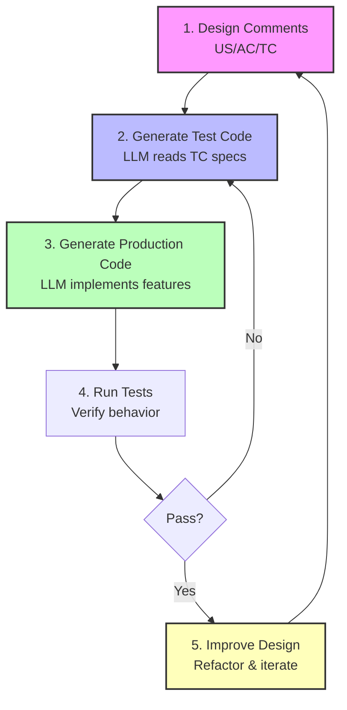
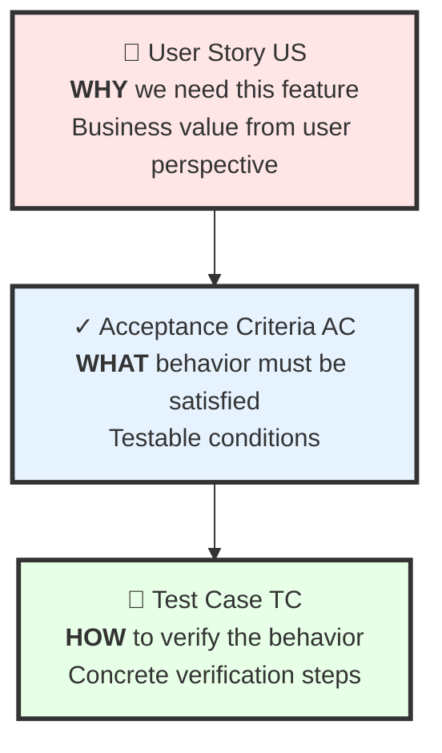
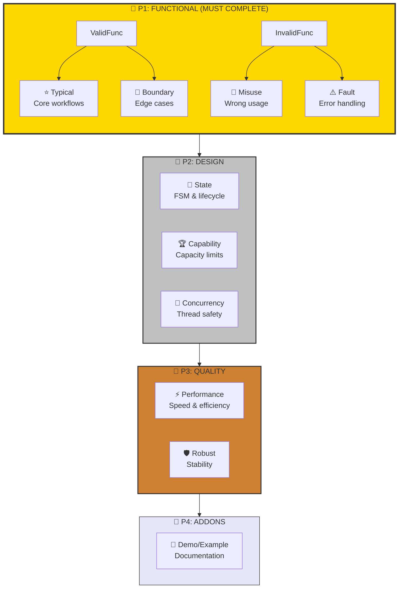
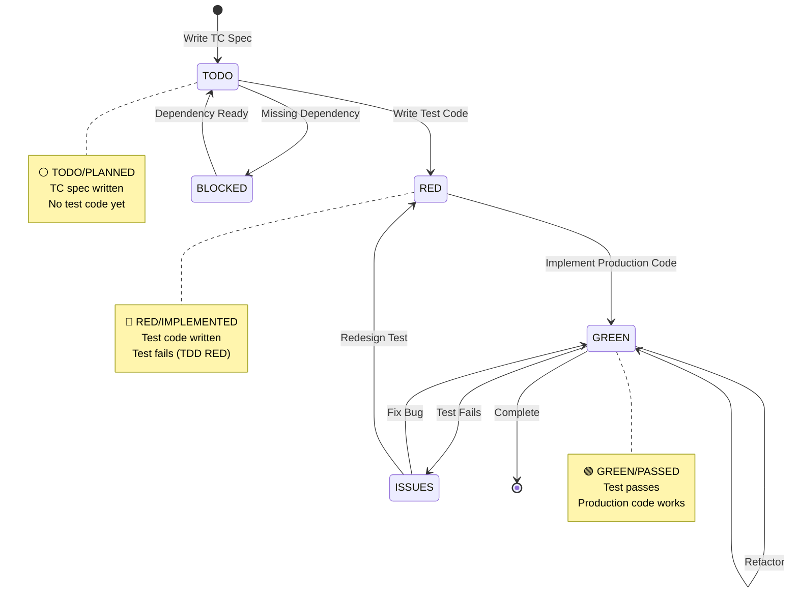
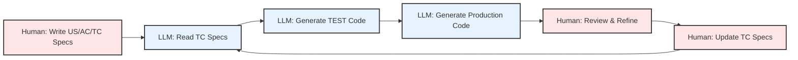

# CaTDD User Guide - Presentation Edition

**Comment-alive Test-Driven Development for the LLM Era**

*Created by EnigmaWU • Since October 2023*

---

## Slide 1: Title

# 🚀 CaTDD
## Comment-alive Test-Driven Development

**The TDD Methodology for the LLM Era**

> *"Comments is Verification Design. LLM Generates Code. Iterate Forward Together."*

**EnigmaWU** • 2023.10 - Present

---

## Slide 2: What is CaTDD?

### 🎯 Definition

**CaTDD** = **Comment-alive Test-Driven Development**

A software development methodology where:
- **Structured comments** define verification design (US/AC/TC)
- **LLMs** parse comments and generate test + production code
- **Humans + AI** iterate forward together

### 💡 Revolutionary Shift

```
Traditional TDD:        Comments → Docs → Stale
CaTDD:                  Comments = Verification Design = Always Alive
```

**Your test file IS the design document** — readable by humans, parseable by LLMs, verified by tests.

---

## Slide 3: The Slogan

# 💎 Core Slogan

> ## **"Comments is Verification Design.**
> ## **LLM Generates Code.**
> ## **Iterate Forward Together."**

### Three Pillars

1. 📝 **Comments is Verification Design** — Not documentation, but executable specifications
2. 🤖 **LLM Generates Code** — AI reads structured comments, produces working code
3. 🔄 **Iterate Forward Together** — Human designs, AI implements, continuous improvement

---

## Slide 4: Core Workflow Cycle



**Key**: Design lives in code → Tests verify behavior → LLMs accelerate → Iterate forever

---

## Slide 5: Why CaTDD?

### ✅ Benefits

| Traditional TDD | CaTDD |
|----------------|-------|
| Manual test writing | **LLM generates tests** from TC specs |
| Docs separate & stale | **Comments ARE the design** — never outdated |
| Human-only workflow | **Human+AI collaboration** — faster iteration |
| Design → Code gap | **Single source of truth** in test file |
| Slow feedback loop | **Rapid iteration** with LLM assistance |

### 🎯 Perfect For

- ✅ LLM-assisted development teams
- ✅ Projects needing living documentation
- ✅ Test-first development culture
- ✅ Complex systems requiring verification design
- ✅ Rapid prototyping with quality gates

---

## Slide 6: The Three-Level Hierarchy



### Hierarchy Breakdown

- **US** (User Story): WHY — "As [role], I want [capability], So that [value]"
- **AC** (Acceptance Criteria): WHAT — "GIVEN [context], WHEN [action], THEN [outcome]"
- **TC** (Test Case): HOW — Concrete steps and verification points

---

## Slide 7: Real Example from IOC Project

### From UT_ConlesEventTypical.cxx

```cpp
// US: User Story
US-1: As an event producer in high-load scenarios,
      I want to post events without blocking when queue is full,
      So that my application remains responsive under load.

// AC: Acceptance Criteria
[@US-1] Non-blocking event posting
 AC-1: GIVEN event queue is full,
       WHEN producer posts event in async mode,
       THEN returns immediately without blocking,
        AND returns IOC_RESULT_TOO_MANY_QUEUING_EVTDESC,
        AND event is not queued.

// TC: Test Case (in design section)
[@AC-1,US-1] Non-blocking behavior when queue is full
 TC-1:
   @[Name]: verifyPostEvt1v1_byOneObjPostEvtAndAnotherObjCbProcEvt
   @[Purpose]: Verify 1:1 post event behavior in ConlesMode
   @[Steps]: ObjA subscribes, ObjB posts 1024 events, verify callback count
   @[Expect]: ObjA receives exactly 1024 callbacks
```

---

## Slide 8: Test Implementation Structure

### 🏗️ File Structure (from CaTDD_ImplTemplate.cxx)

```cpp
//======>BEGIN OF OVERVIEW=========================================
// What, Where, Why this file tests

//======>BEGIN OF UNIT TESTING DESIGN=============================
// FREELY DRAFTS: Brainstorm test ideas
// USER STORIES: US-1, US-2, ...
// ACCEPTANCE CRITERIA: AC-1, AC-2, ...
// TEST CASES: TC-1, TC-2, ... (Specifications only)

//======>BEGIN OF UNIT TESTING IMPLEMENTATION=====================
// TEST(...) { SETUP → BEHAVIOR → VERIFY → CLEANUP }
// Actual executable test code

//======>BEGIN OF TODO/TRACKING===================================
// Status tracking: ⚪ TODO → 🔴 RED → 🟢 GREEN
```

**Key Principle**: TC specifications live in DESIGN section, TEST code in IMPLEMENTATION section

---

## Slide 9: Priority Framework



---

## Slide 10: Priority Framework - Details

### P1 🥇 FUNCTIONAL (MUST COMPLETE)

**ValidFunc** — Proves it works correctly:
- **⭐ Typical**: Core workflows, happy paths
- **🔲 Boundary**: Edge cases, min/max values, null inputs

**InvalidFunc** — Proves it fails gracefully:
- **🚫 Misuse**: Wrong API usage, incorrect sequences
- **⚠️ Fault**: External failures, resource exhaustion

### P2 🥈 DESIGN

- **🔄 State**: Lifecycle transitions, FSM verification
- **🏆 Capability**: Maximum capacity, system limits
- **🚀 Concurrency**: Thread safety, race conditions

### P3 🥉 QUALITY

- **⚡ Performance**: Speed benchmarks, throughput
- **🛡️ Robust**: Stress testing, long-running stability

### P4 🎯 ADDONS

- **🎨 Demo/Example**: End-to-end demonstrations, tutorials

---

## Slide 11: Test Status State Machine



**TDD Workflow**: TODO → RED (write test) → GREEN (write code) → Refactor → Repeat

---

## Slide 12: Quick Start in 5 Steps

### 1️⃣ Copy Template
```bash
cp LLM/CaTDD_ImplTemplate.cxx Test/UT_YourFeature.cxx
```

### 2️⃣ Write User Story
```cpp
US-1: As a [role], I want [capability], So that [value].
```

### 3️⃣ Define Acceptance Criteria
```cpp
[@US-1] Brief description
 AC-1: GIVEN [context], WHEN [action], THEN [outcome].
```

### 4️⃣ Specify Test Case (in DESIGN section)
```cpp
[@AC-1,US-1] Brief description
 TC-1: @[Name]: verifyBehavior_byCondition_expectResult
       @[Purpose]: Why this test matters
       @[Expect]: How to verify success
```

### 5️⃣ Let LLM Generate Test Code
```cpp
TEST(Category, verifyBehavior_byCondition_expectResult) {
    // SETUP → BEHAVIOR → VERIFY → CLEANUP
}
```

---

## Slide 13: Naming Convention

### Test Naming Pattern

```
verifyBehavior_byCondition_expectResult
         ↑           ↑            ↑
    What feature  Context    Expected outcome
```

### Real Examples from IOC Project

✅ **Good Names**:
- `verifyPostEvt1v1_byOneObjPostEvtAndAnotherObjCbProcEvt`
- `verifyServiceRegistration_byValidName_expectSuccess`
- `verifyEventPost_byFullQueue_expectNonBlockReturn`
- `verifyCommandExec_byMultipleClients_expectIsolatedExecution`
- `verifyStateTransition_byInvalidSequence_expectError`

❌ **Bad Names**:
- `test1`, `test2`, `testBasic`
- `testCommand` (what about command?)
- `checkQueue` (not clear what's verified)

---

## Slide 14: 4-Phase Test Structure

### Standard Pattern (SETUP → BEHAVIOR → VERIFY → CLEANUP)

```cpp
TEST(EventPosting, verifyPostEvt1v1_byOneObjPostEvtAndAnotherObjCbProcEvt) {
    //===SETUP===
    // 1. Prepare test fixtures, initialize objects
    _Case01_CbPrivData_T ObjA_CbPrivData = {.KeepAliveEvtCnt = 0};
    IOC_Result_T Result = IOC_subEVT_inConlesMode(&ObjA_SubEvtArgs);
    ASSERT_EQ(IOC_RESULT_SUCCESS, Result);  // CheckPoint

    //===BEHAVIOR===
    // 2. Execute the behavior under test
    for (uint32_t i = 0; i < 1024; i++) {
        Result = IOC_postEVT_inConlesMode(&ObjB_EvtDesc, NULL);
        ASSERT_TRUE(Result == IOC_RESULT_SUCCESS);  // CheckPoint
    }
    IOC_forceProcEVT();

    //===VERIFY===
    // 3. Assert expected outcomes (≤3 key assertions)
    ASSERT_EQ(1024, ObjA_CbPrivData.KeepAliveEvtCnt);  // KeyVerifyPoint

    //===CLEANUP===
    // 4. Release resources, restore state
    Result = IOC_unsubEVT_inConlesMode(&ObjA_UnsubEvtArgs);
    ASSERT_EQ(IOC_RESULT_SUCCESS, Result);  // CheckPoint
}
```

---

## Slide 15: Verification Best Practices

### 🎯 Key Principle: ≤3 Assertions per Test

**Why?** Tests should verify ONE behavior with a few key points.

### IOC Project Custom Macros

```cpp
// From _UT_IOC_Common.h
VERIFY_KEYPOINT_EQ(actual, expected, "description")
VERIFY_KEYPOINT_NE(actual, expected, "description")
VERIFY_KEYPOINT_TRUE(condition, "description")
VERIFY_KEYPOINT_FALSE(condition, "description")
VERIFY_KEYPOINT_NULL(ptr, "description")
VERIFY_KEYPOINT_NOT_NULL(ptr, "description")
VERIFY_KEYPOINT_LT(val1, val2, "description")
VERIFY_KEYPOINT_LE(val1, val2, "description")
VERIFY_KEYPOINT_GT(val1, val2, "description")
VERIFY_KEYPOINT_GE(val1, val2, "description")
```

**Output**: `🔑 [KEY VERIFY POINT] description: actual vs expected`

### Example Usage

```cpp
//===VERIFY===
VERIFY_KEYPOINT_EQ(result, IOC_RESULT_SUCCESS, "Service registration succeeds");
VERIFY_KEYPOINT_NOT_NULL(handle, "Valid handle returned");
VERIFY_KEYPOINT_EQ(callbackCount, 1024, "All events processed");
```

---

## Slide 16: Real-World Example - State Testing

### From UT_CommandStateTCP.cxx

```cpp
/**
 * @brief TCP-Specific Command State Testing Framework
 *
 * 🔄 TESTING SCOPE: TCP Protocol × Command State Integration
 *
 * 🟢 Protocol-Agnostic Tests (UT_CommandStateUS1-5.cxx):
 *    ✓ Command state transitions (PENDING → PROCESSING → SUCCESS)
 *    ✓ Link state evolution during command execution
 *    ✓ State isolation between concurrent commands
 *
 * 🔵 TCP-Specific Tests (UT_CommandStateTCP.cxx):
 *    ⚡ Command state during TCP connection establishment
 *    ⚡ TCP-specific errors: ECONNRESET, EPIPE, ECONNREFUSED
 *    ⚡ Command state during TCP connection loss (mid-execution)
 *    ⚡ TCP flow control impact on command state
 *    ⚡ TCP shutdown behavior: FIN vs RST impact
 */
```

**Key Insight**: Separate protocol-agnostic state tests from protocol-specific integration tests.

---

## Slide 17: Coverage Matrix Template

### Systematic Test Planning

```
┌─────────────────┬─────────────┬─────────────┬──────────────────────────────┐
│ Dimension 1     │ Dimension 2 │ Dimension 3 │ Key Scenarios                │
├─────────────────┼─────────────┼─────────────┼──────────────────────────────┤
│ Service Role    │ Client Role │ Mode        │ US-X: Description            │
├─────────────────┼─────────────┼─────────────┼──────────────────────────────┤
│ EvtProducer     │ EvtConsumer │ Callback    │ US-1: Async event flow       │
│ EvtProducer     │ EvtConsumer │ Pull        │ US-2: Sync event flow        │
│ EvtConsumer     │ EvtProducer │ Callback    │ US-3: Reversed flow          │
└─────────────────┴─────────────┴─────────────┴──────────────────────────────┘
```

### Common Dimension Patterns

- **Option A**: Service Role × Client Role × Mode
- **Option B**: Component State × Operation × Boundary
- **Option C**: Concurrency × Resource Limits × Error Scenarios
- **Custom**: [Your dimensions based on domain]

---

## Slide 18: LLM Workflow Integration

### How LLM Assists in CaTDD



### Division of Labor

| Human Responsibility | LLM Responsibility |
|---------------------|-------------------|
| ✍️ Design verification specs (US/AC/TC) | 🤖 Parse structured comments |
| 🎯 Define acceptance criteria | 🤖 Generate TEST code from TC specs |
| 🧠 Review generated code | 🤖 Generate production code |
| 🔄 Iterate on design | 🤖 Refactor code based on feedback |
| 🎓 Domain knowledge | 🤖 Implementation patterns |

---

## Slide 19: IOC Project Statistics

### Real Numbers from IOC Demonstration

**Test Files**: 80+ unit test files
**Test Categories**:
- P1 Functional: Typical, Boundary, Misuse, Fault
- P2 Design: State, Capability, Concurrency
- P3 Quality: Performance, Robust, Compatibility
- P4 Addons: Demo/Example

**Sample Test Files**:
- `UT_ConlesEventTypical.cxx` — Event posting basics (885 lines)
- `UT_ConlesEventState.cxx` — Event state machine testing
- `UT_CommandStateTCP.cxx` — TCP command state integration (3062 lines)
- `UT_DataBoundary*.cxx` — Data boundary testing (split into US1-5)
- `UT_ServiceBroadcastEvent.cxx` — Service broadcast patterns

**Pattern**: Tests organized by priority and category, split when files grow too large.

---

## Slide 20: File Organization Strategy

### When to Split Test Files

**Single File** (Initial):
```
UT_FeatureTypical.cxx          // All P1 tests
```

**Split by Priority** (Growing):
```
UT_FeatureTypical.cxx          // P1 Typical
UT_FeatureBoundary.cxx         // P1 Boundary
UT_FeatureMisuse.cxx           // P1 Misuse
UT_FeatureState.cxx            // P2 State
```

**Split by User Story** (Large feature):
```
UT_FeatureUS1.cxx              // US-1 tests
UT_FeatureUS2.cxx              // US-2 tests
UT_FeatureUS3.cxx              // US-3 tests
```

**Split by AC** (Very large US):
```
UT_FeatureUS4AC1.cxx           // US-4 AC-1 tests
UT_FeatureUS4AC2.cxx           // US-4 AC-2 tests
UT_FeatureUS4AC3.cxx           // US-4 AC-3 tests
```

**Example from IOC**: `UT_DataBoundaryUS4AC*.cxx` (5 files for US-4)

---

## Slide 21: Common Pitfalls & Solutions

### ❌ Anti-Patterns to Avoid

| Pitfall | Problem | Solution |
|---------|---------|----------|
| **Vague US** | "As developer, I want feature to work" | Be specific: role, capability, value |
| **Untestable AC** | "WHEN called, THEN it works" | Define measurable outcomes |
| **Poor naming** | `test1()`, `testBasic()` | Use `verifyBehavior_byCondition_expectResult` |
| **Too many assertions** | 10+ checks in one test | Split into multiple tests, keep ≤3 key points |
| **Missing CLEANUP** | Tests leave state dirty | Always cleanup to avoid side effects |
| **No status tracking** | All tests marked "TODO" forever | Update: ⚪ TODO → 🔴 RED → 🟢 GREEN |
| **Stale comments** | Comments don't match code | Comments ARE design — keep them alive! |

---

## Slide 22: Best Practices Summary

### ✅ Do's

1. **Design First**: Write US/AC/TC before code
2. **TDD Discipline**: RED → GREEN → Refactor
3. **Clear Naming**: Self-documenting test names
4. **4-Phase Structure**: SETUP → BEHAVIOR → VERIFY → CLEANUP
5. **≤3 Assertions**: Focus each test on one behavior
6. **Track Status**: Keep ⚪→🔴→🟢 markers updated
7. **LLM Collaboration**: Let AI generate code from specs
8. **Iterate**: Continuously improve design comments

### 🚫 Don'ts

1. **Skip US/AC**: Don't jump straight to TC
2. **Vague Specs**: Avoid ambiguous acceptance criteria
3. **God Tests**: Don't test everything in one TEST()
4. **Ignore Cleanup**: Always restore state
5. **Stale Comments**: Keep comments synchronized with code
6. **Skip RED Phase**: Don't write passing tests first

---

## Slide 23: CaTDD vs Traditional TDD

### Comparison Matrix

| Aspect | Traditional TDD | CaTDD |
|--------|----------------|-------|
| **Documentation** | Separate docs (often stale) | Comments ARE design (always alive) |
| **Test Design** | In developer's head | Explicit US/AC/TC structure |
| **Code Generation** | Manual implementation | LLM-assisted from TC specs |
| **Traceability** | Hard to track US→Test→Code | Built-in: TC references AC/US |
| **Learning Curve** | Lower (simpler) | Higher (structured methodology) |
| **LLM Integration** | Limited context | Optimized for LLM parsing |
| **Team Collaboration** | Code + verbal discussion | Code + structured comments |
| **Design Evolution** | Requires separate docs update | Design evolves with code |

### When to Use CaTDD?

✅ **Use CaTDD** when:
- Working with LLMs (Copilot, ChatGPT, Claude, etc.)
- Need living documentation
- Complex system requiring verification design
- Team values test-first development

❌ **Traditional TDD** may suffice when:
- Simple prototypes or scripts
- Solo developer, small codebase
- No LLM integration planned

---

## Slide 24: Getting Started Checklist

### Day 1: Setup

- [ ] Copy `CaTDD_ImplTemplate.cxx` to your project
- [ ] Read `CaTDD_DesignPrompt.md` for methodology details
- [ ] Review sample tests in IOC project `/Test` folder
- [ ] Set up custom VERIFY_KEYPOINT macros (optional)

### Week 1: First Feature

- [ ] Choose a small feature to test
- [ ] Write 1 User Story with clear value proposition
- [ ] Define 2-3 Acceptance Criteria (GIVEN/WHEN/THEN)
- [ ] Specify 3-5 Test Cases for P1 Typical tests
- [ ] Let LLM generate TEST code from TC specs
- [ ] Implement production code (TDD RED→GREEN)
- [ ] Track status: ⚪ → 🔴 → 🟢

### Month 1: Build Momentum

- [ ] Complete P1 Functional tests (Typical + Boundary + Misuse + Fault)
- [ ] Add P2 Design tests if component is stateful/concurrent
- [ ] Refactor common setup into fixtures
- [ ] Review test naming consistency
- [ ] Update team on learnings

---

## Slide 25: Resources & References

### 📚 Core Documents

- **CaTDD_UserGuide.md** — Comprehensive user guide (this presentation's source)
- **CaTDD_DesignPrompt.md** — Detailed methodology explanation
- **CaTDD_ImplTemplate.cxx** — Template for new test files

### 🔍 Real Examples (IOC Project)

**Basic Examples**:
- `UT_ConlesEventTypical.cxx` — Event posting basics
- `UT_ServiceBoundary.cxx` — Service API boundaries
- `UT_CommandTypical.cxx` — Command execution patterns

**Advanced Examples**:
- `UT_CommandStateTCP.cxx` — State machine + protocol integration
- `UT_DataBoundaryUS4AC*.cxx` — Large feature split by AC
- `UT_ConlesEventMayBlock.cxx` — Boundary/blocking behavior

**Design Pattern Examples**:
- `UT_FreelyDrafts.cxx` — Brainstorming test ideas
- `UT_*State*.cxx` — State machine testing patterns
- `UT_*Capability*.cxx` — Capacity/limit testing

### 🌐 Community

- **Repository**: github.com/EnigmaWU/MyIOC_inTDD_withGHC
- **Questions**: Ask EnigmaWU or check existing test files
- **Contributions**: Share your CaTDD experiences!

---

## Slide 26: Quick Reference Card

### US/AC/TC Template

```cpp
// User Story
US-n: As a [role], I want [capability], So that [value].

// Acceptance Criteria
[@US-n] Brief description
 AC-n: GIVEN [context], WHEN [action], THEN [outcome].

// Test Case
[@AC-n,US-n]
 TC-n: @[Name]: verifyBehavior_byCondition_expectResult
       @[Purpose]: Why this test matters
       @[Expect]: How to verify success
```

### Priority Order

```
P1: Typical → Boundary → Misuse → Fault
P2: State → Capability → Concurrency
P3: Performance → Robust → Compatibility
P4: Demo/Example
```

### Status Markers

```
⚪ TODO → 🔴 RED → 🟢 GREEN
⚠️ ISSUES
🚫 BLOCKED
```

---

## Slide 27: The CaTDD Mindset

### 🧠 Mental Model Shift

**Old Way**:
1. Write code
2. Maybe write tests
3. Separate documentation (gets outdated)

**CaTDD Way**:
1. **Design verification** (US/AC/TC comments)
2. **LLM generates tests** from specs
3. **LLM generates code** to pass tests
4. **Iterate design & code together**

### 🎯 Core Beliefs

- **Comments ARE Design** — Not afterthoughts
- **Tests Verify Behavior** — Executable specifications
- **LLM is Collaborator** — Not just code completion
- **Design Evolves** — Never "done", always improving

---

## Slide 28: Success Metrics

### How to Measure CaTDD Adoption

**Design Quality**:
- ✅ All tests have clear US/AC/TC lineage
- ✅ Acceptance criteria are testable and unambiguous
- ✅ Test names follow `verifyBehavior_byCondition_expectResult` convention

**Test Quality**:
- ✅ All tests follow 4-phase structure (SETUP/BEHAVIOR/VERIFY/CLEANUP)
- ✅ Tests have ≤3 key assertions
- ✅ P1 functional coverage complete before P2/P3

**Process Quality**:
- ✅ Status tracking updated regularly (⚪→🔴→🟢)
- ✅ Comments stay synchronized with code
- ✅ LLM successfully generates code from TC specs

**Team Velocity**:
- ✅ Faster test writing (LLM-assisted)
- ✅ Better test maintainability (structured comments)
- ✅ Improved onboarding (living documentation)

---

## Slide 29: Common Questions

### Q: Is CaTDD only for C++?

**A**: No! CaTDD is language-agnostic. US/AC/TC structure works in any language (Python, JavaScript, Java, Go, Rust, etc.). Adapt comment syntax to your language.

### Q: Do I need LLMs to use CaTDD?

**A**: No, but recommended. CaTDD works manually, but LLMs dramatically accelerate code generation from structured comments.

### Q: How long to learn CaTDD?

**A**: 1-2 weeks for basics, 1-2 months for proficiency. Start with simple features, build habits.

### Q: What if my team resists structured comments?

**A**: Start small — one feature, demonstrate value. Show how comments prevent design drift and enable LLM collaboration.

### Q: Can I mix CaTDD with existing tests?

**A**: Yes! Gradually adopt for new features. Retrofit high-value existing tests incrementally.

---

## Slide 30: Summary - The CaTDD Formula

# 🎯 CaTDD in One Slide

## Formula

```
CaTDD = Structured Comments (US/AC/TC) + TDD (RED→GREEN) + LLM (Code Gen)
```

## Three Pillars

1. **Comments is Verification Design** — Single source of truth
2. **LLM Generates Code** — AI reads specs, produces implementations
3. **Iterate Forward Together** — Human+AI continuous improvement

## Workflow

```
Design Comments → Generate Test Code → Generate Production Code → Iterate
```

## Priority

```
P1 (Functional) → P2 (Design) → P3 (Quality) → P4 (Addons)
```

## Status

```
⚪ TODO → 🔴 RED → 🟢 GREEN
```

---

## Slide 31: Call to Action

# 🚀 Get Started Today!

### Step 1: Copy the Template
```bash
cp LLM/CaTDD_ImplTemplate.cxx Test/UT_YourFirstFeature.cxx
```

### Step 2: Write Your First US/AC/TC
Think about ONE feature you need to test.

### Step 3: Let LLM Help
Share your TC specs with LLM, ask it to generate TEST code.

### Step 4: Run TDD Cycle
RED (failing test) → GREEN (passing test) → Refactor

### Step 5: Share Your Experience
Teach others, contribute patterns, iterate!

---

## Slide 32: Thank You!

# 🙏 Thank You!

## Questions?

**CaTDD**: *Comment-alive Test-Driven Development*

> *"Comments is Verification Design. LLM Generates Code. Iterate Forward Together."*

---

**Created by EnigmaWU** • Since October 2023

**Resources**:
- User Guide: `LLM/CaTDD_UserGuide.md`
- Methodology: `LLM/CaTDD_DesignPrompt.md`
- Template: `LLM/CaTDD_ImplTemplate.cxx`
- Examples: `Test/UT_*.cxx` (80+ test files)

**Repository**: github.com/EnigmaWU/MyIOC_inTDD_withGHC

---

*Happy CaTDD Coding!* 🚀
