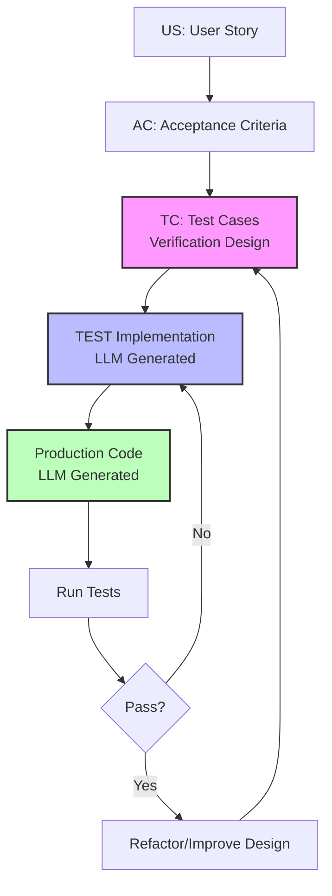

# CaTDD User Guide

**Quick Reference for Comment-alive Test-Driven Development**

---

> **💡 CaTDD Slogan**
>
> ## **"Comments is Verification Design. LLM Generates Code. Iterate Forward Together."**
>
> *The test file IS the design document—structured, executable, and alive.*
>
> **Core Workflow Cycle**:  
> `Design Comments → Generate Test Code → Generate Production Code → Improve Design Iteratively`
>

## Visual Workflow



**Inner Spirit**:
> - 🤖 **LLM-Friendly Context** - Human + AI collaboration
> - 🔄 **Iterate Forever** - Design and code evolve as one

---

## What is CaTDD?

**CaTDD** (Comment-alive Test-Driven Development) is a **software development methodology** where **structured comments define verification design**, which LLMs use to generate test and production code, enabling humans and AI to iterate forward together.

**Key Principles**:
- **Comments ARE Verification Design** - Not documentation, but executable specifications (US/AC/TC)
- **LLMs Generate Code** - AI parses structured comments to produce test and production code
- **Iterate Forward Together** - Design and code evolve as one through human+AI collaboration

**Revolutionary Shift**: Your test file becomes the **single source of truth** - readable by humans, parseable by LLMs, and verified by tests.

**CaTDD vs IOC**:
- **CaTDD** = The **methodology** (TDD improved for the LLM era by EnigmaWU)
- **IOC** = A **demonstration project** (PlayKata module showcasing CaTDD in practice)

> This guide explains the CaTDD methodology with examples drawn from the IOC project.

---

## Why Use CaTDD?

✅ **Verification Design First** - Define HOW to verify before writing code (US/AC/TC structure)  
✅ **LLM Generates Code** - AI reads your comments and produces working implementations  
✅ **Never Stale** - Comments ARE the design, evolving with code, never outdated  
✅ **Human+AI Collaboration** - You design verification, LLM generates code, iterate together  
✅ **Single Source of Truth** - Test file contains design, tests, and traceability in one place  
✅ **Iterate Forward** - Continuous improvement cycle between design comments and code  

---

## Quick Start in 5 Minutes

### 1. Copy the Template
```bash
cp LLM/CaTDD_ImplTemplate.cxx Test/UT_YourFeature.cxx
```

### 2. Fill in the OVERVIEW
```cpp
/**
 * @brief
 *   [WHAT] This file verifies [your feature] behavior
 *   [WHERE] in the [Your Module] module
 *   [WHY] to ensure [key quality goals]
 *
 * Example from IOC project:
 *   [WHAT] This file verifies event posting behavior
 *   [WHERE] in the IOC Event API module
 *   [WHY] to ensure reliable async event delivery
 */
```

### 3. Write Your First User Story
```cpp
/**
 * US-1: As an event producer,
 *       I want to post events without blocking,
 *       So that my app stays responsive under high load.
 */
```

### 4. Define Acceptance Criteria
```cpp
/**
 * [@US-1] Non-blocking event posting
 *  AC-1: GIVEN event queue is full,
 *        WHEN I post an event in async mode,
 *        THEN it returns immediately with error code.
 */
```

### 5. Specify Test Case (in TEST CASES section)
```cpp
//======>BEGIN OF TEST CASES=======================================================================
/**
 * [@AC-1,US-1] Non-blocking behavior when queue is full
 *  TC-1:
 *    @[Name]: verifyNonBlockPost_byFullQueue_expectImmediateReturn
 *    @[Purpose]: Validate non-blocking semantics under load
 *    @[Brief]: Fill queue, post event, verify immediate return with error
 *    @[Expect]: Returns immediately with TOO_MANY_QUEUING error
 */
//======>END OF TEST CASES=========================================================================
```

### 6. Let LLM Generate Test Implementation
```cpp
//======BEGIN OF UNIT TESTING IMPLEMENTATION=======================================================
/**
 * TEST CASE TEMPLATE (copy for each TC)
 *  @[Name]: ${verifyNonBlockPost_byFullQueue_expectImmediateReturn}
 *  @[Steps]:
 *    1) 🔧 SETUP: Fill event queue to capacity
 *    2) 🎯 BEHAVIOR: Post event in async mode
 *    3) ✅ VERIFY: Check immediate return with error code
 *    4) 🧹 CLEANUP: Clear queue
 */
TEST(EventPosting, verifyNonBlockPost_byFullQueue_expectImmediateReturn) {
    // LLM reads TC spec from TEST CASES section and generates:
    // SETUP → BEHAVIOR → VERIFY → CLEANUP
}
```

**💡 Key Structure**: TC specs in design section, implementation later - this is "comment-alive"!

**💡 LLM Era Advantage**: With structured verification design in comments, LLMs can generate both test and production code. You focus on WHAT to verify, LLM handles HOW to implement.

---

## The 3-Phase Workflow

### Phase 1: Design & Planning 🎯

**Goal**: Understand what you need to test

**Step 1: Define Coverage Strategy**  
Identify key dimensions:
- Service Role × Client Role × Mode
- Component State × Operation × Boundary
- Concurrency × Resource Limits × Faults

**Step 2: Freely Draft Ideas**  
Brainstorm test scenarios without worrying about structure:
```cpp
/**
 * FREELY DRAFTS:
 *  - What if queue is full?
 *  - What if user passes NULL?
 *  - What if two threads post simultaneously?
 *  - What if service crashes during command execution?
 */
```

**Step 3: Build Coverage Matrix**  
Organize scenarios systematically:
```
┌─────────────────┬─────────────┬──────────────────────────────┐
│ Service Role    │ Client Role │ Key Scenarios                │
├─────────────────┼─────────────┼──────────────────────────────┤
│ EvtProducer     │ EvtConsumer │ US-1: Async event flow       │
│ EvtProducer     │ EvtConsumer │ US-2: Sync event flow        │
└─────────────────┴─────────────┴──────────────────────────────┘
```

---

### Phase 2: Structured Design 📝

**Goal**: Turn ideas into testable specifications

**Step 4: Write User Stories (US)**  
Express value from user perspective:

```cpp
/**
 * US-{n}: As a [specific role],
 *         I want [specific capability],
 *         So that [business value].
 */
```

**Examples (from IOC project)**:
```cpp
US-1: As an event producer,
      I want to post events without blocking when queue is full,
      So that my application remains responsive under high load.

US-2: As a service implementor,
      I want to receive commands via callback,
      So that I can process requests immediately without polling.
```

**Step 5: Define Acceptance Criteria (AC)**  
Make stories testable with GIVEN/WHEN/THEN:

```cpp
/**
 * [@US-{n}] Brief description
 *  AC-{n}: GIVEN [preconditions],
 *          WHEN [action],
 *          THEN [expected outcome].
 */
```

**Examples (from IOC project)**:
```cpp
[@US-1] Non-blocking event posting
 AC-1: GIVEN event queue is full,
       WHEN producer posts event in async mode,
       THEN returns immediately without blocking,
        AND returns IOC_RESULT_TOO_MANY_QUEUING_EVTDESC,
        AND event is not queued.

 AC-2: GIVEN event queue has space,
       WHEN producer posts event in async mode,
       THEN returns immediately with success,
        AND event is queued for processing.
```

**Step 6: Specify Test Cases (TC)**  
Write TC specifications in the TEST CASES design section:

```cpp
//======>BEGIN OF TEST CASES=======================================================================
/**
 * [@AC-{n},US-{n}] Brief description
 *  TC-{n}:
 *    @[Name]: verifyBehavior_byCondition_expectResult
 *    @[Purpose]: Why this test matters
 *    @[Brief]: What the test does
 *    @[Expect]: How to verify success
 *    @[Notes]: Additional context
 */
//======>END OF TEST CASES=========================================================================
```

**Example (from IOC project)**:
```cpp
[@AC-1,US-1] Non-blocking behavior when queue is full
 TC-1:
   @[Name]: verifyNonBlockPost_byFullQueue_expectImmediateReturn
   @[Purpose]: Validate non-blocking semantics when queue is full
   @[Brief]: Fill queue, post event, verify immediate return with error
   @[Expect]: Return code is TOO_MANY_QUEUING, no blocking observed
```

---

### Phase 3: Implementation 🔨

**Goal**: Implement tests and production code using TDD

**Step 7: Prioritize Tests**  
Follow the priority framework:

- **P1 🥇 Functional** (MUST COMPLETE):
  - Typical → Boundary → Misuse → Fault
- **P2 🥈 Design** (Important):
  - State → Capability → Concurrency
- **P3 🥉 Quality** (Nice-to-have):
  - Performance → Robust → Compatibility
- **P4 🎯 Addons** (Optional):
  - Demo/Example

**Step 8: Write Test Implementation Code**  
In the IMPLEMENTATION section, LLM generates TEST code from your TC specs:

```cpp
//======BEGIN OF UNIT TESTING IMPLEMENTATION=======================================================
/**
 * TEST CASE TEMPLATE
 *  @[Name]: verifyNonBlockPost_byFullQueue_expectImmediateReturn
 *  @[Steps]:
 *    1) 🔧 SETUP: Fill queue to capacity
 *    2) 🎯 BEHAVIOR: Post event in async mode  
 *    3) ✅ VERIFY: Check immediate return with error
 *    4) 🧹 CLEANUP: Clear queue
 */
TEST(EventPosting, verifyNonBlockPost_byFullQueue_expectImmediateReturn) {
    // LLM generates implementation based on TC spec from design section
    // SETUP → BEHAVIOR → VERIFY → CLEANUP
}
```

**Step 9: TDD Red→Green Cycle**  

1. **Write/Generate test first** (it should FAIL) ← 🔴 RED
2. **Run test**, confirm it's failing
3. **Implement/Generate minimal production code** to pass
4. **Run test**, confirm it's passing ← 🟢 GREEN
5. **Refactor** both test and production code (human reviews LLM output)
6. **Repeat** for next test

**Step 10: Refactor & Organize**  
- Extract common setup to fixtures
- Move stable tests to category files
- Update documentation
- Remove obsolete comments

---

## Understanding US/AC/TC Structure

### The Hierarchy

```
User Story (US) - WHY we need this feature
    ↓
Acceptance Criteria (AC) - WHAT behavior must be satisfied
    ↓
Test Case (TC) - HOW to verify the behavior
```

### User Story (US) - The "Why"

**Purpose**: Express business value from user's perspective

**Format**:
```
As a [role],
I want [capability],
So that [value/benefit].
```

**Guidelines**:
- Focus on value, not implementation
- 1 US typically = 1 major feature/behavior
- Usually 2-5 US per module
- Should be understandable by non-technical stakeholders

**Good Example (from IOC project)**:
```
US-1: As an event producer in high-load scenarios,
      I want to post events without blocking when queue is full,
      So that my application remains responsive under load.
```

**Bad Example** ❌:
```
US-1: As a developer,
      I want to implement a queue,
      So that it works.
```
(Too vague, no clear value, implementation-focused)

---

### Acceptance Criteria (AC) - The "What"

**Purpose**: Define testable conditions that satisfy the US

**Format**:
```
GIVEN [context/preconditions],
WHEN [action/trigger],
THEN [expected outcome],
 AND [additional outcomes].
```

**Guidelines**:
- Each US should have 1-4 ACs
- Each AC must be independently verifiable
- Use precise, unambiguous language
- Cover both success and failure scenarios

**Good Example (from IOC project)**:
```
[@US-1] Non-blocking event posting
 AC-1: GIVEN event queue is full,
       WHEN producer posts event in async mode,
       THEN returns immediately without blocking,
        AND returns IOC_RESULT_TOO_MANY_QUEUING_EVTDESC,
        AND event is not queued.
```

**Bad Example** ❌:
```
AC-1: GIVEN queue,
      WHEN post,
      THEN works.
```
(Too vague, not testable, missing details)

---

### Test Case (TC) - The "How"

**Purpose**: Provide concrete steps to verify AC

**Format**:
```
[@AC-n,US-n]
 TC-n:
   @[Name]: verifyBehavior_byCondition_expectResult
   @[Purpose]: Why this test matters
   @[Brief]: What test does in simple terms
   @[Steps]: Detailed implementation steps (optional)
   @[Expect]: How to verify success
   @[Notes]: Additional context
```

**Naming Convention**:
```
verifyBehavior_byCondition_expectResult
         ↑           ↑            ↑
    What feature  Context    Expected outcome
```

**Examples**:
- `verifyServiceRegistration_byValidName_expectSuccess`
- `verifyEventPost_byFullQueue_expectNonBlockReturn`
- `verifyCommandExec_byMultipleClients_expectIsolatedExecution`
- `verifyStateTransition_byInvalidSequence_expectError`

---

## Test Categories & Priorities

### Priority Framework

```
P1 🥇 FUNCTIONAL = ValidFunc(Typical + Boundary) + InvalidFunc(Misuse + Fault)
P2 🥈 DESIGN = State → Capability → Concurrency
P3 🥉 QUALITY = Performance → Robust → Compatibility → Configuration
P4 🎯 ADDONS = Demo/Example
```

### P1 🥇 Functional Testing (MUST COMPLETE)

**ValidFunc** - Proves it works correctly:

**⭐ Typical** (Core workflows)
- **When**: FIRST priority
- **What**: Happy paths, main usage scenarios
- **General examples**: User registration, file save, API call success
- **IOC examples**: Service registration, event flow, command execution

**🔲 Boundary** (Edge cases & limits)
- **When**: Right after Typical
- **What**: Min/max values, empty/null inputs, mode variations
- **General examples**: Empty string, zero/negative numbers, maximum array size
- **IOC examples**: Zero timeout, max string length, queue full/empty

**InvalidFunc** - Proves it fails gracefully:

**🚫 Misuse** (Wrong usage patterns)
- **When**: After core functionality
- **What**: Incorrect API usage, wrong call sequences
- **General examples**: Using after close, wrong parameter types, missing prerequisites
- **IOC examples**: Double-init service, wrong command sequence, invalid handle

**⚠️ Fault** (Error handling)
- **When**: Critical for reliability
- **What**: External failures, resource exhaustion
- **General examples**: Network timeout, out of memory, disk full, database down
- **IOC examples**: TCP connection failure, process crash recovery, queue overflow

---

### P2 🥈 Design Testing

**🔄 State** (Lifecycle & FSM)
- **When**: Essential for stateful components
- **What**: State transitions, object lifecycle
- **General examples**: Connection states, document lifecycle, user session states
- **IOC examples**: Service states (Init→Ready→Running→Stopped), link states

**🏆 Capability** (Capacity & limits)
- **When**: After basic functionality
- **What**: Maximum capacity, system limits
- **General examples**: Max users, file size limits, request rate limits
- **IOC examples**: Max concurrent connections, event queue capacity, service limits

**🚀 Concurrency** (Thread safety)
- **When**: For concurrent components
- **What**: Multi-threading, race conditions, deadlocks
- **General examples**: Concurrent file access, shared cache updates, parallel requests
- **IOC examples**: Parallel event posting, concurrent command execution, thread-safe queues

---

### P3 🥉 Quality Testing

**⚡ Performance** (Speed & efficiency)
- **When**: When SLOs exist
- **What**: Latency, throughput, resource usage
- **General examples**: Page load time, query response time, memory footprint
- **IOC examples**: Event posting latency, command roundtrip time, queue throughput

**🛡️ Robust** (Stability)
- **When**: Production readiness
- **What**: Stress testing, soak testing, repetition
- **Example**: 1000x repetition, 24h soak test

**🔄 Compatibility** (Cross-platform)
- **When**: Multi-platform products
- **What**: Different OS, versions, configurations
- **Example**: Windows/Linux/macOS variations

**🎛️ Configuration** (Settings validation)
- **When**: Configurable systems
- **What**: Different configuration scenarios
- **Example**: Debug/Release builds, feature flags

---

### P4 🎯 Addons Testing

**🎨 Demo/Example** (Documentation)
- **When**: Optional, for documentation
- **What**: End-to-end demonstrations, tutorials
- **Example**: Complete workflow showcase

---

## Status Tracking

### Status Markers

```
⚪ TODO/PLANNED     - Designed but not implemented yet
🔴 RED/IMPLEMENTED  - Test written and failing (need production code)
🟢 GREEN/PASSED     - Test written and passing
⚠️ ISSUES           - Known problem requiring attention
🚫 BLOCKED          - Cannot proceed due to dependency
```

### When to Use Each Status

**⚪ TODO/PLANNED**
- You've written the TC specification in comments
- Test code not yet written
- Planning phase complete

**🔴 RED/IMPLEMENTED**
- Test code is written
- Test runs but FAILS (expected!)
- Production code not yet implemented
- This is the "RED" in TDD Red→Green

**🟢 GREEN/PASSED**
- Test code is written
- Test runs and PASSES
- Production code is implemented
- This is the "GREEN" in TDD Red→Green

**⚠️ ISSUES**
- Test is flaky or intermittently failing
- Known bug in production code
- Design issue discovered
- Need investigation or fix

**🚫 BLOCKED**
- Cannot write/run test due to missing dependency
- Waiting for another feature to be completed
- External blocker (infrastructure, tool, etc.)

### Example Status Tracking

```cpp
//=================================================================================================
// P1 🥇 FUNCTIONAL TESTING
//=================================================================================================
//   🟢 [@AC-1,US-1] TC-1: verifyTypical_byBasicOp_expectSuccess
//   🟢 [@AC-1,US-1] TC-2: verifyBoundary_byNullInput_expectError
//   🔴 [@AC-2,US-1] TC-1: verifyBoundary_byMaxCapacity_expectProperHandling
//        - Status: Need to implement capacity API
//   ⚪ [@AC-3,US-1] TC-1: verifyMisuse_byDoubleInit_expectError
//   🚫 [@AC-4,US-2] TC-1: verifyFault_byNetworkFailure_expectRecovery
//        - BLOCKED: Waiting for mock network layer
```

---

## Practical Tips

### 1. Test Naming Convention

**Good Names** ✅:
```cpp
verifyServiceRegistration_byValidName_expectSuccess
verifyEventPost_byFullQueue_expectNonBlockReturn
verifyCommandExec_byTimeout_expectTimeoutError
```

**Bad Names** ❌:
```cpp
test1                           // Not descriptive
testEventPosting               // Missing condition and expectation
checkIfItWorks                 // Vague
verifyEverythingIsOK           // Too broad
```

---

### 2. Four-Phase Test Structure

Every test should follow this pattern:

```cpp
TEST(Category, verifyBehavior_byCondition_expectResult) {
    //===SETUP===
    // Prepare environment
    // Create resources
    // Set preconditions
    
    //===BEHAVIOR===
    // Execute the action being tested
    printf("🎯 BEHAVIOR: verifyBehavior_byCondition_expectResult\n");
    
    //===VERIFY===
    // Mark KEY verification points (≤3 per test)
    VERIFY_KEYPOINT_EQ(actual, expected, "Description of what this verifies");
    VERIFY_KEYPOINT_TRUE(condition, "Why this condition matters");
    
    //===CLEANUP===
    // Release resources
    // Reset state
}
```

**About `VERIFY_KEYPOINT_xyz` Macros**:

CaTDD recommends using **enhanced assertion macros** that:
- Mark **critical verification points** with clear descriptions
- Print descriptive messages: `🔑 [KEY VERIFY POINT] Description`
- Provide better failure context than plain `ASSERT_xyz`

IOC project uses `VERIFY_KEYPOINT_xyz` (defined in `_UT_IOC_Common.h`):
- `VERIFY_KEYPOINT_EQ(actual, expected, "description")`
- `VERIFY_KEYPOINT_NE(val1, val2, "description")`
- `VERIFY_KEYPOINT_TRUE(condition, "description")`
- `VERIFY_KEYPOINT_FALSE(condition, "description")`
- `VERIFY_KEYPOINT_NULL(ptr, "description")`
- `VERIFY_KEYPOINT_NOT_NULL(ptr, "description")`
- `VERIFY_KEYPOINT_LT/LE/GT/GE(val1, val2, "description")`

You can create similar macros for your project or use standard assertions with descriptive comments.

---

### 3. The ≤3 Key Assertions Rule

**Why?** Each test should verify ONE behavior clearly with a few critical verification points.

**Good Example** ✅ (from IOC project):
```cpp
TEST(EventPost, verifyNonBlockPost_byFullQueue_expectImmediateReturn) {
    // Fill queue...
    
    auto start = now();
    IOC_RESULT result = IOC_postEVT(...);
    auto duration = now() - start;
    
    //@KeyVerifyPoint-1: Non-blocking behavior
    VERIFY_KEYPOINT_LT(duration, 10ms, "Returns immediately without blocking");
    
    //@KeyVerifyPoint-2: Correct error code
    VERIFY_KEYPOINT_EQ(result, IOC_RESULT_TOO_MANY_QUEUING_EVTDESC, 
                       "Returns TOO_MANY_QUEUING when queue is full");
    
    //@KeyVerifyPoint-3: Event not queued
    VERIFY_KEYPOINT_FALSE(wasEventQueued(), "Event should not be queued when full");
}
```

**Bad Example** ❌:
```cpp
TEST(EventPost, testEverything) {
    // Tests 10 different scenarios with 20 assertions
    ASSERT_TRUE(this);
    ASSERT_EQ(that);
    ASSERT_FALSE(other);
    // ... 17 more assertions without descriptions
}
```

**If you need more than 3 key assertions**, split into separate tests!

---

### 4. Fast-Fail Six

Run these tests **early and often** to catch common issues:

1. **Null/Empty Input** - `verifyOp_byNullPointer_expectError`
2. **Zero/Negative Timeout** - `verifyWait_byZeroTimeout_expectImmediate`
3. **Duplicate Registration** - `verifyRegister_byDuplicateName_expectError`
4. **Illegal Call Sequence** - `verifyOp_byWrongSequence_expectError`
5. **Buffer Full/Empty** - `verifyPush_byFullBuffer_expectError`
6. **Double-Close/Re-Init** - `verifyClose_byDoubleCalls_expectIdempotent`

---

## Getting Started Checklist

Ready to write your first CaTDD test file? Follow this checklist:

### ✅ Step 1: Copy Template
```bash
cp LLM/CaTDD_ImplTemplate.cxx Test/UT_YourFeature.cxx
```

### ✅ Step 2: Fill OVERVIEW Section
- [ ] What functionality are you testing?
- [ ] Where in the codebase?
- [ ] Why is this important?
- [ ] Define scope (in-scope vs out-of-scope)
- [ ] List key concepts
- [ ] Note dependencies and related files

### ✅ Step 3: Define Coverage Strategy
- [ ] Identify 2-3 key dimensions
- [ ] Create coverage matrix
- [ ] List major scenarios

### ✅ Step 4: Draft Ideas Freely
- [ ] Brainstorm "what if" scenarios
- [ ] Don't worry about format yet
- [ ] Capture edge cases
- [ ] Note error conditions

### ✅ Step 5: Write User Stories
- [ ] Express value from user perspective
- [ ] Use "As a... I want... So that..." format
- [ ] Focus on business value
- [ ] 2-5 US for the module

### ✅ Step 6: Define Acceptance Criteria
- [ ] Use GIVEN/WHEN/THEN format
- [ ] 1-4 AC per US
- [ ] Make each AC independently verifiable
- [ ] Cover success AND failure cases

### ✅ Step 7: Specify Test Cases
- [ ] Detail concrete steps for each AC
- [ ] Use naming convention: `verifyBehavior_byCondition_expectResult`
- [ ] 1+ TC per AC
- [ ] Add status markers (⚪ TODO)

### ✅ Step 8: Prioritize Tests
- [ ] Mark P1 (Functional) tests
- [ ] Mark P2 (Design) tests if needed
- [ ] Mark P3 (Quality) tests if needed
- [ ] Adjust based on risk scoring

### ✅ Step 9: Implement Using TDD
- [ ] Write test first (should FAIL) ← 🔴 RED
- [ ] Run test, confirm RED
- [ ] Implement minimal production code
- [ ] Run test, confirm GREEN ← 🟢 GREEN
- [ ] Update status marker (⚪ → 🔴 → 🟢)
- [ ] Refactor if needed
- [ ] Repeat for next test

### ✅ Step 10: Quality Gates
- [ ] All P1 tests GREEN before moving to P2
- [ ] Fast-Fail Six all passing
- [ ] No critical bugs
- [ ] Run with sanitizers (Address, Thread)

---

## Common Patterns & Examples

### Pattern 1: Simple Typical Test

**Use when**: Testing basic happy-path behavior

**Example from IOC project**:

**TC Spec (in TEST CASES section)**:
```cpp
/**
 * [@AC-1,US-1] Basic service registration
 *  TC-1:
 *    @[Name]: verifyServiceRegister_byValidName_expectSuccess
 *    @[Purpose]: Validate fundamental service registration
 *    @[Brief]: Register service with valid name, verify success
 *    @[Expect]: Returns SUCCESS and service is accessible
 */
```

**TEST Implementation (in IMPLEMENTATION section)**:
```cpp
TEST(ServiceAPI, verifyServiceRegister_byValidName_expectSuccess) {
    //===SETUP===
    const char* serviceName = "TestService";
    
    //===BEHAVIOR===
    IOC_RESULT result = IOC_registerService(serviceName, ...);
    
    //===VERIFY===
    //@KeyVerifyPoint-1: Registration succeeds
    VERIFY_KEYPOINT_EQ(result, IOC_RESULT_SUCCESS, 
                       "Service registration should succeed with valid name");
    
    //@KeyVerifyPoint-2: Service is accessible
    VERIFY_KEYPOINT_TRUE(IOC_isServiceRegistered(serviceName),
                         "Registered service should be accessible by name");
    
    //===CLEANUP===
    IOC_unregisterService(serviceName);
}
```

---

### Pattern 2: Boundary Test with Error Handling

**Use when**: Testing edge cases that should fail gracefully

**Example from IOC project**:

**TC Spec (in TEST CASES section)**:
```cpp
/**
 * [@AC-2,US-1] Input validation
 *  TC-1:
 *    @[Name]: verifyServiceRegister_byNullName_expectError
 *    @[Purpose]: Fast-fail validation for null pointer
 *    @[Brief]: Call register with NULL, verify INVALID_PARAM error
 *    @[Expect]: Returns INVALID_PARAM without crashing
 */
```

**TEST Implementation (in IMPLEMENTATION section)**:
```cpp
TEST(ServiceAPI, verifyServiceRegister_byNullName_expectError) {
    //===SETUP===
    // No setup needed
    
    //===BEHAVIOR===
    IOC_RESULT result = IOC_registerService(NULL, ...);
    
    //===VERIFY===
    //@KeyVerifyPoint-1: Proper error handling for NULL input
    VERIFY_KEYPOINT_EQ(result, IOC_RESULT_INVALID_PARAM,
                       "NULL name should return INVALID_PARAM error");
    
    //===CLEANUP===
    // No cleanup needed
}
```

---

### Pattern 3: State Transition Test

**Use when**: Testing state machine behavior

**Example from IOC project**:

**TC Spec (in TEST CASES section)**:
```cpp
/**
 * [@AC-1,US-2] Service lifecycle
 *  TC-1:
 *    @[Name]: verifyServiceLifecycle_byStartStopSequence_expectCorrectStates
 *    @[Purpose]: Validate state machine transitions
 *    @[Brief]: Start → Stop → Start sequence, verify states at each step
 *    @[Expect]: Correct state after each transition
 */
```

**TEST Implementation (in IMPLEMENTATION section)**:
```cpp
TEST(ServiceLifecycle, verifyServiceLifecycle_byStartStopSequence_expectCorrectStates) {
    //===SETUP===
    IOC_registerService("TestService", ...);
    
    //===BEHAVIOR & VERIFY===
    // Start service
    VERIFY_KEYPOINT_EQ(IOC_startService("TestService"), IOC_RESULT_SUCCESS,
                       "Initial start should succeed");
    VERIFY_KEYPOINT_EQ(IOC_getServiceState("TestService"), SERVICE_STATE_RUNNING,
                       "Service should be RUNNING after start");
    
    // Stop service
    VERIFY_KEYPOINT_EQ(IOC_stopService("TestService"), IOC_RESULT_SUCCESS,
                       "Stop should succeed");
    VERIFY_KEYPOINT_EQ(IOC_getServiceState("TestService"), SERVICE_STATE_STOPPED,
                       "Service should be STOPPED after stop");
    
    // Restart service
    VERIFY_KEYPOINT_EQ(IOC_startService("TestService"), IOC_RESULT_SUCCESS,
                       "Restart should succeed");
    VERIFY_KEYPOINT_EQ(IOC_getServiceState("TestService"), SERVICE_STATE_RUNNING,
                       "Service should be RUNNING after restart");
    
    //===CLEANUP===
    IOC_stopService("TestService");
    IOC_unregisterService("TestService");
}
```

---

### Pattern 4: Concurrency Test

**Use when**: Testing thread-safety

**Example from IOC project**:

**TC Spec (in TEST CASES section)**:
```cpp
/**
 * [@AC-1,US-3] Thread safety
 *  TC-1:
 *    @[Name]: verifyEventPost_byMultipleThreads_expectAllQueued
 *    @[Purpose]: Validate thread-safe concurrent access
 *    @[Brief]: 10 threads post 100 events each, verify all succeed
 *    @[Expect]: All 1000 events posted successfully, no corruption
 */
```

**TEST Implementation (in IMPLEMENTATION section)**:
```cpp
TEST(EventConcurrency, verifyEventPost_byMultipleThreads_expectAllQueued) {
    //===SETUP===
    const int numThreads = 10;
    const int eventsPerThread = 100;
    std::atomic<int> successCount{0};
    
    //===BEHAVIOR===
    std::vector<std::thread> threads;
    for (int i = 0; i < numThreads; i++) {
        threads.emplace_back([&, i]() {
            for (int j = 0; j < eventsPerThread; j++) {
                if (IOC_postEvent(...) == IOC_RESULT_SUCCESS) {
                    successCount++;
                }
            }
        });
    }
    
    for (auto& t : threads) t.join();
    
    //===VERIFY===
    //@KeyVerifyPoint-1: All events successfully posted
    VERIFY_KEYPOINT_EQ(successCount.load(), numThreads * eventsPerThread,
                       "All events from all threads should be posted successfully");
    
    //===CLEANUP===
    // Clear event queue
}
```

**💡 Key Takeaway from Patterns**: 
- **TC specs** (verification design) go in the TEST CASES section
- **TEST code** (implementation) goes in the IMPLEMENTATION section  
- **Both** live in the same file - this is "comment-alive"!
- **LLM** reads TC specs to generate TEST implementation

---

## Real Examples from the IOC Project

**IOC Project**: A PlayKata module demonstrating CaTDD methodology in practice.

Looking for concrete CaTDD implementations? Check these IOC test files:

- [UT_ConlesEventTypical.cxx](../Test/UT_ConlesEventTypical.cxx) - Basic event posting
- [UT_ConlesEventState.cxx](../Test/UT_ConlesEventState.cxx) - State machine testing
- [UT_CommandTypicalTCP.cxx](../Test/UT_CommandTypicalTCP.cxx) - Command execution
- [UT_ConlesEventMayBlock.cxx](../Test/UT_ConlesEventMayBlock.cxx) - Boundary/blocking tests
- [UT_ConlesEventMisuse.cxx](../Test/UT_ConlesEventMisuse.cxx) - Misuse/error handling

---

## Quick Reference

### US/AC/TC Template

```cpp
/**
 * US-n: As a [role],
 *       I want [capability],
 *       So that [value].
 * 
 * [@US-n] Brief description
 *  AC-n: GIVEN [context],
 *        WHEN [action],
 *        THEN [outcome].
 * 
 * [@AC-n,US-n]
 *  TC-n:
 *    @[Name]: verifyBehavior_byCondition_expectResult
 *    @[Purpose]: Why this matters
 *    @[Brief]: What test does
 *    @[Expect]: How to verify
 */
TEST(Category, verifyBehavior_byCondition_expectResult) {
    // SETUP
    // BEHAVIOR
    // VERIFY (≤3 key assertions with VERIFY_KEYPOINT_xyz)
    //   VERIFY_KEYPOINT_EQ/NE/TRUE/FALSE/...(actual, expected, "description")
    // CLEANUP
}
```

### Priority Order

```
P1: Typical → Boundary → Misuse → Fault
P2: State → Capability → Concurrency
P3: Performance → Robust → Compatibility → Configuration
P4: Demo/Example
```

### Status Markers

```
⚪ TODO → 🔴 RED → 🟢 GREEN
⚠️ ISSUES
🚫 BLOCKED
```

---

## Need More Details?

- **Methodology Deep Dive**: See [CaTDD_DesignPrompt.md](CaTDD_DesignPrompt.md)
- **Code Template**: See [CaTDD_ImplTemplate.cxx](CaTDD_ImplTemplate.cxx)
- **Questions?**: Ask EnigmaWU or check existing test files in [Test/](../Test/)

---

## Summary

**CaTDD Methodology** (Universal):
- A TDD approach improved for the LLM era
- Applicable to any programming language or domain
- Structured comments (US/AC/TC) as living documentation
- Can be adopted in your own projects

**IOC Project** (Demonstration):
- A C/C++ PlayKata showcasing CaTDD
- Real test files following CaTDD principles
- Reference implementation you can learn from

---

**Remember**: CaTDD is a methodology you can apply to **any project**. The goal is not perfect documentation, but **living design that evolves with your code**. Start simple, iterate, and improve as you go!

Happy CaTDD coding! 🚀
