[TOC]

# About

This document describes the **State Machine Design** for IOC (Inter-Object Communication) framework components. It provides detailed state diagrams and sequence diagrams for Service, Link, Command, Event, and Data communication patterns.

# Overview

IOC framework uses hierarchical state machines to manage communication lifecycle across multiple components:

- **Service States**: Service online/offline lifecycle
- **Link States**: Connection establishment and maintenance
- **Command States**: Request-response command execution
- **Event States**: Fire-and-forget event notification
- **Data States**: Stream-based data transfer

Each component maintains independent state machines with clear transition rules, enabling reliable, concurrent, and testable communication patterns.

---

# Service State Machine

## Service Lifecycle States

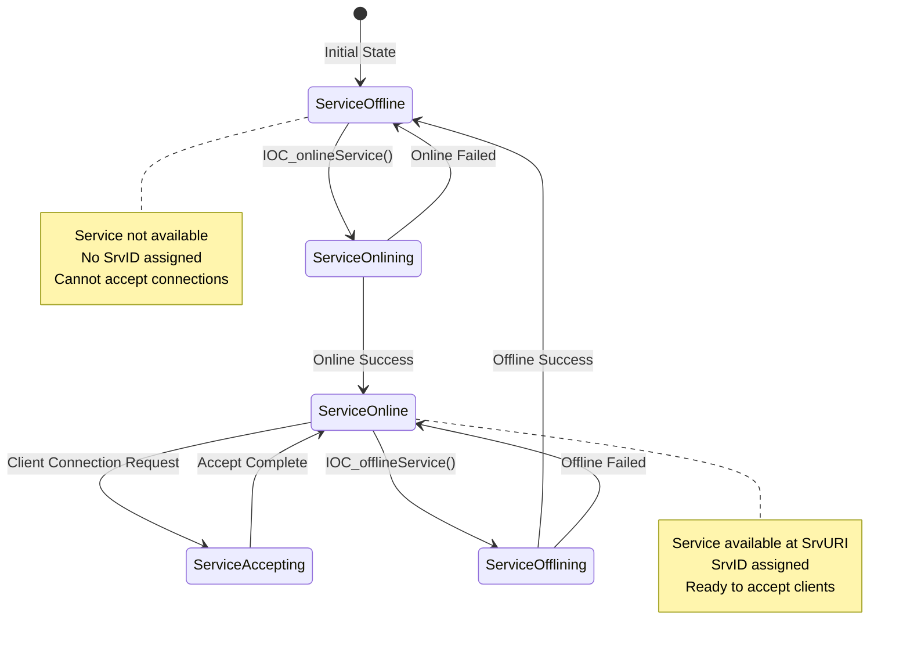
```mermaid
stateDiagram-v2
  [*] --> ServiceOffline: Initial State
  
  ServiceOffline --> ServiceOnlining: IOC_onlineService()
  ServiceOnlining --> ServiceOnline: Online Success
  ServiceOnlining --> ServiceOffline: Online Failed
  
  ServiceOnline --> ServiceAccepting: Client Connection Request
  ServiceAccepting --> ServiceOnline: Accept Complete
  
  ServiceOnline --> ServiceOfflining: IOC_offlineService()
  ServiceOfflining --> ServiceOffline: Offline Success
  ServiceOfflining --> ServiceOnline: Offline Failed
  
  note right of ServiceOffline
    Service not available
    No SrvID assigned
    Cannot accept connections
  end note
  
  note right of ServiceOnline
    Service available at SrvURI
    SrvID assigned
    Ready to accept clients
  end note
```

## Service State Descriptions

| State | Description | Entry Condition | Exit Condition | Valid Operations |
|-------|-------------|----------------|----------------|------------------|
| **ServiceOffline** | Service not available | Initial state or offline complete | IOC_onlineService() called | Define service URI |
| **ServiceOnlining** | Service being registered | onlineService in progress | Success or failure | None (transient) |
| **ServiceOnline** | Service available for connections | Online success | offlineService called | acceptClient, getLinkID |
| **ServiceAccepting** | Processing client connection | Connection request received | Accept complete | None (transient) |
| **ServiceOfflining** | Service being deregistered | offlineService in progress | Success or failure | None (transient) |

## Service Lifecycle Sequence Diagram

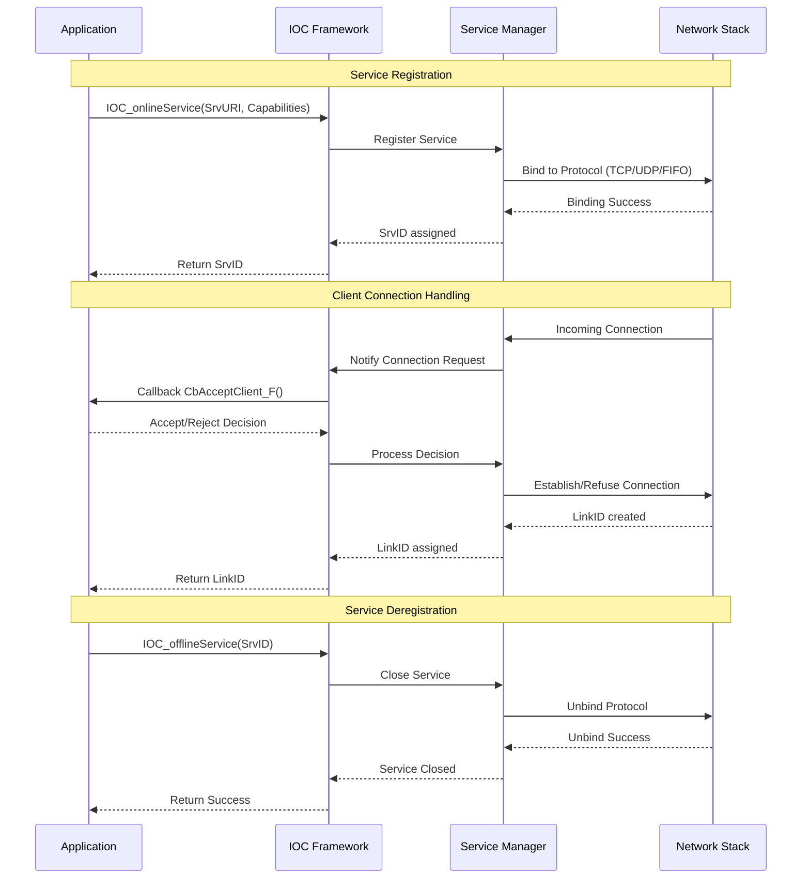
```mermaid
sequenceDiagram
    participant App as Application
    participant IOC as IOC Framework
    participant SrvMgr as Service Manager
    participant NetStack as Network Stack
    
    Note over App,NetStack: Service Registration
    App->>IOC: IOC_onlineService(SrvURI, Capabilities)
    IOC->>SrvMgr: Register Service
    SrvMgr->>NetStack: Bind to Protocol (TCP/UDP/FIFO)
    NetStack-->>SrvMgr: Binding Success
    SrvMgr-->>IOC: SrvID assigned
    IOC-->>App: Return SrvID
    
    Note over App,NetStack: Client Connection Handling
    NetStack->>SrvMgr: Incoming Connection
    SrvMgr->>IOC: Notify Connection Request
    IOC->>App: Callback CbAcceptClient_F()
    App-->>IOC: Accept/Reject Decision
    IOC->>SrvMgr: Process Decision
    SrvMgr->>NetStack: Establish/Refuse Connection
    NetStack-->>SrvMgr: LinkID created
    SrvMgr-->>IOC: LinkID assigned
    IOC-->>App: Return LinkID
    
    Note over App,NetStack: Service Deregistration
    App->>IOC: IOC_offlineService(SrvID)
    IOC->>SrvMgr: Close Service
    SrvMgr->>NetStack: Unbind Protocol
    NetStack-->>SrvMgr: Unbind Success
    SrvMgr-->>IOC: Service Closed
    IOC-->>App: Return Success
```

## Service Flags Configuration

### IOC_SrvFlags_T Enumeration

```c
typedef enum {
    IOC_SRVFLAG_NONE = 0,
    IOC_SRVFLAG_BROADCAST_EVENT    = 1 << 0,  // Enable broadcast events to all clients
    IOC_SRVFLAG_AUTO_ACCEPT        = 1 << 1,  // Automatically accept client connections
    IOC_SRVFLAG_KEEP_ACCEPTED_LINK = 1 << 2,  // Keep links alive after service shutdown
} IOC_SrvFlags_T;
```

### IOC_SRVFLAG_AUTO_ACCEPT

**Purpose**: Automatically accept client connections without manual `IOC_acceptClient()` calls.

**Behavior**:
- **Background Accept Loop**: Starts daemon thread to accept connections automatically
- **Link Storage**: Accepted links stored inside service, discoverable via `IOC_getServiceLinkIDs()`
- **Callback Preservation**: Callbacks remain where they belong (DAT recv on receiver, CMD exec on executor, EVT consume on consumer)
- **Notification Options**:
  - **Polling Mode**: Periodically call `IOC_getServiceLinkIDs()` to discover new links
  - **Immediate Mode**: Provide `OnAutoAccepted_F(SrvID, LinkID, pPriv)` callback for instant notification

**State Machine Impact**:
```
ServiceOnline → ServiceAccepting (automatic, background)
              → ServiceOnline (with new LinkID added)
```

**Usage Examples**:

| Scenario | Service Capability | Client Usage | Callback Location |
|----------|-------------------|--------------|-------------------|
| **DAT Receiver** | `IOC_LinkUsageDatReceiver` | `IOC_LinkUsageDatSender` | `SrvArgs.UsageArgs.pDat->CbRecvDat_F` |
| **DAT Sender** | `IOC_LinkUsageDatSender` | `IOC_LinkUsageDatReceiver` | `ConnArgs.UsageArgs.pDat->CbRecvDat_F` (client-side) |
| **CMD Executor** | `IOC_LinkUsageCmdExecutor` | `IOC_LinkUsageCmdInitiator` | `SrvArgs.UsageArgs.pCmd->CbExecCmd_F` |
| **CMD Initiator** | `IOC_LinkUsageCmdInitiator` | `IOC_LinkUsageCmdExecutor` | `ConnArgs.UsageArgs.pCmd->CbExecCmd_F` (client-side) |
| **EVT Producer** | `IOC_LinkUsageEvtProducer` | `IOC_LinkUsageEvtConsumer` | `ConnArgs.UsageArgs.pEvt->CbProcEvt_F` (client-side) |
| **EVT Consumer** | `IOC_LinkUsageEvtConsumer` | `IOC_LinkUsageEvtProducer` | `SrvArgs.UsageArgs.pEvt->CbProcEvt_F` |

**Configuration Example**:
```c
IOC_SrvArgs_T srvArgs;
IOC_Helper_initSrvArgs(&srvArgs);
srvArgs.Flags = IOC_SRVFLAG_AUTO_ACCEPT;
srvArgs.UsageCapabilites = IOC_LinkUsageDatReceiver;
srvArgs.UsageArgs.pDat->CbRecvDat_F = MyServiceRecvCallback;
srvArgs.OnAutoAccepted_F = OnNewClientAccepted;  // Optional immediate notification

IOC_SrvID_T srvID;
IOC_onlineService(&srvID, &srvArgs);

// Option 1: Polling mode
IOC_LinkID_T linkIDs[100];
size_t linkCount = 100;
IOC_getServiceLinkIDs(srvID, linkIDs, &linkCount);

// Option 2: Immediate callback already invoked
void OnNewClientAccepted(IOC_SrvID_T srvID, IOC_LinkID_T newLinkID, void* pPriv) {
    // Initialize per-link tracking, start operations, etc.
}
```

### IOC_SRVFLAG_KEEP_ACCEPTED_LINK

**Purpose**: Control accepted link lifecycle during service shutdown.

**Default Behavior (flag NOT set)**:
- `IOC_offlineService()` **automatically closes ALL accepted links**
- Prevents resource leaks and ensures clean shutdown
- Callbacks registered on those links will no longer be invoked
- Client-side links (CliLinkIDs) become invalid/disconnected

**With IOC_SRVFLAG_KEEP_ACCEPTED_LINK**:
- Accepted links **survive service shutdown**
- Links remain valid and functional after service goes offline
- Developer is **responsible for manual link cleanup** via `IOC_closeLink()`
- Useful for advanced scenarios like service restart while preserving connections

**State Machine Impact**:

| Scenario | Without Flag | With Flag |
|----------|-------------|----------|
| **Service Offline** | ServiceOnline → ServiceOfflining → **All Links Closed** → ServiceOffline | ServiceOnline → ServiceOfflining → **Links Remain Open** → ServiceOffline |
| **Link State** | LinkReady → **LinkDisconnected** (automatic) | LinkReady → **LinkReady** (manual cleanup needed) |
| **Cleanup** | Automatic (safe by default) | Manual (`IOC_closeLink()` required) |

**Usage Comparison**:

```c
// Scenario 1: Default behavior (safe, automatic cleanup)
IOC_SrvArgs_T srvArgs1;
srvArgs1.Flags = IOC_SRVFLAG_AUTO_ACCEPT;
IOC_onlineService(&srvID, &srvArgs1);
// ... service operates ...
IOC_offlineService(srvID);  // ✅ All accepted links automatically closed

// Scenario 2: Keep links alive (advanced, manual cleanup)
IOC_SrvArgs_T srvArgs2;
srvArgs2.Flags = IOC_SRVFLAG_AUTO_ACCEPT | IOC_SRVFLAG_KEEP_ACCEPTED_LINK;
IOC_onlineService(&srvID, &srvArgs2);
// ... service operates ...
IOC_offlineService(srvID);  // ⚠️ Links still open, service can restart
// Developer must manually close links:
IOC_LinkID_T linkIDs[100];
size_t linkCount = 100;
IOC_getServiceLinkIDs(srvID, linkIDs, &linkCount);
for (size_t i = 0; i < linkCount; i++) {
    IOC_closeLink(linkIDs[i]);  // 🔴 Manual cleanup required
}
```

**Use Cases**:

| Use Case | Recommended Flag Configuration | Reason |
|----------|-------------------------------|--------|
| **Standard Service** | `IOC_SRVFLAG_AUTO_ACCEPT` | Safe default, automatic cleanup |
| **Hot-Reload Service** | `IOC_SRVFLAG_AUTO_ACCEPT \| IOC_SRVFLAG_KEEP_ACCEPTED_LINK` | Preserve connections during restart |
| **Stateful Service** | `IOC_SRVFLAG_AUTO_ACCEPT \| IOC_SRVFLAG_KEEP_ACCEPTED_LINK` | Maintain session state across service lifecycle |
| **Debug/Test Service** | `IOC_SRVFLAG_AUTO_ACCEPT` | Simplify cleanup, prevent resource leaks |

### IOC_SRVFLAG_BROADCAST_EVENT

**Purpose**: Enable broadcast event delivery to all connected clients.

**Behavior**:
- **Default (P2P)**: Events use link-specific LinkIDs (AcptLinkID ↔ ConnLinkID)
  - `postEVT(AcptLinkID)` → **ONLY** ConnLinkID receives event
  - `postEVT(ConnLinkID)` → **ONLY** AcptLinkID receives event
  
- **With BROADCAST_EVENT**: `SrvID` is aliased to `SrvLinkID` for broadcast
  - `postEVT(SrvLinkID)` → **ALL** ConnLinkIDs receive event
  - Multicast pattern: One-to-many event delivery

**Configuration**:
```c
IOC_SrvArgs_T srvArgs;
srvArgs.Flags = IOC_SRVFLAG_AUTO_ACCEPT | IOC_SRVFLAG_BROADCAST_EVENT;
srvArgs.UsageCapabilites = IOC_LinkUsageEvtProducer;
IOC_onlineService(&srvID, &srvArgs);

// Service can now broadcast to all clients
IOC_postEVT(srvID, evtID, &evtDesc);  // All connected clients receive
```

### Service Flags Combination Matrix

| Flags | Auto Accept | Keep Links | Broadcast EVT | Use Case |
|-------|------------|-----------|---------------|----------|
| `NONE` | ❌ | ❌ | ❌ | Manual accept, manual cleanup, P2P only |
| `AUTO_ACCEPT` | ✅ | ❌ | ❌ | Auto accept, auto cleanup (standard) |
| `AUTO_ACCEPT \| KEEP_ACCEPTED_LINK` | ✅ | ✅ | ❌ | Auto accept, manual cleanup (hot-reload) |
| `AUTO_ACCEPT \| BROADCAST_EVENT` | ✅ | ❌ | ✅ | Auto accept, auto cleanup, broadcast events |
| `AUTO_ACCEPT \| KEEP_ACCEPTED_LINK \| BROADCAST_EVENT` | ✅ | ✅ | ✅ | Full control with all features |

---

# Link State Machine

## Link Lifecycle States

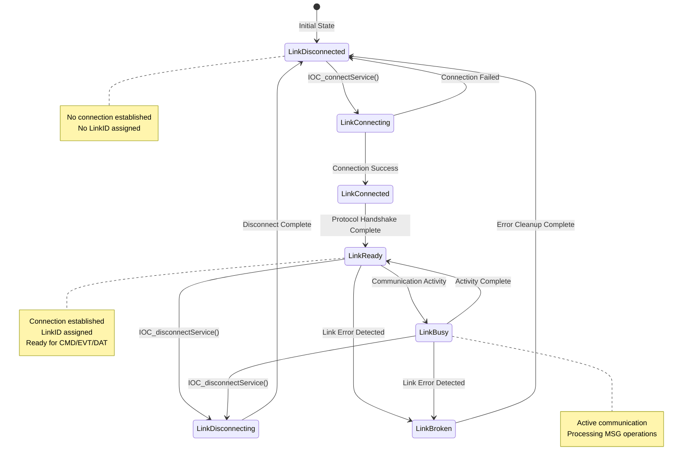
```mermaid
stateDiagram-v2
  [*] --> LinkDisconnected: Initial State
  
  LinkDisconnected --> LinkConnecting: IOC_connectService()
  LinkConnecting --> LinkConnected: Connection Success
  LinkConnecting --> LinkDisconnected: Connection Failed
  
  LinkConnected --> LinkReady: Protocol Handshake Complete
  
  LinkReady --> LinkBusy: Communication Activity
  LinkBusy --> LinkReady: Activity Complete
  
  LinkReady --> LinkDisconnecting: IOC_disconnectService()
  LinkBusy --> LinkDisconnecting: IOC_disconnectService()
  LinkDisconnecting --> LinkDisconnected: Disconnect Complete
  
  LinkReady --> LinkBroken: Link Error Detected
  LinkBusy --> LinkBroken: Link Error Detected
  LinkBroken --> LinkDisconnected: Error Cleanup Complete
  
  note right of LinkDisconnected
    No connection established
    No LinkID assigned
  end note
  
  note right of LinkReady
    Connection established
    LinkID assigned
    Ready for CMD/EVT/DAT
  end note
  
  note right of LinkBusy
    Active communication
    Processing MSG operations
  end note
```

## Link State Descriptions

| State | Description | Entry Condition | Exit Condition | Valid Operations |
|-------|-------------|----------------|----------------|------------------|
| **LinkDisconnected** | No connection exists | Initial or disconnect complete | connectService called | None |
| **LinkConnecting** | Connection being established | connectService in progress | Success or failure | None (transient) |
| **LinkConnected** | Transport connection ready | Connection success | Handshake complete | Protocol negotiation |
| **LinkReady** | Link ready for communication | Handshake complete or activity done | Communication starts or disconnect | execCMD, postEVT, sendDAT |
| **LinkBusy** | Communication in progress | MSG operation started | Operation complete | Continue operation |
| **LinkDisconnecting** | Link being closed | disconnectService called | Cleanup complete | None (transient) |
| **LinkBroken** | Connection error occurred | Error detected | Cleanup complete | Error reporting |

## Link Connection Sequence Diagram (ConetMode)

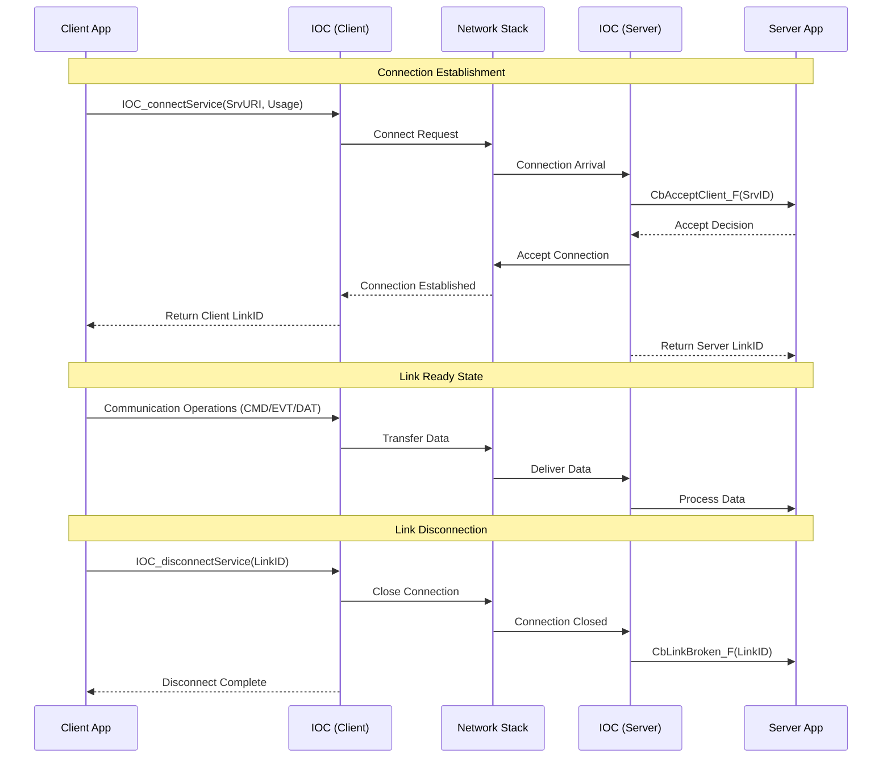
```mermaid
sequenceDiagram
    participant Client as Client App
    participant IOC_C as IOC (Client)
    participant Network as Network Stack
    participant IOC_S as IOC (Server)
    participant Server as Server App
    
    Note over Client,Server: Connection Establishment
    Client->>IOC_C: IOC_connectService(SrvURI, Usage)
    IOC_C->>Network: Connect Request
    Network->>IOC_S: Connection Arrival
    IOC_S->>Server: CbAcceptClient_F(SrvID)
    Server-->>IOC_S: Accept Decision
    IOC_S->>Network: Accept Connection
    Network-->>IOC_C: Connection Established
    IOC_C-->>Client: Return Client LinkID
    IOC_S-->>Server: Return Server LinkID
    
    Note over Client,Server: Link Ready State
    Client->>IOC_C: Communication Operations (CMD/EVT/DAT)
    IOC_C->>Network: Transfer Data
    Network->>IOC_S: Deliver Data
    IOC_S->>Server: Process Data
    
    Note over Client,Server: Link Disconnection
    Client->>IOC_C: IOC_disconnectService(LinkID)
    IOC_C->>Network: Close Connection
    Network->>IOC_S: Connection Closed
    IOC_S->>Server: CbLinkBroken_F(LinkID)
    IOC_C-->>Client: Disconnect Complete
```

---

# Command State Machine

## Link-Level Command States (CMD::Conet)

Commands operate in **ConetMode** (connection-oriented) with bidirectional roles on each link. Each link maintains independent **Initiator** and **Executor** sub-state machines for concurrent command processing.

### Link Usage Types

- **IOC_LinkUsageCmdInitiator**: Link configured to initiate commands via `IOC_execCMD()`
  - Corresponds to **Initiator** role in state machine
  - Sends commands and waits for responses
  - States: InitiatorReady ↔ InitiatorBusyExecCmd

- **IOC_LinkUsageCmdExecutor**: Link configured to execute commands via callback or polling
  - Corresponds to **Executor** role in state machine
  - Receives commands and sends responses
  - States: ExecutorReady → ExecutorBusyCbExecCmd (callback) or ExecutorReady → ExecutorBusyWaitCmd → ExecutorBusyAckCmd (polling)

**Note**: A single link can have both usage types enabled for bidirectional command execution.

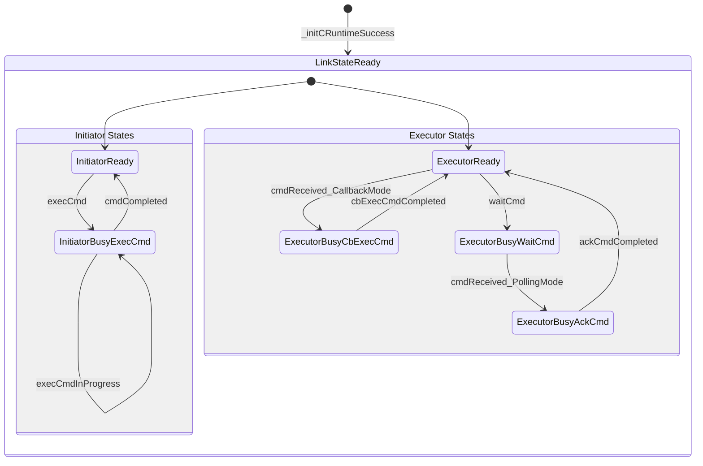
```mermaid
stateDiagram-v2
  [*] --> LinkStateReady: _initCRuntimeSuccess
  
  state LinkStateReady {
    [*] --> InitiatorReady
    [*] --> ExecutorReady
    
    state "Initiator States" as InitiatorStates {
      InitiatorReady --> InitiatorBusyExecCmd: execCmd
      InitiatorBusyExecCmd --> InitiatorReady: cmdCompleted
      InitiatorBusyExecCmd --> InitiatorBusyExecCmd: execCmdInProgress
    }
    
    state "Executor States" as ExecutorStates {
      ExecutorReady --> ExecutorBusyCbExecCmd: cmdReceived_CallbackMode
      ExecutorBusyCbExecCmd --> ExecutorReady: cbExecCmdCompleted
      
      ExecutorReady --> ExecutorBusyWaitCmd: waitCmd
      ExecutorBusyWaitCmd --> ExecutorBusyAckCmd: cmdReceived_PollingMode
      ExecutorBusyAckCmd --> ExecutorReady: ackCmdCompleted
    }
  }
```

### Link Command State Descriptions

| State | Role | Description | Entry | Exit | Operations |
|-------|------|-------------|-------|------|------------|
| **InitiatorReady** | Initiator | Ready to send commands | Init or command complete | execCMD called | IOC_execCMD() |
| **InitiatorBusyExecCmd** | Initiator | Awaiting command response | execCMD called | Response received or timeout | Wait for result |
| **ExecutorReady** | Executor | Ready to receive commands | Init or processing complete | Command received or waitCMD called | IOC_waitCMD() |
| **ExecutorBusyCbExecCmd** | Executor | Processing command (callback) | CbExecCmd_F invoked | Callback returns | Execute logic |
| **ExecutorBusyWaitCmd** | Executor | Waiting for commands (polling) | waitCMD called | Command received | Block until command |
| **ExecutorBusyAckCmd** | Executor | Sending response (polling) | Command received | ackCMD complete | IOC_ackCMD() |

### Design Principles

1. **Composite State Machine**: Hierarchical states with independent sub-state machines
2. **Concurrent Operations**: Allow simultaneous command execution in both directions
3. **Role-Specific Configuration**: Different timeout, retry policies for each role
4. **State Isolation**: Prevent state interference between initiator and executor roles
5. **Error Handling**: Independent error recovery for each role

### Key Advantages

1. **No Deadlock Risk**: Initiator and executor states don't block each other
2. **Better Throughput**: Process commands bidirectionally without mutual exclusion
3. **Clear Semantics**: Each role has well-defined state transitions
4. **Easy Testing**: Independent state machines are easier to unit test
5. **Future Extensibility**: Easy to add more complex command patterns

## Individual Command States (IOC_CmdDesc_T)

Individual command descriptors maintain their own state lifecycle **independent** of link states. This provides fine-grained command tracking for error handling, timeout management, and execution verification.

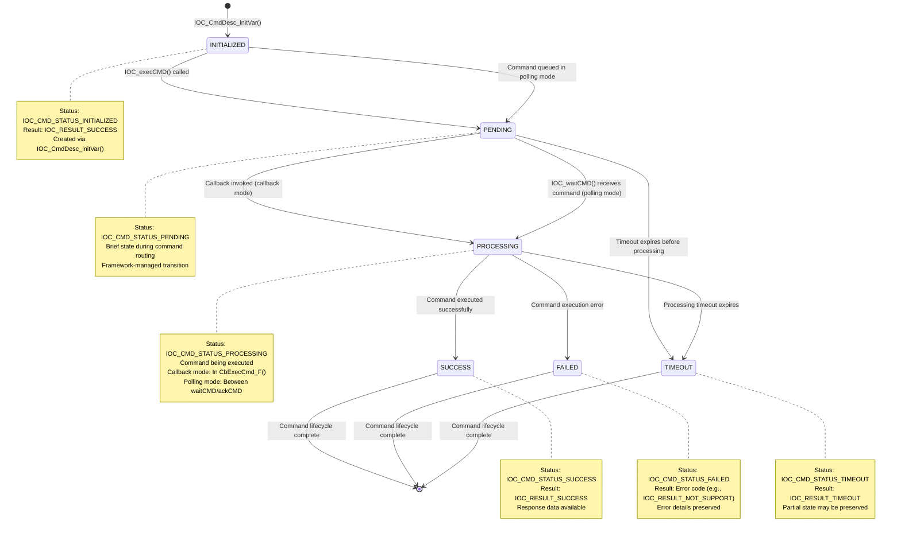
```mermaid
stateDiagram-v2
  [*] --> INITIALIZED: IOC_CmdDesc_initVar()
  
  INITIALIZED --> PENDING: IOC_execCMD() called
  INITIALIZED --> PENDING: Command queued in polling mode
  
  PENDING --> PROCESSING: Callback invoked (callback mode)
  PENDING --> PROCESSING: IOC_waitCMD() receives command (polling mode)
  PENDING --> TIMEOUT: Timeout expires before processing
  
  PROCESSING --> SUCCESS: Command executed successfully
  PROCESSING --> FAILED: Command execution error
  PROCESSING --> TIMEOUT: Processing timeout expires
  
  SUCCESS --> [*]: Command lifecycle complete
  FAILED --> [*]: Command lifecycle complete
  TIMEOUT --> [*]: Command lifecycle complete
  
  note right of INITIALIZED
    Status: IOC_CMD_STATUS_INITIALIZED
    Result: IOC_RESULT_SUCCESS
    Created via IOC_CmdDesc_initVar()
  end note
  
  note right of PENDING
    Status: IOC_CMD_STATUS_PENDING
    Brief state during command routing
    Framework-managed transition
  end note
  
  note right of PROCESSING
    Status: IOC_CMD_STATUS_PROCESSING
    Command being executed
    Callback mode: In CbExecCmd_F()
    Polling mode: Between waitCMD/ackCMD
  end note
  
  note right of SUCCESS
    Status: IOC_CMD_STATUS_SUCCESS
    Result: IOC_RESULT_SUCCESS
    Response data available
  end note
  
  note right of FAILED
    Status: IOC_CMD_STATUS_FAILED
    Result: Error code (e.g., IOC_RESULT_NOT_SUPPORT)
    Error details preserved
  end note
  
  note right of TIMEOUT
    Status: IOC_CMD_STATUS_TIMEOUT
    Result: IOC_RESULT_TIMEOUT
    Partial state may be preserved
  end note
```

### Individual Command State Descriptions

| State | Status Code | Description | Entry | Exit | Result Code |
|-------|-------------|-------------|-------|------|-------------|
| **INITIALIZED** | IOC_CMD_STATUS_INITIALIZED | Command descriptor created | initVar() called | execCMD or queue | IOC_RESULT_SUCCESS |
| **PENDING** | IOC_CMD_STATUS_PENDING | Queued for processing | Command submitted | Executor receives or timeout | IOC_RESULT_SUCCESS |
| **PROCESSING** | IOC_CMD_STATUS_PROCESSING | Being executed | Executor starts | Complete or timeout | IOC_RESULT_SUCCESS |
| **SUCCESS** | IOC_CMD_STATUS_SUCCESS | Executed successfully | Execution complete | Terminal state | IOC_RESULT_SUCCESS |
| **FAILED** | IOC_CMD_STATUS_FAILED | Execution failed | Error detected | Terminal state | Error code |
| **TIMEOUT** | IOC_CMD_STATUS_TIMEOUT | Execution timeout | Timeout expires | Terminal state | IOC_RESULT_TIMEOUT |

### Design Principles

1. **Independent Lifecycle**: Each IOC_CmdDesc_T maintains state regardless of link state
2. **Atomic Transitions**: State changes are atomic and thread-safe
3. **Terminal States**: SUCCESS/FAILED/TIMEOUT are immutable final states
4. **Error Preservation**: Failed commands preserve error context
5. **Timeout Flexibility**: Timeout can occur during PENDING or PROCESSING

### State Correlation with Link States

- **Individual Command State** (IOC_CmdDesc_T): Tracks single command execution lifecycle
- **Link Command State** (IOC_LinkID_T): Tracks aggregate command activity on link
- **Relationship**: Multiple individual commands can be PROCESSING on same link concurrently
- **Independence**: Individual command completion doesn't directly affect link state
- **Coordination**: Link busy states reflect presence of active individual commands

## Command Execution Sequence Diagrams

### Pattern 1: Callback Mode (Automatic)

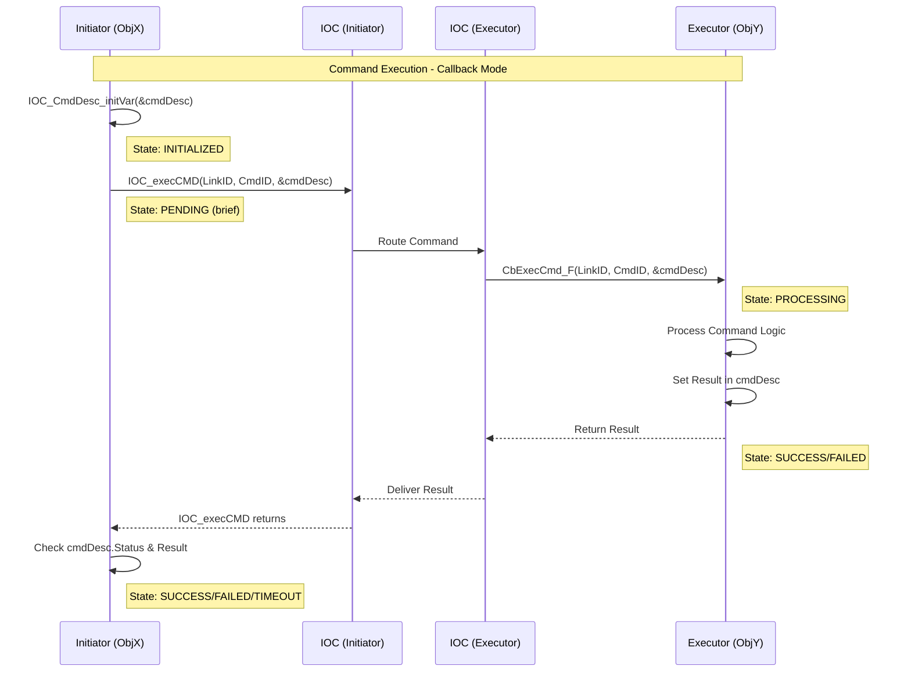
```mermaid
sequenceDiagram
    participant Init as Initiator (ObjX)
    participant IOC_I as IOC (Initiator)
    participant IOC_E as IOC (Executor)
    participant Exec as Executor (ObjY)
    
    Note over Init,Exec: Command Execution - Callback Mode
    
    Init->>Init: IOC_CmdDesc_initVar(&cmdDesc)
    Note right of Init: State: INITIALIZED
    
    Init->>IOC_I: IOC_execCMD(LinkID, CmdID, &cmdDesc)
    Note right of Init: State: PENDING (brief)
    IOC_I->>IOC_E: Route Command
    
    IOC_E->>Exec: CbExecCmd_F(LinkID, CmdID, &cmdDesc)
    Note right of Exec: State: PROCESSING
    
    Exec->>Exec: Process Command Logic
    Exec->>Exec: Set Result in cmdDesc
    Exec-->>IOC_E: Return Result
    Note right of Exec: State: SUCCESS/FAILED
    
    IOC_E-->>IOC_I: Deliver Result
    IOC_I-->>Init: IOC_execCMD returns
    
    Init->>Init: Check cmdDesc.Status & Result
    Note right of Init: State: SUCCESS/FAILED/TIMEOUT
```

### Pattern 2: Polling Mode (Manual)

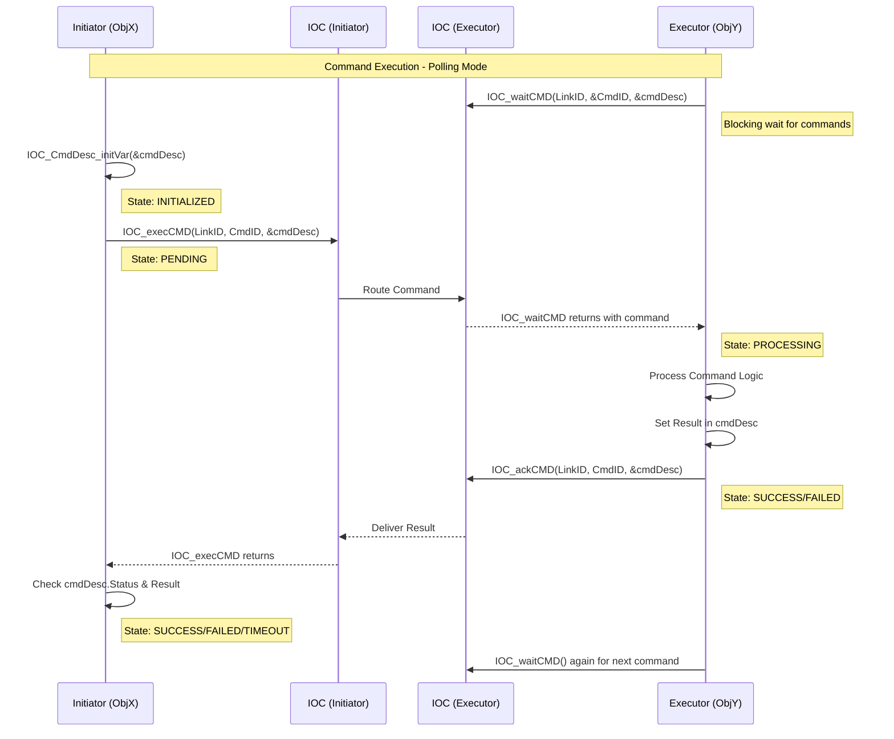
```mermaid
sequenceDiagram
    participant Init as Initiator (ObjX)
    participant IOC_I as IOC (Initiator)
    participant IOC_E as IOC (Executor)
    participant Exec as Executor (ObjY)
    
    Note over Init,Exec: Command Execution - Polling Mode
    
    Exec->>IOC_E: IOC_waitCMD(LinkID, &CmdID, &cmdDesc)
    Note right of Exec: Blocking wait for commands
    
    Init->>Init: IOC_CmdDesc_initVar(&cmdDesc)
    Note right of Init: State: INITIALIZED
    
    Init->>IOC_I: IOC_execCMD(LinkID, CmdID, &cmdDesc)
    Note right of Init: State: PENDING
    IOC_I->>IOC_E: Route Command
    
    IOC_E-->>Exec: IOC_waitCMD returns with command
    Note right of Exec: State: PROCESSING
    
    Exec->>Exec: Process Command Logic
    Exec->>Exec: Set Result in cmdDesc
    Exec->>IOC_E: IOC_ackCMD(LinkID, CmdID, &cmdDesc)
    Note right of Exec: State: SUCCESS/FAILED
    
    IOC_E-->>IOC_I: Deliver Result
    IOC_I-->>Init: IOC_execCMD returns
    
    Init->>Init: Check cmdDesc.Status & Result
    Note right of Init: State: SUCCESS/FAILED/TIMEOUT
    
    Exec->>IOC_E: IOC_waitCMD() again for next command
```

### Pattern 3: Timeout Scenario

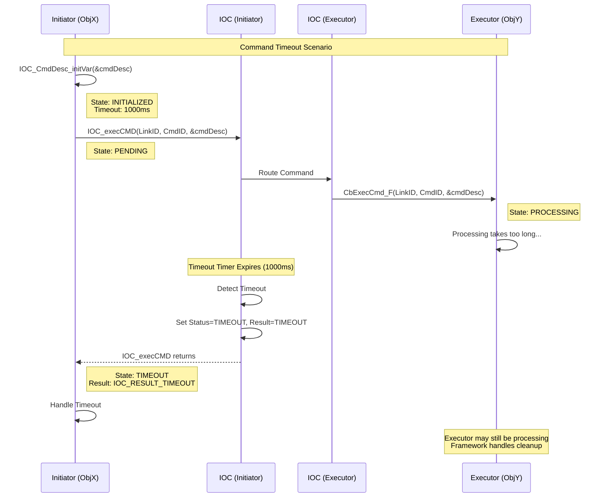
```mermaid
sequenceDiagram
    participant Init as Initiator (ObjX)
    participant IOC_I as IOC (Initiator)
    participant IOC_E as IOC (Executor)
    participant Exec as Executor (ObjY)
    
    Note over Init,Exec: Command Timeout Scenario
    
    Init->>Init: IOC_CmdDesc_initVar(&cmdDesc)
    Note right of Init: State: INITIALIZED<br/>Timeout: 1000ms
    
    Init->>IOC_I: IOC_execCMD(LinkID, CmdID, &cmdDesc)
    Note right of Init: State: PENDING
    IOC_I->>IOC_E: Route Command
    
    IOC_E->>Exec: CbExecCmd_F(LinkID, CmdID, &cmdDesc)
    Note right of Exec: State: PROCESSING
    
    Exec->>Exec: Processing takes too long...
    
    Note over IOC_I: Timeout Timer Expires (1000ms)
    IOC_I->>IOC_I: Detect Timeout
    IOC_I->>IOC_I: Set Status=TIMEOUT, Result=TIMEOUT
    
    IOC_I-->>Init: IOC_execCMD returns
    Note right of Init: State: TIMEOUT<br/>Result: IOC_RESULT_TIMEOUT
    
    Init->>Init: Handle Timeout
    
    Note over Exec: Executor may still be processing<br/>Framework handles cleanup
```

---

# Event State Machine

## Link-Level Event States (EVT::Conet)

Events operate in **ConetMode** (connection-oriented) with **Publisher-Subscriber** pattern. Each link maintains independent **Publisher** and **Subscriber** sub-state machines for concurrent event handling.

### Link Usage Types

- **IOC_LinkUsageEvtProducer**: Link configured to post events via `IOC_postEVT()`
  - Corresponds to **Publisher** role in state machine
  - Publishes events to subscribers
  - States: EventPublisherReady ↔ EventPublisherBusyPostEvt

- **IOC_LinkUsageEvtConsumer**: Link configured to receive events via callback or polling
  - Corresponds to **Subscriber** role in state machine
  - Receives and processes events
  - States: EventSubscriberReady → EventSubscriberBusySubEvt/UnsubEvt/CbProcEvt/WaitEvt

**Note**: A single link can have both usage types enabled for bidirectional event notification.

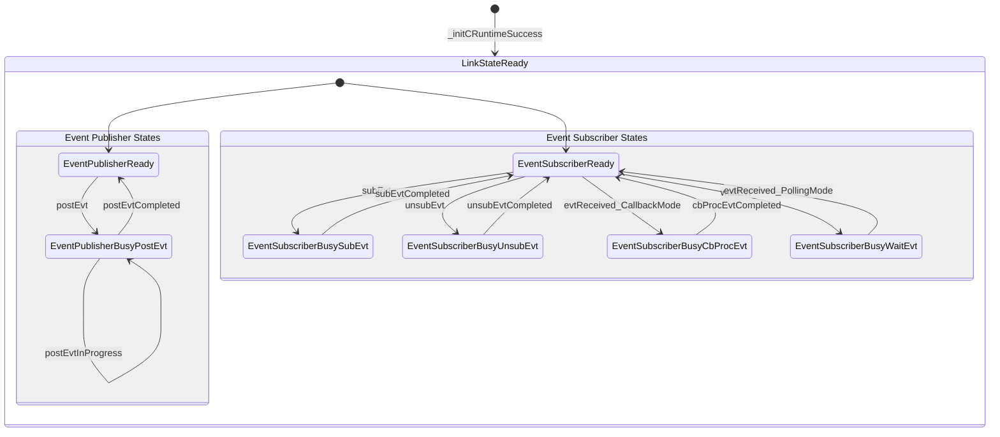
```mermaid
stateDiagram-v2
  [*] --> LinkStateReady: _initCRuntimeSuccess
  
  state LinkStateReady {
    [*] --> EventPublisherReady
    [*] --> EventSubscriberReady
    
    state "Event Publisher States" as PublisherStates {
      EventPublisherReady --> EventPublisherBusyPostEvt: postEvt
      EventPublisherBusyPostEvt --> EventPublisherReady: postEvtCompleted
      EventPublisherBusyPostEvt --> EventPublisherBusyPostEvt: postEvtInProgress
    }
    
    state "Event Subscriber States" as SubscriberStates {
      EventSubscriberReady --> EventSubscriberBusySubEvt: subEvt
      EventSubscriberBusySubEvt --> EventSubscriberReady: subEvtCompleted
      
      EventSubscriberReady --> EventSubscriberBusyUnsubEvt: unsubEvt
      EventSubscriberBusyUnsubEvt --> EventSubscriberReady: unsubEvtCompleted
      
      EventSubscriberReady --> EventSubscriberBusyCbProcEvt: evtReceived_CallbackMode
      EventSubscriberBusyCbProcEvt --> EventSubscriberReady: cbProcEvtCompleted
      
      EventSubscriberReady --> EventSubscriberBusyWaitEvt: waitEvt
      EventSubscriberBusyWaitEvt --> EventSubscriberReady: evtReceived_PollingMode
    }
  }
```

### Link Event State Descriptions (ConetMode)

| State | Role | Description | Entry | Exit | Operations |
|-------|------|-------------|-------|------|------------|
| **EventPublisherReady** | Publisher | Ready to post events | Init or post complete | postEVT called | IOC_postEVT() |
| **EventPublisherBusyPostEvt** | Publisher | Posting event (brief) | postEVT called | Event queued | Queue operation |
| **EventSubscriberReady** | Subscriber | Ready to manage subscriptions | Init or operation complete | subEVT/unsubEVT/waitEVT called | IOC_subEVT(), IOC_waitEVT() |
| **EventSubscriberBusySubEvt** | Subscriber | Establishing subscription | subEVT called | Subscription registered | Register callback |
| **EventSubscriberBusyUnsubEvt** | Subscriber | Removing subscription | unsubEVT called | Subscription removed | Deregister callback |
| **EventSubscriberBusyCbProcEvt** | Subscriber | Processing event (callback) | CbProcEvt_F invoked | Callback returns | Handle event |
| **EventSubscriberBusyWaitEvt** | Subscriber | Waiting for events (polling) | waitEVT called | Event received | Block until event |

### Design Principles

1. **Composite State Machine**: Hierarchical states with independent sub-state machines
2. **Concurrent Operations**: Allow simultaneous event publishing and subscription management
3. **Asynchronous Publishing**: Event posting is non-blocking and doesn't wait for delivery
4. **Subscription Management**: Independent subscription/unsubscription operations
5. **Dual Reception Modes**: Support both callback and polling reception patterns
6. **Role-Specific Configuration**: Different timeout, reliability policies for publisher/subscriber
7. **State Isolation**: Prevent state interference between publisher and subscriber roles

### Key Advantages

1. **No Blocking Risk**: Publisher doesn't block on subscriber availability
2. **Better Performance**: Asynchronous event delivery optimized for throughput
3. **Clear Semantics**: Each role has well-defined state transitions
4. **Flexible Reception**: Support both push (callback) and pull (polling) patterns
5. **Independent Subscriptions**: Multiple event types managed independently
6. **Easy Testing**: Independent state machines are easier to unit test
7. **Future Extensibility**: Easy to add event filtering, priority handling, or batching

### EVT::Conet vs CMD::Conet Key Differences

| Aspect | EVT::Conet | CMD::Conet |
|--------|-----------|-----------|
| **Response Pattern** | Fire-and-forget | Request-response |
| **Blocking Behavior** | Non-blocking default | Blocking default |
| **Publisher/Initiator State** | Simpler (no wait for response) | Complex (wait management) |
| **Subscriber/Executor Features** | Subscription management | Simple execution |
| **Error Handling** | Best-effort delivery | Guaranteed response |
| **Performance** | Optimized for throughput | Optimized for reliability |

## Event States in ConlesMode (EVT::Conles)

In **ConlesMode** (connectionless), events use **AutoLinkID** for broadcast/multicast delivery without connection establishment. State machine is simpler with focus on subscription management.

### Link Usage Types

- **IOC_LinkUsageEvtProducer**: Implicit usage for posting events to `AutoLinkID`
  - No explicit link configuration required
  - Any object can post events via `IOC_postEVT(AutoLinkID, EvtID, EvtDesc)`
  
- **IOC_LinkUsageEvtConsumer**: Implicit usage for receiving events from `AutoLinkID`
  - Subscription-based reception via `IOC_subEVT()` or direct polling via `IOC_waitEVT()`
  - No explicit link configuration required

**Note**: ConlesMode doesn't require explicit link usage configuration - roles are implicit based on API usage.

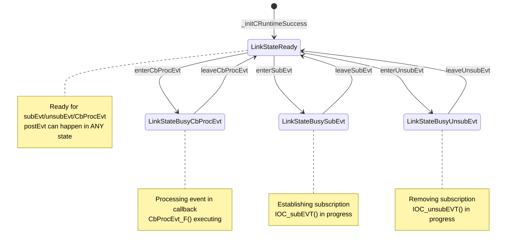
```mermaid
stateDiagram-v2
  [*] --> LinkStateReady: _initCRuntimeSuccess
  LinkStateReady --> LinkStateBusyCbProcEvt: enterCbProcEvt
  LinkStateBusyCbProcEvt --> LinkStateReady: leaveCbProcEvt

  LinkStateReady --> LinkStateBusySubEvt: enterSubEvt
  LinkStateBusySubEvt --> LinkStateReady: leaveSubEvt

  LinkStateReady --> LinkStateBusyUnsubEvt: enterUnsubEvt
  LinkStateBusyUnsubEvt --> LinkStateReady: leaveUnsubEvt
  
  note right of LinkStateReady
    Ready for subEvt/unsubEvt/CbProcEvt
    postEvt can happen in ANY state
  end note
  
  note right of LinkStateBusyCbProcEvt
    Processing event in callback
    CbProcEvt_F() executing
  end note
  
  note right of LinkStateBusySubEvt
    Establishing subscription
    IOC_subEVT() in progress
  end note
  
  note right of LinkStateBusyUnsubEvt
    Removing subscription
    IOC_unsubEVT() in progress
  end note
```

### Link Event State Descriptions (ConlesMode)

| State | Description | Entry | Exit | Operations |
|-------|-------------|-------|------|------------|
| **LinkStateReady** | Ready for subscription operations | Init or operation complete | subEVT/unsubEVT/event received | IOC_postEVT(), IOC_subEVT(), IOC_unsubEVT() |
| **LinkStateBusyCbProcEvt** | Processing event in callback | CbProcEvt_F invoked | Callback returns | Handle event |
| **LinkStateBusySubEvt** | Establishing subscription | subEVT called | Subscription complete | Register callback/interest |
| **LinkStateBusyUnsubEvt** | Removing subscription | unsubEVT called | Unsubscription complete | Deregister callback/interest |

### Key Characteristics

1. **No Connection Required**: Events posted to AutoLinkID without prior connection
2. **Broadcast/Multicast**: One-to-many event delivery to all subscribers
3. **Flexible Subscription**: Three reception modes supported:
   - **Mandatory Callback**: IOC_subEVT(EvtID, CbProcEvt_F) - callback required
   - **Optional Polling**: IOC_waitEVT(AutoLinkID, EvtID, EvtDesc) - subEVT optional
   - **Hybrid**: IOC_subEVT(EvtID, NULL) + IOC_waitEVT() - optional subscription
4. **PostEvt Anytime**: Can post events in any state (Ready/BusyXXX)
5. **Simpler State Machine**: No publisher/subscriber separation like ConetMode

## Event Processing Sequence Diagrams

### Pattern 1: ConetMode Callback Reception

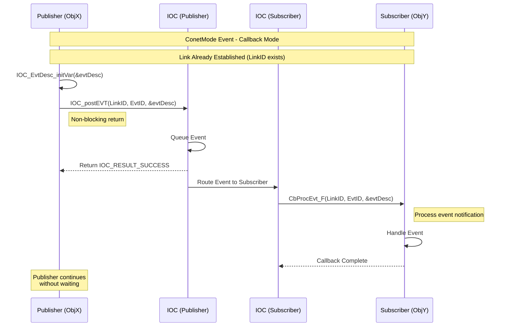
```mermaid
sequenceDiagram
    participant Pub as Publisher (ObjX)
    participant IOC_P as IOC (Publisher)
    participant IOC_S as IOC (Subscriber)
    participant Sub as Subscriber (ObjY)
    
    Note over Pub,Sub: ConetMode Event - Callback Mode
    
    Note over Pub,Sub: Link Already Established (LinkID exists)
    
    Pub->>Pub: IOC_EvtDesc_initVar(&evtDesc)
    
    Pub->>IOC_P: IOC_postEVT(LinkID, EvtID, &evtDesc)
    Note right of Pub: Non-blocking return
    
    IOC_P->>IOC_P: Queue Event
    IOC_P-->>Pub: Return IOC_RESULT_SUCCESS
    
    IOC_P->>IOC_S: Route Event to Subscriber
    
    IOC_S->>Sub: CbProcEvt_F(LinkID, EvtID, &evtDesc)
    Note right of Sub: Process event notification
    
    Sub->>Sub: Handle Event
    Sub-->>IOC_S: Callback Complete
    
    Note over Pub: Publisher continues<br/>without waiting
```

### Pattern 2: ConetMode Polling Reception

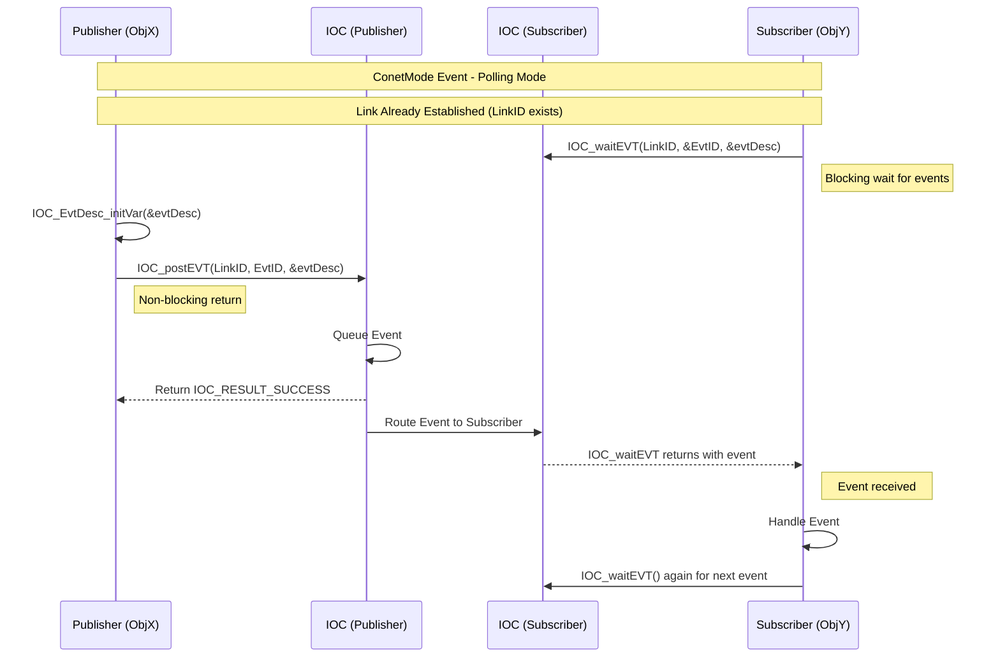
```mermaid
sequenceDiagram
    participant Pub as Publisher (ObjX)
    participant IOC_P as IOC (Publisher)
    participant IOC_S as IOC (Subscriber)
    participant Sub as Subscriber (ObjY)
    
    Note over Pub,Sub: ConetMode Event - Polling Mode
    
    Note over Pub,Sub: Link Already Established (LinkID exists)
    
    Sub->>IOC_S: IOC_waitEVT(LinkID, &EvtID, &evtDesc)
    Note right of Sub: Blocking wait for events
    
    Pub->>Pub: IOC_EvtDesc_initVar(&evtDesc)
    
    Pub->>IOC_P: IOC_postEVT(LinkID, EvtID, &evtDesc)
    Note right of Pub: Non-blocking return
    
    IOC_P->>IOC_P: Queue Event
    IOC_P-->>Pub: Return IOC_RESULT_SUCCESS
    
    IOC_P->>IOC_S: Route Event to Subscriber
    
    IOC_S-->>Sub: IOC_waitEVT returns with event
    Note right of Sub: Event received
    
    Sub->>Sub: Handle Event
    
    Sub->>IOC_S: IOC_waitEVT() again for next event
```

### Pattern 3: ConlesMode Subscription Callback

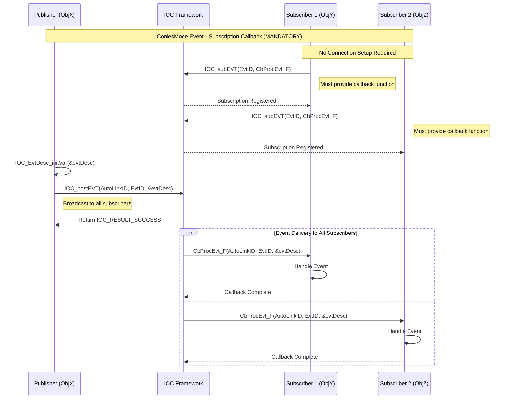
```mermaid
sequenceDiagram
    participant Pub as Publisher (ObjX)
    participant IOC as IOC Framework
    participant Sub1 as Subscriber 1 (ObjY)
    participant Sub2 as Subscriber 2 (ObjZ)
    
    Note over Pub,Sub2: ConlesMode Event - Subscription Callback (MANDATORY)
    
    Note over Sub1,Sub2: No Connection Setup Required
    
    Sub1->>IOC: IOC_subEVT(EvtID, CbProcEvt_F)
    Note right of Sub1: Must provide callback function
    IOC-->>Sub1: Subscription Registered
    
    Sub2->>IOC: IOC_subEVT(EvtID, CbProcEvt_F)
    Note right of Sub2: Must provide callback function
    IOC-->>Sub2: Subscription Registered
    
    Pub->>Pub: IOC_EvtDesc_initVar(&evtDesc)
    
    Pub->>IOC: IOC_postEVT(AutoLinkID, EvtID, &evtDesc)
    Note right of Pub: Broadcast to all subscribers
    IOC-->>Pub: Return IOC_RESULT_SUCCESS
    
    par Event Delivery to All Subscribers
        IOC->>Sub1: CbProcEvt_F(AutoLinkID, EvtID, &evtDesc)
        Sub1->>Sub1: Handle Event
        Sub1-->>IOC: Callback Complete
    and
        IOC->>Sub2: CbProcEvt_F(AutoLinkID, EvtID, &evtDesc)
        Sub2->>Sub2: Handle Event
        Sub2-->>IOC: Callback Complete
    end
```

### Pattern 4: ConlesMode Polling Reception

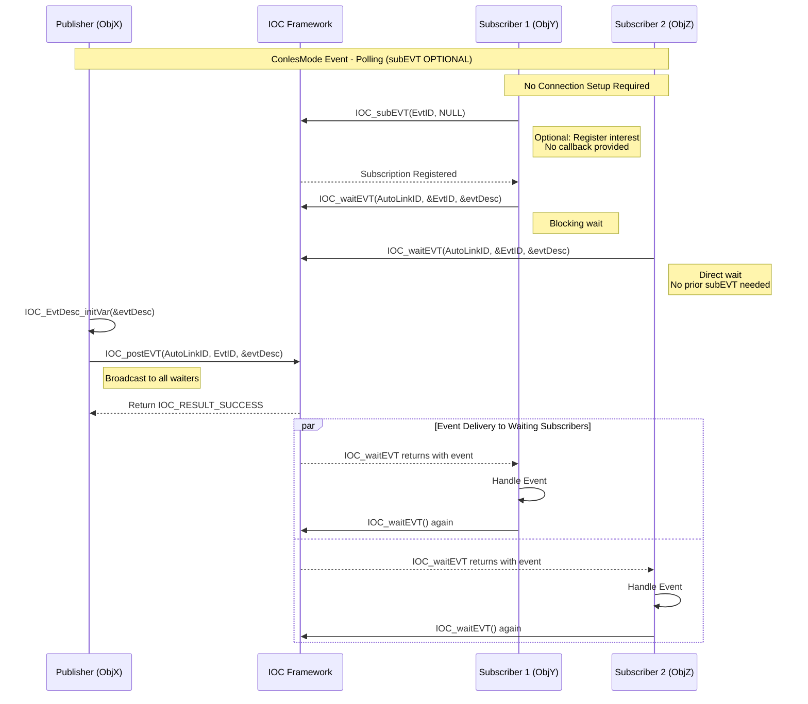
```mermaid
sequenceDiagram
    participant Pub as Publisher (ObjX)
    participant IOC as IOC Framework
    participant Sub1 as Subscriber 1 (ObjY)
    participant Sub2 as Subscriber 2 (ObjZ)
    
    Note over Pub,Sub2: ConlesMode Event - Polling (subEVT OPTIONAL)
    
    Note over Sub1,Sub2: No Connection Setup Required
    
    Sub1->>IOC: IOC_subEVT(EvtID, NULL)
    Note right of Sub1: Optional: Register interest<br/>No callback provided
    IOC-->>Sub1: Subscription Registered
    
    Sub1->>IOC: IOC_waitEVT(AutoLinkID, &EvtID, &evtDesc)
    Note right of Sub1: Blocking wait
    
    Sub2->>IOC: IOC_waitEVT(AutoLinkID, &EvtID, &evtDesc)
    Note right of Sub2: Direct wait<br/>No prior subEVT needed
    
    Pub->>Pub: IOC_EvtDesc_initVar(&evtDesc)
    
    Pub->>IOC: IOC_postEVT(AutoLinkID, EvtID, &evtDesc)
    Note right of Pub: Broadcast to all waiters
    IOC-->>Pub: Return IOC_RESULT_SUCCESS
    
    par Event Delivery to Waiting Subscribers
        IOC-->>Sub1: IOC_waitEVT returns with event
        Sub1->>Sub1: Handle Event
        Sub1->>IOC: IOC_waitEVT() again
    and
        IOC-->>Sub2: IOC_waitEVT returns with event
        Sub2->>Sub2: Handle Event
        Sub2->>IOC: IOC_waitEVT() again
    end
```

---

# Data State Machine

## Link-Level Data States (DAT::Conet)

Data streaming operates in **ConetMode** (connection-oriented) with **Sender-Receiver** pattern. Each link maintains independent **Sender** and **Receiver** sub-state machines for concurrent bidirectional streaming.

### Link Usage Types

- **IOC_LinkUsageDatSender**: Link configured to send data streams via `IOC_sendDAT()`
  - Corresponds to **Sender** role in state machine
  - Sends data chunks with flow control
  - States: DataSenderReady ↔ DataSenderBusySendDat

- **IOC_LinkUsageDatReceiver**: Link configured to receive data streams via callback or polling
  - Corresponds to **Receiver** role in state machine
  - Receives and processes data chunks
  - States: DataReceiverReady → DataReceiverBusyRecvDat (polling) or DataReceiverBusyCbRecvDat (callback)

**Note**: A single link can have both usage types enabled for full-duplex bidirectional streaming.

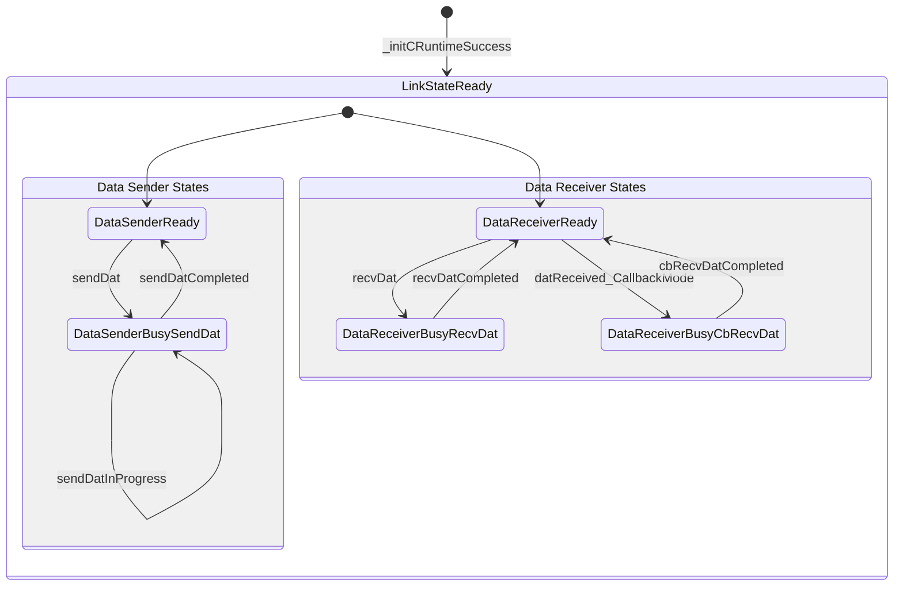
```mermaid
stateDiagram-v2
  [*] --> LinkStateReady: _initCRuntimeSuccess
  
  state LinkStateReady {
    [*] --> DataSenderReady
    [*] --> DataReceiverReady
    
    state "Data Sender States" as SenderStates {
      DataSenderReady --> DataSenderBusySendDat: sendDat
      DataSenderBusySendDat --> DataSenderReady: sendDatCompleted
      DataSenderBusySendDat --> DataSenderBusySendDat: sendDatInProgress
    }
    
    state "Data Receiver States" as ReceiverStates {
      DataReceiverReady --> DataReceiverBusyRecvDat: recvDat
      DataReceiverBusyRecvDat --> DataReceiverReady: recvDatCompleted
      
      DataReceiverReady --> DataReceiverBusyCbRecvDat: datReceived_CallbackMode
      DataReceiverBusyCbRecvDat --> DataReceiverReady: cbRecvDatCompleted
    }
  }
```

### Link Data State Descriptions

| State | Role | Description | Entry | Exit | Operations |
|-------|------|-------------|-------|------|------------|
| **DataSenderReady** | Sender | Ready to send data | Init or send complete | sendDAT called | IOC_sendDAT(), IOC_flushDAT() |
| **DataSenderBusySendDat** | Sender | Sending data chunk | sendDAT called | Data queued/sent | Buffer operation |
| **DataReceiverReady** | Receiver | Ready to receive data | Init or receive complete | recvDAT called or data arrives | IOC_recvDAT() |
| **DataReceiverBusyRecvDat** | Receiver | Receiving data (polling) | recvDAT called | Data received | Block until data |
| **DataReceiverBusyCbRecvDat** | Receiver | Processing data (callback) | CbRecvDat_F invoked | Callback returns | Handle data chunk |

### Design Principles

1. **Composite State Machine**: Hierarchical states with independent sub-state machines
2. **Concurrent Operations**: Allow simultaneous data sending and receiving
3. **Asynchronous Sending**: Data sending is non-blocking (default MAYBLOCK with flow control)
4. **Stream Semantics**: ALWAYS NODROP - maintains data integrity and order
5. **Dual Reception Modes**: Support both callback and polling reception patterns
6. **Role-Specific Configuration**: Different buffer sizes, flow control policies
7. **State Isolation**: Prevent state interference between sender and receiver roles

### Key Advantages

1. **Reliable Streaming**: NODROP guarantee ensures no data loss
2. **Flow Control**: Automatic backpressure prevents buffer overflow
3. **Clear Semantics**: Each role has well-defined state transitions
4. **Flexible Reception**: Support both push (callback) and pull (polling) patterns
5. **Bidirectional**: Full-duplex streaming on same link
6. **Easy Testing**: Independent state machines are easier to unit test
7. **Minimalist Design**: Auto-initialization, only flushDAT() needed for control

### DAT vs CMD vs EVT Key Differences

| Aspect | DAT | EVT | CMD |
|--------|-----|-----|-----|
| **Data Type** | STREAM (continuous) | DGRAM (discrete) | DGRAM (discrete) |
| **Synchronization** | ASYNC (always) | ASYNC (always) | SYNC (always) |
| **Response** | Flow control acknowledgment | Fire-and-forget | Request-response |
| **Reliability** | NODROP (always) | MAYDROP (default) | NODROP (default) |
| **Blocking** | MAYBLOCK (default) | NONBLOCK (default) | MAYBLOCK (default) |
| **Communication** | Point-to-Point | Point-to-Point + Broadcast | Point-to-Point |
| **Buffer Management** | Complex with flow control | Simple queuing | Minimal buffering |
| **Ordering** | Maintains order | No guarantee | Single request ordering |

## Data Streaming Sequence Diagrams

### Pattern 1: Callback Reception Mode

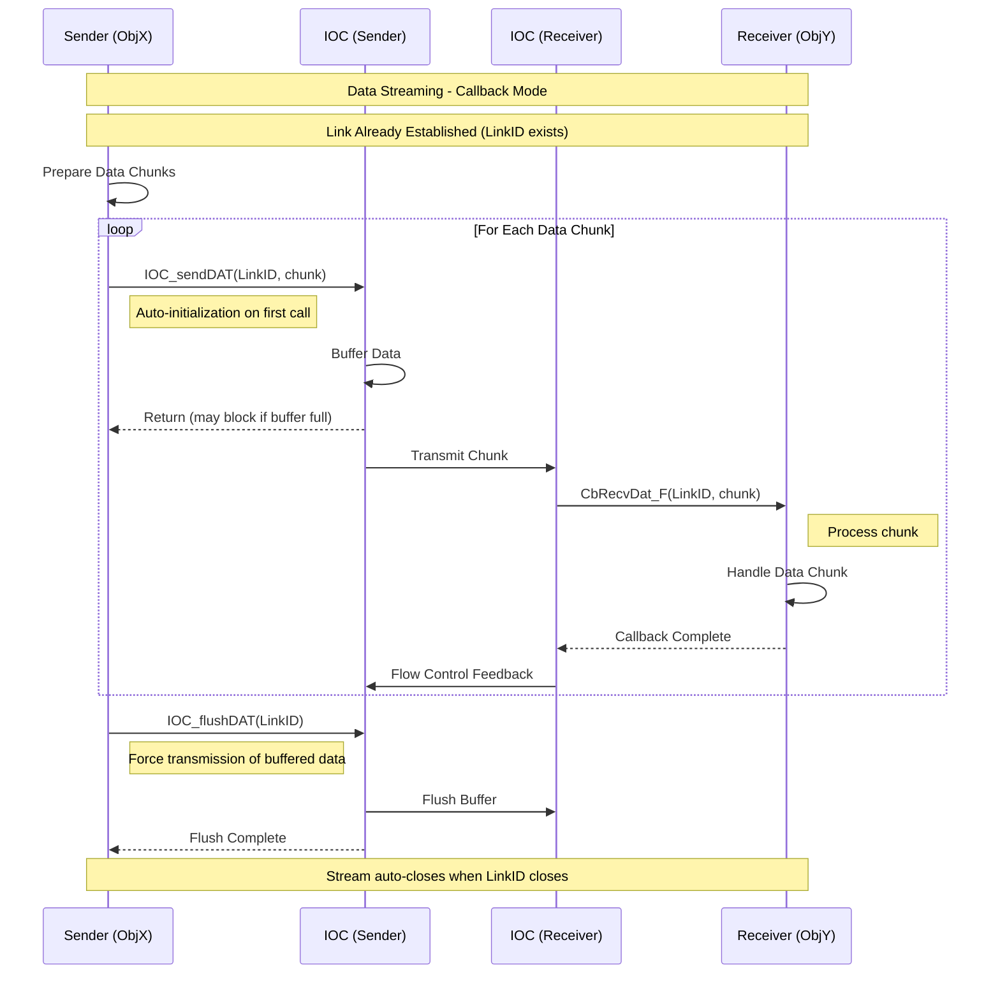
```mermaid
sequenceDiagram
    participant Send as Sender (ObjX)
    participant IOC_S as IOC (Sender)
    participant IOC_R as IOC (Receiver)
    participant Recv as Receiver (ObjY)
    
    Note over Send,Recv: Data Streaming - Callback Mode
    
    Note over Send,Recv: Link Already Established (LinkID exists)
    
    Send->>Send: Prepare Data Chunks
    
    loop For Each Data Chunk
        Send->>IOC_S: IOC_sendDAT(LinkID, chunk)
        Note right of Send: Auto-initialization on first call
        
        IOC_S->>IOC_S: Buffer Data
        IOC_S-->>Send: Return (may block if buffer full)
        
        IOC_S->>IOC_R: Transmit Chunk
        
        IOC_R->>Recv: CbRecvDat_F(LinkID, chunk)
        Note right of Recv: Process chunk
        
        Recv->>Recv: Handle Data Chunk
        Recv-->>IOC_R: Callback Complete
        
        IOC_R->>IOC_S: Flow Control Feedback
    end
    
    Send->>IOC_S: IOC_flushDAT(LinkID)
    Note right of Send: Force transmission of buffered data
    IOC_S->>IOC_R: Flush Buffer
    IOC_S-->>Send: Flush Complete
    
    Note over Send,Recv: Stream auto-closes when LinkID closes
```

### Pattern 2: Polling Reception Mode

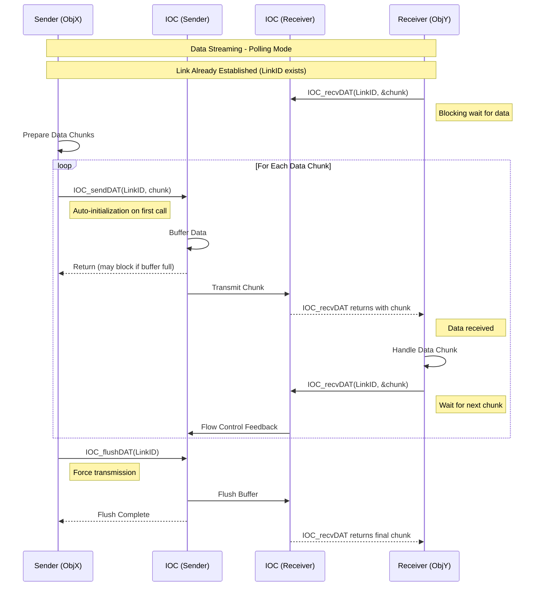
```mermaid
sequenceDiagram
    participant Send as Sender (ObjX)
    participant IOC_S as IOC (Sender)
    participant IOC_R as IOC (Receiver)
    participant Recv as Receiver (ObjY)
    
    Note over Send,Recv: Data Streaming - Polling Mode
    
    Note over Send,Recv: Link Already Established (LinkID exists)
    
    Recv->>IOC_R: IOC_recvDAT(LinkID, &chunk)
    Note right of Recv: Blocking wait for data
    
    Send->>Send: Prepare Data Chunks
    
    loop For Each Data Chunk
        Send->>IOC_S: IOC_sendDAT(LinkID, chunk)
        Note right of Send: Auto-initialization on first call
        
        IOC_S->>IOC_S: Buffer Data
        IOC_S-->>Send: Return (may block if buffer full)
        
        IOC_S->>IOC_R: Transmit Chunk
        
        IOC_R-->>Recv: IOC_recvDAT returns with chunk
        Note right of Recv: Data received
        
        Recv->>Recv: Handle Data Chunk
        
        Recv->>IOC_R: IOC_recvDAT(LinkID, &chunk)
        Note right of Recv: Wait for next chunk
        
        IOC_R->>IOC_S: Flow Control Feedback
    end
    
    Send->>IOC_S: IOC_flushDAT(LinkID)
    Note right of Send: Force transmission
    IOC_S->>IOC_R: Flush Buffer
    IOC_S-->>Send: Flush Complete
    
    IOC_R-->>Recv: IOC_recvDAT returns final chunk
```

### Pattern 3: Bidirectional Streaming

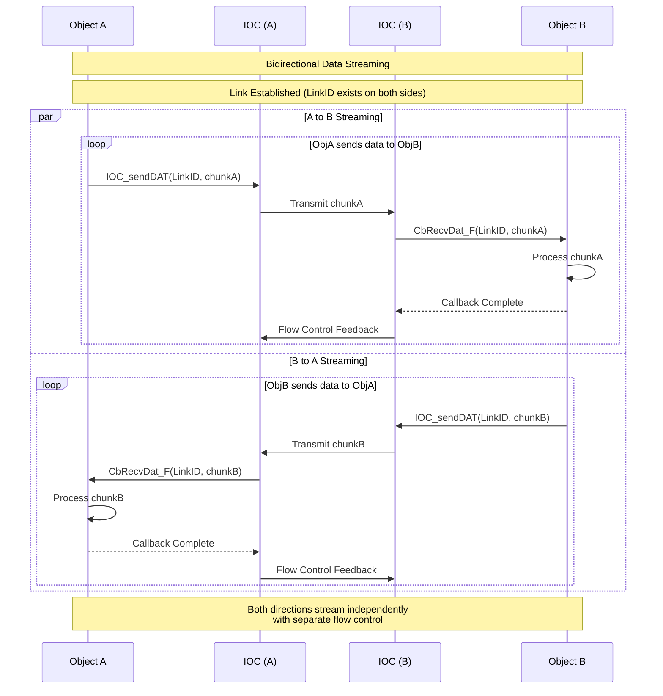
```mermaid
sequenceDiagram
    participant ObjA as Object A
    participant IOC_A as IOC (A)
    participant IOC_B as IOC (B)
    participant ObjB as Object B
    
    Note over ObjA,ObjB: Bidirectional Data Streaming
    
    Note over ObjA,ObjB: Link Established (LinkID exists on both sides)
    
    par A to B Streaming
        loop ObjA sends data to ObjB
            ObjA->>IOC_A: IOC_sendDAT(LinkID, chunkA)
            IOC_A->>IOC_B: Transmit chunkA
            IOC_B->>ObjB: CbRecvDat_F(LinkID, chunkA)
            ObjB->>ObjB: Process chunkA
            ObjB-->>IOC_B: Callback Complete
            IOC_B->>IOC_A: Flow Control Feedback
        end
    and B to A Streaming
        loop ObjB sends data to ObjA
            ObjB->>IOC_B: IOC_sendDAT(LinkID, chunkB)
            IOC_B->>IOC_A: Transmit chunkB
            IOC_A->>ObjA: CbRecvDat_F(LinkID, chunkB)
            ObjA->>ObjA: Process chunkB
            ObjA-->>IOC_A: Callback Complete
            IOC_A->>IOC_B: Flow Control Feedback
        end
    end
    
    Note over ObjA,ObjB: Both directions stream independently<br/>with separate flow control
```

### Pattern 4: Flow Control and Backpressure

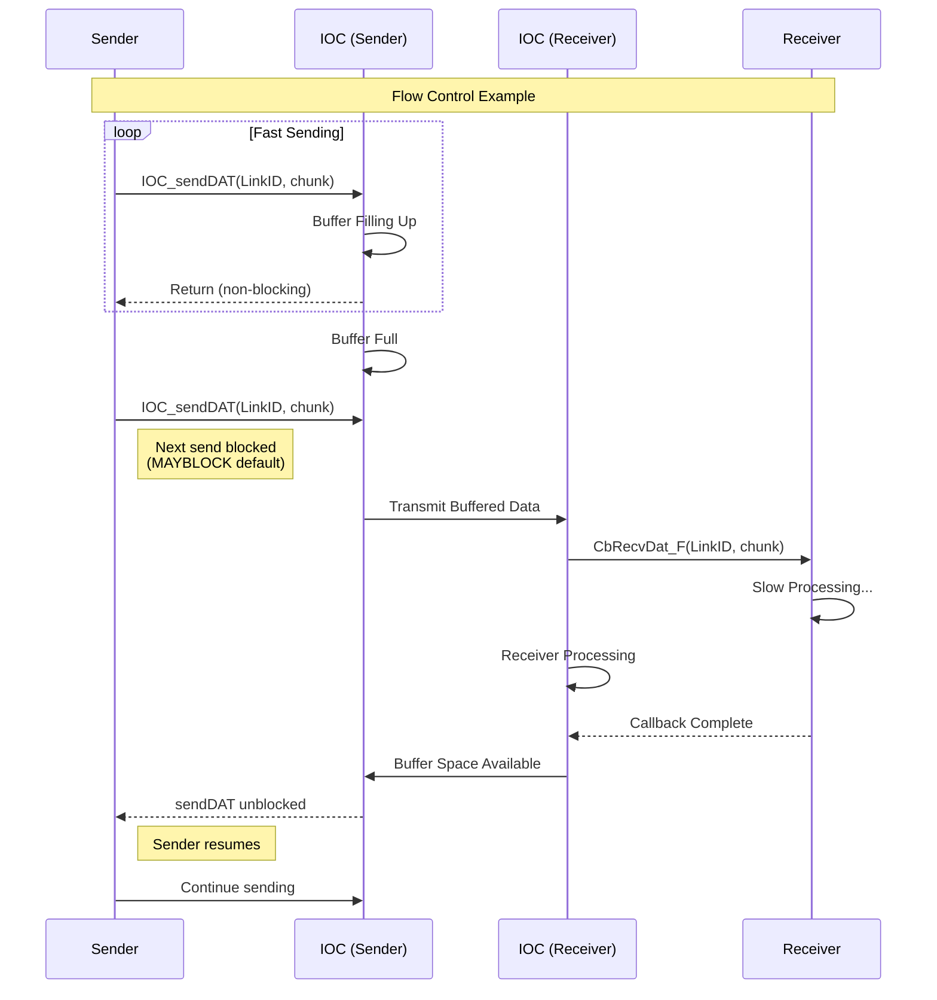
```mermaid
sequenceDiagram
    participant Send as Sender
    participant IOC_S as IOC (Sender)
    participant IOC_R as IOC (Receiver)
    participant Recv as Receiver
    
    Note over Send,Recv: Flow Control Example
    
    loop Fast Sending
        Send->>IOC_S: IOC_sendDAT(LinkID, chunk)
        IOC_S->>IOC_S: Buffer Filling Up
        IOC_S-->>Send: Return (non-blocking)
    end
    
    IOC_S->>IOC_S: Buffer Full
    
    Send->>IOC_S: IOC_sendDAT(LinkID, chunk)
    Note right of Send: Next send blocked<br/>(MAYBLOCK default)
    
    IOC_S->>IOC_R: Transmit Buffered Data
    IOC_R->>Recv: CbRecvDat_F(LinkID, chunk)
    Recv->>Recv: Slow Processing...
    
    IOC_R->>IOC_R: Receiver Processing
    
    Recv-->>IOC_R: Callback Complete
    IOC_R->>IOC_S: Buffer Space Available
    
    IOC_S-->>Send: sendDAT unblocked
    Note right of Send: Sender resumes
    
    Send->>IOC_S: Continue sending
```

---

# State Machine Integration Summary

## Component State Hierarchy

```
IOC Framework
├── Service States (Online/Offline lifecycle)
│   └── Manages multiple Links
│
├── Link States (Connection lifecycle)
│   ├── Conet Links (Connection-oriented)
│   │   ├── Command Sub-States (Initiator + Executor)
│   │   ├── Event Sub-States (Publisher + Subscriber)
│   │   └── Data Sub-States (Sender + Receiver)
│   │
│   └── Conles Links (Connectionless - EVT only)
│       └── Event Sub-States (Subscription management)
│
└── Individual Message States
    ├── Individual Command States (INITIALIZED → SUCCESS/FAILED/TIMEOUT)
    └── Individual Event States (Queued → Delivered/Dropped)
```

## State Machine Principles

1. **Hierarchical Organization**: Clear parent-child relationships between state machines
2. **Independent Lifecycles**: Each level maintains state independently
3. **Concurrent Operations**: Multiple state machines operate simultaneously
4. **Clear Boundaries**: Well-defined state ownership and transition rules
5. **Error Isolation**: Failures in one state machine don't cascade to others
6. **Testability**: Each state machine can be tested in isolation
7. **Extensibility**: New states/transitions can be added without breaking existing ones

## Link Usage Configuration

### IOC_LinkUsage_T Enumeration

```c
typedef enum {
    IOC_LinkUsageEvtProducer  = 0x01,  // Link can post events
    IOC_LinkUsageEvtConsumer  = 0x02,  // Link can receive events
    IOC_LinkUsageCmdInitiator = 0x04,  // Link can initiate commands
    IOC_LinkUsageCmdExecutor  = 0x08,  // Link can execute commands
    IOC_LinkUsageDatSender    = 0x10,  // Link can send data streams
    IOC_LinkUsageDatReceiver  = 0x20,  // Link can receive data streams
} IOC_LinkUsage_T;
```

### Link Usage Configuration Examples

| Scenario | Link Usage Configuration | State Machines Enabled |
|----------|-------------------------|------------------------|
| **Command Client** | `IOC_LinkUsageCmdInitiator` | InitiatorReady ↔ InitiatorBusyExecCmd |
| **Command Server** | `IOC_LinkUsageCmdExecutor` | ExecutorReady → ExecutorBusyCbExecCmd/WaitCmd/AckCmd |
| **Bidirectional CMD** | `IOC_LinkUsageCmdInitiator \| IOC_LinkUsageCmdExecutor` | Both Initiator and Executor sub-states |
| **Event Publisher** | `IOC_LinkUsageEvtProducer` | EventPublisherReady ↔ EventPublisherBusyPostEvt |
| **Event Subscriber** | `IOC_LinkUsageEvtConsumer` | EventSubscriberReady → EventSubscriberBusy* |
| **Event Pub-Sub** | `IOC_LinkUsageEvtProducer \| IOC_LinkUsageEvtConsumer` | Both Publisher and Subscriber sub-states |
| **Data Streaming Client** | `IOC_LinkUsageDatSender` | DataSenderReady ↔ DataSenderBusySendDat |
| **Data Streaming Server** | `IOC_LinkUsageDatReceiver` | DataReceiverReady → DataReceiverBusy* |
| **Full-Duplex Data** | `IOC_LinkUsageDatSender \| IOC_LinkUsageDatReceiver` | Both Sender and Receiver sub-states |
| **Full Capabilities** | All flags combined | All sub-state machines enabled |

### Usage Configuration APIs

```c
// Service side: Specify supported usage capabilities and behavior flags
IOC_Result_T IOC_onlineService(
    IOC_SrvID_T* pSrvID,
    IOC_SrvArgs_T* pSrvArgs  // Contains: SrvURI, Flags, UsageCapabilities, UsageArgs, OnAutoAccepted_F
);

// Service side: Complete configuration structure
typedef struct {
    IOC_SrvURI_T SrvURI;                      // Service URI (protocol://host:port/path)
    IOC_SrvFlags_T Flags;                     // Behavior flags (AUTO_ACCEPT, KEEP_ACCEPTED_LINK, BROADCAST_EVENT)
    IOC_LinkUsage_T UsageCapabilities;        // Bitwise OR of supported usages
    struct {
        IOC_EvtUsageArgs_pT pEvt;             // Event usage arguments
        IOC_CmdUsageArgs_pT pCmd;             // Command usage arguments
        IOC_DatUsageArgs_pT pDat;             // Data usage arguments
    } UsageArgs;
    IOC_CbOnAutoAccepted_F OnAutoAccepted_F;  // Optional callback for auto-accepted links
    void* pSrvPriv;                           // Service private context
} IOC_SrvArgs_T;

// Client side: Specify required usage
IOC_Result_T IOC_connectService(
    IOC_LinkID_T* pLinkID,
    IOC_ConnArgs_T* pConnArgs  // Contains: SrvURI, Usage, UsageArgs
);

// Client side: Complete configuration structure
typedef struct {
    IOC_SrvURI_T SrvURI;           // Service URI to connect to
    IOC_LinkUsage_T Usage;         // Bitwise OR of required usages
    union {
        IOC_EvtUsageArgs_pT pEvt;  // Event usage arguments
        IOC_CmdUsageArgs_pT pCmd;  // Command usage arguments
        IOC_DatUsageArgs_pT pDat;  // Data usage arguments
    } UsageArgs;
} IOC_ConnArgs_T;

// Query link usage configuration
IOC_Result_T IOC_getLinkUsage(
    IOC_LinkID_T LinkID,
    IOC_LinkUsage_T* pUsage
);

// Query accepted links (useful with AUTO_ACCEPT)
IOC_Result_T IOC_getServiceLinkIDs(
    IOC_SrvID_T SrvID,
    IOC_LinkID_T* pLinkIDs,
    size_t* pLinkCount
);
```

## State Query APIs

| Component | Query API | Returns |
|-----------|-----------|---------|
| Service | `IOC_getServiceState(SrvID)` | ServiceOffline/Online/Offlining |
| Link | `IOC_getLinkState(LinkID)` | LinkDisconnected/Ready/Busy/Broken |
| Command | `IOC_CmdDesc_getStatus()` | INITIALIZED/PENDING/PROCESSING/SUCCESS/FAILED/TIMEOUT |
| Event | `IOC_EvtDesc_getStatus()` | Queued/Delivered/Dropped |

## Testing Strategy

### Unit Testing per Component

1. **Service State Tests**: Test service lifecycle transitions
2. **Link State Tests**: Test connection establishment and breakdown
3. **Command State Tests**: Test individual command state machine (US-1 ACs)
4. **Event State Tests**: Test event delivery patterns
5. **Data State Tests**: Test streaming and flow control

### Integration Testing

1. **Service-Link Integration**: Test service accepting multiple clients
2. **Link-Command Integration**: Test concurrent commands on same link
3. **Link-Event Integration**: Test event broadcast/multicast patterns
4. **Link-Data Integration**: Test bidirectional streaming
5. **Multi-Protocol Integration**: Test TCP/UDP/FIFO protocol state consistency

### State Invariant Verification

1. **Terminal State Immutability**: SUCCESS/FAILED/TIMEOUT states never change
2. **State Transition Atomicity**: State changes are atomic and thread-safe
3. **State Consistency**: Link states correlate with individual message states
4. **Timeout Enforcement**: Timeouts properly detected and state updated
5. **Error Context Preservation**: Failed states preserve diagnostic information

---

# References

- **Architecture Design**: [README_ArchDesign.md](./README_ArchDesign.md)
- **User Guide**: [README_UserGuide.md](./README_UserGuide.md)
- **Specification**: [README_Specification.md](./README_Specification.md)
- **Glossary**: [README_Glossary.md](./README_Glossary.md)
- **Use Cases**: [README_UseCase.md](./README_UseCase.md)

---

# Revision History

| Version | Date | Author | Description |
|---------|------|--------|-------------|
| 1.0 | 2025-01-30 | IOC Team | Initial state machine documentation extracted from README_ArchDesign.md |
| 1.0 | 2025-01-30 | IOC Team | Added comprehensive sequence diagrams for all patterns |
| 1.0 | 2025-01-30 | IOC Team | Added state correlation analysis and testing strategy |
