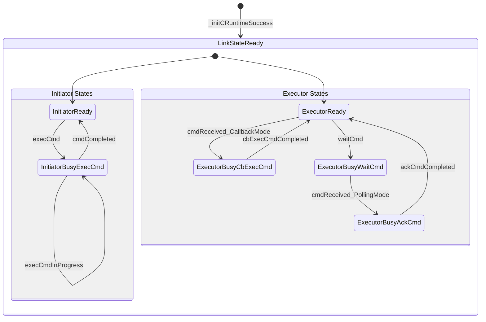
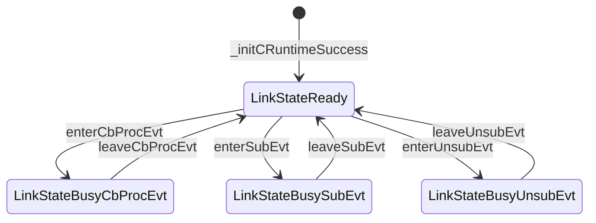

[TOC]

# About

* This is IOC's Architecture Design, which including definations of:
  * Glossary + Concept + Object + Operation + State

# Glossary
* RefDoc: [Glossary](./README_Glossary.md)

# Key Concept


## ModMgr vs ModUsr（EvtProducer or EvtConsumer）

* Module Manager(a.k.a 【ModMgr】) who is a manager role such as platform manager, call IOC's MGR_APIs with arguments by product requirements to initModule, or deinitModule before module exit.
* Module User(a.k.a 【ModUsr】) who is EvtProducer or EvtConsumer call IOC's USR_APIs.
  * Event Producer(a.k.a 【EvtProducer】) who generate/trigge events.
    * EvtProducer will post event to IOC by IOC_postEVT API.
  * Event Consumer(a.k.a 【EvtConsumer】) who process events.
    * EvtConsumer will subscribe or unsubscribe event to IOC by IOC_subEVT or IOC_unsubEVT API.

## Conet vs Conles

* Communicate has Connect or Connectless Mode(a.k.a 【ConetMode】、【ConlesMode】).
* @ConetMode@:
  * [1] ObjX MUST call IOC_onlineService to online a service with $SrvArgs and identfied as $SrvID.
  * [2] ObjY MUST call IOC_connectService to that service, and both ObjX/Y will get a $LinkID,
  * [3.1] ObjY call IOC_execCMD with $LinkID to ask ObjX execute commands and get result, or ObjX call IOC_execCMD.
    * Command execution is typically request-response pattern: Initiator -> Executor -> Response
    * CmdInitiator calls IOC_execCMD(LinkID, CmdID, CmdDesc) to send command
    * CmdExecutor has two ways to handle commands:
      * **Callback Mode**: CmdExecutor's CbExecCmd_F(LinkID, CmdID, CmdDesc) is invoked to process command
      * **Polling Mode**: CmdExecutor calls IOC_waitCMD(LinkID, CmdID, CmdDesc) to actively wait for commands
    * CmdExecutor sets result in CmdDesc and may call IOC_ackCMD(LinkID, CmdID, CmdDesc) to send response
    * CmdInitiator gets the result synchronously through IOC_execCMD return or separate response handling
  * [3.2] ObjX call IOC_postEVT with $LinkID to notify ObjY something happened, or ObjY call IOC_postEVT.
  * [3.3] ObjX call IOC_sendDAT with $LinkID to send data to ObjY, or ObjY call IOC_sendDAT.
* @ConlesMode@: ObjX call IOC_postEVT with pre-defined $AutoLinkID to notify all ObjYZs, who call IOC_waitEVT or IOC_subEVT, without IOC_onlineService and IOC_connectService.
  * NOTE: CMD is NOT supported in ConlesMode because:
    * CMD requires bidirectional communication for request-response pattern
    * ConlesMode is designed for unidirectional broadcast/multicast events
    * No specific target identification mechanism in ConlesMode for command routing

* In ConetMode service has dynamic or static online mode:
  * [D] Dynamic: ObjX call PLT_IOC_onlineService in its context to online a service and identfied as $SrvID,
  * [S] Static: ObjX use PLT_IOC_defineService in its source to define and identfied by $SrvArgs::SrvURL.

### SrvURI
* Service URI(a.k.a 【SrvURI】) is a unique StrID to identify a service in IOC's ConetMode.
  * Server side will use SrvURI to online a service by IOC_onlineService.
  * Client side will use SrvURI to connect to a service by IOC_connectService.
  * SrvURI is following RFC's URI format, plus some IOC's specific extensions, such as:
    * auto://localprocess/SrvNameX
    * udp://localhost:12345/SrvNameY
    * tcp://192.168.0.234:54321/SrvNameZ

### SrvID vs LinkID
* Service ID(a.k.a 【SrvID】) is a unique ID to identify a onlined service in IOC.
  * ONLY service owner who onlined the service will get and has this SrvID.
* Link ID(a.k.a 【LinkID】) is a unique ID to identify a connected link between ObjX and ObjY in IOC.
  * BOTH ObjX and ObjY will get a pair of LinkID, such as ObjY connect to ObjX who already call IOC_onlineService, then ObjY's LinkID is get from IOC_connectService, while ObjX's LinkID is get from IOC_acceptClient by SrvID.
  * This means LinkID is a pair of ID, one is ObjX's LinkID, another is ObjY's LinkID, which is a pair of ID to identify a established connection between ObjX and ObjY in IOC.
  * Each pair of LinkID will have one Usage, which is CMD or EVT or DAT, and one Direction, which is from ObjX to ObjY or from ObjY to ObjX. Such as:
    * ObjX's LinkID is used to postEVT to ObjY, while ObjY's LinkID is used to CbProcEvt_F in IOC's context, 
      * OR ObjY's LinkID is used to postEVT to ObjX, while ObjX's LinkID is used to CbProcEvt_F in IOC's context.
    * ObjX's LinkID is used to execCMD to ObjY, while ObjY's LinkID is used to CbExecCmd_F in IOC's context, 
      * OR ObjY's LinkID is used to waitCMD/ackCMD in ObjY's context for polling mode,
      * OR ObjY's LinkID is used to execCMD to ObjX, while ObjX's LinkID is used to CbExecCmd_F in IOC's context.
    * ObjX's LinkID is used to sendDAT to ObjY, while ObjY's LinkID is used to CbRecvDat_F in IOC's context, 
      * OR ObjY's LinkID is used to sendDAT to ObjX, while ObjX's LinkID is used to CbRecvDat_F in IOC's context.

## MSG（CMD or EVT or DAT）

* Message(a.k.a 【MSG】) is a Command(a.k.a 【CMD】) or an Event(a.k.a 【EVT】) or a piece of Data(a.k.a 【DAT】).
  * CMD is always SYNC and DGRAM defined by IOC identified by CmdID;
  * EVT is always ASYNC and DGRAM defined by IOC identified by EvtID;
  * DAT is ASYNC/SYNC and STREAM defined by IOC knowns only by object pair;

### EVT

* 【EVT】 is always ASYNC and DGRAM defined by IOC identified by EvtID, and each event is described by EvtDesc;
  * Its default property is 【ASYNC+NONBLOCK+MAYDROP】, and may be changed by setLinkParams or IOC_Options_T.
  * ->[ASYNC]: means ObjX in its current context postEVT to LinkID,
      then ObjY's CbProcEvt_F will be callbacked in IOC's context, not in ObjX's context.
      Here IOC's context is designed&implemented by IOC, may be a standalone thread or a thread pool.
      EVT is ALWAYS ASYNC and CANNOT be changed to SYNC because events are fire-and-forget notifications designed for asynchronous processing.
      This ensures non-blocking event posting and prevents caller from being blocked by event processing time.
  * ->[NONBLOCK]: means ObjX's postEVT may not be blocked if not enough resource to postEVT,
      such as no free space to queuing the EvtDesc.
      This includes immediate return (true NONBLOCK) and timeout-based return (NONBLOCK with timeout).
      USE setLinkParams to change Link's each postEvt to MAYBLOCK,
      USE IOC_Options_T to change Link's current postEvt to MAYBLOCK,
          by set enable timeout checking and with timeout value 'ULONG_MAX',
          which means ObjX's postEVT will block until has resource to postEVT.
      NOTE: TIMEOUT is a special condition of NONBLOCK - operation returns after specified time limit.
  * ->[MAYDROP]: means after ObjX's postEVT success, if IOC's internal MAY drop this EVT,
      such as IOC's internal subsystem or submodule is busy or not enough resource to process this EVT.
      Here assume IOC is a complex system, such as ObjX vs ObjY is inter-process or inter-machine communication.
      USE setLinkParams to change Link's each postEvt to NODROP,
      USE IOC_Options_T to change Link's current postEvt to NODROP,
          which means ObjX's postEVT success, IOC will try best effect to make the EVT to be processed by ObjY, including save to local persistent storage before transfer the EVT to remote machine's ObjY.

#### EVT Lifecycle
* Event processing follows these phases:
  1. **Initiation**: ObjX calls IOC_postEVT(LinkID, EvtID, EvtDesc) to post event
  2. **Validation**: IOC validates EvtID, LinkID, and EvtDesc format
  3. **Routing**: IOC routes event to target ObjY or all subscribers based on LinkID/AutoLinkID
  4. **Queuing**: IOC queues event for processing (may drop if MAYDROP and resources constrained)
  5. **Reception**: ObjY receives event through one of five modes:
     * **ConetMode Callback**: ObjY's CbProcEvt_F(LinkID, EvtID, EvtDesc) is automatically invoked
     * **ConetMode Polling**: ObjY calls IOC_waitEVT(LinkID, EvtID, EvtDesc) to actively wait for events
     * **ConlesMode <M> subEVT+CbProcEvt**: ObjY calls IOC_subEVT(EvtID, CbProcEvt_F) (MANDATORY for callback)
     * **ConlesMode <O> waitEVT**: ObjY calls IOC_waitEVT(AutoLinkID, EvtID, EvtDesc) directly (subEVT OPTIONAL)
     * **ConlesMode <O> subEVT+waitEVT**: ObjY calls IOC_subEVT(EvtID, NULL) then IOC_waitEVT() (subEVT optional)
  6. **Processing**: ObjY processes the event notification
  7. **Completion**: Event processing completes (no response required for fire-and-forget nature)
  
* **MAYDROP Behavior**: In phases 1-7, events may be dropped during phases 3-4 if resources are constrained and MAYDROP is configured. Unlike CMD's NODROP guarantee, EVT accepts potential message loss for better performance.

#### EVT Reception Patterns
* **Pattern 1 - ConetMode (Point-to-Point)**:
  ```
  // Requires established LinkID from IOC_connectService
  // Supports both callback and polling reception modes
  
  // Callback Mode:
  ObjX: IOC_postEVT(LinkID, EvtID, EvtDesc) 
    -> IOC routes to ObjY
    -> ObjY: CbProcEvt_F(LinkID, EvtID, EvtDesc) invoked
    -> ObjY: process event notification
    -> Completion (no response required)
  
  // Polling Mode:
  ObjY: IOC_waitEVT(LinkID, EvtID, EvtDesc) // blocking wait for event
  ObjX: IOC_postEVT(LinkID, EvtID, EvtDesc) // post event
    -> IOC routes to ObjY
    -> ObjY: IOC_waitEVT returns with event
    -> ObjY: process event notification
    -> Completion (no response required)
  ```

* **Pattern 2 - ConlesMode (Broadcast/Multicast)**:
  ```
  // No connection establishment required, uses AutoLinkID
  // Supports subscription-based reception with callback or polling
  
  // Subscription Callback Mode (subEVT MANDATORY):
  ObjY: IOC_subEVT(EvtID, CbProcEvt_F) // must subscribe with callback function
  ObjX: IOC_postEVT(AutoLinkID, EvtID, EvtDesc) // broadcast event
    -> IOC routes to all subscribers
    -> ObjY: CbProcEvt_F(AutoLinkID, EvtID, EvtDesc) invoked automatically
    -> ObjY: process event notification
    -> Completion (no response required)
  
  // Subscription Polling Mode (subEVT OPTIONAL):
  ObjY: IOC_subEVT(EvtID, NULL) // optional subscription without callback
  ObjY: IOC_waitEVT(AutoLinkID, EvtID, EvtDesc) // wait for events
  ObjX: IOC_postEVT(AutoLinkID, EvtID, EvtDesc) // broadcast event
    -> IOC routes to subscribers or waiting objects
    -> ObjY: IOC_waitEVT returns with event
    -> ObjY: process event notification
    -> Completion (no response required)
  ```

#### EVT Communication Modes
* **ConetMode (Point-to-Point)**:
  * Requires IOC_onlineService and IOC_connectService to establish LinkID
  * Direct event delivery between specific ObjX and ObjY
  * Supports two reception mechanisms:
    * **Callback**: Direct CbProcEvt_F invocation upon event arrival
    * **Polling**: IOC_waitEVT for active event retrieval
  * Better reliability and flow control for targeted communication
  
* **ConlesMode (Broadcast/Multicast)**:
  * Uses pre-defined AutoLinkID for broadcast delivery
  * No connection establishment required
  * Supports subscription-based reception with two mechanisms:
    * **Subscription Callback**: IOC_subEVT(EvtID, CbProcEvt_F) - MANDATORY for callback mode
    * **Subscription Polling**: IOC_subEVT(EvtID, NULL) + IOC_waitEVT() - subEVT OPTIONAL for polling mode
  * Higher scalability for one-to-many communication, lower reliability guarantees

#### EVT Error Handling
* Event processing may encounter these conditions:
  * **IOC_RESULT_INVALID_PARAM**: Invalid EvtID, LinkID, or EvtDesc
  * **IOC_RESULT_NOT_EXIST_LINK**: LinkID does not exist or already closed
  * **IOC_RESULT_BUSY**: IOC event queue is full (when immediate NONBLOCK mode)
  * **IOC_RESULT_TIMEOUT**: Event posting timeout (when NONBLOCK mode with timeout configured)
  * **IOC_RESULT_EVT_DROPPED**: Event dropped due to resource constraints (MAYDROP mode)
  * **IOC_RESULT_NO_SUBSCRIBER**: No subscriber for this EvtID (ConlesMode)
  * **IOC_RESULT_WAIT_EVT_TIMEOUT**: IOC_waitEVT timeout (when configured with timeout)
  * **IOC_RESULT_LINK_BROKEN**: Communication link is broken during event delivery

#### Blocking Behavior Clarification
* **NONBLOCK (EVT default)**: Non-blocking behavior with two sub-modes:
  * **Immediate NONBLOCK**: Returns immediately with IOC_RESULT_BUSY if resource unavailable
  * **Timeout NONBLOCK**: Returns with IOC_RESULT_TIMEOUT after specified time limit
* **MAYBLOCK**: Infinite blocking until operation completes or fails

#### Reliability Behavior Clarification  
* **MAYDROP (EVT default)**: Allows event dropping under resource constraints for better performance
  * Acceptable behavior for notifications where occasional loss is tolerable
  * Examples: status updates, progress notifications, non-critical alerts
* **NODROP**: Guarantees event delivery with best effort including persistent storage
  * For critical events that must not be lost
  * Examples: error notifications, state change events, critical alarms

#### Synchronization Behavior Clarification
* **ASYNC (EVT always)**: Event processing in IOC's context (separate thread/thread pool)
  * Better isolation and concurrency
  * ObjX continues execution immediately after IOC_postEVT
  * ObjY's CbProcEvt_F executes in IOC's managed context
  * EVT is designed for asynchronous notifications and cannot be changed to SYNC

#### EVT vs CMD Key Differences
* **Purpose**: EVT for notifications, CMD for request-response
* **Response**: EVT fire-and-forget, CMD always expects result  
* **Reliability**: EVT may drop (MAYDROP default), CMD never drops (NODROP default)
* **Performance**: EVT optimized for throughput, CMD optimized for reliability
* **Scalability**: EVT supports broadcast/multicast, CMD only point-to-point
* **Blocking**: EVT non-blocking default, CMD blocking default

### CMD

* 【CMD】 is SYNC and DGRAM defined by IOC identified by CmdID, and each command is described by CmdDesc;
  * Its default property is 【SYNC+MAYBLOCK+NODROP】, and may be changed by setLinkParams or IOC_Options_T.
  * ->[SYNC]: means ObjX in its current context execCMD to LinkID,
      then ObjY's CbExecCmd_F will be callbacked and ObjX will wait for the response synchronously.
      This is the ONLY mode for CMD execution - commands are always synchronous request-response operations.
      CMD CANNOT be changed to ASYNC because it fundamentally requires a return value from the executor.
  * ->[MAYBLOCK]: means ObjX's execCMD may be blocked if not enough resource to execCMD,
      such as ObjY is busy processing other commands or network congestion in remote case.
      This is infinite blocking until resource becomes available.
      USE setLinkParams to change Link's each execCmd to NONBLOCK,
      USE IOC_Options_T to change Link's current execCmd to NONBLOCK,
          which means ObjX's execCMD will return immediately with IOC_RESULT_BUSY if resource not available,
          or return with IOC_RESULT_TIMEOUT if timeout is configured and time limit is reached.
      NOTE: TIMEOUT is a special condition of NONBLOCK - operation returns after specified time limit.
  * ->[NODROP]: means after ObjX's execCMD success, IOC will guarantee this CMD to be processed by ObjY,
      and ObjX will ALWAYS get CMD's final result - either the processed result or the reason why it can't be processed.
      CMD will NEVER be pending in IOC indefinitely. This includes:
      * Success case: ObjY processes CMD and returns result to ObjX
      * Failure case: IOC returns failure reason (busy, timeout, link broken, etc.) to ObjX
      * Error case: IOC detects error and returns error code to ObjX
      IOC uses retry mechanism, persistent storage for inter-process/inter-machine communication to ensure delivery.
      USE setLinkParams to change Link's each execCmd to MAYDROP,
      USE IOC_Options_T to change Link's current execCmd to MAYDROP,
          which means IOC may drop the CMD if system is overloaded or resource constrained,
          and ObjX may not get any response (fire-and-forget behavior, which breaks CMD's request-response semantics).

#### CMD Lifecycle
* Command execution follows these phases:
  1. **Initiation**: ObjX calls IOC_execCMD(LinkID, CmdID, CmdDesc) to initiate command
  2. **Validation**: IOC validates CmdID, LinkID, and CmdDesc format
  3. **Routing**: IOC routes command to target ObjY based on LinkID
  4. **Reception**: ObjY receives command through one of two modes:
     * **Callback Mode**: ObjY's CbExecCmd_F(LinkID, CmdID, CmdDesc) is automatically invoked
     * **Polling Mode**: ObjY calls IOC_waitCMD(LinkID, CmdID, CmdDesc) to actively receive command
  5. **Execution**: ObjY processes the command and prepares result
  6. **Response**: ObjY sends response through one of two modes:
     * **Direct Return**: Return result directly from CbExecCmd_F callback function
     * **Explicit Ack**: Call IOC_ackCMD(LinkID, CmdID, CmdDesc) to send response separately
  7. **Completion**: ObjX receives the command result synchronously
  
* **NODROP Guarantee**: In phases 1-7, if any failure occurs, ObjX will receive a specific error code rather than the command being lost. IOC ensures ObjX always gets either success result or failure reason.

#### CMD Execution Patterns
* **Pattern 1 - Callback Mode (Automatic)**:
  ```
  ObjX: IOC_execCMD(LinkID, CmdID, CmdDesc) 
    -> IOC routes to ObjY
    -> ObjY: CbExecCmd_F(LinkID, CmdID, CmdDesc) invoked
    -> ObjY: process and return result
    -> ObjX: gets result from IOC_execCMD return
  ```

* **Pattern 2 - Polling Mode (Manual)**:
  ```
  ObjY: IOC_waitCMD(LinkID, CmdID, CmdDesc) // blocking wait for command
  ObjX: IOC_execCMD(LinkID, CmdID, CmdDesc) // send command
    -> IOC routes to ObjY
    -> ObjY: IOC_waitCMD returns with command
    -> ObjY: process command
    -> ObjY: IOC_ackCMD(LinkID, CmdID, CmdDesc) // send response
    -> ObjX: gets result from IOC_execCMD return
  ```

#### CMD Error Handling
* Command execution may fail at different phases:
  * **IOC_RESULT_INVALID_PARAM**: Invalid CmdID, LinkID, or CmdDesc
  * **IOC_RESULT_NOT_EXIST_LINK**: LinkID does not exist or already closed
  * **IOC_RESULT_BUSY**: Target ObjY is busy (when immediate NONBLOCK mode)
  * **IOC_RESULT_TIMEOUT**: Command execution timeout (when NONBLOCK mode with timeout configured)
  * **IOC_RESULT_CMD_EXEC_FAILED**: ObjY's CbExecCmd_F returns failure
  * **IOC_RESULT_LINK_BROKEN**: Communication link is broken during execution
  * **IOC_RESULT_WAIT_CMD_TIMEOUT**: IOC_waitCMD timeout (when configured with timeout)
  * **IOC_RESULT_ACK_CMD_FAILED**: IOC_ackCMD failed to send response

#### Blocking Behavior Clarification
* **MAYBLOCK**: Infinite blocking until operation completes or fails
* **NONBLOCK**: Non-blocking behavior with two sub-modes:
  * **Immediate NONBLOCK**: Returns immediately with IOC_RESULT_BUSY if resource unavailable
  * **Timeout NONBLOCK**: Returns with IOC_RESULT_TIMEOUT after specified time limit

#### Reliability Behavior Clarification  
* **NODROP (CMD default)**: Guarantees response delivery - ObjX always gets final result or failure reason
  * Success: Command processed successfully, result returned
  * Failure: Command failed, specific error code returned (BUSY, TIMEOUT, EXEC_FAILED, etc.)
  * Never: Command lost in IOC without any response
* **MAYDROP**: Allows message dropping under resource constraints
  * For CMD: Breaks request-response contract, not recommended
  * For EVT: Acceptable behavior for notifications

#### CMD vs EVT Comparison
| Aspect          | CMD                                        | EVT                                                                                                                                      |
| --------------- | ------------------------------------------ | ---------------------------------------------------------------------------------------------------------------------------------------- |
| Synchronization | SYNC (always)                              | ASYNC (always)                                                                                                                           |
| Response        | Always expects result                      | Fire-and-forget                                                                                                                          |
| Blocking        | MAYBLOCK (default) / NONBLOCK (optional)   | NONBLOCK (default) / MAYBLOCK (optional)                                                                                                 |
| Timeout         | TIMEOUT is special case of NONBLOCK        | TIMEOUT is special case of NONBLOCK                                                                                                      |
| Reliability     | NODROP (default) - always get final result | MAYDROP (default) - may lose events                                                                                                      |
| Drop Behavior   | MAYDROP breaks request-response semantics  | MAYDROP is acceptable for notifications                                                                                                  |
| Communication   | Point-to-Point only                        | Point-to-Point + Broadcast/Multicast                                                                                                     |
| Connection      | ConetMode only                             | ConetMode + ConlesMode                                                                                                                   |
| Reception Mode  | Callback + Polling                         | ConetMode: Callback + Polling<br/>ConlesMode: <M>subEVT+CbProcEvt(mandatory) + <O>waitEVT(optional subEVT) + <O>subEVT+waitEVT(optional) |
| Use Case        | Request-Response operations                | Notifications and status updates                                                                                                         |
| Performance     | Higher latency, guaranteed delivery        | Lower latency, optimized throughput                                                                                                      |
| Scalability     | One-to-One communication                   | One-to-Many communication supported                                                                                                      |
| Context Switch  | May execute in caller's or IOC's context   | May execute in caller's or IOC's context                                                                                                 |
| Error Handling  | Comprehensive error reporting              | Best-effort delivery with basic errors                                                                                                   |
| Resource Usage  | Higher (persistent state for responses)    | Lower (stateless notifications)                                                                                                          |

### DAT
* 【DAT】 is ASYNC and STREAM defined by IOC knowns only by object pair, and each data is described by DatDesc;
  * Its default property is 【ASYNC+MAYBLOCK+NODROP】, and may be changed by setLinkParams or IOC_Options_T.
  


# Object

## TODO: Link

# Operation

# State

## CMD::Conet


* **State Descriptions**:
  * **LinkStateReady**: Main state containing both initiator and executor sub-states
    * **InitiatorReady**: Ready to send commands via IOC_execCMD
    * **ExecutorReady**: Ready to receive commands via callback or polling
    * **InitiatorBusyExecCmd**: Currently executing outbound command, waiting for response
    * **ExecutorBusyCbExecCmd**: Currently processing inbound command in callback mode
    * **ExecutorBusyWaitCmd**: Actively waiting for commands in polling mode
    * **ExecutorBusyAckCmd**: Sending response in polling mode

* **Design Implementation**:
  1. **Composite State Machine**: Use hierarchical states with independent sub-state machines
  2. **Concurrent Operations**: Allow simultaneous command execution in both directions
  3. **Role-Specific Configuration**: Different timeout, retry policies for each role
  4. **State Isolation**: Prevent state interference between initiator and executor roles
  5. **Error Handling**: Independent error recovery for each role

* **Key Advantages**:
  1. **No Deadlock Risk**: Initiator and executor states don't block each other
  2. **Better Throughput**: Can process commands bidirectionally without mutual exclusion
  3. **Clear Semantics**: Each role has well-defined state transitions
  4. **Easy Testing**: Independent state machines are easier to unit test
  5. **Future Extensibility**: Easy to add more complex command patterns

## EVT::Conet

* TODO

## EVT::Conles（AutoLink）



* LinkStateReady is means we may perform subEvt/unsubEvt/CbProcEvt behaviors.
  * LinkStateBusyCbProcEvt is means we are in CbProcEvt callback progress.
  * LinkStateBusySubEvt is means we are in subEvt progress.
  * LinkStateBusyUnsubEvt is means we are in unsubEvt progress.
* Attention:
  * 1) all LinkState is its main state, and its default substate is LinkSubStateDefault if not specified.
  * 2) we may postEvt in any main state, which means we may postEvt in LinkStateReady/BusyXXX.
