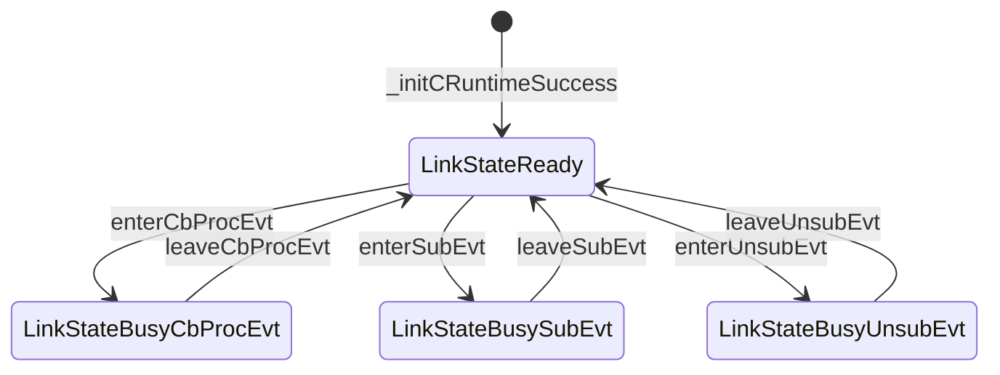

# About

* This is IOC's Architecture Design, which including definations of:
  * Glossary + Concept + Object + Operation + State

# Glossary
* RefDoc: [Glossary](./README_Glossary.md)

# Concept

## ModMgr vs ModUsr（EvtProducer or EvtConsumer）

* Module Manager(a.k.a 【ModMgr】) who is a manager role such as platform manager, call IOC's MGR_APIs with arguments by product requirements to initModule, or deinitModule before module exit.
* Module User(a.k.a 【ModUsr】) who is EvtProducer or EvtConsumer call IOC's USR_APIs.
  * Event Producer(a.k.a 【EvtProducer】) who generate/trigge events.
    * EvtProducer will post event to IOC by IOC_postEVT API.
  * Event Consumer(a.k.a 【EvtConsumer】) who process events.
    * EvtConsumer will subscribe or unsubscribe event to IOC by IOC_subEVT or IOC_unsubEVT API.

## Conet vs Conles

* Communicate has Connect or Connectless Mode(a.k.a 【ConetMode】、【ConlesMode】).
* @ConetMode@:
  * [1] ObjX MUST call IOC_onlineService to online a service with $SrvArgs and identfied as $SrvID.
  * [2] ObjY MUST call IOC_connectService to that service, and both ObjX/Y will get a $LinkID,
  * [3.1] ObjY call IOC_execCMD with $LinkID to ask ObjX execute commands and get result, or ObjX call IOC_execCMD.
  * [3.2] ObjX call IOC_postEVT with $LinkID to notify ObjY something happened, or ObjY call IOC_postEVT.
  * [3.3] ObjX call IOC_sendDAT with $LinkID to send data to ObjY, or ObjY call IOC_sendDAT.
* @ConlesMode@: ObjX call IOC_postEVT with pre-defined $AutoLinkID to notify all ObjYZs, who call IOC_waitEVT or IOC_subEVT, without IOC_onlineService and IOC_connectService.

* In ConetMode service has dynamic or static online mode:
  * [D] Dynamic: ObjX call PLT_IOC_onlineService in its context to online a service and identfied as $SrvID,
  * [S] Static: ObjX use PLT_IOC_defineService in its source to define and identfied by $SrvArgs::SrvURL.

### SrvURI
* Service URI(a.k.a 【SrvURI】) is a unique StrID to identify a service in IOC's ConetMode.
  * Server side will use SrvURI to online a service by IOC_onlineService.
  * Client side will use SrvURI to connect to a service by IOC_connectService.
  * SrvURI is following RFC's URI format, plus some IOC's specific extensions, such as:
    * auto://localprocess/SrvNameX
    * udp://localhost:12345/SrvNameY
    * tcp://192.168.0.234:54321/SrvNameZ

### SrvID vs LinkID
* Service ID(a.k.a 【SrvID】) is a unique ID to identify a onlined service in IOC.
  * ONLY service owner who onlined the service will get and has this SrvID.
* Link ID(a.k.a 【LinkID】) is a unique ID to identify a connected link between ObjX and ObjY in IOC.
  * BOTH ObjX and ObjY will get a pair of LinkID, such as ObjY connect to ObjX who already call IOC_onlineService, then ObjY's LinkID is get from IOC_connectService, while ObjX's LinkID is get from IOC_acceptClient by SrvID.
  * This means LinkID is a pair of ID, one is ObjX's LinkID, another is ObjY's LinkID, which is a pair of ID to identify a established connection between ObjX and ObjY in IOC.
  * Each pair of LinkID will have one Usage, which is CMD or EVT or DAT, and one Direction, which is from ObjX to ObjY or from ObjY to ObjX. Such as:
    * ObjX's LinkID is used to postEVT to ObjY, while ObjY's LinkID is used to CbProcEvt_F in IOC's context, 
      * OR ObjY's LinkID is used to postEVT to ObjX, while ObjX's LinkID is used to CbProcEvt_F in IOC's context.
    * ObjX's LinkID is used to execCMD to ObjY, while ObjY's LinkID is used to CbExecCmd_F in IOC's context, 
      * OR ObjY's LinkID is used to execCMD to ObjX, while ObjX's LinkID is used to CbExecCmd_F in IOC's context.
    * ObjX's LinkID is used to sendDAT to ObjY, while ObjY's LinkID is used to CbRecvDat_F in IOC's context, 
      * OR ObjY's LinkID is used to sendDAT to ObjX, while ObjX's LinkID is used to CbRecvDat_F in IOC's context.

## MSG（CMD or EVT or DAT）

* Message(a.k.a 【MSG】) is a Command(a.k.a 【CMD】) or an Event(a.k.a 【EVT】) or a piece of Data(a.k.a 【DAT】).
  * CMD is SYNC and DGRAM defined by IOC identified by CmdID;
  * EVT is ASYNC/SYNC and DGRAM defined by IOC identified by EvtID;
  * DAT is ASNYC/SYNC and STREAM defined by IOC knowns only by object pair;

### EVT

* 【EVT】 is ASYNC and DGRAM defined by IOC identified by EvtID, and each event is described by EvtDesc;
  * Its default property is 【ASYNC+NONBLOCK+MAYDROP】, and may be changed by setLinkParams or IOC_Options_T.
  * ->[ASYNC]：means ObjX in its current context postEVT to LinkID,
      then ObjY's CbProcEvt_F will be callbacked in IOC's context, not in ObjX's context.
      Here IOC's context is designed&implemented by IOC, may be a standalone thread or a thread pool.
      USE setLinkParams to change Link's each postEvt to SYNC,
      USE IOC_Options_T to change Link's current postEvt to SYNC,
          which means ObjY's CbProcEvt_F callbacked in ObjX's context.
  * ->[NONBLOCK]: means ObjX's postEVT may not be blocked if not enough resource to postEVT,
      such as no free space to queuing the EvtDesc.
      USE setLinkParams to change Link's each postEvt to MAYBLOCK,
      USE IOC_Options_T to change Link's current postEvt to MAYBLOCK,
          by set enable timeout checking and with timeout value 'ULONG_MAX',
          which means ObjX's postEVT will block until has resource to postEVT.
  * ->[MAYDROP]: means after ObjX's postEVT success, if IOC's internal MAY drop this EVT,
      such as IOC's internal subsystem or submodule is busy or not enough resource to process this EVT.
      Here assume IOC is a complex system, such as ObjX vs ObjY is inter-process or inter-machine communication.
      USE setLinkParams to change Link's each postEvt to NODROP,
      USE IOC_Options_T to change Link's current postEvt to NODROP,
          which means ObjX's postEVT success, IOC will try best effect to make the EVT to be processed by ObjY, including save to local persistent storage before transfer the EVT to remote machine's ObjY.

### CMD
* 【CMD】 is SYNC and DGRAM defined by IOC identified by CmdID, and each command is described by CmdDesc;
  * Its default property is 【SYNC+MAYBLOCK+NODROP】, and may be changed by setLinkParams or IOC_Options_T.

### DAT
* 【DAT】 is ASYNC and STREAM defined by IOC knowns only by object pair, and each data is described by DatDesc;
  * Its default property is 【ASYNC+MAYBLOCK+NODROP】, and may be changed by setLinkParams or IOC_Options_T.
  

# Object

## TODO: Link

# Operation

# State

## EVT::Conet

* TODO

## EVT::Conles（AutoLink）

* LinkStateReady is means we may perform subEvt/unsubEvt/CbProcEvt behaviors.
  * LinkStateBusyCbProcEvt is means we are in CbProcEvt callback progress.
  * LinkStateBusySubEvt is means we are in subEvt progress.
  * LinkStateBusyUnsubEvt is means we are in unsubEvt progress.
* Attention:
  * 1) all LinkState is its main state, and its default substate is LinkSubStateDefault if not specified.
  * 2) we may postEvt in any main state, which means we may postEvt in LinkStateReady/BusyXXX.
