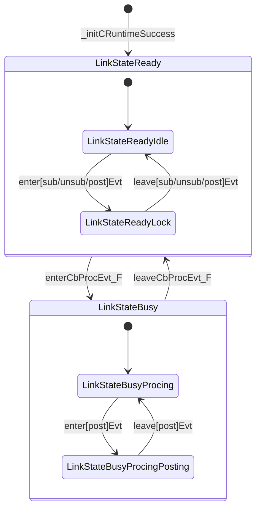

# About

* This is IOC's Architecture Design, which including definations of:
  * Glossary + Concept + Object + Operation + State

# Glossary

# Concept

# Object

# Operation

# State

## ModMgr vs ModUsr（EvtPrduer or EvtCosmer）

* Module Manager(a.k.a 【ModMgr】) who is a manager role such as platform manager, call IOC's MGR_APIs with arguments by product requirements to initModule, or deinitModule before module exit.
* Module User(a.k.a 【ModUsr】) who is EvtPrduer or EvtCosmer call IOC's USR_APIs.
  * Event Producer(a.k.a 【EvtPrduer】) who generate/trigge events.
    * EvtPrduer will post event to IOC by IOC_postEVT API.
  * Event Consumer(a.k.a 【EvtCosmer】) who process events.
    * EvtCosmer will subscribe or unsubscribe event to IOC by IOC_subEVT or IOC_unsubEVT API.

## Conet vs Conles

* Communicate has Connect or Connectless Mode(a.k.a 【ConetMode】、【ConlesMode】).
* @ConetMode@:
  * [1] ObjX MUST call IOC_onlineService to online a service with $SrvArgs and identfied as $SrvID.
  * [2] ObjY MUST call IOC_connectService to that service, and both ObjX/Y will get a $LinkID,
  * [3.1] ObjY call IOC_execCMD with $LinkID to ask ObjX execute commands and get result, or ObjX call IOC_execCMD.
  * [3.2] ObjX call IOC_postEVT with $LinkID to notify ObjY something happened, or ObjY call IOC_postEVT.
  * [3.3] ObjX call IOC_sendDAT with $LinkID to send data to ObjY, or ObjY call IOC_sendDAT.
* @ConlesMode@: ObjX call IOC_postEVT with pre-defined $AutoLinkID to notify all ObjYZs, who call IOC_waitEVT or IOC_subEVT, without IOC_onlineService and IOC_connectService.

* In ConetMode service has dynamic or static online mode:
  * [D] Dynamic: ObjX call PLT_IOC_onlineService in its context to online a service and identfied as $SrvID,
  * [S] Static: ObjX use PLT_IOC_defineService in its source to define and identfied by $SrvArgs::SrvURL.

## MSG（CMD or EVT or DAT）

* Message(a.k.a 【MSG】) is a Command(a.k.a 【CMD】) or an Event(a.k.a 【EVT】) or a piece of Data(a.k.a 【DAT】).
  * CMD is SYNC and DGRAM defined by IOC identified by CmdID;
  * EVT is ASYNC/SYNC and DGRAM defined by IOC identified by EvtID;
  * DAT is ASNYC/SYNC and STREAM defined by IOC knowns only by object pair;

### EVT::Properties

* [EVT] is ASYNC and DGRAM defined by IOC identified by EvtID;
  * Its default property is ASYNC+MAYBLOCK+NODROP, and may be changed by setLinkParams or IOC_Options_T.
* [ASYNC]：means ObjX in its current context postEVT to LinkID,
      then ObjY's CbProcEvt_F will be callbacked in IOC's context, not in ObjX's context.
      Here IOC's context is designed&implemented by IOC, may be a standalone thread or a thread pool.
      USE setLinkParams to change Link's each postEvt to SYNC,
      USE IOC_Options_T to change Link's current postEvt to SYNC,
          which means ObjY's CbProcEvt_F callbacked in ObjX's context.
* [MAYBLOCK]: means ObjX's postEVT may be blocked if not enough resource to postEVT,
      such as no free space to queuing the pEvtDesc.
      USE setLinkParams to change Link's each postEvt to NONBLOCK,
      USE IOC_Options_T to change Link's current postEvt to NONBLOCK,
          by set enable timeout checking and with timeout value '0',
          which means ObjX's postEVT will return TOS_RESULT_TIMEOUT if not enough resource to postEVT.
* [NODROP]: means after ObjX's postEVT success, if IOC's internal MAY drop this EVT,
      such as IOC's internal subsystem or submodule is busy or not enough resource to process this EVT.
      Here assume IOC is a complex system, such as ObjX vs ObjY is inter-process or inter-machine communication.
      USE setLinkParams to change Link's each postEvt to MAYDROP,
      USE IOC_Options_T to change Link's current postEvt to MAYDROP,
          which means ObjX's postEVT success, but sometimes ObjY never get this EVT.

### EVT:FSM::Conet

* TODO

### EVT::FSM::Conles

* {TSF-0}\<ACT:_initCRuntimeSuccess>  -> [STATE:LinkStateReady]

---

* {TSF-1}[STATE:LinkStateReady]  ->  \<ACT:subEvt/unsubEvt>   -> [STATE:LinkStateReady]

---

* {TSF-2}[STATE:LinkStateReady/Busy]  ->  \<ACT:postEvt>    -> [STATE:LinkStateReady/Busy]
  * |-> \<EVT:enterCbProcEvt_F>  ->  [STATE:LinkStateBusy]

---

* {TSF-3}[STATE:LinkStateBusy]
  * |-> \<EVT:leaveCbProcEvt_F>  ->  [STATE:LinkStateReady]

