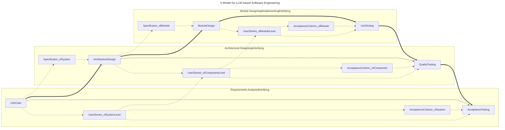

# About

* This docuement has 'Body of Knowledge for Large Language Model based Software Engineering'(a.k.a BoK-LLMSE) guiding this project.
  * Most part of this BoK-LLMSE is based on or learning from public courses, books, and articles.
  * Some part of this BoK-LLMSE is my own experience and understanding.

# Overview

* Renewed V-Model for LLM based Software Engineering.

# References

* [SWEBOKv3](https://www.computer.org/education/bodies-of-knowledge/software-engineering)
* X8X: AI based Software Engineering([link](https://time.geekbang.org/column/intro/100755401?tab=intro))