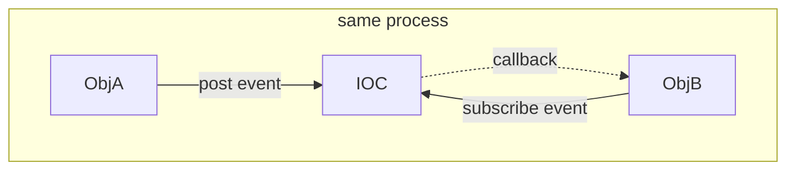
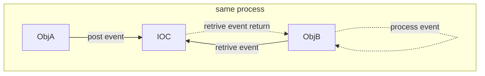
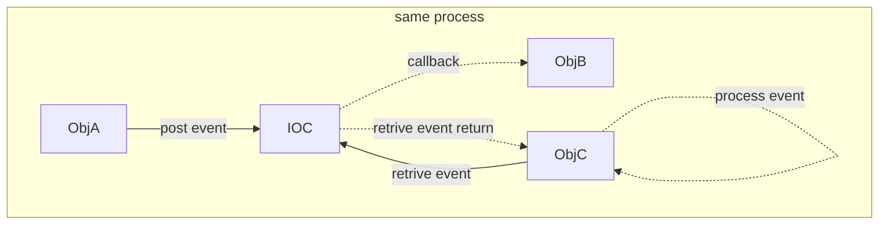
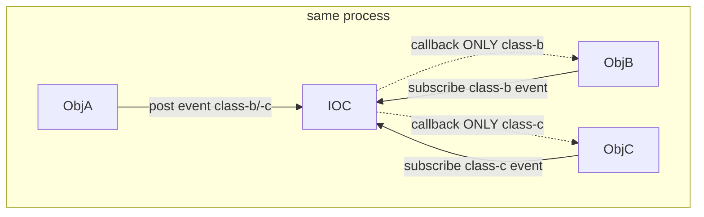
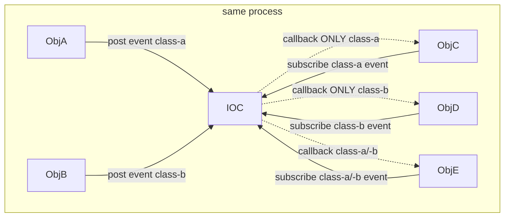

# About
* This is IOC's Use Case（a.k.a UC） document, describe how **USER** as a specific role will **USE** IOC in a specific context.
* **USER**: an object in a thread/process/machine, named as ObjA/ObjB/ObjC/ObjD/ObjE/... in IOC.
* **UES**: ObjA post event and ObjB process event(a.k.a EVT) OR ObjA request ObjB to execute command(a.k.a CMD) OR ObjA send data to ObjB(a.k.a DAT).

# UC-01: post&process event in same process.
## -A
* ObjA and ObjB is in the same process.
    * ObjA post event to IOC,
        * IOC callback ObjB to process the event.
            * ObjB MUST subscribe event before ObjA post event.
        * ObjB retrive the event from IOC and process it.
            * ObjB DONT need to subscribe event before ObjA post event.
            * ObjB retrive event from IOC MAYBLOCK if no event in IOC.

## -B
* ObjA and ObjB/C is in the same process.
    * ObjA post event to IOC,
        * IOC callback ObjB to process the event.
        * ObjC retrive the event from IOC and process it.

## -C
* ObjA post event of class-b and class-c to IOC,
    * ObjB subscribe class-b event from IOC.
        * IF ObjA post event of class-b,
            * THEN IOC callback ObjB to process the class-b event.
    * ObjC subscribe class-c event IOC.
        * IF ObjA post event of class-c,
            * THEN IOC callback ObjC to process the class-c event.
    * ObjB and ObjC MAY also retrive the event from IOC.

## -D
* ObjA post event of class-a to IOC, ObjB post event of class-b to IOC.
    * ObjC subscribe class-a event from IOC.
        * IF ObjA post event of class-a,
            * THEN IOC callback ObjC to process the class-a event.
    * ObjD subscribe class-b event from IOC.
        * IF ObjB post event of class-b,
            * THEN IOC callback ObjD to process the class-b event.
    * ObjE subscribe class-a/-b event from IOC.
        * IF ObjA post event of class-a,
            * THEN IOC callback ObjE to process the class-a event.
        * IF ObjB post event of class-b,
            * THEN IOC callback ObjE to process the class-b event.
    * ObjC/D/E MAY also retrive the event from IOC.

