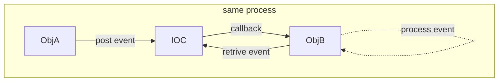
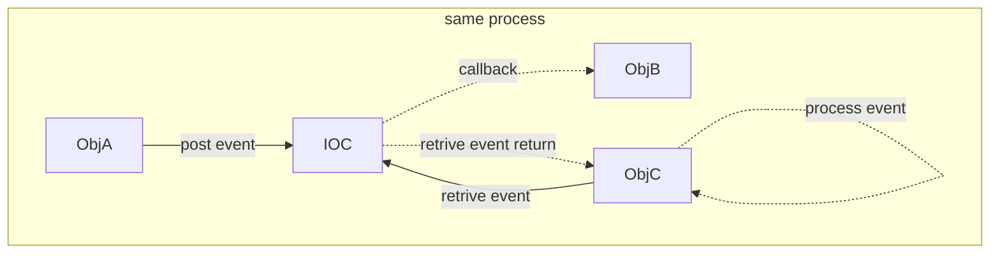

# About
* This is IOC's Use Case document, describe how user as a specific role will use IOC in a specific context or scenario.

# UC01: post&process event in same process.
* ObjA and ObjB is in the same process.
    * ObjA post event to IOC,
        * IOC callback ObjB to process the event.
        * ObjB retrive the event from IOC and process it.

* ObjA and ObjB/C is in the same process.
    * ObjA post event to IOC,
        * IOC callback ObjB to process the event.
        * ObjC retrive the event from IOC and process it.
