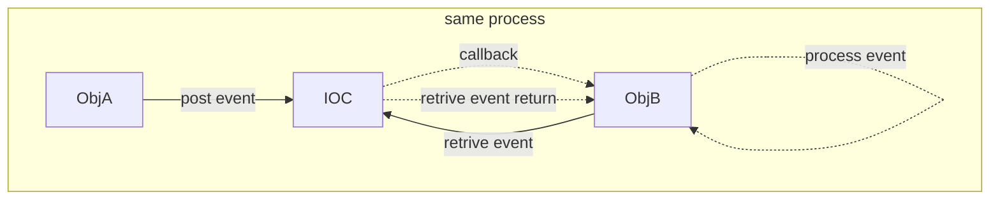
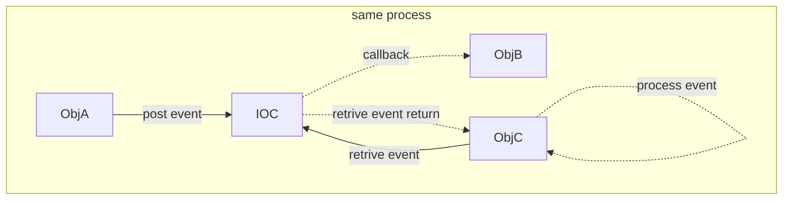
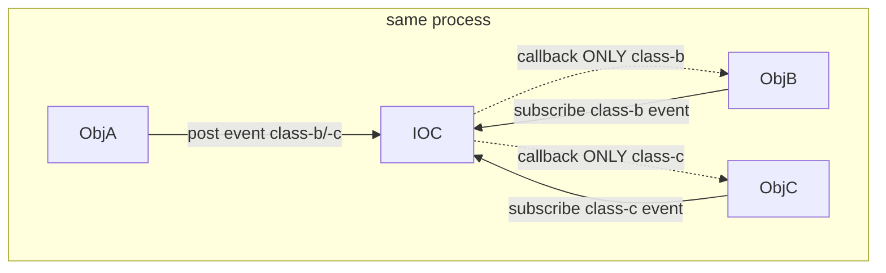

# About
* This is IOC's Use Case（a.k.a UC） document, describe how user as a specific role will use IOC in a specific context or scenario.

# UC-01: post&process event in same process.
## -A
* ObjA and ObjB is in the same process.
    * ObjA post event to IOC,
        * IOC callback ObjB to process the event.
        * ObjB retrive the event from IOC and process it.

## -B
* ObjA and ObjB/C is in the same process.
    * ObjA post event to IOC,
        * IOC callback ObjB to process the event.
        * ObjC retrive the event from IOC and process it.

## -C
* ObjA post event of class-b and class-c to IOC,
    * ObjB subscribe class-b event from IOC.
        * IF ObjA post event of class-b,
            * THEN IOC callback ObjB to process the class-b event.
    * ObjC subscribe class-c event IOC.
        * IF ObjA post event of class-c,
            * THEN IOC callback ObjC to process the class-c event.
    * ObjB and ObjC MAY also retrive the event from IOC.
