[[_TOC_]]

# About
* This is IOC(a.k.a Inter-Object-Communication)'s Use Case document, describe how **USER** as a specific role will **USE** IOC in a specific context.
    * **USER**: an object in a thread/process/machine, named as ObjA/ObjB/ObjC/ObjD/ObjE/... in IOC.
    * **UES**: ObjA post event to ObjB/C/...(a.k.a EVT) 
        * OR ObjA execute command over ObjB(a.k.a CMD) 
            * OR ObjA send data to ObjB(a.k.a DAT).

* All use cases are divided into different categories:
    * [ Category-A ]: post event in same process.
    * [ Category-B ]: post event beyond same process(inter-process/machine).
    * [ Category-C ]: execute command in same process.
    * [ Category-D ]: execute command beyond same process(inter-process/machine).
    * [ Category-E ]: send data in same process.
    * [ Category-F ]: send data beyond same process(inter-process/machine).

# [ Category-A ]: post event in same process.
## [ Use Case-01 ]: ObjA post event, ObjB process event by callback or retrive.
### [Scenario-01]
* ObjA and ObjB is in the same process.
    * ObjA post event to IOC,
        * IOC callback ObjB to process the event.
            * ObjB MUST subscribe event before ObjA post event.
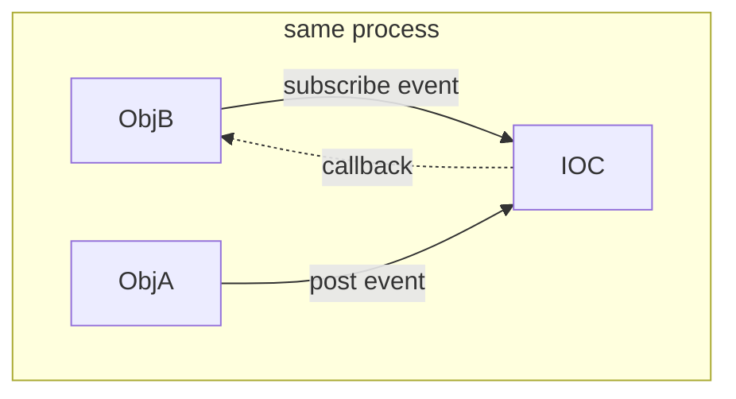

#### [Scenario-01.a]
* ObjB will be callbacked only AFTER successfully subscribe the event, and THEN ObjA post a new event.
    * This MEANS ObjA post event will get NO_EVENT_CONSUMER result, if ObjB has NOT subscribed the event.

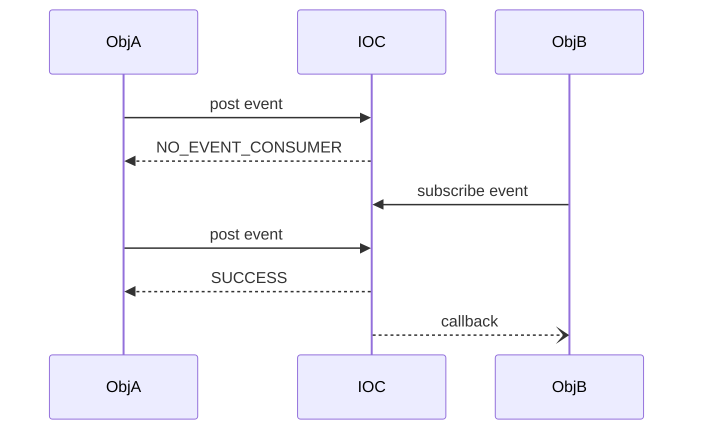

#### [Scenario-01.b]
* ObjA post event get NO_EVENT_CONSUMER result,
    * IF ObjB unsubscribe the event before ObjA post event.

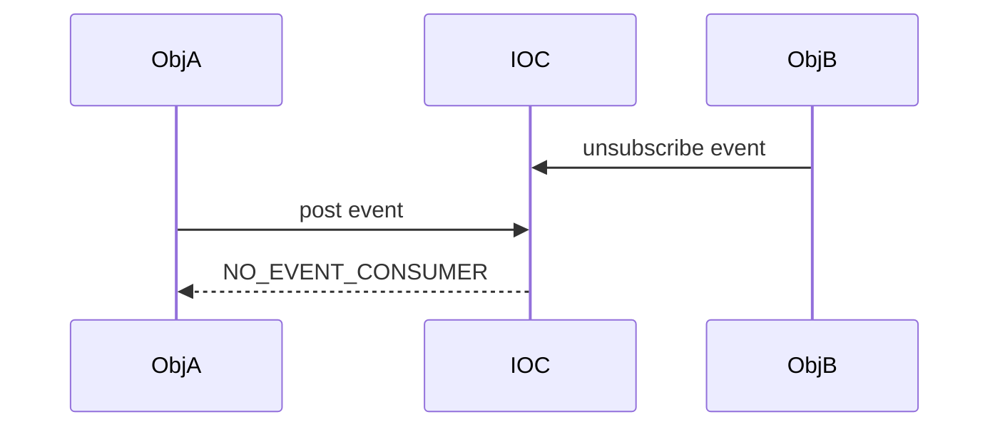

#### [Scenario-01.c]
* ObjA post event to IOC and IOC is callbacking ObjB,
    * IF ObjB unsubscribe the event during callback,
        * THEN the unsubscription will block until the callback is done.

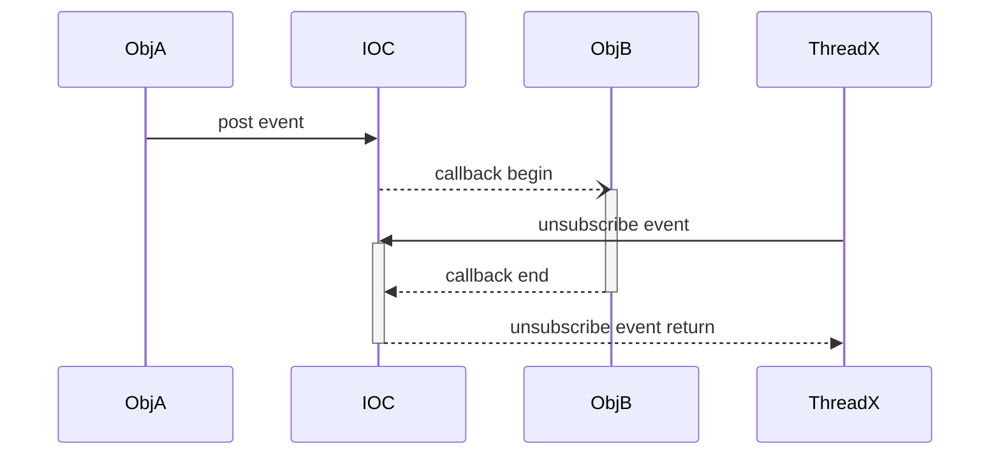

### [Scenario-02]
* ObjA and ObjB is in the same process.
    * ObjA post event to IOC,
        * ObjB retrive the event from IOC and process it.
            * ObjB DONT need to subscribe event before ObjA post event.
            * ObjB retrive event from IOC MAYBLOCK if no event in IOC.

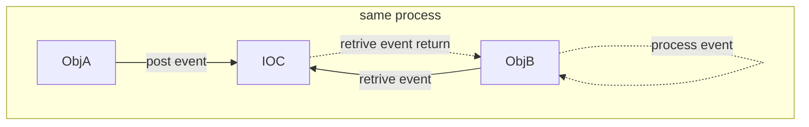

#### [Scenario-02.a]
* ObjB retrive event SHOULDBLOCK until ObjA post new event.
    * This INDICATE ObjA post event will get NO_EVENT_CONSUMER result, if ObjB is NOT waitting to retrive event, which MEANS ObjA's pending event queue depth is ZERO by default.
    
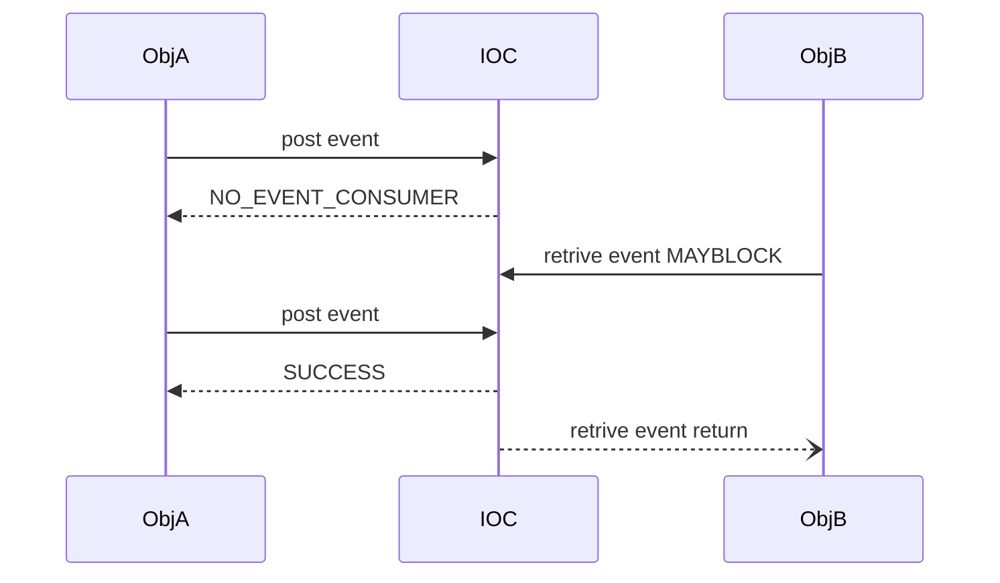

#### [Scenario-02.b]
* ObjB MAY set MAX_PENDING_EVENT_QUEUE_DEPTH=N(>0) to avoid NO_EVENT_CONSUMER result, but may get IOC_RESULT_TOO_MANY_QUEUING_EVENT result. 

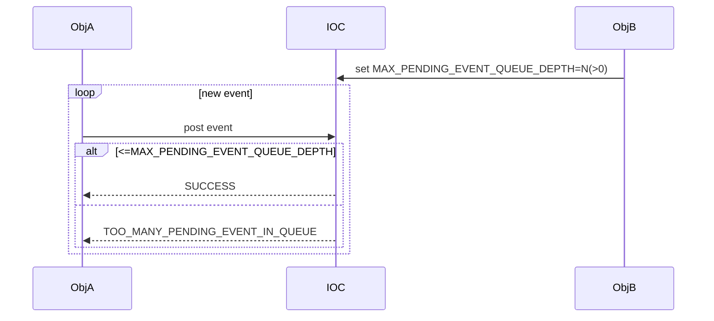

#### [Scenario-02.c]
* ObjB MAY retrive event with timeout arguement to avoid MAYBLOCK.
    * IF ObjA not post event within timeout, 
        * THEN ObjB will get RETRIVE_TIMEOUT result.

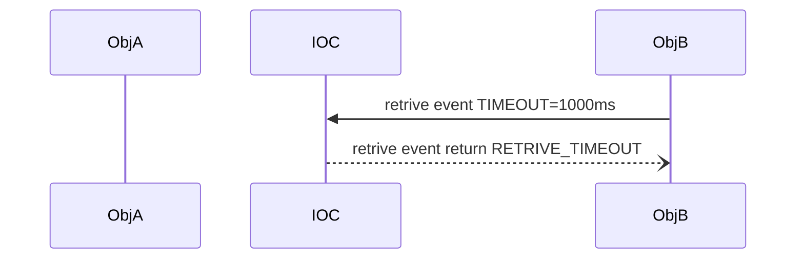

## [ Use Case-02 ]: ObjA post event, ObjB process event by callback, ObjC process event by retrive.
### [Scenario-01]
* ObjA and ObjB/C is in the same process.
    * ObjA post event to IOC,
        * IOC callback ObjB to process the event.
        * ObjC retrive the event from IOC and process it.
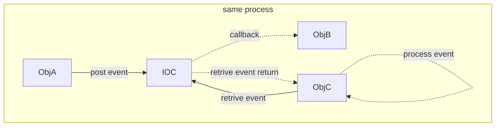

## [ Use Case-03 ]: ObjA post class-b/-c event, ObjB process class-b event, ObjC process class-c event.
### [Scenario-01]
* ObjA post event of class-b and class-c to IOC,
    * ObjB subscribe class-b event from IOC.
        * IF ObjA post event of class-b,
            * THEN IOC callback ObjB to process the class-b event.
    * ObjC subscribe class-c event IOC.
        * IF ObjA post event of class-c,
            * THEN IOC callback ObjC to process the class-c event.
    * ObjB and ObjC MAY also retrive the event from IOC.
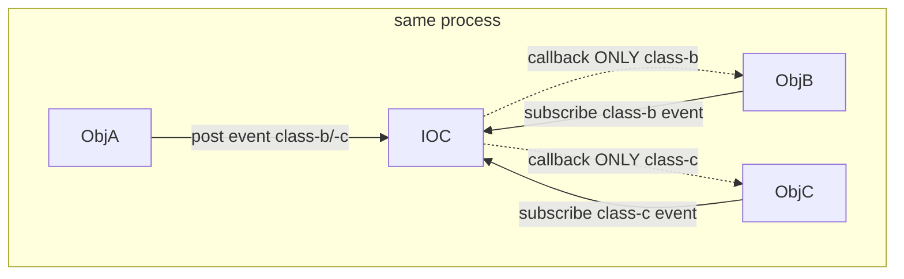

### [Scenario-02]
* ObjA post event of class-b and class-c to IOC,
    * ObjB retrive with class-b event arguement from IOC.
        * IF ObjA post event of class-b,
            * THEN ObjB retrive the class-b event from IOC and process it.
    * ObjC retrive with class-c event arguement from IOC.
        * IF ObjA post event of class-c,
            * THEN ObjC retrive the class-c event from IOC and process it.
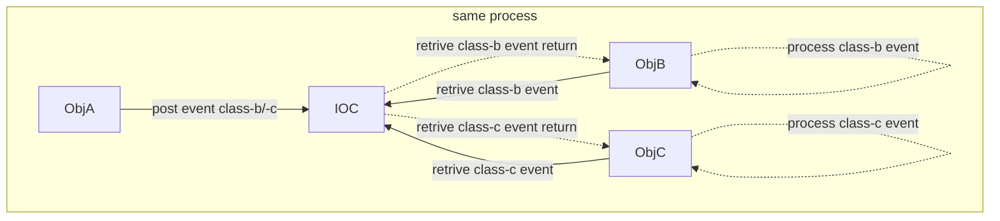

## [ Use Case-04 ]: ObjA post class-a event, ObjB post class-b event, ObjC process class-a event, ObjD process class-b event, ObjE process class-a/-b event.
### [Scenario-01]
* ObjA post event of class-a to IOC, ObjB post event of class-b to IOC.
    * ObjC subscribe class-a event from IOC.
        * IF ObjA post event of class-a,
            * THEN IOC callback ObjC to process the class-a event.
    * ObjD subscribe class-b event from IOC.
        * IF ObjB post event of class-b,
            * THEN IOC callback ObjD to process the class-b event.
    * ObjE subscribe class-a/-b event from IOC.
        * IF ObjA post event of class-a,
            * THEN IOC callback ObjE to process the class-a event.
        * IF ObjB post event of class-b,
            * THEN IOC callback ObjE to process the class-b event.
    * ObjC/D/E MAY also retrive the event from IOC.
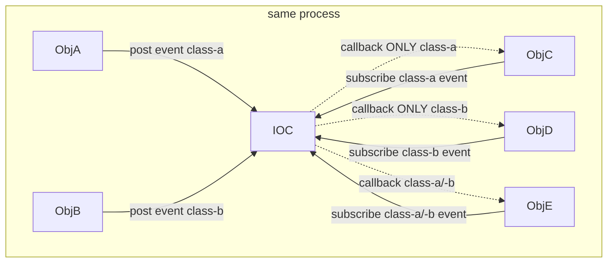

## [ Use Case-05 ]: ObjA post class-b event, ObjB subscribe class-b and in callback post class-c event, ObjC is subscribing class-c and is callbacked
### [Scenario-01]
* ObjB subscribe class-b event from IOC, ObjC subscribe class-c event from IOC.
    * IF ObjA post event of class-b,
        * THEN IOC callback ObjB to process the class-b event.
            * AND in callback IF ObjB post class-c event to IOC.
                * THEN IOC callback ObjC to process the class-c event.
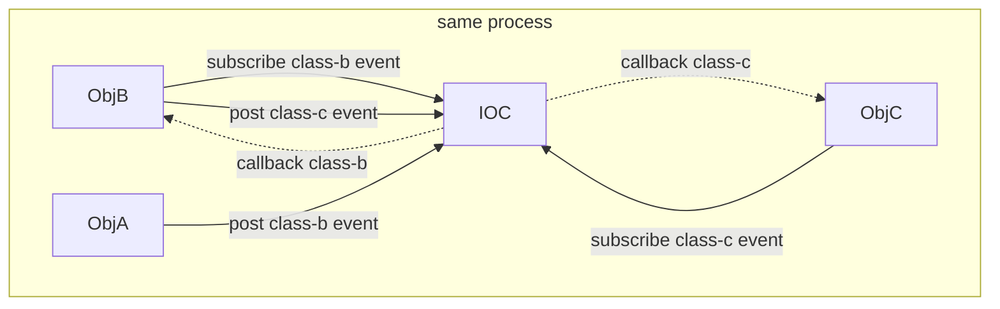

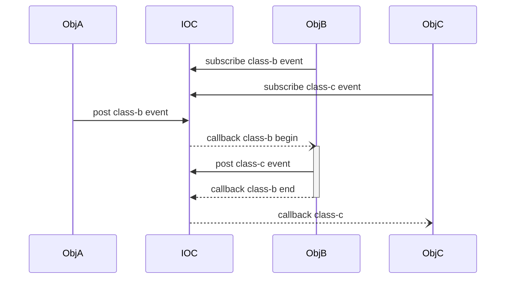

#### [Scenario-01.a]
* IOC callback ObjC before ObjB's callback retrun

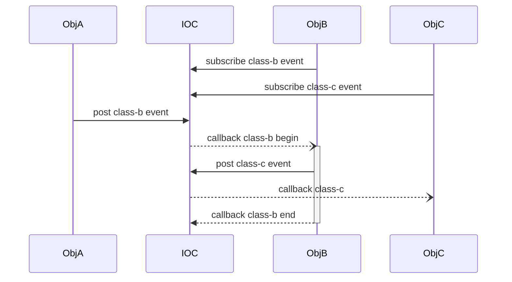

# [ Category-B ]: post event beyond same process(inter-process/machine)

# [ Category-C ]: execute command in same process.

# [ Category-D ]: execute command beyond same process(inter-process/machine)

# [ Category-E ]: send data in same process.

# [ Category-F ]: send data beyond same process(inter-process/machine)
