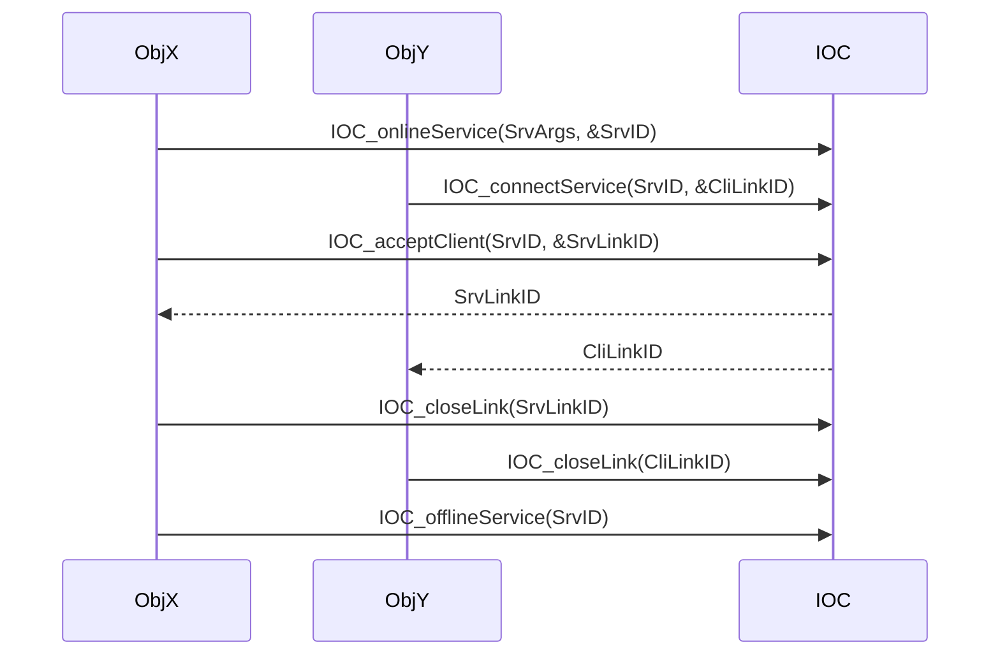
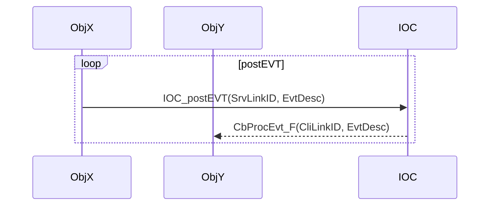
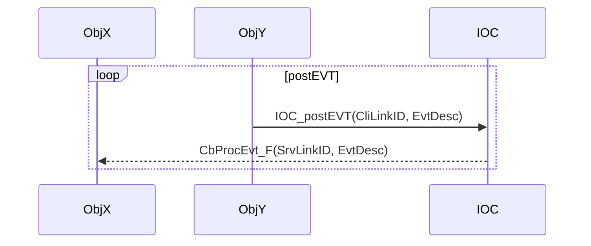
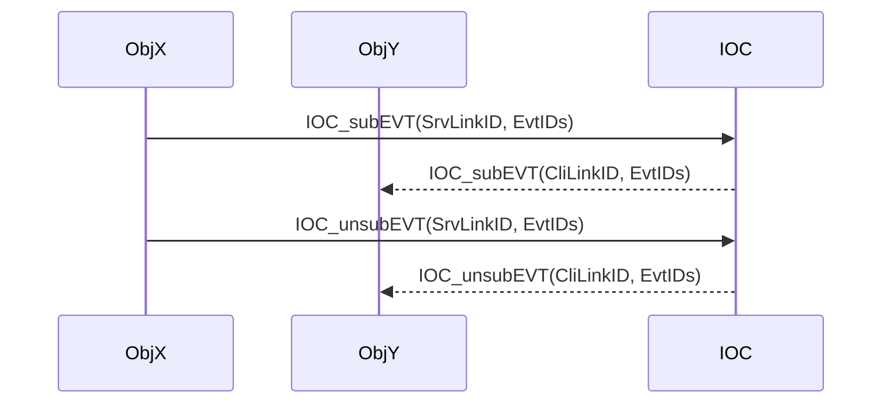

[[_TOC_]]

# About

* As a **USER**，you just need to read this document to know how to use the IOC.

# Use Scenarios

* 【TinyVersion】：IF your runtime is xxKB scale, use this version, and connectless event(a.k.a ConlesEvent) is good enough for you.
* 【TypicalVersion】：IF your runtime is xxMB scale, use this version, consider ConlesEvent by default.
  * IF you want to avoid unpredictable event processing latency, use connection-based event(a.k.a ConetEvent).
  * IF you want to get the result of controlling command execution, use connection-based command(a.k.a ConetCmd).
  * IF you want to transfer data between objects, use connection-based data(a.k.a ConetData).
* 【TitanVersion】：IF your runtime is xxGB scale such as SimuX64, use this version.

---

* 【TinyVersion】：如果你的运行时规模是 xxKB 级别，使用这个版本，无连接事件（也叫 ConlesEvent）对你来说已经足够了。
* 【TypicalVersion】：如果你的运行时规模是 xxMB 级别，使用这个版本，默认考虑使用无连接事件（也叫 ConlesEvent）。
  * 如果你想避免不可预测的事件处理延迟，使用基于连接的事件（也叫 ConetEvent）。
  * 如果你想知道控制命令执行的结果，使用基于连接的命令（也叫 ConetCmd）。
  * 如果你想在对象之间传输数据，使用基于连接的数据（也叫 ConetData）。
* 【TitanVersion】：如果你的运行时规模是 xxGB 级别，比如 SimuX64，使用这个版本吧。

---

# 【Tiny Usage（ConlesMode）】
## asEvtConsumer

### 1. 订阅事件

作为事件消费者，您需要订阅感兴趣的事件。使用 `IOC_subEVT_inConlesMode` 函数来订阅事件。

```c
void SubscribeEvent() {
    IOC_EvtID_T EventIDs[] = {IOC_EVTID_TEST_KEEPALIVE};
    IOC_SubEvtArgs_T SubEvtArgs = {
        .CbProcEvt_F = MyCallback,
        .pCbPrivData = NULL,
        .EvtNum      = 1,
        .pEvtIDs     = EventIDs,
    };

    IOC_Result_T Result = IOC_subEVT_inConlesMode(&SubEvtArgs);
    if (Result != IOC_RESULT_SUCCESS) {
        // 处理订阅失败
    }
}
```

### 2. 实现回调函数
回调函数将在事件发生时被调用。实现您的回调函数来处理事件。

```c
// 回调函数
static IOC_Result_T MyCallback(IOC_EvtDesc_pT pEvtDesc, void *pCbPriv) {
    // 处理事件逻辑
    return IOC_RESULT_SUCCESS;
}
```

### 3. 取消订阅事件

作为事件消费者，您可以取消订阅不再感兴趣的事件。使用 `IOC_unsubEVT_inConlesMode` 函数来取消订阅事件。

```c
void UnsubscribeEvent() {
    IOC_UnsubEvtArgs_T UnsubEvtArgs = {
        .CbProcEvt_F = MyCallback,
        .pCbPrivData = NULL,
    };

    IOC_Result_T Result = IOC_unsubEVT_inConlesMode(&UnsubEvtArgs);
    if (Result != IOC_RESULT_SUCCESS) {
        // 处理取消订阅失败
    }
}
```

### 完整示例
  
  ```c

    // 回调函数
  static IOC_Result_T MyCallback(IOC_EvtDesc_pT pEvtDesc, void *pCbPriv) {
      // 处理事件逻辑
      return IOC_RESULT_SUCCESS;
  }
  
  void SubscribeEvent() {
      IOC_EvtID_T EventIDs[] = {IOC_EVTID_TEST_KEEPALIVE};
      IOC_SubEvtArgs_T SubEvtArgs = {
          .CbProcEvt_F = MyCallback,
          .pCbPrivData = NULL,
          .EvtNum      = 1,
          .pEvtIDs     = EventIDs,
      };
  
      IOC_Result_T Result = IOC_subEVT_inConlesMode(&SubEvtArgs);
      if (Result != IOC_RESULT_SUCCESS) {
          // 处理订阅失败
      }
  }
  
  void UnsubscribeEvent() {
      IOC_UnsubEvtArgs_T UnsubEvtArgs = {
          .CbProcEvt_F = MyCallback,
          .pCbPrivData = NULL,
      };
  
      IOC_Result_T Result = IOC_unsubEVT_inConlesMode(&UnsubEvtArgs);
      if (Result != IOC_RESULT_SUCCESS) {
          // 处理取消订阅失败
      }
  }
  ```

## asEvtProducer
### 1. 发布事件
作为事件生产者，您需要发布事件。使用 IOC_postEVT_inConlesMode 函数来发布事件。

```c
void PostEvent() {
    IOC_EvtDesc_T EvtDesc = {
        .EvtID = IOC_EVTID_TEST_KEEPALIVE,
    };

    IOC_Result_T Result = IOC_postEVT_inConlesMode(&EvtDesc, NULL);
    if (Result != IOC_RESULT_SUCCESS) {
        // 处理发布失败
    }
}
```

### 2. 强制事件处理
作为事件生产者，您可以使用 IOC_forceProcEVT 函数来强制处理所有挂起的事件。此函数会阻塞当前线程，直到所有事件都被处理完毕。

```c
void PostAndForceProcessEvent() {
    // 发布事件
    IOC_EvtDesc_T EvtDesc = {
        .EvtID = IOC_EVTID_TEST_KEEPALIVE,
    };
    IOC_Result_T Result = IOC_postEVT_inConlesMode(&EvtDesc, NULL);
    if (Result != IOC_RESULT_SUCCESS) {
        // 处理发布失败
    }

    // 强制处理事件
    IOC_forceProcEVT();
}
```

### 3. 唤醒事件处理
作为事件生产者，您可以使用 IOC_wakeupProcEVT 函数来唤醒事件处理。此函数会唤醒事件处理线程，处理所有挂起的事件。

```c
void PostAndWakeupProcessEvent() {
    // 发布事件
    IOC_EvtDesc_T EvtDesc = {
        .EvtID = IOC_EVTID_TEST_KEEPALIVE,
    };
    IOC_Result_T Result = IOC_postEVT_inConlesMode(&EvtDesc, NULL);
    if (Result != IOC_RESULT_SUCCESS) {
        // 处理发布失败
    }

    // 唤醒事件处理
    IOC_wakeupProcEVT();
}
```

---

# 【Typical Usage（ConetMode）】
## Shared Sequence
### onlineService, connectService, acceptClient, closeLink, offlineService


### postEVT, CbProcEvt_F
#### SrvLinkID as EvtProducer


#### CliLinkID as EvtProducer


## asEvtConsumer(subEVT, unsubEVT)


## asCmdInitiator

## asCmdExecutor

## asDataSender

## asDataReceiver