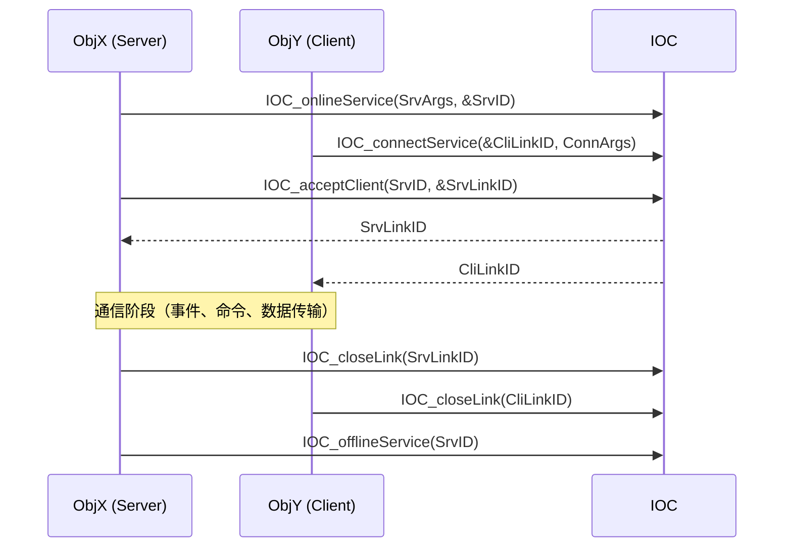
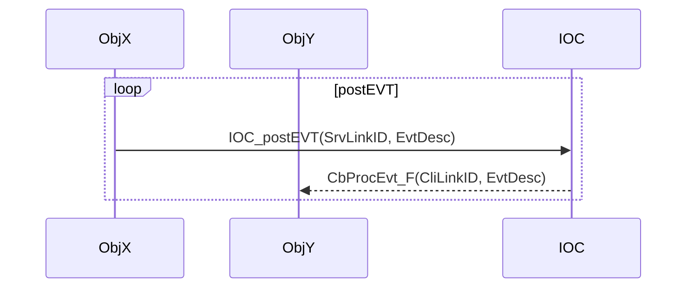
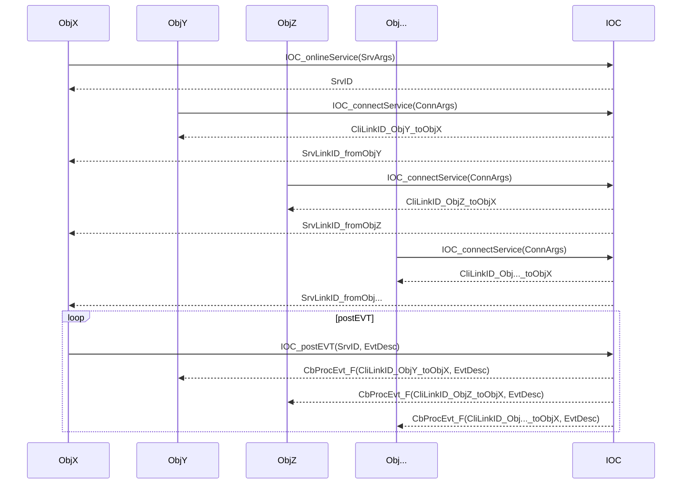
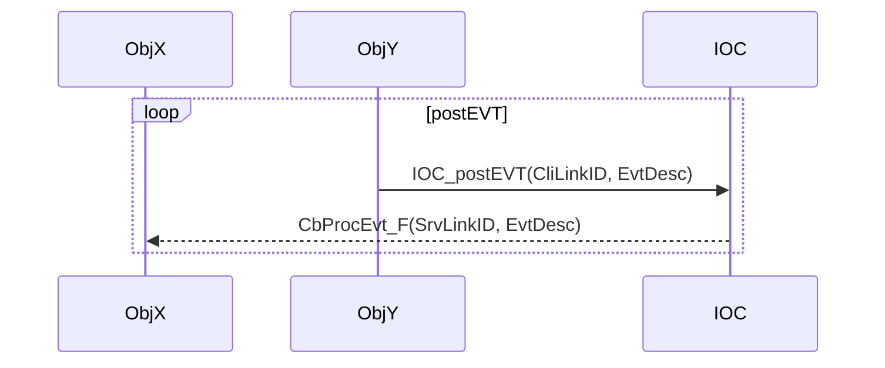
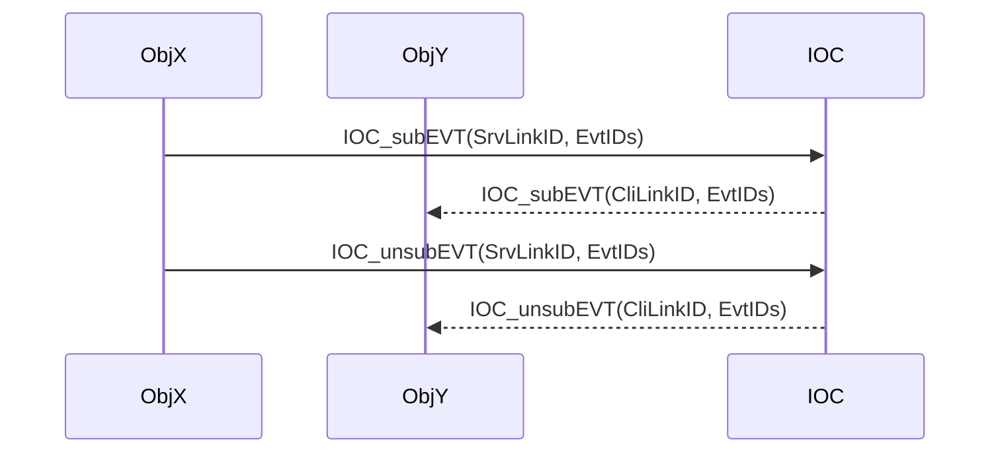

[TOC]

# About

* As a **USER**，you just need to read this document to know how to use the IOC.

# Use Scenarios

* 【TinyVersion】：IF your runtime is xxKB scale, use this version, and connectless event(a.k.a ConlesEvent) is good enough for you.
* 【TypicalVersion】：IF your runtime is xxMB scale, use this version, consider ConlesEvent by default.
  * IF you want to avoid unpredictable event processing latency, use connection-based event(a.k.a ConetEvent).
  * IF you want to get the result of controlling command execution, use connection-based command(a.k.a ConetCmd).
  * IF you want to transfer data between objects, use connection-based data(a.k.a ConetData).
* 【TitanVersion】：IF your runtime is xxGB scale such as SimuX64, use this version.

---

* 【TinyVersion】：如果你的运行时规模是 xxKB 级别，使用这个版本，无连接事件（也叫 ConlesEvent）对你来说已经足够了。
* 【TypicalVersion】：如果你的运行时规模是 xxMB 级别，使用这个版本，默认考虑使用无连接事件（也叫 ConlesEvent）。
  * 如果你想避免不可预测的事件处理延迟，使用基于连接的事件（也叫 ConetEvent）。
  * 如果你想知道控制命令执行的结果，使用基于连接的命令（也叫 ConetCmd）。
  * 如果你想在对象之间传输数据，使用基于连接的数据（也叫 ConetData）。
* 【TitanVersion】：如果你的运行时规模是 xxGB 级别，比如 SimuX64，使用这个版本吧。

---

# 【Tiny Usage（ConlesMode）】
## asEvtConsumer

### 1. 订阅事件

作为事件消费者，您需要订阅感兴趣的事件。使用 `IOC_subEVT_inConlesMode` 函数来订阅事件。

```c
void SubscribeEvent() {
    IOC_EvtID_T EventIDs[] = {IOC_EVTID_TEST_KEEPALIVE};
    IOC_SubEvtArgs_T SubEvtArgs = {
        .CbProcEvt_F = MyCallback,
        .pCbPrivData = NULL,
        .EvtNum      = 1,
        .pEvtIDs     = EventIDs,
    };

    IOC_Result_T Result = IOC_subEVT_inConlesMode(&SubEvtArgs);
    if (Result != IOC_RESULT_SUCCESS) {
        // 处理订阅失败
    }
}
```

### 2. 实现回调函数
回调函数将在事件发生时被调用。实现您的回调函数来处理事件。

```c
// 回调函数
static IOC_Result_T MyCallback(IOC_EvtDesc_pT pEvtDesc, void *pCbPriv) {
    // 处理事件逻辑
    return IOC_RESULT_SUCCESS;
}
```

### 3. 取消订阅事件

作为事件消费者，您可以取消订阅不再感兴趣的事件。使用 `IOC_unsubEVT_inConlesMode` 函数来取消订阅事件。

```c
void UnsubscribeEvent() {
    IOC_UnsubEvtArgs_T UnsubEvtArgs = {
        .CbProcEvt_F = MyCallback,
        .pCbPrivData = NULL,
    };

    IOC_Result_T Result = IOC_unsubEVT_inConlesMode(&UnsubEvtArgs);
    if (Result != IOC_RESULT_SUCCESS) {
        // 处理取消订阅失败
    }
}
```

### 完整示例
  
  ```c

    // 回调函数
  static IOC_Result_T MyCallback(IOC_EvtDesc_pT pEvtDesc, void *pCbPriv) {
      // 处理事件逻辑
      return IOC_RESULT_SUCCESS;
  }
  
  void SubscribeEvent() {
      IOC_EvtID_T EventIDs[] = {IOC_EVTID_TEST_KEEPALIVE};
      IOC_SubEvtArgs_T SubEvtArgs = {
          .CbProcEvt_F = MyCallback,
          .pCbPrivData = NULL,
          .EvtNum      = 1,
          .pEvtIDs     = EventIDs,
      };
  
      IOC_Result_T Result = IOC_subEVT_inConlesMode(&SubEvtArgs);
      if (Result != IOC_RESULT_SUCCESS) {
          // 处理订阅失败
      }
  }
  
  void UnsubscribeEvent() {
      IOC_UnsubEvtArgs_T UnsubEvtArgs = {
          .CbProcEvt_F = MyCallback,
          .pCbPrivData = NULL,
      };
  
      IOC_Result_T Result = IOC_unsubEVT_inConlesMode(&UnsubEvtArgs);
      if (Result != IOC_RESULT_SUCCESS) {
          // 处理取消订阅失败
      }
  }
  ```

## asEvtProducer
### 1. 发布事件
作为事件生产者，您需要发布事件。使用 IOC_postEVT_inConlesMode 函数来发布事件。

```c
void PostEvent() {
    IOC_EvtDesc_T EvtDesc = {
        .EvtID = IOC_EVTID_TEST_KEEPALIVE,
    };

    IOC_Result_T Result = IOC_postEVT_inConlesMode(&EvtDesc, NULL);
    if (Result != IOC_RESULT_SUCCESS) {
        // 处理发布失败
    }
}
```

### 2. 强制事件处理
作为事件生产者，您可以使用 IOC_forceProcEVT 函数来强制处理所有挂起的事件。此函数会阻塞当前线程，直到所有事件都被处理完毕。

```c
void PostAndForceProcessEvent() {
    // 发布事件
    IOC_EvtDesc_T EvtDesc = {
        .EvtID = IOC_EVTID_TEST_KEEPALIVE,
    };
    IOC_Result_T Result = IOC_postEVT_inConlesMode(&EvtDesc, NULL);
    if (Result != IOC_RESULT_SUCCESS) {
        // 处理发布失败
    }

    // 强制处理事件
    IOC_forceProcEVT();
}
```

### 3. 唤醒事件处理
作为事件生产者，您可以使用 IOC_wakeupProcEVT 函数来唤醒事件处理。此函数会唤醒事件处理线程，处理所有挂起的事件。

```c
void PostAndWakeupProcessEvent() {
    // 发布事件
    IOC_EvtDesc_T EvtDesc = {
        .EvtID = IOC_EVTID_TEST_KEEPALIVE,
    };
    IOC_Result_T Result = IOC_postEVT_inConlesMode(&EvtDesc, NULL);
    if (Result != IOC_RESULT_SUCCESS) {
        // 处理发布失败
    }

    // 唤醒事件处理
    IOC_wakeupProcEVT();
}
```

---

# 【Typical Usage（ConetMode）】

## asUser - 服务生命周期管理

在连接模式（ConetMode）中，用户需要管理服务的完整生命周期，包括服务上线、客户端连接、接受连接、关闭链接和服务下线。

### 1. 服务端操作流程

#### 1.1 上线服务

作为服务提供者，首先需要上线一个服务。服务通过 URI 来标识，包含协议、主机、端口和路径信息。

#### IOC_SrvArgs_T 结构体详解

`IOC_SrvArgs_T` 是用于配置服务参数的结构体，包含三个主要字段：

```c
typedef struct {
    IOC_SrvURI_T SrvURI;           // 服务统一资源标识符
    IOC_SrvFlags_T Flags;          // 服务标志位
    IOC_LinkUsage_T UsageCapabilites; // 服务能力声明
} IOC_SrvArgs_T;
```

##### SrvURI - 服务统一资源标识符

服务 URI 用于唯一标识一个服务，遵循标准 URI 格式：`protocol://host:port/path`

```c
typedef struct {
    const char *pProtocol;  // 通信协议
    const char *pHost;      // 主机地址
    const char *pPath;      // 服务路径/名称
    uint16_t Port;          // 端口号
} IOC_SrvURI_T;
```

**协议类型（pProtocol）**：

目前支持的协议：
- `IOC_SRV_PROTO_AUTO` = "auto" - 自动选择协议
- `IOC_SRV_PROTO_FIFO` = "fifo" - 进程内/线程间 FIFO 队列通信

计划支持的协议（TODO）：
- `IOC_SRV_PROTO_TCP` = "tcp" - TCP 网络协议
- `IOC_SRV_PROTO_UDP` = "udp" - UDP 网络协议  
- `IOC_SRV_PROTO_HTTP` = "http" - HTTP 协议

#### 各协议详细说明

##### FIFO 协议（当前支持）
- **适用场景**：同一进程内的线程间通信
- **特点**：
  - 高性能，无网络开销
  - 内存共享，零拷贝
  - 适合高频率、低延迟通信
- **主机要求**：必须使用 `IOC_SRV_HOST_LOCAL_PROCESS`
- **端口**：不需要端口号（设置为 0）

##### TCP 协议（计划支持）
- **适用场景**：跨进程、跨主机的可靠通信
- **特点**：
  - 面向连接，保证数据完整性和顺序
  - 适合需要可靠传输的场景
  - 支持流量控制和拥塞控制
- **主机支持**：
  - `IOC_SRV_HOST_LOCAL_HOST` - 本地进程间
  - `IOC_SRV_HOST_IPV4_ANY` - 跨主机通信
  - 具体 IP 地址 - 指定主机通信
- **端口**：需要指定端口号

##### UDP 协议（计划支持）
- **适用场景**：对延迟敏感、可容忍少量数据丢失的通信
- **特点**：
  - 无连接，低延迟
  - 适合实时数据传输（如音视频流）
  - 广播和多播支持
- **主机支持**：与 TCP 相同
- **端口**：需要指定端口号

##### HTTP 协议（计划支持）
- **适用场景**：与 Web 服务集成、RESTful API
- **特点**：
  - 基于 HTTP 标准
  - 易于与现有 Web 基础设施集成
  - 支持负载均衡、代理等
- **主机支持**：与 TCP 相同
- **端口**：通常使用 80（HTTP）或 443（HTTPS）

#### 协议选择指南

| 使用场景             | 推荐协议 | 原因               |
| -------------------- | -------- | ------------------ |
| 同进程线程间高频通信 | FIFO     | 零开销，最高性能   |
| 跨进程可靠通信       | TCP      | 保证数据完整性     |
| 实时数据流传输       | UDP      | 低延迟，适合流媒体 |
| Web 服务集成         | HTTP     | 标准协议，易集成   |
| 不确定最佳协议       | AUTO     | 系统自动选择       |

#### 未来协议扩展示例

```c
// TCP 协议示例（未来支持）
IOC_SrvArgs_T TcpSrvArgs = {
    .SrvURI = {
        .pProtocol = IOC_SRV_PROTO_TCP,         // 使用 TCP 协议
        .pHost = "192.168.1.100",               // 指定服务器 IP
        .pPath = "DataService",                 // 服务路径
        .Port = 8080                            // TCP 端口
    },
    .Flags = IOC_SRVFLAG_NONE,
    .UsageCapabilites = IOC_LinkUsageEvtProducer
};

// UDP 协议示例（未来支持）
IOC_SrvArgs_T UdpSrvArgs = {
    .SrvURI = {
        .pProtocol = IOC_SRV_PROTO_UDP,         // 使用 UDP 协议
        .pHost = IOC_SRV_HOST_IPV4_ANY,         // 监听所有网卡
        .pPath = "StreamService",               // 服务路径
        .Port = 9090                            // UDP 端口
    },
    .Flags = IOC_SRVFLAG_BROADCAST_EVENT,       // UDP 适合广播
    .UsageCapabilites = IOC_LinkUsageEvtProducer
};

// HTTP 协议示例（未来支持）
IOC_SrvArgs_T HttpSrvArgs = {
    .SrvURI = {
        .pProtocol = IOC_SRV_PROTO_HTTP,        // 使用 HTTP 协议
        .pHost = IOC_SRV_HOST_LOCAL_HOST,       // 本地主机
        .pPath = "/api/v1/events",              // RESTful 路径
        .Port = 8080                            // HTTP 端口
    },
    .Flags = IOC_SRVFLAG_NONE,
    .UsageCapabilites = IOC_LinkUsageEvtProducer | IOC_LinkUsageCmdExecutor
};
```

**主机类型（pHost）**：
- `IOC_SRV_HOST_LOCAL_PROCESS` = "localprocess" - 线程间通信
- `IOC_SRV_HOST_LOCAL_HOST` = "localhost" - 进程间通信  
- `IOC_SRV_HOST_IPV4_ANY` = "0.0.0.0" - 主机间通信

**路径（pPath）**：
- 服务的逻辑名称或主题，用于区分不同服务

##### Flags - 服务标志位

```c
typedef enum {
    IOC_SRVFLAG_NONE = 0,                    // 默认标志，点对点通信
    IOC_SRVFLAG_BROADCAST_EVENT = 1 << 0,    // 广播事件模式
} IOC_SrvFlags_T;
```

**通信模式对比**：
- **P2P（点对点）模式**（默认）：
  - `AcptLinkID <--> ConnLinkID`
  - `postEVT(AcptLinkID)` → 只有对应的 `ConnLinkID` 会收到事件
  
- **BROADCAST（广播）模式**：
  - `SrvLinkID <--> ConnLinkIDs`
  - `postEVT(SrvLinkID)` → 所有连接的 `ConnLinkIDs` 都会收到事件

##### UsageCapabilites - 服务能力声明

声明服务支持的通信类型，决定了可以接受哪种类型的客户端连接：

```c
typedef enum {
    IOC_LinkUsageEvtProducer = (1U << 0),   // 事件生产者
    IOC_LinkUsageEvtConsumer = (1U << 1),   // 事件消费者
    IOC_LinkUsageCmdInitiator = (1U << 2),  // 命令发起者
    IOC_LinkUsageCmdExecutor = (1U << 3),   // 命令执行者
    IOC_LinkUsageDatSender = (1U << 4),     // 数据发送者
    IOC_LinkUsageDatReceiver = (1U << 5),   // 数据接收者
} IOC_LinkUsage_T;
```

**兼容性规则**：
- 服务的 `UsageCapabilites` 与客户端的 `Usage` 必须配对
- 服务端可以支持多种用途：`UsageCapabilites` 可以使用位运算符组合多个值
- 客户端连接必须单一用途：`Usage` 每次只能指定一个值
- 例如：服务声明 `IOC_LinkUsageEvtProducer`，则只能接受 `IOC_LinkUsageEvtConsumer` 的客户端

**重要约束**：
- **服务端（IOC_SrvArgs_T）**：`UsageCapabilites` 可以组合多种能力
  ```c
  .UsageCapabilites = IOC_LinkUsageEvtProducer | IOC_LinkUsageCmdExecutor  // ✅ 正确
  ```
- **客户端（IOC_ConnArgs_T）**：`Usage` 必须只指定一种用途
  ```c
  .Usage = IOC_LinkUsageEvtConsumer                                        // ✅ 正确
  .Usage = IOC_LinkUsageEvtConsumer | IOC_LinkUsageCmdInitiator           // ❌ 错误！
  ```

#### 多功能通信的正确实现

如果客户端需要与服务端进行多种类型的通信，应该建立多个专用连接：

```c
void MultiPurposeClientExample() {
    IOC_LinkID_T EventLinkID, CommandLinkID, DataLinkID;
    
    // 连接1：用于事件消费
    IOC_ConnArgs_T EventConnArgs = {
        .SrvURI = {
            .pProtocol = IOC_SRV_PROTO_FIFO,
            .pHost = IOC_SRV_HOST_LOCAL_PROCESS,
            .pPath = "MultiService",
            .Port = 0
        },
        .Usage = IOC_LinkUsageEvtConsumer           // 专用于事件消费
    };
    
    // 连接2：用于命令发起
    IOC_ConnArgs_T CommandConnArgs = {
        .SrvURI = {
            .pProtocol = IOC_SRV_PROTO_FIFO,
            .pHost = IOC_SRV_HOST_LOCAL_PROCESS,
            .pPath = "MultiService",
            .Port = 0
        },
        .Usage = IOC_LinkUsageCmdInitiator          // 专用于命令发起
    };
    
    // 连接3：用于数据发送
    IOC_ConnArgs_T DataConnArgs = {
        .SrvURI = {
            .pProtocol = IOC_SRV_PROTO_FIFO,
            .pHost = IOC_SRV_HOST_LOCAL_PROCESS,
            .pPath = "MultiService",
            .Port = 0
        },
        .Usage = IOC_LinkUsageDatSender             // 专用于数据发送
    };
    
    // 建立多个专用连接
    if (IOC_connectService(&EventLinkID, &EventConnArgs, NULL) != IOC_RESULT_SUCCESS) {
        return;
    }
    
    if (IOC_connectService(&CommandLinkID, &CommandConnArgs, NULL) != IOC_RESULT_SUCCESS) {
        IOC_closeLink(EventLinkID);
        return;
    }
    
    if (IOC_connectService(&DataLinkID, &DataConnArgs, NULL) != IOC_RESULT_SUCCESS) {
        IOC_closeLink(EventLinkID);
        IOC_closeLink(CommandLinkID);
        return;
    }
    
    // 现在可以在不同的连接上进行不同类型的通信
    // EventLinkID   - 用于订阅和接收事件
    // CommandLinkID - 用于发送命令
    // DataLinkID    - 用于发送数据
    
    // 清理所有连接
    IOC_closeLink(EventLinkID);
    IOC_closeLink(CommandLinkID);
    IOC_closeLink(DataLinkID);
}
```

#### 设计原理说明

这种"一个连接一种用途"的设计有以下优势：

1. **清晰性**：每个连接的用途明确，便于理解和维护
2. **安全性**：避免在同一连接上混合不同类型的通信
3. **性能**：可以为不同类型的通信优化不同的连接
4. **可扩展性**：便于未来添加新的通信类型

#### 完整配置示例

```c
void OnlineEvtProducerService() {
    IOC_SrvArgs_T SrvArgs = {
        .SrvURI = {
            .pProtocol = IOC_SRV_PROTO_FIFO,        // 使用 FIFO 协议
            .pHost = IOC_SRV_HOST_LOCAL_PROCESS,    // 本地进程通信
            .pPath = "EvtProducerService",          // 服务路径/名称
            .Port = 0                               // FIFO 协议不需要端口
        },
        .Flags = IOC_SRVFLAG_NONE,                  // 点对点模式（或使用 IOC_SRVFLAG_BROADCAST_EVENT 启用广播）
        .UsageCapabilites = IOC_LinkUsageEvtProducer // 声明此服务可以产生事件
    };

    IOC_SrvID_T SrvID;
    IOC_Result_T Result = IOC_onlineService(&SrvID, &SrvArgs);
    if (Result != IOC_RESULT_SUCCESS) {
        printf("Failed to online service: %s\n", IOC_getResultStr(Result));
        return;
    }
    
    printf("Service onlined successfully with SrvID: %lu\n", SrvID);
    // 保存 SrvID 供后续使用
}

// 多功能服务示例
void OnlineMultiCapabilityService() {
    IOC_SrvArgs_T SrvArgs = {
        .SrvURI = {
            .pProtocol = IOC_SRV_PROTO_FIFO,
            .pHost = IOC_SRV_HOST_LOCAL_PROCESS,
            .pPath = "MultiService",
            .Port = 0
        },
        .Flags = IOC_SRVFLAG_BROADCAST_EVENT,       // 启用广播模式
        // 支持多种通信类型
        .UsageCapabilites = IOC_LinkUsageEvtProducer | 
                           IOC_LinkUsageCmdExecutor | 
                           IOC_LinkUsageDatReceiver
    };

    IOC_SrvID_T SrvID;
    IOC_Result_T Result = IOC_onlineService(&SrvID, &SrvArgs);
    // ... 错误处理
}
```

#### 1.2 接受客户端连接

服务上线后，需要接受来自客户端的连接请求。每个连接会产生一个唯一的 LinkID。

```c
void AcceptClientConnection(IOC_SrvID_T SrvID) {
    IOC_LinkID_T SrvLinkID;
    
    // 接受客户端连接
    IOC_Result_T Result = IOC_acceptClient(SrvID, &SrvLinkID, NULL);
    if (Result != IOC_RESULT_SUCCESS) {
        printf("Failed to accept client: %s\n", IOC_getResultStr(Result));
        return;
    }
    
    printf("Client accepted successfully with SrvLinkID: %lu\n", SrvLinkID);
    // 保存 SrvLinkID 供后续通信使用
}
```

#### 1.3 下线服务

当不再需要提供服务时，调用下线服务函数。这会断开所有相关连接并释放资源。

```c
void OfflineService(IOC_SrvID_T SrvID) {
    IOC_Result_T Result = IOC_offlineService(SrvID);
    if (Result != IOC_RESULT_SUCCESS) {
        printf("Failed to offline service: %s\n", IOC_getResultStr(Result));
        return;
    }
    
    printf("Service offlined successfully\n");
}
```

### 2. 客户端操作流程

#### 2.1 连接到服务

作为客户端，需要连接到指定的服务。连接参数需要与服务端的 URI 匹配。

```c
void ConnectToEvtProducerService() {
    IOC_ConnArgs_T ConnArgs = {
        .SrvURI = {
            .pProtocol = IOC_SRV_PROTO_FIFO,        // 与服务端协议匹配
            .pHost = IOC_SRV_HOST_LOCAL_PROCESS,    // 与服务端主机匹配
            .pPath = "EvtProducerService",          // 与服务端路径匹配
            .Port = 0
        },
        .Usage = IOC_LinkUsageEvtConsumer           // 声明此连接用于消费事件
    };

    IOC_LinkID_T CliLinkID;
    IOC_Result_T Result = IOC_connectService(&CliLinkID, &ConnArgs, NULL);
    if (Result != IOC_RESULT_SUCCESS) {
        printf("Failed to connect to service: %s\n", IOC_getResultStr(Result));
        return;
    }
    
    printf("Connected to service successfully with CliLinkID: %lu\n", CliLinkID);
    // 保存 CliLinkID 供后续通信使用
}
```

### 3. 链接管理

#### 3.1 关闭链接

无论是服务端还是客户端，都可以主动关闭链接。

```c
void CloseConnection(IOC_LinkID_T LinkID) {
    IOC_Result_T Result = IOC_closeLink(LinkID);
    if (Result != IOC_RESULT_SUCCESS) {
        printf("Failed to close link: %s\n", IOC_getResultStr(Result));
        return;
    }
    
    printf("Link closed successfully\n");
}
```

### 4. 完整的生命周期示例

```c
// 服务端完整示例
void ServerLifecycleExample() {
    IOC_SrvID_T SrvID;
    IOC_LinkID_T SrvLinkID;
    
    // 1. 上线服务
    IOC_SrvArgs_T SrvArgs = {
        .SrvURI = {
            .pProtocol = IOC_SRV_PROTO_FIFO,
            .pHost = IOC_SRV_HOST_LOCAL_PROCESS,
            .pPath = "ExampleService",
            .Port = 0
        },
        .Flags = IOC_SRVFLAG_NONE,
        .UsageCapabilites = IOC_LinkUsageEvtProducer | IOC_LinkUsageCmdExecutor
    };
    
    if (IOC_onlineService(&SrvID, &SrvArgs) != IOC_RESULT_SUCCESS) {
        return;
    }
    
    // 2. 接受客户端连接
    if (IOC_acceptClient(SrvID, &SrvLinkID, NULL) != IOC_RESULT_SUCCESS) {
        IOC_offlineService(SrvID);
        return;
    }
    
    // 3. 进行通信（事件发布、命令执行等）
    // ... 通信逻辑 ...
    
    // 4. 清理资源
    IOC_closeLink(SrvLinkID);
    IOC_offlineService(SrvID);
}

// 客户端完整示例  
void ClientLifecycleExample() {
    IOC_LinkID_T CliLinkID;
    
    // 1. 连接到服务
    IOC_ConnArgs_T ConnArgs = {
        .SrvURI = {
            .pProtocol = IOC_SRV_PROTO_FIFO,
            .pHost = IOC_SRV_HOST_LOCAL_PROCESS,
            .pPath = "ExampleService",
            .Port = 0
        },
        .Usage = IOC_LinkUsageEvtConsumer           // 只能指定一种用途
    };
    
    if (IOC_connectService(&CliLinkID, &ConnArgs, NULL) != IOC_RESULT_SUCCESS) {
        return;
    }
    
    // 如果需要多种功能，需要建立多个连接
    IOC_LinkID_T CliLinkID_forCmd;
    IOC_ConnArgs_T ConnArgs_forCmd = {
        .SrvURI = {
            .pProtocol = IOC_SRV_PROTO_FIFO,
            .pHost = IOC_SRV_HOST_LOCAL_PROCESS,
            .pPath = "ExampleService",
            .Port = 0
        },
        .Usage = IOC_LinkUsageCmdInitiator          // 另一个连接用于命令
    };
    
    if (IOC_connectService(&CliLinkID_forCmd, &ConnArgs_forCmd, NULL) != IOC_RESULT_SUCCESS) {
        IOC_closeLink(CliLinkID);
        return;
    }
    
    // 2. 进行通信（事件订阅、命令发送等）
    // ... 通信逻辑 ...
    
    // 3. 清理资源 - 关闭所有连接
    IOC_closeLink(CliLinkID);
    IOC_closeLink(CliLinkID_forCmd);
}
```

### 5. 时序图



### 6. 注意事项

- **协议匹配**：客户端连接参数必须与服务端完全匹配
- **用途兼容**：客户端的 Usage 必须与服务端的 UsageCapabilites 兼容
- **资源管理**：务必在适当时机关闭链接和下线服务，避免资源泄漏
- **错误处理**：每个 API 调用都应检查返回值并进行适当的错误处理
- **广播模式**：如果服务使用 `IOC_SRVFLAG_BROADCAST_EVENT`，可以向所有连接的客户端广播事件

## asEvtProducer use SrvLinkID call postEVT in P2P


## asEvtProducer use SrvID call postEVT in Broadcast


## asEvtProducer use CliLinkID call postEVT in P2P


## asEvtConsumer call subEVT/unsubEVT


## asCmdInitiator

## asCmdExecutor

## asDataSender

## asDataReceiver