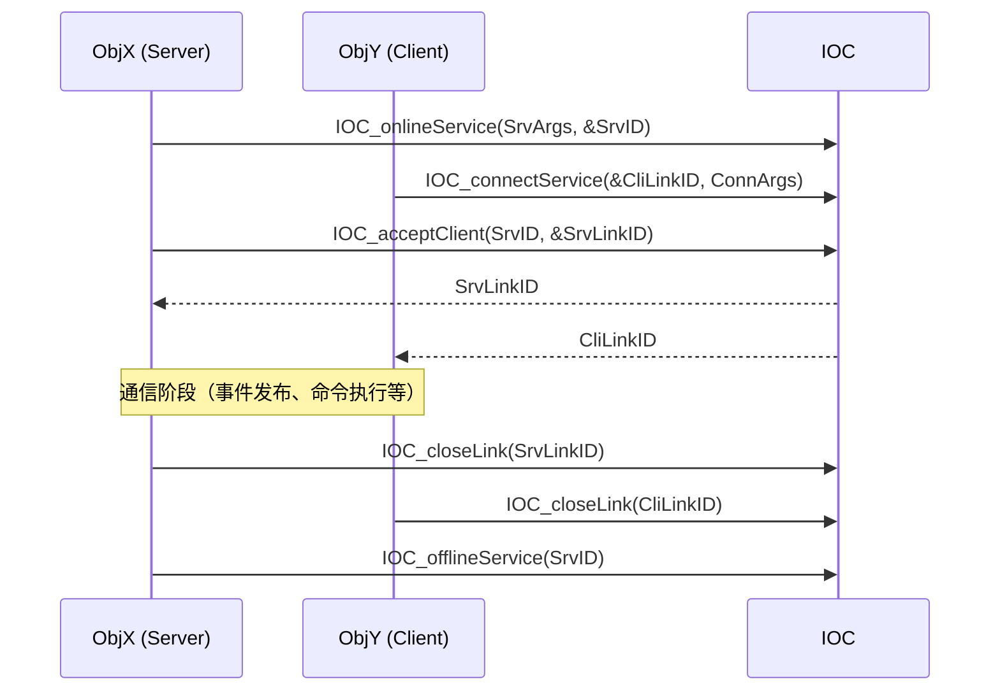
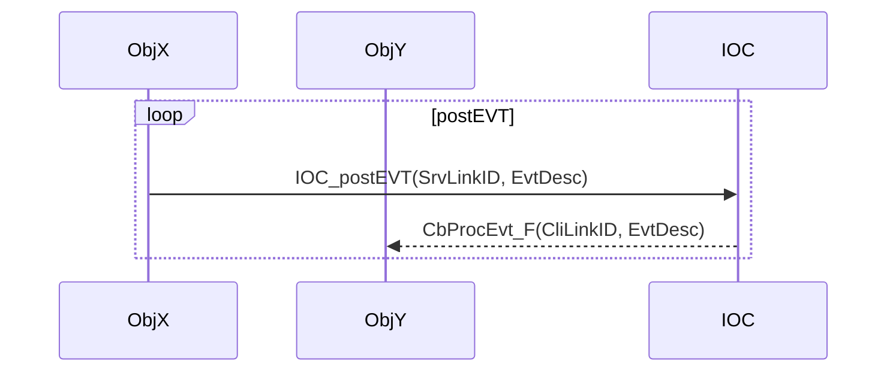
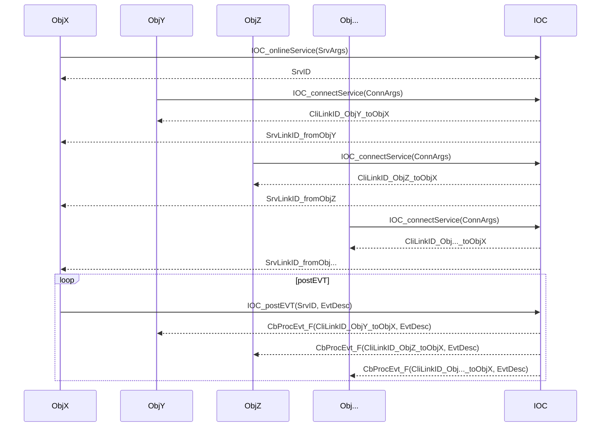
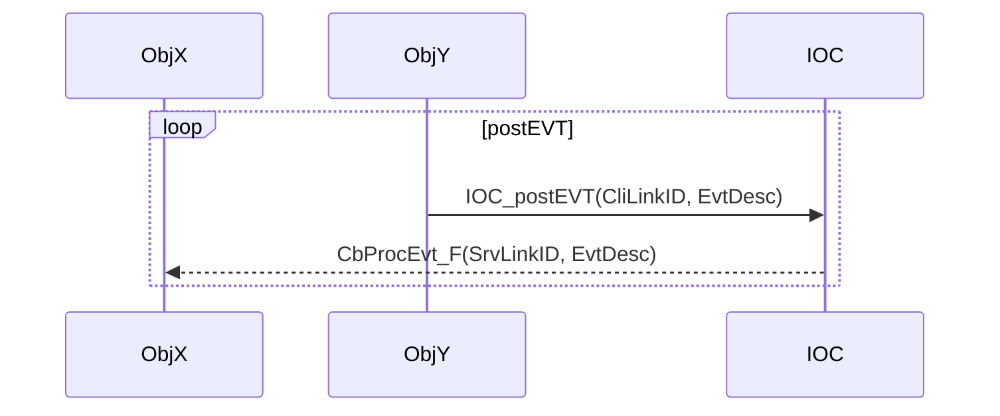
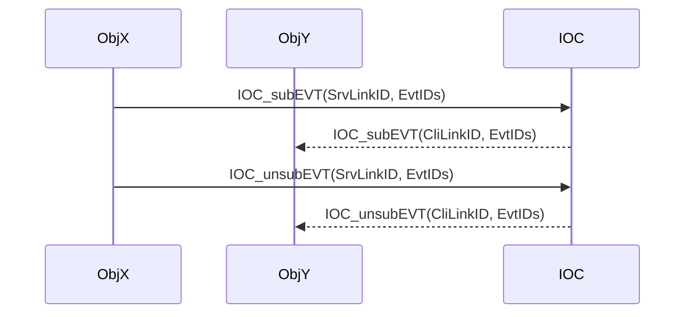
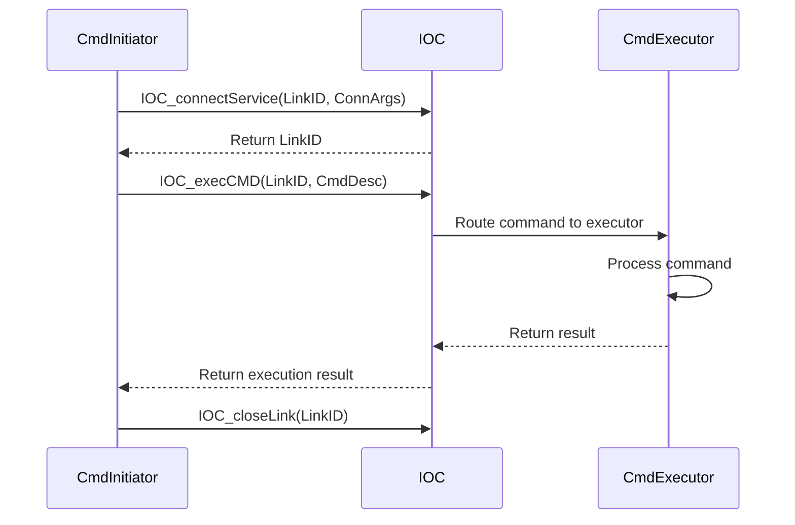
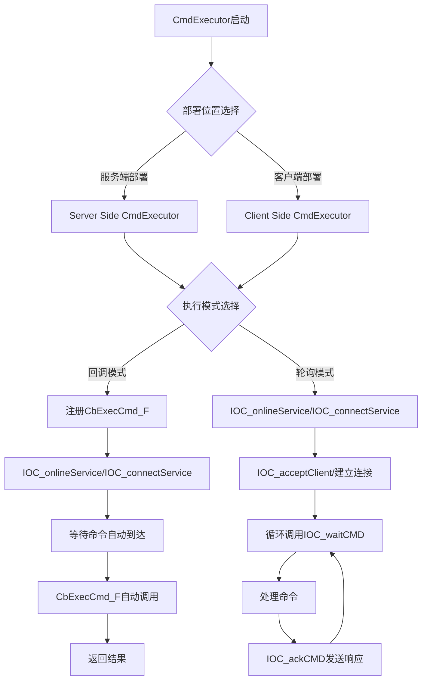
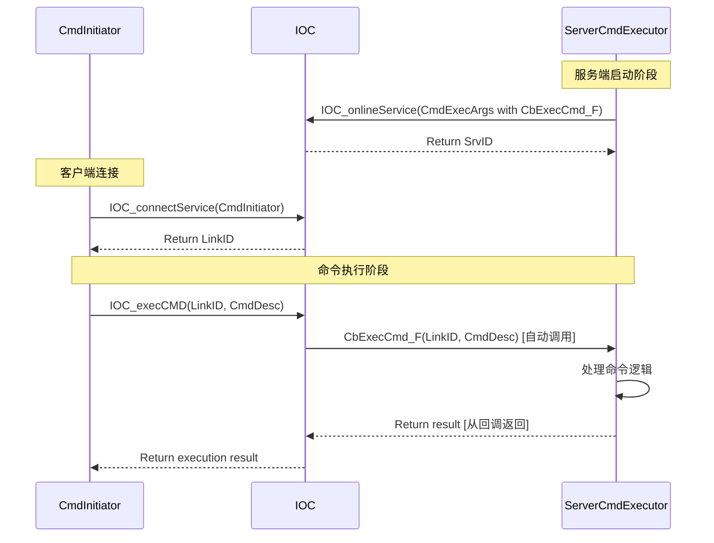
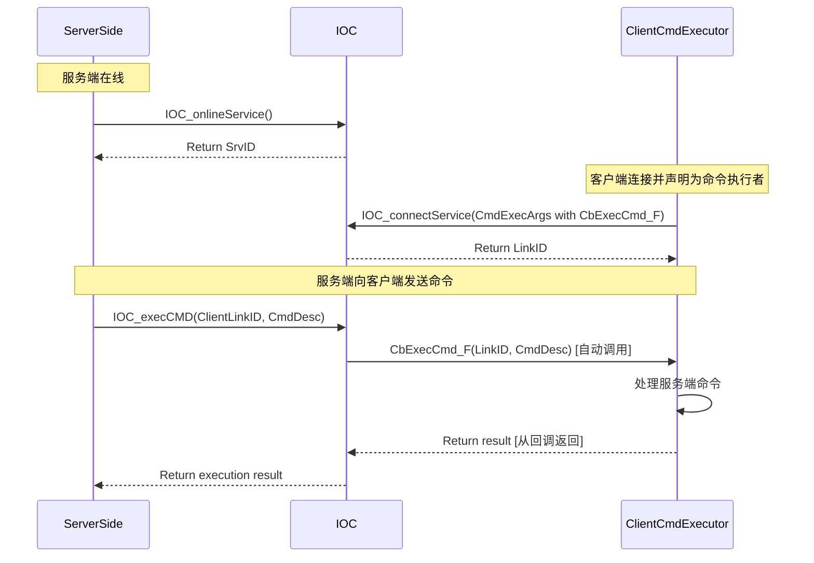
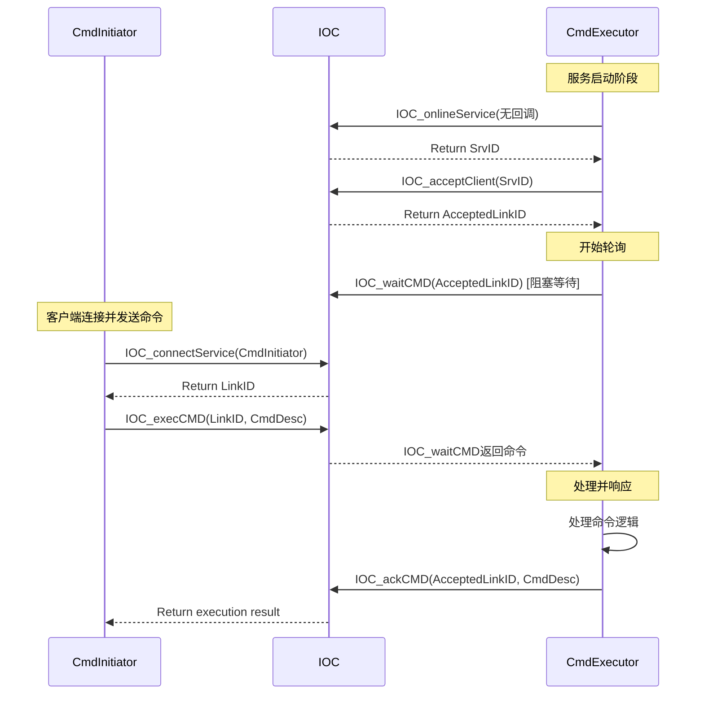

[TOC]

# About

* As a **USER**，you just need to read this document to know how to use the IOC.

# Use Scenarios

* 【TinyVersion】：IF your runtime is xxKB scale, use this version, and connectless event(a.k.a ConlesEvent) is good enough for you.
* 【TypicalVersion】：IF your runtime is xxMB scale, use this version, consider ConlesEvent by default.
  * IF you want to avoid unpredictable event processing latency, use connection-based event(a.k.a ConetEvent).
  * IF you want to get the result of controlling command execution, use connection-based command(a.k.a ConetCmd).
  * IF you want to transfer data between objects, use connection-based data(a.k.a ConetData).
* 【TitanVersion】：IF your runtime is xxGB scale such as SimuX64, use this version.

---

* 【TinyVersion】：如果你的运行时规模是 xxKB 级别，使用这个版本，无连接事件（也叫 ConlesEvent）对你来说已经足够了。
* 【TypicalVersion】：如果你的运行时规模是 xxMB 级别，使用这个版本，默认考虑使用无连接事件（也叫 ConlesEvent）。
  * 如果你想避免不可预测的事件处理延迟，使用基于连接的事件（也叫 ConetEvent）。
  * 如果你想知道控制命令执行的结果，使用基于连接的命令（也叫 ConetCmd）。
  * 如果你想在对象之间传输数据，使用基于连接的数据（也叫 ConetData）。
* 【TitanVersion】：如果你的运行时规模是 xxGB 级别，比如 SimuX64，使用这个版本吧。

---

# 【Tiny Usage（ConlesMode）】

ConlesMode（无连接模式）是 IOC 最简单的使用方式，适用于单进程内的模块间通信。所有事件通过一个自动管理的内部链接进行传递，无需显式建立连接。

## asEvtConsumer（事件消费者）

### 1. 基础事件订阅

作为事件消费者，您需要订阅感兴趣的事件。使用 `IOC_subEVT_inConlesMode` 函数来订阅事件。

```c
// 定义回调函数的私有数据结构
typedef struct {
    uint32_t processedCount;
    char moduleName[32];
} MyPrivateData_T;

// 实现事件处理回调函数
static IOC_Result_T MyCallback(IOC_EvtDesc_pT pEvtDesc, void *pCbPriv) {
    MyPrivateData_T *pPrivData = (MyPrivateData_T *)pCbPriv;
    
    switch (pEvtDesc->EvtID) {
        case IOC_EVTID_TEST_KEEPALIVE:
            pPrivData->processedCount++;
            printf("[%s] 处理 KeepAlive 事件，计数: %d\n", 
                   pPrivData->moduleName, pPrivData->processedCount);
            break;
            
        case IOC_EVTID_YOUR_CUSTOM_EVENT:
            // 处理自定义事件
            printf("[%s] 处理自定义事件\n", pPrivData->moduleName);
            break;
            
        default:
            printf("[%s] 收到未知事件 ID: %d\n", pPrivData->moduleName, pEvtDesc->EvtID);
            return IOC_RESULT_BUG;
    }
    
    return IOC_RESULT_SUCCESS;
}

void SubscribeEvent() {
    // 初始化私有数据
    static MyPrivateData_T privateData = {
        .processedCount = 0,
        .moduleName = "VideoDecoder"
    };
    
    // 定义要订阅的事件 ID 列表
    IOC_EvtID_T EventIDs[] = {
        IOC_EVTID_TEST_KEEPALIVE,
        IOC_EVTID_YOUR_CUSTOM_EVENT
    };
    
    // 设置订阅参数
    IOC_SubEvtArgs_T SubEvtArgs = {
        .CbProcEvt_F = MyCallback,        // 事件处理回调函数
        .pCbPrivData = &privateData,      // 传递给回调的私有数据
        .EvtNum      = IOC_calcArrayElmtCnt(EventIDs), // 事件数量
        .pEvtIDs     = EventIDs,          // 事件 ID 数组
    };

    // 执行订阅
    IOC_Result_T Result = IOC_subEVT_inConlesMode(&SubEvtArgs);
    if (Result != IOC_RESULT_SUCCESS) {
        printf("订阅事件失败: %s\n", IOC_getResultStr(Result));
        return;
    }
    
    printf("成功订阅 %lu 个事件\n", SubEvtArgs.EvtNum);
}
```

### 2. 高级事件处理模式

#### 2.1 多模块协作示例

```c
// 模块状态管理
typedef struct {
    bool isRunning;
    uint32_t frameCount;
    uint32_t errorCount;
    time_t lastHeartbeat;
} ModuleContext_T;

// 视频捕获模块的事件处理
static IOC_Result_T VideoCaptureCallback(IOC_EvtDesc_pT pEvtDesc, void *pCbPriv) {
    ModuleContext_T *pContext = (ModuleContext_T *)pCbPriv;
    
    switch (pEvtDesc->EvtID) {
        case IOC_EVTID_MODULE_START:
            pContext->isRunning = true;
            pContext->lastHeartbeat = time(NULL);
            printf("视频捕获模块启动\n");
            break;
            
        case IOC_EVTID_MODULE_STOP:
            pContext->isRunning = false;
            printf("视频捕获模块停止，处理了 %d 帧\n", pContext->frameCount);
            break;
            
        case IOC_EVTID_FRAME_REQUEST:
            if (pContext->isRunning) {
                // 模拟处理帧请求
                pContext->frameCount++;
                
                // 发布帧数据事件
                IOC_EvtDesc_T frameEvent = {
                    .EvtID = IOC_EVTID_FRAME_CAPTURED,
                    .DataLen = sizeof(uint32_t),
                    .pData = &pContext->frameCount
                };
                IOC_postEVT_inConlesMode(&frameEvent, NULL);
            }
            break;
            
        default:
            pContext->errorCount++;
            return IOC_RESULT_BUG;
    }
    
    pContext->lastHeartbeat = time(NULL);
    return IOC_RESULT_SUCCESS;
}

void SetupVideoCaptureModule() {
    static ModuleContext_T videoContext = {0};
    
    IOC_EvtID_T videoEvents[] = {
        IOC_EVTID_MODULE_START,
        IOC_EVTID_MODULE_STOP,
        IOC_EVTID_FRAME_REQUEST
    };
    
    IOC_SubEvtArgs_T videoSubArgs = {
        .CbProcEvt_F = VideoCaptureCallback,
        .pCbPrivData = &videoContext,
        .EvtNum = IOC_calcArrayElmtCnt(videoEvents),
        .pEvtIDs = videoEvents
    };
    
    IOC_Result_T result = IOC_subEVT_inConlesMode(&videoSubArgs);
    if (result != IOC_RESULT_SUCCESS) {
        printf("视频捕获模块订阅失败: %s\n", IOC_getResultStr(result));
    }
}
```

#### 2.2 错误处理和恢复

```c
// 带有错误处理的回调函数
static IOC_Result_T RobustCallback(IOC_EvtDesc_pT pEvtDesc, void *pCbPriv) {
    MyPrivateData_T *pPrivData = (MyPrivateData_T *)pCbPriv;
    
    // 参数验证
    if (!pEvtDesc || !pCbPriv) {
        printf("错误：回调函数收到空指针参数\n");
        return IOC_RESULT_BUG;
    }
    
    // 处理各种事件
    switch (pEvtDesc->EvtID) {
        case IOC_EVTID_TEST_KEEPALIVE:
            // 正常处理
            pPrivData->processedCount++;
            break;
            
        case IOC_EVTID_ERROR_RECOVERY:
            // 错误恢复逻辑
            printf("[%s] 执行错误恢复\n", pPrivData->moduleName);
            pPrivData->processedCount = 0; // 重置计数器
            break;
            
        case IOC_EVTID_SHUTDOWN:
            // 清理资源
            printf("[%s] 收到关闭信号，开始清理\n", pPrivData->moduleName);
            // 在这里可以设置标志位，主循环检查后进行清理
            break;
            
        default:
            printf("[%s] 警告：未处理的事件 ID: %d\n", 
                   pPrivData->moduleName, pEvtDesc->EvtID);
            // 对于未知事件，不返回错误，以保持系统稳定性
            break;
    }
    
    return IOC_RESULT_SUCCESS;
}
```

### 3. 取消订阅事件

当模块不再需要处理某些事件时，应及时取消订阅以释放系统资源。

```c
void UnsubscribeEvent() {
    // 注意：取消订阅时只需要提供回调函数和私有数据指针
    // IOC 会根据这两个参数找到对应的订阅并移除
    IOC_UnsubEvtArgs_T UnsubEvtArgs = {
        .CbProcEvt_F = MyCallback,
        .pCbPrivData = &privateData,  // 必须与订阅时的指针相同
    };

    IOC_Result_T Result = IOC_unsubEVT_inConlesMode(&UnsubEvtArgs);
    if (Result != IOC_RESULT_SUCCESS) {
        printf("取消订阅失败: %s\n", IOC_getResultStr(Result));
    } else {
        printf("成功取消事件订阅\n");
    }
}
```

### 4. 最佳实践

#### 4.1 模块生命周期管理

```c
typedef struct {
    bool initialized;
    bool subscribed;
    ModuleContext_T context;
} ModuleManager_T;

// 模块初始化
IOC_Result_T ModuleInit(ModuleManager_T *pMgr, const char *moduleName) {
    if (pMgr->initialized) {
        return IOC_RESULT_SUCCESS; // 已经初始化
    }
    
    // 初始化上下文
    memset(&pMgr->context, 0, sizeof(ModuleContext_T));
    strncpy(pMgr->context.moduleName, moduleName, sizeof(pMgr->context.moduleName) - 1);
    
    // 订阅事件
    IOC_EvtID_T events[] = {
        IOC_EVTID_MODULE_START,
        IOC_EVTID_MODULE_STOP,
        IOC_EVTID_TEST_KEEPALIVE
    };
    
    IOC_SubEvtArgs_T subArgs = {
        .CbProcEvt_F = ModuleCallback,
        .pCbPrivData = &pMgr->context,
        .EvtNum = IOC_calcArrayElmtCnt(events),
        .pEvtIDs = events
    };
    
    IOC_Result_T result = IOC_subEVT_inConlesMode(&subArgs);
    if (result == IOC_RESULT_SUCCESS) {
        pMgr->initialized = true;
        pMgr->subscribed = true;
        printf("模块 [%s] 初始化成功\n", moduleName);
    }
    
    return result;
}

// 模块清理
void ModuleCleanup(ModuleManager_T *pMgr) {
    if (pMgr->subscribed) {
        IOC_UnsubEvtArgs_T unsubArgs = {
            .CbProcEvt_F = ModuleCallback,
            .pCbPrivData = &pMgr->context
        };
        
        IOC_unsubEVT_inConlesMode(&unsubArgs);
        pMgr->subscribed = false;
    }
    
    if (pMgr->initialized) {
        printf("模块 [%s] 清理完成\n", pMgr->context.moduleName);
        pMgr->initialized = false;
    }
}
```

#### 4.2 常见错误和避免方法

```c
// ❌ 错误示例：重复订阅相同的回调和私有数据
void BadExample() {
    IOC_SubEvtArgs_T subArgs = {
        .CbProcEvt_F = MyCallback,
        .pCbPrivData = &privateData,
        .EvtNum = 1,
        .pEvtIDs = events
    };
    
    IOC_subEVT_inConlesMode(&subArgs); // 第一次订阅
    IOC_subEVT_inConlesMode(&subArgs); // ❌ 重复订阅会失败
}

// ✅ 正确示例：检查是否已订阅
bool isSubscribed = false;

void GoodExample() {
    if (!isSubscribed) {
        IOC_SubEvtArgs_T subArgs = {
            .CbProcEvt_F = MyCallback,
            .pCbPrivData = &privateData,
            .EvtNum = 1,
            .pEvtIDs = events
        };
        
        if (IOC_subEVT_inConlesMode(&subArgs) == IOC_RESULT_SUCCESS) {
            isSubscribed = true;
        }
    }
}
```

### 5. 完整的模块示例

```c
// 音频处理模块示例
typedef struct {
    uint32_t samplesProcessed;
    uint32_t bufferSize;
    bool isProcessing;
    char moduleName[32];
} AudioProcessor_T;

static IOC_Result_T AudioCallback(IOC_EvtDesc_pT pEvtDesc, void *pCbPriv) {
    AudioProcessor_T *pAudio = (AudioProcessor_T *)pCbPriv;
    
    switch (pEvtDesc->EvtID) {
        case IOC_EVTID_AUDIO_DATA_READY:
            if (pAudio->isProcessing) {
                // 处理音频数据
                pAudio->samplesProcessed++;
                printf("[%s] 处理音频样本 #%d\n", 
                       pAudio->moduleName, pAudio->samplesProcessed);
                
                // 处理完成后发布结果事件
                IOC_EvtDesc_T resultEvent = {
                    .EvtID = IOC_EVTID_AUDIO_PROCESSED,
                    .DataLen = sizeof(uint32_t),
                    .pData = &pAudio->samplesProcessed
                };
                IOC_postEVT_inConlesMode(&resultEvent, NULL);
            }
            break;
            
        case IOC_EVTID_MODULE_START:
            pAudio->isProcessing = true;
            printf("[%s] 音频处理模块启动\n", pAudio->moduleName);
            break;
            
        case IOC_EVTID_MODULE_STOP:
            pAudio->isProcessing = false;
            printf("[%s] 音频处理模块停止，共处理 %d 个样本\n", 
                   pAudio->moduleName, pAudio->samplesProcessed);
            break;
    }
    
    return IOC_RESULT_SUCCESS;
}

// 音频模块的完整生命周期
void AudioModuleExample() {
    // 初始化音频处理器
    static AudioProcessor_T audioProcessor = {
        .samplesProcessed = 0,
        .bufferSize = 1024,
        .isProcessing = false,
        .moduleName = "AudioProcessor"
    };
    
    // 订阅音频相关事件
    IOC_EvtID_T audioEvents[] = {
        IOC_EVTID_AUDIO_DATA_READY,
        IOC_EVTID_MODULE_START,
        IOC_EVTID_MODULE_STOP
    };
    
    IOC_SubEvtArgs_T audioSubArgs = {
        .CbProcEvt_F = AudioCallback,
        .pCbPrivData = &audioProcessor,
        .EvtNum = IOC_calcArrayElmtCnt(audioEvents),
        .pEvtIDs = audioEvents
    };
    
    IOC_Result_T result = IOC_subEVT_inConlesMode(&audioSubArgs);
    if (result != IOC_RESULT_SUCCESS) {
        printf("音频模块订阅失败: %s\n", IOC_getResultStr(result));
        return;
    }
    
    printf("音频模块初始化完成\n");
    
    // ... 模块运行期间 ...
    
    // 清理阶段：取消订阅
    IOC_UnsubEvtArgs_T audioUnsubArgs = {
        .CbProcEvt_F = AudioCallback,
        .pCbPrivData = &audioProcessor
    };
    
    result = IOC_unsubEVT_inConlesMode(&audioUnsubArgs);
    if (result != IOC_RESULT_SUCCESS) {
        printf("音频模块取消订阅失败: %s\n", IOC_getResultStr(result));
    } else {
        printf("音频模块清理完成\n");
    }
}
```

## asEvtProducer（事件生产者）

### 1. 基础事件发布

作为事件生产者，您可以发布事件通知其他模块。使用 `IOC_postEVT_inConlesMode` 函数来发布事件。

```c
// 基础事件发布
void PostBasicEvent() {
    IOC_EvtDesc_T EvtDesc = {
        .EvtID = IOC_EVTID_TEST_KEEPALIVE,
        .DataLen = 0,      // 无附加数据
        .pData = NULL      // 无附加数据
    };

    IOC_Result_T Result = IOC_postEVT_inConlesMode(&EvtDesc, NULL);
    if (Result != IOC_RESULT_SUCCESS) {
        printf("发布事件失败: %s\n", IOC_getResultStr(Result));
    } else {
        printf("成功发布 KeepAlive 事件\n");
    }
}

// 带数据的事件发布
void PostEventWithData() {
    // 准备要传递的数据
    typedef struct {
        uint32_t frameId;
        uint32_t timestamp;
        uint16_t width;
        uint16_t height;
    } FrameInfo_T;
    
    static FrameInfo_T frameInfo = {
        .frameId = 12345,
        .timestamp = 1640995200,  // Unix 时间戳
        .width = 1920,
        .height = 1080
    };
    
    IOC_EvtDesc_T EvtDesc = {
        .EvtID = IOC_EVTID_FRAME_CAPTURED,
        .DataLen = sizeof(FrameInfo_T),
        .pData = &frameInfo
    };

    IOC_Result_T Result = IOC_postEVT_inConlesMode(&EvtDesc, NULL);
    if (Result != IOC_RESULT_SUCCESS) {
        printf("发布帧事件失败: %s\n", IOC_getResultStr(Result));
    } else {
        printf("成功发布帧事件 [ID=%d, %dx%d]\n", 
               frameInfo.frameId, frameInfo.width, frameInfo.height);
    }
}
```

### 2. 高级事件发布模式

#### 2.1 批量事件发布

```c
// 批量发布事件（适用于需要快速发送多个相关事件的场景）
void PostBatchEvents() {
    const uint32_t eventCount = 10;
    
    for (uint32_t i = 0; i < eventCount; i++) {
        uint32_t sequenceId = i + 1;
        
        IOC_EvtDesc_T EvtDesc = {
            .EvtID = IOC_EVTID_SEQUENCE_EVENT,
            .DataLen = sizeof(uint32_t),
            .pData = &sequenceId
        };
        
        IOC_Result_T Result = IOC_postEVT_inConlesMode(&EvtDesc, NULL);
        if (Result != IOC_RESULT_SUCCESS) {
            printf("批量事件发布失败 [序号=%d]: %s\n", sequenceId, IOC_getResultStr(Result));
            
            // 处理队列满的情况
            if (Result == IOC_RESULT_TOO_MANY_QUEUING_EVTDESC) {
                printf("事件队列已满，等待处理...\n");
                // 强制处理积压的事件
                IOC_forceProcEVT();
                
                // 重试发布
                Result = IOC_postEVT_inConlesMode(&EvtDesc, NULL);
                if (Result != IOC_RESULT_SUCCESS) {
                    printf("重试后仍然失败，跳过事件 [序号=%d]\n", sequenceId);
                    continue;
                }
            }
        }
        
        printf("成功发布序列事件 [序号=%d]\n", sequenceId);
    }
}
```

#### 2.2 条件事件发布

```c
// 根据条件发布不同的事件
typedef struct {
    float temperature;
    float humidity;
    uint32_t sensorId;
} SensorData_T;

void PostSensorEvent(const SensorData_T *pSensorData) {
    if (!pSensorData) {
        printf("错误：传感器数据为空\n");
        return;
    }
    
    // 根据温度值发布不同的事件
    IOC_EvtID_T eventId;
    const char *eventType;
    
    if (pSensorData->temperature > 50.0f) {
        eventId = IOC_EVTID_TEMPERATURE_HIGH;
        eventType = "高温警告";
    } else if (pSensorData->temperature < 0.0f) {
        eventId = IOC_EVTID_TEMPERATURE_LOW;
        eventType = "低温警告";
    } else {
        eventId = IOC_EVTID_TEMPERATURE_NORMAL;
        eventType = "温度正常";
    }
    
    IOC_EvtDesc_T EvtDesc = {
        .EvtID = eventId,
        .DataLen = sizeof(SensorData_T),
        .pData = (void *)pSensorData
    };
    
    IOC_Result_T Result = IOC_postEVT_inConlesMode(&EvtDesc, NULL);
    if (Result == IOC_RESULT_SUCCESS) {
        printf("传感器事件 [%s]: 温度=%.1f°C, 湿度=%.1f%%, 传感器ID=%d\n",
               eventType, pSensorData->temperature, pSensorData->humidity, pSensorData->sensorId);
    } else {
        printf("传感器事件发布失败: %s\n", IOC_getResultStr(Result));
    }
}

// 使用示例
void SensorMonitorExample() {
    SensorData_T sensorReadings[] = {
        {25.5f, 60.2f, 1001},  // 正常温度
        {55.3f, 45.8f, 1002},  // 高温
        {-5.1f, 80.1f, 1003}   // 低温
    };
    
    for (size_t i = 0; i < IOC_calcArrayElmtCnt(sensorReadings); i++) {
        PostSensorEvent(&sensorReadings[i]);
    }
}
```

### 3. 事件处理控制

#### 3.1 强制事件处理

使用 `IOC_forceProcEVT` 函数强制处理所有挂起的事件。此函数会阻塞当前线程，直到所有事件都被处理完毕。

```c
void PostAndForceProcessEvent() {
    printf("开始发布事件序列...\n");
    
    // 发布多个事件
    for (int i = 0; i < 5; i++) {
        IOC_EvtDesc_T EvtDesc = {
            .EvtID = IOC_EVTID_TEST_KEEPALIVE,
            .DataLen = sizeof(int),
            .pData = &i
        };
        
        IOC_Result_T Result = IOC_postEVT_inConlesMode(&EvtDesc, NULL);
        if (Result != IOC_RESULT_SUCCESS) {
            printf("发布事件 %d 失败: %s\n", i, IOC_getResultStr(Result));
        } else {
            printf("已发布事件 %d\n", i);
        }
    }
    
    printf("强制处理所有挂起的事件...\n");
    // 强制处理事件 - 这是一个同步操作，会等待所有事件处理完成
    IOC_forceProcEVT();
    printf("所有事件处理完成\n");
}
```

#### 3.2 唤醒事件处理

使用 `IOC_wakeupProcEVT` 函数唤醒事件处理线程。与 `IOC_forceProcEVT` 不同，这是一个异步操作。

```c
void PostAndWakeupProcessEvent() {
    printf("发布事件并异步触发处理...\n");
    
    // 发布事件
    IOC_EvtDesc_T EvtDesc = {
        .EvtID = IOC_EVTID_TEST_KEEPALIVE,
        .DataLen = 0,
        .pData = NULL
    };
    
    IOC_Result_T Result = IOC_postEVT_inConlesMode(&EvtDesc, NULL);
    if (Result != IOC_RESULT_SUCCESS) {
        printf("发布事件失败: %s\n", IOC_getResultStr(Result));
        return;
    }
    
    printf("事件已发布，唤醒处理线程...\n");
    // 唤醒事件处理 - 这是异步操作，不会等待处理完成
    IOC_wakeupProcEVT();
    printf("处理线程已被唤醒，继续执行其他任务...\n");
    
    // 可以继续执行其他任务，事件会在后台异步处理
}
```

### 4. 高性能事件发布

#### 4.1 非阻塞事件发布

```c
#include "IOC_Option.h"  // 包含选项定义

// 非阻塞方式发布事件（推荐用于高频事件发布）
void PostNonBlockingEvent() {
    // 定义非阻塞选项
    IOC_Option_defineNonBlock(optNonBlock);
    
    IOC_EvtDesc_T EvtDesc = {
        .EvtID = IOC_EVTID_HIGH_FREQ_DATA,
        .DataLen = 0,
        .pData = NULL
    };
    
    IOC_Result_T Result = IOC_postEVT_inConlesMode(&EvtDesc, &optNonBlock);
    
    switch (Result) {
        case IOC_RESULT_SUCCESS:
            printf("非阻塞事件发布成功\n");
            break;
            
        case IOC_RESULT_TOO_MANY_QUEUING_EVTDESC:
            printf("警告：事件队列已满，事件被丢弃\n");
            // 在高频发布场景中，可以选择忽略这个错误或记录统计信息
            break;
            
        default:
            printf("非阻塞事件发布失败: %s\n", IOC_getResultStr(Result));
            break;
    }
}

// 高频数据发布示例
void HighFrequencyDataPublisher() {
    const uint32_t maxEvents = 1000;
    uint32_t successCount = 0;
    uint32_t droppedCount = 0;
    
    IOC_Option_defineNonBlock(optNonBlock);
    
    printf("开始高频事件发布 (%d 个事件)...\n", maxEvents);
    
    for (uint32_t i = 0; i < maxEvents; i++) {
        uint32_t data = i;
        IOC_EvtDesc_T EvtDesc = {
            .EvtID = IOC_EVTID_HIGH_FREQ_DATA,
            .DataLen = sizeof(uint32_t),
            .pData = &data
        };
        
        IOC_Result_T Result = IOC_postEVT_inConlesMode(&EvtDesc, &optNonBlock);
        
        if (Result == IOC_RESULT_SUCCESS) {
            successCount++;
        } else if (Result == IOC_RESULT_TOO_MANY_QUEUING_EVTDESC) {
            droppedCount++;
        } else {
            printf("发布事件 %d 失败: %s\n", i, IOC_getResultStr(Result));
        }
        
        // 可选：添加小延迟以模拟真实数据生成
        // usleep(100);  // 100 微秒
    }
    
    printf("高频发布完成: 成功=%d, 丢弃=%d, 总计=%d\n", 
           successCount, droppedCount, maxEvents);
}
```

#### 4.2 同步事件发布

```c
// 同步方式发布事件（确保事件被处理后再继续）
void PostSynchronousEvent() {
    // 定义同步选项
    IOC_Option_defineSync(optSync);
    
    printf("发布同步事件...\n");
    
    IOC_EvtDesc_T EvtDesc = {
        .EvtID = IOC_EVTID_CRITICAL_EVENT,
        .DataLen = 0,
        .pData = NULL
    };
    
    IOC_Result_T Result = IOC_postEVT_inConlesMode(&EvtDesc, &optSync);
    
    if (Result == IOC_RESULT_SUCCESS) {
        printf("同步事件已被完全处理\n");
    } else {
        printf("同步事件发布失败: %s\n", IOC_getResultStr(Result));
    }
}
```

### 5. 事件发布模式选择指南

| 使用场景     | 推荐方式                                       | 选项         | 特点                 |
| ------------ | ---------------------------------------------- | ------------ | -------------------- |
| 普通事件通知 | `IOC_postEVT_inConlesMode(&evt, NULL)`         | 默认（异步） | 平衡性能和可靠性     |
| 高频数据流   | `IOC_postEVT_inConlesMode(&evt, &optNonBlock)` | 非阻塞       | 高性能，允许丢失     |
| 关键事件     | `IOC_postEVT_inConlesMode(&evt, &optSync)`     | 同步         | 确保处理完成         |
| 批量处理后   | `IOC_forceProcEVT()`                           | 强制处理     | 立即处理所有挂起事件 |
| 后台异步     | `IOC_wakeupProcEVT()`                          | 唤醒处理     | 触发异步处理         |

### 6. 实际应用示例

#### 6.1 视频流处理系统

```c
// 视频帧生产者模块
typedef struct {
    uint32_t frameCount;
    uint32_t droppedFrames;
    bool isStreaming;
    uint32_t targetFPS;
} VideoProducer_T;

void VideoFrameGenerator(VideoProducer_T *pProducer) {
    if (!pProducer->isStreaming) {
        return;
    }
    
    // 模拟生成视频帧
    typedef struct {
        uint32_t frameId;
        uint64_t timestamp;
        uint32_t size;
    } VideoFrame_T;
    
    VideoFrame_T frame = {
        .frameId = ++pProducer->frameCount,
        .timestamp = getCurrentTimestamp(),  // 假设的时间戳函数
        .size = 1920 * 1080 * 3  // RGB 数据大小
    };
    
    IOC_EvtDesc_T frameEvent = {
        .EvtID = IOC_EVTID_VIDEO_FRAME_READY,
        .DataLen = sizeof(VideoFrame_T),
        .pData = &frame
    };
    
    // 使用非阻塞方式发布，允许在高负载时丢帧
    IOC_Option_defineNonBlock(optNonBlock);
    IOC_Result_T result = IOC_postEVT_inConlesMode(&frameEvent, &optNonBlock);
    
    if (result == IOC_RESULT_SUCCESS) {
        printf("视频帧 #%d 发布成功\n", frame.frameId);
    } else if (result == IOC_RESULT_TOO_MANY_QUEUING_EVTDESC) {
        pProducer->droppedFrames++;
        printf("视频帧 #%d 被丢弃（队列满）\n", frame.frameId);
    } else {
        printf("视频帧 #%d 发布失败: %s\n", frame.frameId, IOC_getResultStr(result));
    }
}

// 定期报告统计信息
void ReportVideoStats(const VideoProducer_T *pProducer) {
    IOC_EvtDesc_T statsEvent = {
        .EvtID = IOC_EVTID_VIDEO_STATS,
        .DataLen = sizeof(VideoProducer_T),
        .pData = (void *)pProducer
    };
    
    IOC_Result_T result = IOC_postEVT_inConlesMode(&statsEvent, NULL);
    if (result == IOC_RESULT_SUCCESS) {
        printf("视频统计信息已发布: 总帧数=%d, 丢帧数=%d\n", 
               pProducer->frameCount, pProducer->droppedFrames);
    }
}
```

#### 6.2 系统状态监控

```c
// 系统监控模块
typedef enum {
    SYS_STATE_IDLE,
    SYS_STATE_RUNNING,
    SYS_STATE_ERROR,
    SYS_STATE_SHUTDOWN
} SystemState_T;

void PublishSystemStateChange(SystemState_T oldState, SystemState_T newState) {
    typedef struct {
        SystemState_T oldState;
        SystemState_T newState;
        uint64_t timestamp;
    } StateChangeEvent_T;
    
    StateChangeEvent_T stateChange = {
        .oldState = oldState,
        .newState = newState,
        .timestamp = getCurrentTimestamp()
    };
    
    IOC_EvtDesc_T stateEvent = {
        .EvtID = IOC_EVTID_SYSTEM_STATE_CHANGED,
        .DataLen = sizeof(StateChangeEvent_T),
        .pData = &stateChange
    };
    
    // 系统状态变化是关键事件，使用同步方式确保被处理
    IOC_Option_defineSync(optSync);
    IOC_Result_T result = IOC_postEVT_inConlesMode(&stateEvent, &optSync);
    
    if (result == IOC_RESULT_SUCCESS) {
        printf("系统状态变化: %d -> %d (已确认处理)\n", oldState, newState);
    } else {
        printf("系统状态变化事件发布失败: %s\n", IOC_getResultStr(result));
    }
}

// 心跳事件发布
void PublishHeartbeat() {
    static uint32_t heartbeatCount = 0;
    heartbeatCount++;
    
    IOC_EvtDesc_T heartbeatEvent = {
        .EvtID = IOC_EVTID_SYSTEM_HEARTBEAT,
        .DataLen = sizeof(uint32_t),
        .pData = &heartbeatCount
    };
    
    // 心跳事件使用默认异步方式
    IOC_Result_T result = IOC_postEVT_inConlesMode(&heartbeatEvent, NULL);
    
    if (result == IOC_RESULT_SUCCESS) {
        printf("心跳 #%d 发布成功\n", heartbeatCount);
    } else {
        printf("心跳事件发布失败: %s\n", IOC_getResultStr(result));
    }
}
```

### 7. 最佳实践总结

#### 7.1 事件发布策略

```c
// ✅ 推荐的事件发布模式
void RecommendedEventPublishing() {
    // 1. 普通通知事件 - 使用默认异步方式
    IOC_EvtDesc_T normalEvent = {.EvtID = IOC_EVTID_NORMAL_NOTIFICATION};
    IOC_postEVT_inConlesMode(&normalEvent, NULL);
    
    // 2. 高频数据事件 - 使用非阻塞方式
    IOC_Option_defineNonBlock(optNonBlock);
    IOC_EvtDesc_T dataEvent = {.EvtID = IOC_EVTID_HIGH_FREQ_DATA};
    IOC_postEVT_inConlesMode(&dataEvent, &optNonBlock);
    
    // 3. 关键控制事件 - 使用同步方式确保被处理
    IOC_Option_defineSync(optSync);
    IOC_EvtDesc_T criticalEvent = {.EvtID = IOC_EVTID_CRITICAL_CONTROL};
    IOC_postEVT_inConlesMode(&criticalEvent, &optSync);
    
    // 4. 批量事件后 - 强制处理
    IOC_forceProcEVT();
}
```

#### 7.2 错误处理模式

```c
// 健壮的事件发布函数
IOC_Result_T RobustEventPublish(IOC_EvtID_T eventId, void *pData, size_t dataLen, bool isCritical) {
    IOC_EvtDesc_T event = {
        .EvtID = eventId,
        .DataLen = dataLen,
        .pData = pData
    };
    
    IOC_Result_T result;
    
    if (isCritical) {
        // 关键事件使用同步方式，并重试
        IOC_Option_defineSync(optSync);
        
        for (int retry = 0; retry < 3; retry++) {
            result = IOC_postEVT_inConlesMode(&event, &optSync);
            if (result == IOC_RESULT_SUCCESS) {
                break;
            }
            
            printf("关键事件发布失败，重试 %d/3: %s\n", retry + 1, IOC_getResultStr(result));
            
            if (result == IOC_RESULT_TOO_MANY_QUEUING_EVTDESC) {
                // 队列满时，强制处理后重试
                IOC_forceProcEVT();
            }
        }
    } else {
        // 普通事件使用默认方式
        result = IOC_postEVT_inConlesMode(&event, NULL);
        
        if (result == IOC_RESULT_TOO_MANY_QUEUING_EVTDESC) {
            // 可选：触发异步处理
            IOC_wakeupProcEVT();
        }
    }
    
    return result;
}
```

---

# 【Typical Usage（ConetMode）】

## asUser - 服务生命周期管理

在连接模式（ConetMode）中，用户需要管理服务的完整生命周期，包括服务上线、客户端连接、接受连接、关闭链接和服务下线。

### 1. 服务端操作流程

#### 1.1 上线服务

作为服务提供者，首先需要上线一个服务。服务通过 URI 来标识，包含协议、主机、端口和路径信息。

#### IOC_SrvArgs_T 结构体详解

`IOC_SrvArgs_T` 是用于配置服务参数的结构体，包含四个主要字段：

```c
typedef struct {
    IOC_SrvURI_T SrvURI;           // 服务统一资源标识符
    IOC_SrvFlags_T Flags;          // 服务标志位
    IOC_LinkUsage_T UsageCapabilites; // 服务能力声明
    struct {                       // 服务使用参数配置
        IOC_EvtUsageArgs_pT pEvt;  // 事件相关参数
        IOC_CmdUsageArgs_pT pCmd;  // 命令相关参数
        IOC_DatUsageArgs_pT pDat;  // 数据相关参数
        void *pGeneric;            // 通用扩展指针
    } UsageArgs;
} IOC_SrvArgs_T;
```

##### SrvURI - 服务统一资源标识符

服务 URI 用于唯一标识一个服务，遵循标准 URI 格式：`protocol://host:port/path`

```c
typedef struct {
    const char *pProtocol;  // 通信协议
    const char *pHost;      // 主机地址
    const char *pPath;      // 服务路径/名称
    uint16_t Port;          // 端口号
} IOC_SrvURI_T;
```

**协议类型（pProtocol）**：

目前支持的协议：
- `IOC_SRV_PROTO_AUTO` = "auto" - 自动选择协议
- `IOC_SRV_PROTO_FIFO` = "fifo" - 进程内/线程间 FIFO 队列通信

计划支持的协议（TODO）：
- `IOC_SRV_PROTO_TCP` = "tcp" - TCP 网络协议
- `IOC_SRV_PROTO_UDP` = "udp" - UDP 网络协议  
- `IOC_SRV_PROTO_HTTP` = "http" - HTTP 协议

#### 各协议详细说明

##### FIFO 协议（当前支持）
- **适用场景**：同一进程内的线程间通信
- **特点**：
  - 高性能，无网络开销
  - 内存共享，零拷贝
  - 适合高频率、低延迟通信
- **主机要求**：必须使用 `IOC_SRV_HOST_LOCAL_PROCESS`
- **端口**：不需要端口号（设置为 0）

##### TCP 协议（计划支持）
- **适用场景**：跨进程、跨主机的可靠通信
- **特点**：
  - 面向连接，保证数据完整性和顺序
  - 适合需要可靠传输的场景
  - 支持流量控制和拥塞控制
- **主机支持**：
  - `IOC_SRV_HOST_LOCAL_HOST` - 本地进程间
  - `IOC_SRV_HOST_IPV4_ANY` - 跨主机通信
  - 具体 IP 地址 - 指定主机通信
- **端口**：需要指定端口号

##### UDP 协议（计划支持）
- **适用场景**：对延迟敏感、可容忍少量数据丢失的通信
- **特点**：
  - 无连接，低延迟
  - 适合实时数据传输（如音视频流）
  - 广播和多播支持
- **主机支持**：与 TCP 相同
- **端口**：需要指定端口号

##### HTTP 协议（计划支持）
- **适用场景**：与 Web 服务集成、RESTful API
- **特点**：
  - 基于 HTTP 标准
  - 易于与现有 Web 基础设施集成
  - 支持负载均衡、代理等
- **主机支持**：与 TCP 相同
- **端口**：通常使用 80（HTTP）或 443（HTTPS）

#### 协议选择指南

| 使用场景             | 推荐协议 | 原因               |
| -------------------- | -------- | ------------------ |
| 同进程线程间高频通信 | FIFO     | 零开销，最高性能   |
| 跨进程可靠通信       | TCP      | 保证数据完整性     |
| 实时数据流传输       | UDP      | 低延迟，适合流媒体 |
| Web 服务集成         | HTTP     | 标准协议，易集成   |
| 不确定最佳协议       | AUTO     | 系统自动选择       |

#### 未来协议扩展示例

```c
// TCP 协议示例（未来支持）
IOC_SrvArgs_T TcpSrvArgs = {
    .SrvURI = {
        .pProtocol = IOC_SRV_PROTO_TCP,         // 使用 TCP 协议
        .pHost = "192.168.1.100",               // 指定服务器 IP
        .pPath = "DataService",                 // 服务路径
        .Port = 8080                            // TCP 端口
    },
    .Flags = IOC_SRVFLAG_NONE,
    .UsageCapabilites = IOC_LinkUsageEvtProducer
};

// UDP 协议示例（未来支持）
IOC_SrvArgs_T UdpSrvArgs = {
    .SrvURI = {
        .pProtocol = IOC_SRV_PROTO_UDP,         // 使用 UDP 协议
        .pHost = IOC_SRV_HOST_IPV4_ANY,         // 监听所有网卡
        .pPath = "StreamService",               // 服务路径
        .Port = 9090                            // UDP 端口
    },
    .Flags = IOC_SRVFLAG_BROADCAST_EVENT,       // UDP 适合广播
    .UsageCapabilites = IOC_LinkUsageEvtProducer
};

// HTTP 协议示例（未来支持）
IOC_SrvArgs_T HttpSrvArgs = {
    .SrvURI = {
        .pProtocol = IOC_SRV_PROTO_HTTP,        // 使用 HTTP 协议
        .pHost = IOC_SRV_HOST_LOCAL_HOST,       // 本地主机
        .pPath = "/api/v1/events",              // RESTful 路径
        .Port = 8080                            // HTTP 端口
    },
    .Flags = IOC_SRVFLAG_NONE,
    .UsageCapabilites = IOC_LinkUsageEvtProducer | IOC_LinkUsageCmdExecutor
};
```

**主机类型（pHost）**：
- `IOC_SRV_HOST_LOCAL_PROCESS` = "localprocess" - 线程间通信
- `IOC_SRV_HOST_LOCAL_HOST` = "localhost" - 进程间通信  
- `IOC_SRV_HOST_IPV4_ANY` = "0.0.0.0" - 主机间通信

**路径（pPath）**：
- 服务的逻辑名称或主题，用于区分不同服务

##### Flags - 服务标志位

```c
typedef enum {
    IOC_SRVFLAG_NONE = 0,                    // 默认标志，点对点通信
    IOC_SRVFLAG_BROADCAST_EVENT = 1 << 0,    // 广播事件模式
} IOC_SrvFlags_T;
```

**通信模式对比**：
- **P2P（点对点）模式**（默认）：
  - `AcptLinkID <--> ConnLinkID`
  - `postEVT(AcptLinkID)` → 只有对应的 `ConnLinkID` 会收到事件
  
- **BROADCAST（广播）模式**：
  - `SrvLinkID <--> ConnLinkIDs`
  - `postEVT(SrvLinkID)` → 所有连接的 `ConnLinkIDs` 都会收到事件

##### UsageCapabilites - 服务能力声明

声明服务支持的通信类型，决定了可以接受哪种类型的客户端连接：

```c
typedef enum {
    IOC_LinkUsageEvtProducer = (1U << 0),   // 事件生产者
    IOC_LinkUsageEvtConsumer = (1U << 1),   // 事件消费者
    IOC_LinkUsageCmdInitiator = (1U << 2),  // 命令发起者
    IOC_LinkUsageCmdExecutor = (1U << 3),   // 命令执行者（服务端和客户端都可使用）
    IOC_LinkUsageDatSender = (1U << 4),     // 数据发送者
    IOC_LinkUsageDatReceiver = (1U << 5),   // 数据接收者
} IOC_LinkUsage_T;
```

**兼容性规则**：
- 服务的 `UsageCapabilites` 与客户端的 `Usage` 必须配对
- 服务端可以支持多种用途：`UsageCapabilites` 可以使用位运算符组合多个值
- 客户端连接必须单一用途：`Usage` 每次只能指定一个值
- **命令执行者**：`IOC_LinkUsageCmdExecutor` 可以在服务端和客户端使用，都支持 `CbExecCmd_F` 回调函数
- 例如：服务声明 `IOC_LinkUsageEvtProducer`，则只能接受 `IOC_LinkUsageEvtConsumer` 的客户端

**重要约束**：
- **服务端（IOC_SrvArgs_T）**：`UsageCapabilites` 可以组合多种能力
  ```c
  .UsageCapabilites = IOC_LinkUsageEvtProducer | IOC_LinkUsageCmdExecutor  // ✅ 正确
  ```
- **客户端（IOC_ConnArgs_T）**：`Usage` 必须只指定一种用途
  ```c
  .Usage = IOC_LinkUsageEvtConsumer                                        // ✅ 正确
  .Usage = IOC_LinkUsageEvtConsumer | IOC_LinkUsageCmdInitiator           // ❌ 错误！
  ```

#### 多功能通信的正确实现

如果客户端需要与服务端进行多种类型的通信，应该建立多个专用连接：

```c
void MultiPurposeClientExample() {
    IOC_LinkID_T EventLinkID, CommandLinkID, DataLinkID;
    
    // 连接1：用于事件消费
    IOC_ConnArgs_T EventConnArgs = {
        .SrvURI = {
            .pProtocol = IOC_SRV_PROTO_FIFO,
            .pHost = IOC_SRV_HOST_LOCAL_PROCESS,
            .pPath = "MultiService",
            .Port = 0
        },
        .Usage = IOC_LinkUsageEvtConsumer           // 专用于事件消费
    };
    
    // 连接2：用于命令发起
    IOC_ConnArgs_T CommandConnArgs = {
        .SrvURI = {
            .pProtocol = IOC_SRV_PROTO_FIFO,
            .pHost = IOC_SRV_HOST_LOCAL_PROCESS,
            .pPath = "MultiService",
            .Port = 0
        },
        .Usage = IOC_LinkUsageCmdInitiator          // 专用于命令发起
    };
    
    // 连接3：用于数据发送
    IOC_ConnArgs_T DataConnArgs = {
        .SrvURI = {
            .pProtocol = IOC_SRV_PROTO_FIFO,
            .pHost = IOC_SRV_HOST_LOCAL_PROCESS,
            .pPath = "MultiService",
            .Port = 0
        },
        .Usage = IOC_LinkUsageDatSender             // 专用于数据发送
    };
    
    // 建立多个专用连接
    if (IOC_connectService(&EventLinkID, &EventConnArgs, NULL) != IOC_RESULT_SUCCESS) {
        return;
    }
    
    if (IOC_connectService(&CommandLinkID, &CommandConnArgs, NULL) != IOC_RESULT_SUCCESS) {
        IOC_closeLink(EventLinkID);
        return;
    }
    
    if (IOC_connectService(&DataLinkID, &DataConnArgs, NULL) != IOC_RESULT_SUCCESS) {
        IOC_closeLink(EventLinkID);
        IOC_closeLink(CommandLinkID);
        return;
    }
    
    // 现在可以在不同的连接上进行不同类型的通信
    // EventLinkID   - 用于订阅和接收事件
    // CommandLinkID - 用于发送命令
    // DataLinkID    - 用于发送数据
    
    // 清理所有连接
    IOC_closeLink(EventLinkID);
    IOC_closeLink(CommandLinkID);
    IOC_closeLink(DataLinkID);
}
```

#### 设计原理说明

这种"一个连接一种用途"的设计有以下优势：

1. **清晰性**：每个连接的用途明确，便于理解和维护
2. **安全性**：避免在同一连接上混合不同类型的通信
3. **性能**：可以为不同类型的通信优化不同的连接
4. **可扩展性**：便于未来添加新的通信类型

#### 完整配置示例

```c
void OnlineEvtProducerService() {
    IOC_SrvArgs_T SrvArgs = {
        .SrvURI = {
            .pProtocol = IOC_SRV_PROTO_FIFO,        // 使用 FIFO 协议
            .pHost = IOC_SRV_HOST_LOCAL_PROCESS,    // 本地进程通信
            .pPath = "EvtProducerService",          // 服务路径/名称
            .Port = 0                               // FIFO 协议不需要端口
        },
        .Flags = IOC_SRVFLAG_NONE,                  // 点对点模式（或使用 IOC_SRVFLAG_BROADCAST_EVENT 启用广播）
        .UsageCapabilites = IOC_LinkUsageEvtProducer, // 声明此服务可以产生事件
        .UsageArgs = {
            .pEvt = NULL  // 事件产生者不需要回调参数
        }
    };

    IOC_SrvID_T SrvID;
    IOC_Result_T Result = IOC_onlineService(&SrvID, &SrvArgs);
    if (Result != IOC_RESULT_SUCCESS) {
        printf("Failed to online service: %s\n", IOC_getResultStr(Result));
        return;
    }
    
    printf("Service onlined successfully with SrvID: %lu\n", SrvID);
    // 保存 SrvID 供后续使用
}

// 多功能服务示例
void OnlineMultiCapabilityService() {
    IOC_SrvArgs_T SrvArgs = {
        .SrvURI = {
            .pProtocol = IOC_SRV_PROTO_FIFO,
            .pHost = IOC_SRV_HOST_LOCAL_PROCESS,
            .pPath = "MultiService",
            .Port = 0
        },
        .Flags = IOC_SRVFLAG_BROADCAST_EVENT,       // 启用广播模式
        // 支持多种通信类型
        .UsageCapabilites = IOC_LinkUsageEvtProducer | 
                           IOC_LinkUsageCmdExecutor | 
                           IOC_LinkUsageDatReceiver,
        .UsageArgs = {
            .pEvt = NULL,  // 事件相关参数
            .pCmd = NULL,  // 命令相关参数 
            .pDat = NULL   // 数据相关参数
        }
    };

    IOC_SrvID_T SrvID;
    IOC_Result_T Result = IOC_onlineService(&SrvID, &SrvArgs);
    // ... 错误处理
}
```

#### 1.2 接受客户端连接

服务上线后，需要接受来自客户端的连接请求。每个连接会产生一个唯一的 LinkID。

```c
void AcceptClientConnection(IOC_SrvID_T SrvID) {
    IOC_LinkID_T SrvLinkID;
    
    // 接受客户端连接
    IOC_Result_T Result = IOC_acceptClient(SrvID, &SrvLinkID, NULL);
    if (Result != IOC_RESULT_SUCCESS) {
        printf("Failed to accept client: %s\n", IOC_getResultStr(Result));
        return;
    }
    
    printf("Client accepted successfully with SrvLinkID: %lu\n", SrvLinkID);
    // 保存 SrvLinkID 供后续通信使用
}
```

#### 1.3 下线服务

当不再需要提供服务时，调用下线服务函数。这会断开所有相关连接并释放资源。

```c
void OfflineService(IOC_SrvID_T SrvID) {
    IOC_Result_T Result = IOC_offlineService(SrvID);
    if (Result != IOC_RESULT_SUCCESS) {
        printf("Failed to offline service: %s\n", IOC_getResultStr(Result));
        return;
    }
    
    printf("Service offlined successfully\n");
}
```

### 2. 客户端操作流程

#### 2.1 连接到服务

作为客户端，需要连接到指定的服务。连接参数需要与服务端的 URI 匹配。

```c
void ConnectToEvtProducerService() {
    IOC_ConnArgs_T ConnArgs = {
        .SrvURI = {
            .pProtocol = IOC_SRV_PROTO_FIFO,        // 与服务端协议匹配
            .pHost = IOC_SRV_HOST_LOCAL_PROCESS,    // 与服务端主机匹配
            .pPath = "EvtProducerService",          // 与服务端路径匹配
            .Port = 0
        },
        .Usage = IOC_LinkUsageEvtConsumer           // 声明此连接用于消费事件
    };

    IOC_LinkID_T CliLinkID;
    IOC_Result_T Result = IOC_connectService(&CliLinkID, &ConnArgs, NULL);
    if (Result != IOC_RESULT_SUCCESS) {
        printf("Failed to connect to service: %s\n", IOC_getResultStr(Result));
        return;
    }
    
    printf("Connected to service successfully with CliLinkID: %lu\n", CliLinkID);
    // 保存 CliLinkID 供后续通信使用
}
```

### 3. 链接管理

#### 3.1 关闭链接

无论是服务端还是客户端，都可以主动关闭链接。

```c
void CloseConnection(IOC_LinkID_T LinkID) {
    IOC_Result_T Result = IOC_closeLink(LinkID);
    if (Result != IOC_RESULT_SUCCESS) {
        printf("Failed to close link: %s\n", IOC_getResultStr(Result));
        return;
    }
    
    printf("Link closed successfully\n");
}
```

### 4. 完整的生命周期示例

```c
// 服务端完整示例
void ServerLifecycleExample() {
    IOC_SrvID_T SrvID;
    IOC_LinkID_T SrvLinkID;
    
    // 1. 上线服务
    IOC_SrvArgs_T SrvArgs = {
        .SrvURI = {
            .pProtocol = IOC_SRV_PROTO_FIFO,
            .pHost = IOC_SRV_HOST_LOCAL_PROCESS,
            .pPath = "ExampleService",
            .Port = 0
        },
        .Flags = IOC_SRVFLAG_NONE,
        .UsageCapabilites = IOC_LinkUsageEvtProducer | IOC_LinkUsageCmdExecutor,
        .UsageArgs = {
            .pEvt = NULL,  // 事件相关参数
            .pCmd = NULL   // 命令相关参数（使用polling模式，不需要回调参数）
        }
    };
    
    if (IOC_onlineService(&SrvID, &SrvArgs) != IOC_RESULT_SUCCESS) {
        return;
    }
    
    // 2. 接受客户端连接
    if (IOC_acceptClient(SrvID, &SrvLinkID, NULL) != IOC_RESULT_SUCCESS) {
        IOC_offlineService(SrvID);
        return;
    }
    
    // 3. 进行通信（事件发布、命令执行等）
    // ... 通信逻辑 ...
    
    // 4. 清理资源
    IOC_closeLink(SrvLinkID);
    IOC_offlineService(SrvID);
}

// 客户端完整示例  
void ClientLifecycleExample() {
    IOC_LinkID_T CliLinkID;
    
    // 1. 连接到服务
    IOC_ConnArgs_T ConnArgs = {
        .SrvURI = {
            .pProtocol = IOC_SRV_PROTO_FIFO,
            .pHost = IOC_SRV_HOST_LOCAL_PROCESS,
            .pPath = "ExampleService",
            .Port = 0
        },
        .Usage = IOC_LinkUsageEvtConsumer           // 只能指定一种用途
    };
    
    if (IOC_connectService(&CliLinkID, &ConnArgs, NULL) != IOC_RESULT_SUCCESS) {
        return;
    }
    
    // 如果需要多种功能，需要建立多个连接
    IOC_LinkID_T CliLinkID_forCmd;
    IOC_ConnArgs_T ConnArgs_forCmd = {
        .SrvURI = {
            .pProtocol = IOC_SRV_PROTO_FIFO,
            .pHost = IOC_SRV_HOST_LOCAL_PROCESS,
            .pPath = "ExampleService",
            .Port = 0
        },
        .Usage = IOC_LinkUsageCmdInitiator          // 另一个连接用于命令
    };
    
    if (IOC_connectService(&CliLinkID_forCmd, &ConnArgs_forCmd, NULL) != IOC_RESULT_SUCCESS) {
        IOC_closeLink(CliLinkID);
        return;
    }
    
    // 2. 进行通信（事件订阅、命令发送等）
    // ... 通信逻辑 ...
    
    // 3. 清理资源 - 关闭所有连接
    IOC_closeLink(CliLinkID);
    IOC_closeLink(CliLinkID_forCmd);
}
```

### 5. 时序图



### 6. 注意事项

- **协议匹配**：客户端连接参数必须与服务端完全匹配
- **用途兼容**：客户端的 Usage 必须与服务端的 UsageCapabilites 兼容
- **资源管理**：务必在适当时机关闭链接和下线服务，避免资源泄漏
- **错误处理**：每个 API 调用都应检查返回值并进行适当的错误处理
- **广播模式**：如果服务使用 `IOC_SRVFLAG_BROADCAST_EVENT`，可以向所有连接的客户端广播事件

## asEvtProducer use SrvLinkID call postEVT in P2P


## asEvtProducer use SrvID call postEVT in Broadcast


## asEvtProducer use CliLinkID call postEVT in P2P


## asEvtConsumer call subEVT/unsubEVT


## asCmdInitiator

作为命令发起者（Command Initiator），你可以向命令执行者发送命令并同步获取执行结果。

### 基本使用流程

1. **建立连接**：连接到提供命令执行服务的服务端
2. **准备命令**：构造命令描述（CmdDesc）
3. **执行命令**：调用 `IOC_execCMD()` 发送命令并获取结果
4. **处理结果**：根据返回值和输出参数处理执行结果



### 代码示例

```c
#include "IOC/IOC_CmdAPI.h"
#include "IOC/IOC_SrvAPI.h"

void CmdInitiatorExample() {
    IOC_Result_T Result;
    IOC_LinkID_T LinkID;
    
    // 1. 连接到命令执行服务
    IOC_ConnArgs_T ConnArgs = {
        .SrvURI = {
            .pProtocol = IOC_SRV_PROTO_FIFO,        // 与服务端协议匹配
            .pHost = IOC_SRV_HOST_LOCAL_PROCESS,    // 与服务端主机匹配
            .pPath = "CommandService",
            .Port = 0
        },
        .Usage = IOC_LinkUsageCmdInitiator          // 声明为命令发起者
    };
    
    Result = IOC_connectService(&LinkID, &ConnArgs, NULL);
    if (Result != IOC_RESULT_SUCCESS) {
        printf("Failed to connect to command service: %d\n", Result);
        return;
    }
    
    // 2. 准备命令描述
    IOC_CmdDesc_T CmdDesc = {0};
    CmdDesc.CmdID = IOC_CMDID_TEST_PING;  // 使用预定义命令ID
    CmdDesc.Status = IOC_CMD_STATUS_PENDING;
    CmdDesc.TimeoutMs = 5000;  // 5秒超时
    
    // 设置输入参数
    const char *InputData = "Hello, Command!";
    IOC_CmdDesc_setInPayload(&CmdDesc, (void*)InputData, strlen(InputData));
    
    // 3. 执行命令（同步调用）
    IOC_Option_defineTimeout(Options, 5000000);  // 5秒超时（微秒）
    
    Result = IOC_execCMD(LinkID, &CmdDesc, &Options);
    
    // 4. 处理执行结果
    if (Result == IOC_RESULT_SUCCESS) {
        if (IOC_CmdDesc_getStatus(&CmdDesc) == IOC_CMD_STATUS_SUCCESS) {
            // 命令执行成功，获取输出数据
            void *pOutputData = IOC_CmdDesc_getOutData(&CmdDesc);
            ULONG_T OutputSize = IOC_CmdDesc_getOutDataSize(&CmdDesc);
            
            printf("Command executed successfully!\n");
            printf("Output: %.*s\n", (int)OutputSize, (char*)pOutputData);
        } else {
            printf("Command execution failed with status: %s\n", 
                   IOC_CmdDesc_getStatusStr(&CmdDesc));
        }
    } else {
        printf("Failed to execute command: %d\n", Result);
        switch (Result) {
            case IOC_RESULT_TIMEOUT:
                printf("Command execution timeout\n");
                break;
            case IOC_RESULT_BUSY:
                printf("Command executor is busy\n");
                break;
            case IOC_RESULT_LINK_BROKEN:
                printf("Communication link is broken\n");
                break;
            default:
                printf("Other error occurred\n");
        }
    }
    
    // 5. 清理资源
    IOC_closeLink(LinkID);
}
```

### 高级用法

#### 自定义命令ID

```c
// 定义自定义命令类和命令名
#define MY_CMD_CLASS_APP (1 << 10ULL)
#define MY_CMD_NAME_PROCESS_DATA (1 << 0ULL)

// 生成自定义命令ID
IOC_CmdID_T MyCmdID = IOC_defineCmdID(MY_CMD_CLASS_APP, MY_CMD_NAME_PROCESS_DATA);

IOC_CmdDesc_T CmdDesc = {0};
CmdDesc.CmdID = MyCmdID;
// ... 其他设置
```

#### 非阻塞执行

```c
// 设置非阻塞模式
IOC_Option_defineNonBlock(Options);

Result = IOC_execCMD(LinkID, &CmdDesc, &Options);
if (Result == IOC_RESULT_BUSY) {
    printf("Command executor is busy, try again later\n");
} else if (Result == IOC_RESULT_TIMEOUT) {
    printf("Command execution timeout\n");
}
```

### 错误处理指南

| 错误码                       | 含义       | 处理建议                         |
| ---------------------------- | ---------- | -------------------------------- |
| `IOC_RESULT_SUCCESS`         | 执行成功   | 检查 CmdDesc.Status 获取详细状态 |
| `IOC_RESULT_TIMEOUT`         | 执行超时   | 检查网络连接或增加超时时间       |
| `IOC_RESULT_BUSY`            | 执行器忙碌 | 稍后重试或使用异步方式           |
| `IOC_RESULT_LINK_BROKEN`     | 连接断开   | 重新建立连接                     |
| `IOC_RESULT_INVALID_PARAM`   | 参数无效   | 检查 CmdID、LinkID、CmdDesc      |
| `IOC_RESULT_CMD_EXEC_FAILED` | 执行失败   | 检查 CmdDesc.Result 获取详细错误 |

## asCmdExecutor

作为命令执行者（Command Executor），你需要注册命令处理器来响应命令发起者的请求。命令执行者可以在服务端（Server side）或客户端（Client side）运行，两种场景都支持使用回调函数 `CbExecCmd_F` 进行命令处理。

### 应用场景

- **服务端命令执行者**：典型的服务提供方，等待客户端连接并处理命令请求
- **客户端命令执行者**：作为客户端连接到远程服务，但同时也能处理来自服务端的命令请求

### 执行模式选择

IOC 支持两种命令执行模式，无论是在服务端还是客户端都可以使用：



#### 1. 回调模式（推荐）
- **优点**：自动处理，响应迅速
- **缺点**：需要在回调中快速处理，避免阻塞
- **适用场景**：简单命令处理，快速响应
- **部署位置**：服务端和客户端都可以使用 `CbExecCmd_F` 回调函数

#### 2. 轮询模式
- **优点**：可控制处理时机，适合复杂处理
- **缺点**：需要主动轮询，可能有延迟
- **适用场景**：复杂命令处理，需要特定时机处理
- **部署位置**：服务端和客户端都支持

### 回调模式示例

回调模式支持在服务端和客户端两种部署方式中使用 `CbExecCmd_F` 回调函数。

#### 服务端回调模式示例

```c
#include "IOC/IOC_CmdAPI.h"
#include "IOC/IOC_SrvAPI.h"

// 命令执行回调函数（服务端）
IOC_Result_T ServerCommandCallback(IOC_LinkID_T LinkID, IOC_CmdDesc_pT pCmdDesc, void *pCbPriv) {
    printf("[Server] Received command: %s\n", IOC_CmdDesc_getCmdFullNameStr(pCmdDesc, NULL, 0));
    
    // 获取输入参数
    void *pInputData = IOC_CmdDesc_getInData(pCmdDesc);
    ULONG_T InputSize = IOC_CmdDesc_getInDataSize(pCmdDesc);
    
    printf("[Server] Input: %.*s\n", (int)InputSize, (char*)pInputData);
    
    // 处理命令逻辑
    IOC_CmdID_T CmdID = IOC_CmdDesc_getCmdID(pCmdDesc);
    IOC_Result_T ProcessResult = IOC_RESULT_SUCCESS;
    
    switch (CmdID) {
        case IOC_CMDID_TEST_PING: {
            // 处理 PING 命令
            const char *Response = "PONG from Server";
            IOC_CmdDesc_setOutPayload(pCmdDesc, (void*)Response, strlen(Response));
            IOC_CmdDesc_setStatus(pCmdDesc, IOC_CMD_STATUS_SUCCESS);
            break;
        }
        case IOC_CMDID_TEST_ECHO: {
            // 处理 ECHO 命令 - 直接返回输入数据
            IOC_CmdDesc_setOutPayload(pCmdDesc, pInputData, InputSize);
            IOC_CmdDesc_setStatus(pCmdDesc, IOC_CMD_STATUS_SUCCESS);
            break;
        }
        default: {
            // 不支持的命令
            IOC_CmdDesc_setStatus(pCmdDesc, IOC_CMD_STATUS_FAILED);
            IOC_CmdDesc_setResult(pCmdDesc, IOC_RESULT_NOT_SUPPORT);
            ProcessResult = IOC_RESULT_NOT_SUPPORT;
            break;
        }
    }
    
    printf("[Server] Command processed with status: %s\n", IOC_CmdDesc_getStatusStr(pCmdDesc));
    return ProcessResult;
}

void ServerCmdExecutorCallbackExample() {
    IOC_Result_T Result;
    IOC_SrvID_T SrvID;
    
    // 准备支持的命令列表
    IOC_CmdID_T SupportedCmds[] = {
        IOC_CMDID_TEST_PING,
        IOC_CMDID_TEST_ECHO
    };
    
    // 配置命令执行参数
    IOC_CmdUsageArgs_T CmdUsageArgs = {
        .CbExecCmd_F = ServerCommandCallback,  // 注册服务端回调函数
        .pCbPrivData = NULL,                   // 回调私有数据
        .CmdNum = IOC_calcArrayElmtCnt(SupportedCmds),
        .pCmdIDs = SupportedCmds
    };
    
    // 1. 在线服务
    IOC_SrvArgs_T SrvArgs = {
        .SrvURI = {
            .pProtocol = IOC_SRV_PROTO_FIFO,
            .pHost = IOC_SRV_HOST_LOCAL_PROCESS,
            .pPath = "CommandService",
            .Port = 0
        },
        .Flags = IOC_SRVFLAG_NONE,
        .UsageCapabilites = IOC_LinkUsageCmdExecutor,  // 声明为命令执行者
        .UsageArgs = {
            .pCmd = &CmdUsageArgs  // 提供回调模式的命令执行参数
        }
    };
    
    Result = IOC_onlineService(&SrvID, &SrvArgs);
    if (Result != IOC_RESULT_SUCCESS) {
        printf("Failed to online command service: %d\n", Result);
        return;
    }
    
    printf("[Server] Command service is online, waiting for commands...\n");
    
    // 2. 接受客户端连接（自动处理）
    // 在回调模式下，IOC 会自动接受连接并调用回调函数处理命令
    
    // 3. 保持服务运行
    sleep(30);  // 运行30秒
    
    // 4. 下线服务
    IOC_offlineService(SrvID);
    printf("[Server] Command service is offline\n");
}
```

#### 客户端回调模式示例

```c
// 命令执行回调函数（客户端）
IOC_Result_T ClientCommandCallback(IOC_LinkID_T LinkID, IOC_CmdDesc_pT pCmdDesc, void *pCbPriv) {
    printf("[Client] Received command from server: %s\n", IOC_CmdDesc_getCmdFullNameStr(pCmdDesc, NULL, 0));
    
    // 获取输入参数
    void *pInputData = IOC_CmdDesc_getInData(pCmdDesc);
    ULONG_T InputSize = IOC_CmdDesc_getInDataSize(pCmdDesc);
    
    printf("[Client] Input: %.*s\n", (int)InputSize, (char*)pInputData);
    
    // 处理服务端发送的命令
    IOC_CmdID_T CmdID = IOC_CmdDesc_getCmdID(pCmdDesc);
    IOC_Result_T ProcessResult = IOC_RESULT_SUCCESS;
    
    switch (CmdID) {
        case IOC_CMDID_TEST_HEARTBEAT: {
            // 响应服务端心跳检测
            const char *Response = "Client heartbeat response";
            IOC_CmdDesc_setOutPayload(pCmdDesc, (void*)Response, strlen(Response));
            IOC_CmdDesc_setStatus(pCmdDesc, IOC_CMD_STATUS_SUCCESS);
            break;
        }
        case IOC_CMDID_TEST_STATUS_QUERY: {
            // 响应服务端状态查询
            const char *Status = "Client status: RUNNING";
            IOC_CmdDesc_setOutPayload(pCmdDesc, (void*)Status, strlen(Status));
            IOC_CmdDesc_setStatus(pCmdDesc, IOC_CMD_STATUS_SUCCESS);
            break;
        }
        default: {
            // 不支持的命令
            IOC_CmdDesc_setStatus(pCmdDesc, IOC_CMD_STATUS_FAILED);
            IOC_CmdDesc_setResult(pCmdDesc, IOC_RESULT_NOT_SUPPORT);
            ProcessResult = IOC_RESULT_NOT_SUPPORT;
            break;
        }
    }
    
    printf("[Client] Command processed with status: %s\n", IOC_CmdDesc_getStatusStr(pCmdDesc));
    return ProcessResult;
}

void ClientCmdExecutorCallbackExample() {
    IOC_Result_T Result;
    IOC_LinkID_T LinkID;
    
    // 准备支持的命令列表
    IOC_CmdID_T SupportedCmds[] = {
        IOC_CMDID_TEST_HEARTBEAT,
        IOC_CMDID_TEST_STATUS_QUERY
    };
    
    // 配置命令执行参数
    IOC_CmdUsageArgs_T CmdUsageArgs = {
        .CbExecCmd_F = ClientCommandCallback,  // 注册客户端回调函数
        .pCbPrivData = NULL,                   // 回调私有数据
        .CmdNum = IOC_calcArrayElmtCnt(SupportedCmds),
        .pCmdIDs = SupportedCmds
    };
    
    // 1. 连接到服务端，同时声明自己也是命令执行者
    IOC_ConnArgs_T ConnArgs = {
        .SrvURI = {
            .pProtocol = IOC_SRV_PROTO_FIFO,
            .pHost = IOC_SRV_HOST_LOCAL_PROCESS,
            .pPath = "RemoteService",
            .Port = 0
        },
        .Usage = IOC_LinkUsageCmdExecutor,  // 声明为命令执行者
        .UsageArgs = {
            .pCmd = &CmdUsageArgs  // 提供回调模式的命令执行参数
        }
    };
    
    Result = IOC_connectService(&LinkID, &ConnArgs, NULL);
    if (Result != IOC_RESULT_SUCCESS) {
        printf("Failed to connect to remote service: %d\n", Result);
        return;
    }
    
    printf("[Client] Connected to remote service and ready to handle commands...\n");
    
    // 2. 在连接状态下，客户端可以同时发起命令和接收命令
    // 接收来自服务端的命令会自动调用 ClientCommandCallback
    
    // 3. 保持连接运行
    sleep(30);  // 运行30秒
    
    // 4. 关闭连接
    IOC_closeLink(LinkID);
    printf("[Client] Connection closed\n");
}
```

### 轮询模式示例

```c
void CmdExecutorPollingExample() {
    IOC_Result_T Result;
    IOC_SrvID_T SrvID;
    IOC_LinkID_T AcceptedLinkID;
    
    // 1. 在线服务（轮询模式不需要回调函数）
    IOC_SrvArgs_T SrvArgs = {
        .SrvURI = {
            .pProtocol = IOC_SRV_PROTO_FIFO,
            .pHost = IOC_SRV_HOST_LOCAL_PROCESS,
            .pPath = "CommandServicePolling",
            .Port = 0
        },
        .Flags = IOC_SRVFLAG_NONE,
        .UsageCapabilites = IOC_LinkUsageCmdExecutor,
        .UsageArgs = {
            .pCmd = NULL  // 轮询模式不需要回调参数
        }
    };
    
    Result = IOC_onlineService(&SrvID, &SrvArgs);
    if (Result != IOC_RESULT_SUCCESS) {
        printf("Failed to online command service: %d\n", Result);
        return;
    }
    
    // 2. 接受客户端连接
    Result = IOC_acceptClient(SrvID, &AcceptedLinkID, NULL);
    if (Result != IOC_RESULT_SUCCESS) {
        printf("Failed to accept client connection: %d\n", Result);
        return;
    }
    
    printf("Client connected, waiting for commands...\n");
    
    // 3. 轮询处理命令
    IOC_Option_defineTimeout(WaitOptions, 1000000);  // 1秒轮询超时（微秒）
    
    for (int i = 0; i < 30; i++) {  // 运行30次轮询
        IOC_CmdDesc_T CmdDesc = {0};
        
        // 等待命令
        Result = IOC_waitCMD(AcceptedLinkID, &CmdDesc, &WaitOptions);
        
        if (Result == IOC_RESULT_SUCCESS) {
            printf("Received command: %s\n", IOC_CmdDesc_getCmdFullNameStr(&CmdDesc, NULL, 0));
            
            // 处理命令
            IOC_CmdID_T CmdID = IOC_CmdDesc_getCmdID(&CmdDesc);
            switch (CmdID) {
                case IOC_CMDID_TEST_PING: {
                    const char *Response = "PONG from polling mode";
                    IOC_CmdDesc_setOutPayload(&CmdDesc, (void*)Response, strlen(Response));
                    IOC_CmdDesc_setStatus(&CmdDesc, IOC_CMD_STATUS_SUCCESS);
                    break;
                }
                default: {
                    IOC_CmdDesc_setStatus(&CmdDesc, IOC_CMD_STATUS_FAILED);
                    IOC_CmdDesc_setResult(&CmdDesc, IOC_RESULT_NOT_SUPPORT);
                    break;
                }
            }
            
            // 发送响应
            IOC_Option_defineTimeout(AckOptions, 1000000);  // 1秒超时（微秒）
            
            Result = IOC_ackCMD(AcceptedLinkID, &CmdDesc, &AckOptions);
            if (Result != IOC_RESULT_SUCCESS) {
                printf("Failed to send command response: %d\n", Result);
            } else {
                printf("Command response sent successfully\n");
            }
            
        } else if (Result == IOC_RESULT_TIMEOUT) {
            // 轮询超时，继续等待
            printf("Polling timeout, continue waiting...\n");
        } else {
            printf("Failed to wait for command: %d\n", Result);
            break;
        }
    }
    
    // 4. 清理资源
    IOC_closeLink(AcceptedLinkID);
    IOC_offlineService(SrvID);
    printf("Command service is offline\n");
}
```

### 最佳实践

#### 1. 命令处理原则
- **快速响应**：在回调模式下避免长时间处理
- **错误处理**：总是设置合适的状态和结果码
- **资源管理**：及时释放分配的内存资源

#### 2. 部署策略
- **服务端命令执行者**：适用于提供稳定服务，处理来自多个客户端的命令请求
- **客户端命令执行者**：适用于需要接收服务端控制命令的场景，如远程管理、配置更新等
- **双向命令处理**：同一个连接可以同时支持命令发起和命令执行，实现双向通信

#### 3. 性能优化
- **批量处理**：对于高频命令，考虑批量处理
- **异步处理**：复杂命令可在回调中启动异步处理
- **缓存机制**：对于重复计算，使用缓存提高效率

#### 4. 安全考虑
- **输入验证**：验证命令参数的有效性
- **权限检查**：根据需要检查命令执行权限
- **资源限制**：防止命令消耗过多系统资源

### 常见问题

#### Q: 如何选择回调模式还是轮询模式？
A: 
- **回调模式**：适合简单、快速的命令处理，服务端和客户端都可以使用 `CbExecCmd_F`
- **轮询模式**：适合复杂处理或需要特定时机执行的命令

#### Q: 服务端和客户端都可以使用 CbExecCmd_F 吗？
A: 是的，无论是服务端（Server side）还是客户端（Client side），都可以使用 `CbExecCmd_F` 回调函数来处理命令：
- **服务端**：通过 `IOC_onlineService()` 注册 `CbExecCmd_F` 处理客户端命令
- **客户端**：通过 `IOC_connectService()` 注册 `CbExecCmd_F` 处理服务端命令

#### Q: 如何处理长时间运行的命令？
A: 建议在回调中启动异步任务，立即返回处理中状态，后续通过事件通知完成状态。

#### Q: 命令执行失败如何通知发起者？
A: 设置 `CmdDesc.Status = IOC_CMD_STATUS_FAILED` 和相应的 `CmdDesc.Result` 错误码。

#### Q: 一个连接可以同时支持命令发起和命令执行吗？
A: 是的，同一个连接可以同时作为命令发起者和命令执行者，实现双向命令通信。

### 命令执行交互序列图

#### 服务端回调模式交互


#### 客户端回调模式交互


#### 轮询模式交互


## asDataSender
- TODO：数据发送者的使用示例

## asDataReceiver
- TODO：数据接收者的使用示例