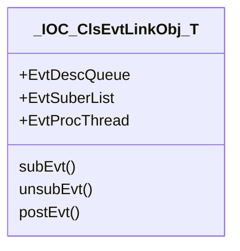
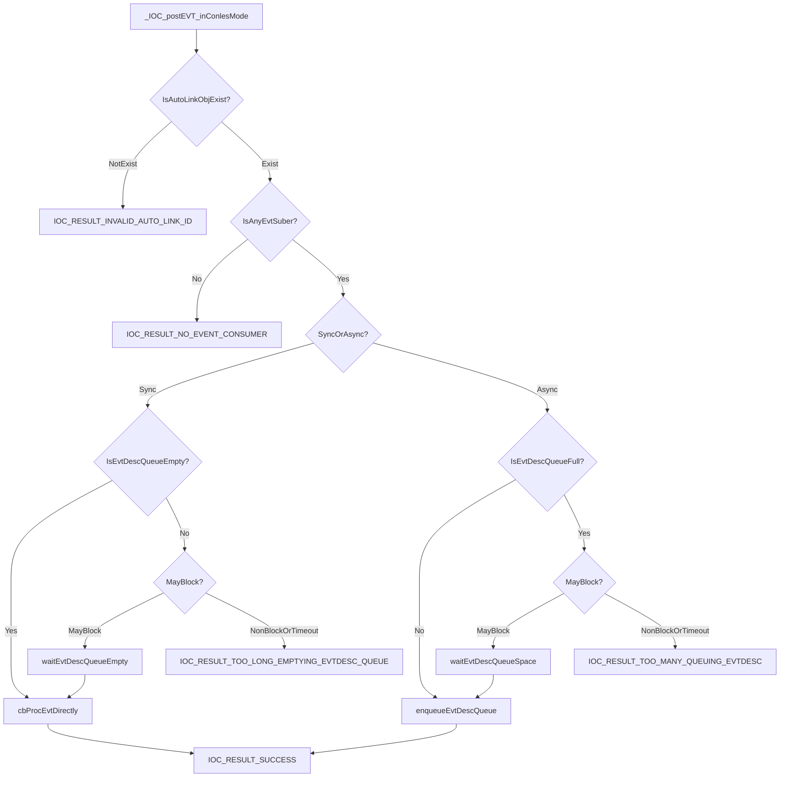

# About

* This file contains diagrams for ConlesEvent submodule design.

# DataType(Class) Diagram

```mermaid
classDiagram
    class _IOC_ClsEvtLinkObj_T{
        +EvtDescQueue
        +EvtSuberList
        +EvtProcThread

        subEvt()
        unsubEvt()
        postEvt()
    }
```

# FlowChart Diagram

## _IOC_postEVT_inConlesMode

```mermaid
flowchart TD
    _IOC_postEVT_inConlesMode --> AutoLinkObj{ IsAutoLinkObjExist? }
    AutoLinkObj -- NotExist --> IOC_RESULT_INVALID_AUTO_LINK_ID
    AutoLinkObj -- Exist --> EvtSuber{ IsAnyEvtSuber? }
    EvtSuber -- No --> IOC_RESULT_NO_EVENT_CONSUMER
    EvtSuber -- Yes --> OptMode{ SyncOrAsync? }
    OptMode -- Sync --> IsEvtDescQueueEmpty{ IsEvtDescQueueEmpty? }
    IsEvtDescQueueEmpty -- Yes --> cbProcEvtDirectly
    IsEvtDescQueueEmpty -- No --> OptWaitSync{ MayBlock? }
    OptWaitSync -- MayBlock --> waitEvtDescQueueEmpty --> cbProcEvtDirectly --> IOC_RESULT_SUCCESS
    OptWaitSync -- NonBlockOrTimeout --> IOC_RESULT_TOO_LONG_EMPTYING_EVTDESC_QUEUE
    OptMode -- Async --> EvtDescQueue{ IsEvtDescQueueFull? }
    EvtDescQueue -- No --> enqueueEvtDescQueue
    EvtDescQueue -- Yes --> OptWaitASync{ MayBlock? }
    OptWaitASync -- MayBlock --> waitEvtDescQueueSpace --> enqueueEvtDescQueue --> IOC_RESULT_SUCCESS
    OptWaitASync -- NonBlockOrTimeout --> IOC_RESULT_TOO_MANY_QUEUING_EVTDESC
```
