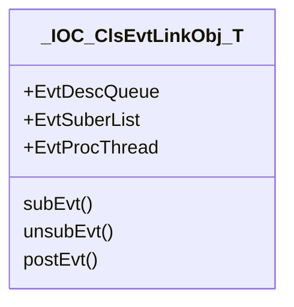
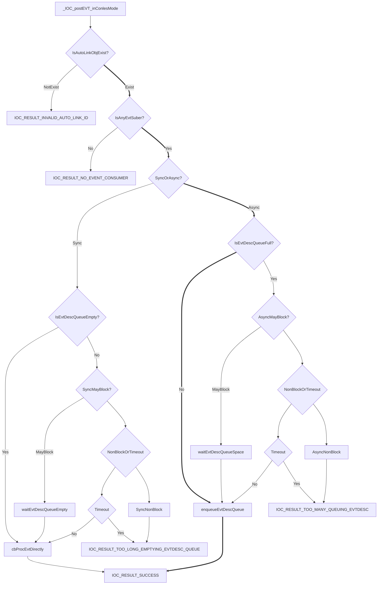

# About

* This file contains diagrams for ConlesEvent submodule design.

# DataType(Class) Diagram

# Design Decisions

## Two-Phase Execution Pattern (Deadlock Prevention)

To prevent deadlocks when user callbacks perform re-entrant operations (like `IOC_subEVT`, `IOC_unsubEVT`, or `IOC_postEVT`), the event processing loop follows a **Two-Phase** pattern:

1.  **Phase 1: Snapshot (Under Lock)**
    *   Acquire the internal mutex.
    *   Identify the list of subscribers for the current event.
    *   Copy the subscriber pointers to a local "snapshot" array.
    *   Release the internal mutex.
2.  **Phase 2: Invocation (Lock-Free)**
    *   Iterate through the snapshot array.
    *   Invoke each callback.
    *   Since the lock is released, callbacks can safely call other IOC APIs without causing deadlocks.

## State Machine & Re-entrancy

The `LinkObj` maintains internal flags to track its current activity:
*   `IsInCbProc`: Set during Phase 2 of event processing.
*   `IsInSub`: Set during `IOC_subEVT`.
*   `IsInUnsub`: Set during `IOC_unsubEVT`.

**Rules:**
*   `IOC_postEVT(SyncMode)` is **FORBIDDEN** if `IsInCbProc` is true (returns `IOC_RESULT_FORBIDDEN_IN_CALLBACK`).
*   `IOC_subEVT` and `IOC_unsubEVT` are **ALLOWED** during `IsInCbProc`. They will modify the subscriber list for *future* events, but will not affect the current snapshot being processed.

# Robustness Test Matrix

| ID | Name | Description | Result |
|:---|:---|:---|:---|
| TC-1 | Backpressure (Slow Consumer) | Producer blocks when queue is full. | Pass |
| TC-2 | Queue Overflow (Fast Producer) | Producer returns error when queue is full (NonBlock). | Pass |
| TC-3 | Timeout (Full Queue) | Producer returns timeout when queue stays full. | Pass |
| TC-4 | Recovery (After Backpressure) | System returns to normal latency after consumer catches up. | Pass |
| TC-5 | Cascading (Linear Chain) | Event A -> Callback -> Post Event B -> ... | Pass |
| TC-6 | Cascading (Exponential) | Event A -> Callback -> Post 2x Event B (Limited by queue). | Pass |
| TC-7 | Cascading (MayBlock) | Cascading events with MayBlock handle backpressure gracefully. | Pass |
| TC-8 | Recovery (After Storm) | System remains stable after a massive burst of events. | Pass |
| TC-9 | Sync Post in Callback | Forbidden to prevent deadlock. | Pass |
| TC-10 | Async Post in Callback | Allowed and succeeds. | Pass |
| TC-11 | Sync Post after Callback | Allowed and succeeds. | Pass |
| TC-12 | Max Subscribers | System handles reaching the subscriber limit gracefully. | Pass |
| TC-13 | Queue Drain after Unsub | Events already in queue are delivered even if unsubscribed. | Pass |
| TC-14 | Unsub during Callback | A callback can safely unsubscribe itself. | Pass |
| TC-15 | Sub during Callback | A callback can safely subscribe new consumers. | Pass |

# FlowChart Diagram

## _IOC_postEVT_inConlesMode

