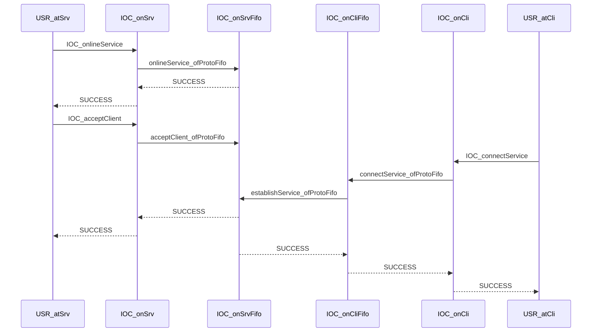
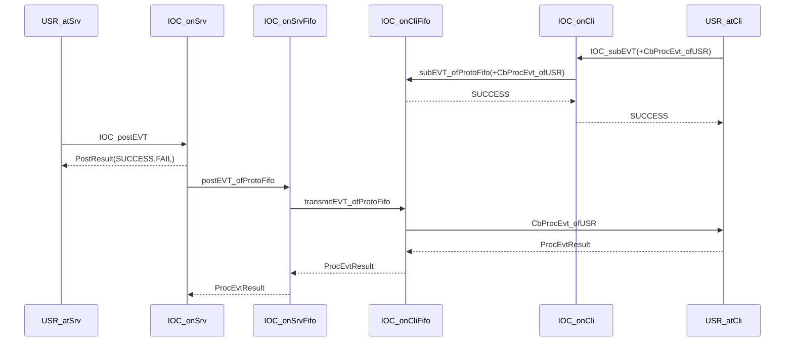
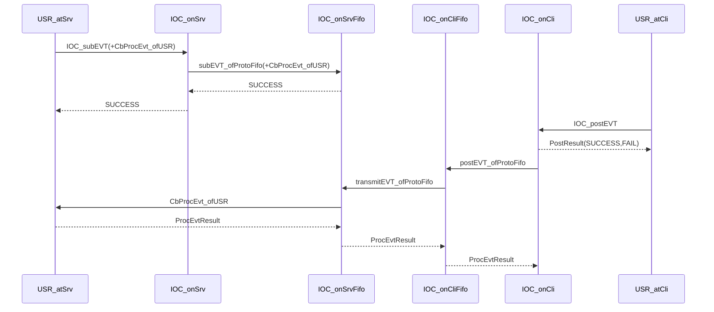
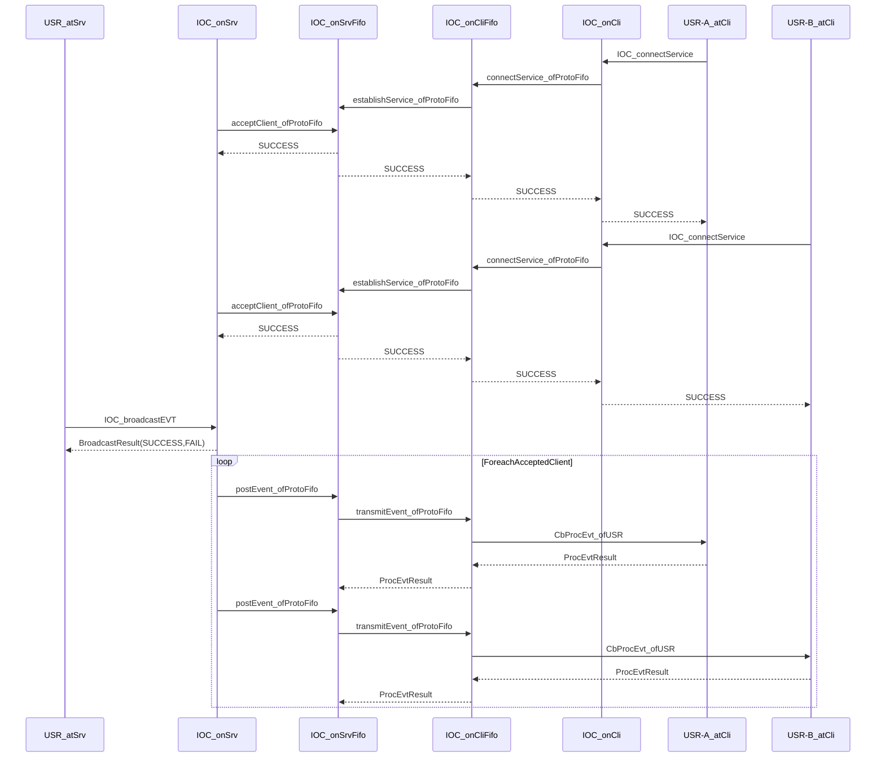

[[TOC]]

# IOC_onlineService vs IOC_connectService

```mermaid
sequenceDiagram
    participant USR_atSrv 
    participant IOC_onSrv
    participant IOC_onSrvFifo 
    participant IOC_onCliFifo
    participant IOC_onCli
    participant USR_atCli

    USR_atSrv->>IOC_onSrv: IOC_onlineService
    IOC_onSrv->>IOC_onSrvFifo: onlineService_ofProtoFifo
    IOC_onSrvFifo-->>IOC_onSrv: SUCCESS
    IOC_onSrv-->>USR_atSrv: SUCCESS

    USR_atSrv->>IOC_onSrv: IOC_acceptClient
    IOC_onSrv->>IOC_onSrvFifo: acceptClient_ofProtoFifo

    USR_atCli->>IOC_onCli: IOC_connectService
    IOC_onCli->>IOC_onCliFifo: connectService_ofProtoFifo
    IOC_onCliFifo->>IOC_onSrvFifo: establishService_ofProtoFifo

    IOC_onSrvFifo-->>IOC_onSrv: SUCCESS
    IOC_onSrv-->>USR_atSrv: SUCCESS

    IOC_onSrvFifo-->>IOC_onCliFifo: SUCCESS
    IOC_onCliFifo-->>IOC_onCli: SUCCESS
    IOC_onCli-->>USR_atCli: SUCCESS
```

# IOC_subEVT vs IOC_postEVT
## USR_atSrv as EvtProducer

```mermaid
sequenceDiagram
    participant USR_atSrv 
    participant IOC_onSrv
    participant IOC_onSrvFifo 
    participant IOC_onCliFifo
    participant IOC_onCli
    participant USR_atCli

    USR_atCli->>IOC_onCli: IOC_subEVT(+CbProcEvt_ofUSR)
    IOC_onCli->>IOC_onCliFifo: subEVT_ofProtoFifo(+CbProcEvt_ofUSR)
    IOC_onCliFifo-->>IOC_onCli: SUCCESS
    IOC_onCli-->>USR_atCli: SUCCESS

    USR_atSrv->>IOC_onSrv: IOC_postEVT
    IOC_onSrv-->>USR_atSrv: PostResult(SUCCESS,FAIL)

    IOC_onSrv->>IOC_onSrvFifo: postEVT_ofProtoFifo
    IOC_onSrvFifo->>IOC_onCliFifo: transmitEVT_ofProtoFifo
    IOC_onCliFifo->>USR_atCli: CbProcEvt_ofUSR
    USR_atCli-->>IOC_onCliFifo: ProcEvtResult
    IOC_onCliFifo-->>IOC_onSrvFifo: ProcEvtResult
    IOC_onSrvFifo-->>IOC_onSrv: ProcEvtResult

```

## USR_atCli as EvtProducer

```mermaid
sequenceDiagram
    participant USR_atSrv 
    participant IOC_onSrv
    participant IOC_onSrvFifo 
    participant IOC_onCliFifo
    participant IOC_onCli
    participant USR_atCli

    USR_atSrv->>IOC_onSrv: IOC_subEVT(+CbProcEvt_ofUSR)
    IOC_onSrv->>IOC_onSrvFifo: subEVT_ofProtoFifo(+CbProcEvt_ofUSR)
    IOC_onSrvFifo-->>IOC_onSrv: SUCCESS
    IOC_onSrv-->>USR_atSrv: SUCCESS

    USR_atCli->>IOC_onCli: IOC_postEVT
    IOC_onCli-->>USR_atCli: PostResult(SUCCESS,FAIL)

    IOC_onCli->>IOC_onCliFifo: postEVT_ofProtoFifo
    IOC_onCliFifo->>IOC_onSrvFifo: transmitEVT_ofProtoFifo
    IOC_onSrvFifo->>USR_atSrv: CbProcEvt_ofUSR
    USR_atSrv-->>IOC_onSrvFifo: ProcEvtResult   
    IOC_onSrvFifo-->>IOC_onCliFifo: ProcEvtResult
    IOC_onCliFifo-->>IOC_onCli: ProcEvtResult
```

# IOC_broadcastEVT

```mermaid
sequenceDiagram
    participant USR_atSrv 
    participant IOC_onSrv
    participant IOC_onSrvFifo 
    participant IOC_onCliFifo
    participant IOC_onCli
    participant USR-A_atCli
    participant USR-B_atCli
    ###=> MORE: participant USR-C_atCli

    USR-A_atCli->>IOC_onCli: IOC_connectService
    IOC_onCli->>IOC_onCliFifo: connectService_ofProtoFifo
    IOC_onCliFifo->>IOC_onSrvFifo: establishService_ofProtoFifo
    IOC_onSrv->>IOC_onSrvFifo: acceptClient_ofProtoFifo
    IOC_onSrvFifo-->>IOC_onSrv: SUCCESS
    IOC_onSrvFifo-->>IOC_onCliFifo: SUCCESS
    IOC_onCliFifo-->>IOC_onCli: SUCCESS
    IOC_onCli-->>USR-A_atCli: SUCCESS

    USR-B_atCli->>IOC_onCli: IOC_connectService
    IOC_onCli->>IOC_onCliFifo: connectService_ofProtoFifo
    IOC_onCliFifo->>IOC_onSrvFifo: establishService_ofProtoFifo
    IOC_onSrv->>IOC_onSrvFifo: acceptClient_ofProtoFifo
    IOC_onSrvFifo-->>IOC_onSrv: SUCCESS
    IOC_onSrvFifo-->>IOC_onCliFifo: SUCCESS
    IOC_onCliFifo-->>IOC_onCli: SUCCESS
    IOC_onCli-->>USR-B_atCli: SUCCESS

    ###=> MORE: USR-A/-B subEVT(+CbProcEvt_ofUSR)

    USR_atSrv->>IOC_onSrv: IOC_broadcastEVT
    IOC_onSrv-->>USR_atSrv: BroadcastResult(SUCCESS,FAIL)

    ###=> FOREACH/LOOP USR-A/-B: IOC_onSrv->>IOC_onSrvFifo: postEvent_ofProtoFifo
    loop ForeachAcceptedClient
        IOC_onSrv->>IOC_onSrvFifo: postEvent_ofProtoFifo
        IOC_onSrvFifo->>IOC_onCliFifo: transmitEvent_ofProtoFifo
        IOC_onCliFifo->>USR-A_atCli: CbProcEvt_ofUSR
        USR-A_atCli-->>IOC_onCliFifo: ProcEvtResult
        IOC_onCliFifo-->>IOC_onSrvFifo: ProcEvtResult

        IOC_onSrv->>IOC_onSrvFifo: postEvent_ofProtoFifo
        IOC_onSrvFifo->>IOC_onCliFifo: transmitEvent_ofProtoFifo
        IOC_onCliFifo->>USR-B_atCli: CbProcEvt_ofUSR
        USR-B_atCli-->>IOC_onCliFifo: ProcEvtResult
        IOC_onCliFifo-->>IOC_onSrvFifo: ProcEvtResult
    end
    
```