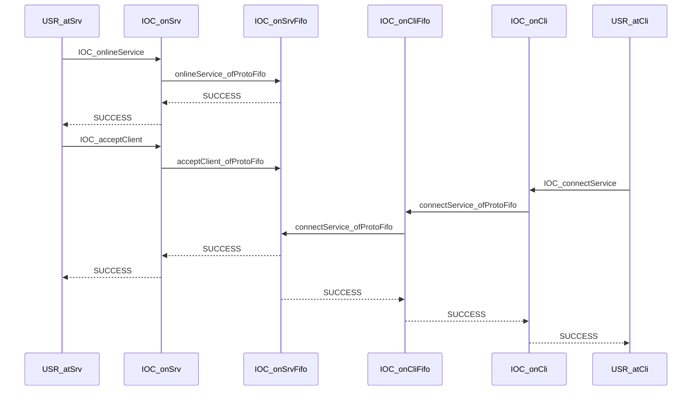
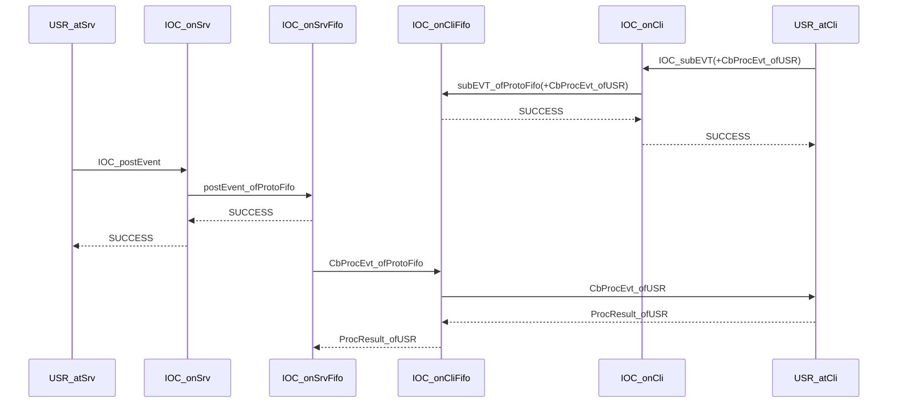

# IOC_onlineService vs IOC_connectService

```mermaid
sequenceDiagram
    participant USR_atSrv 
    participant IOC_onSrv
    participant IOC_onSrvFifo 
    participant IOC_onCliFifo
    participant IOC_onCli
    participant USR_atCli

    USR_atSrv->>IOC_onSrv: IOC_onlineService
    IOC_onSrv->>IOC_onSrvFifo: onlineService_ofProtoFifo
    IOC_onSrvFifo-->>IOC_onSrv: SUCCESS
    IOC_onSrv-->>USR_atSrv: SUCCESS

    USR_atSrv->>IOC_onSrv: IOC_acceptClient
    IOC_onSrv->>IOC_onSrvFifo: acceptClient_ofProtoFifo

    USR_atCli->>IOC_onCli: IOC_connectService
    IOC_onCli->>IOC_onCliFifo: connectService_ofProtoFifo
    IOC_onCliFifo->>IOC_onSrvFifo: connectService_ofProtoFifo

    IOC_onSrvFifo-->>IOC_onSrv: SUCCESS
    IOC_onSrv-->>USR_atSrv: SUCCESS

    IOC_onSrvFifo-->>IOC_onCliFifo: SUCCESS
    IOC_onCliFifo-->>IOC_onCli: SUCCESS
    IOC_onCli-->>USR_atCli: SUCCESS
```

# IOC_subEVT vs IOC_postEVT

```mermaid
sequenceDiagram
    participant USR_atSrv 
    participant IOC_onSrv
    participant IOC_onSrvFifo 
    participant IOC_onCliFifo
    participant IOC_onCli
    participant USR_atCli

    USR_atCli->>IOC_onCli: IOC_subEVT(+CbProcEvt_ofUSR)
    IOC_onCli->>IOC_onCliFifo: subEVT_ofProtoFifo(+CbProcEvt_ofUSR)
    IOC_onCliFifo-->>IOC_onCli: SUCCESS
    IOC_onCli-->>USR_atCli: SUCCESS

    USR_atSrv->>IOC_onSrv: IOC_postEvent
    IOC_onSrv->>IOC_onSrvFifo: postEvent_ofProtoFifo

    IOC_onSrvFifo-->>IOC_onSrv: SUCCESS
    IOC_onSrv-->>USR_atSrv: SUCCESS

    IOC_onSrvFifo->>IOC_onCliFifo: CbProcEvt_ofProtoFifo
    IOC_onCliFifo->>USR_atCli: CbProcEvt_ofUSR
    USR_atCli-->>IOC_onCliFifo: ProcResult_ofUSR
    IOC_onCliFifo-->>IOC_onSrvFifo: ProcResult_ofUSR

```