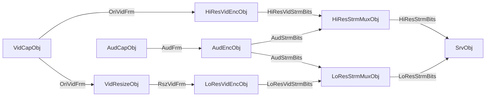
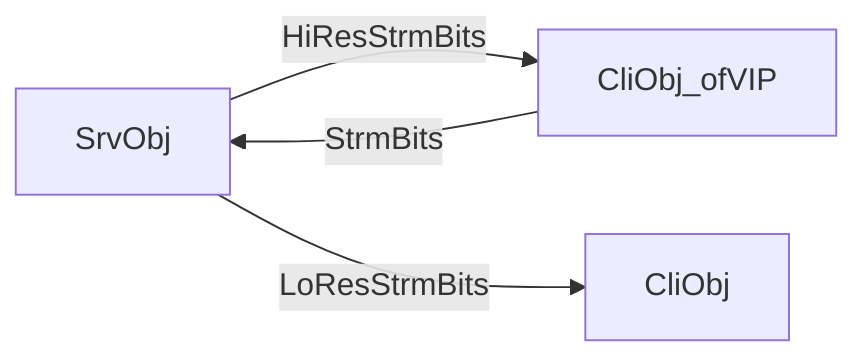
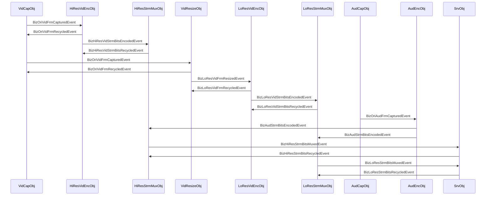
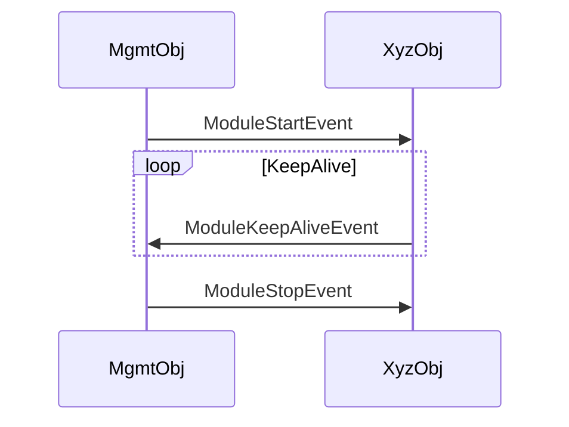

# UT_ConlesEventDemoLiveCam

* Use this file to write and preview module objects in the UT_ConlesEventDemoLiveCam.

## Data flow of service side module objects

## Data flow between service side and client side module objects

## Event flow of service side module objects

### From Biz Viewpoint

### From Management Viewpoint

