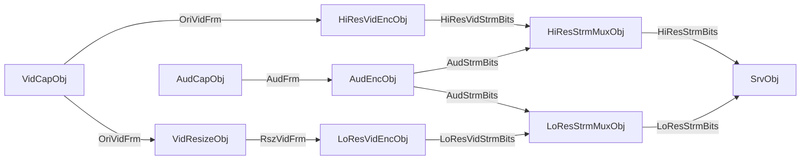

# UT_ConlesEventDemoLiveCam

* Use this file to write and preview module objects in the UT_ConlesEventDemoLiveCam.

## Data flow of service side module objects

```mermaid
flowchart LR
    VidCapObj -- OriVidFrm --> HiResVidEncObj --HiResVidStrmBits--> HiResStrmMuxObj
    VidCapObj -- OriVidFrm --> VidResizeObj -- RszVidFrm --> LoResVidEncObj -- LoResVidStrmBits --> LoResStrmMuxObj
    AudCapObj -- AudFrm --> AudEncObj -- AudStrmBits --> HiResStrmMuxObj
    AudEncObj -- AudStrmBits --> LoResStrmMuxObj

    HiResStrmMuxObj -- HiResStrmBits --> SrvObj
    LoResStrmMuxObj --LoResStrmBits --> SrvObj
```
