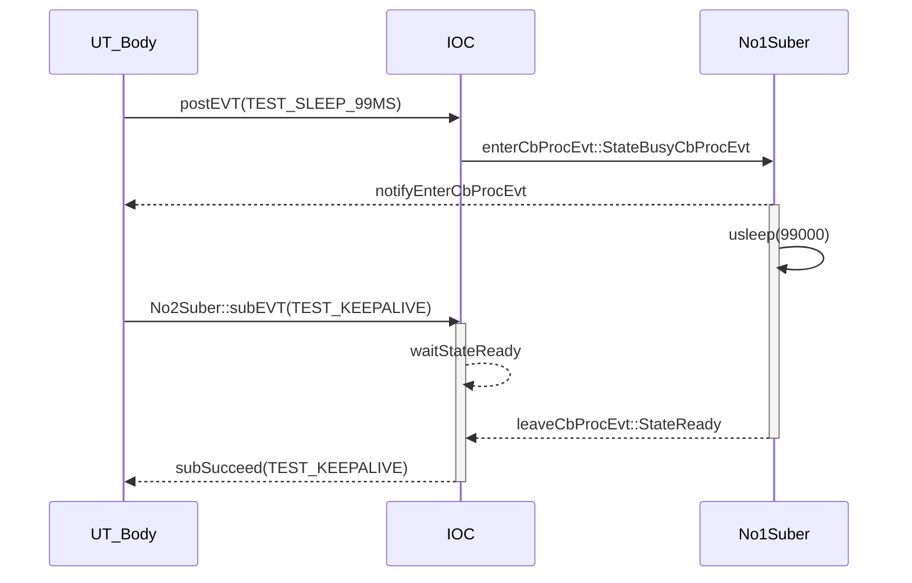

# Flowchart

## Case-05

```mermaid
sequenceDiagram
    participant UTB as UT_Body
    participant IOC as IOC
    participant No1Suber 

    UTB->>IOC: postEVT(TEST_SLEEP_99MS)
    IOC->>No1Suber: enterCbProcEvt::StateBusyCbProcEvt

    No1Suber -->> UTB: notifyEnterCbProcEvt

    activate No1Suber
    No1Suber->>No1Suber: usleep(99000)

    UTB ->> IOC: No2Suber::subEVT(TEST_KEEPALIVE)
    activate IOC
    IOC -->> IOC: waitStateReady

    No1Suber -->> IOC: leaveCbProcEvt::StateReady
    deactivate No1Suber

    IOC -->> UTB: subSucceed(TEST_KEEPALIVE)
    deactivate IOC

```
