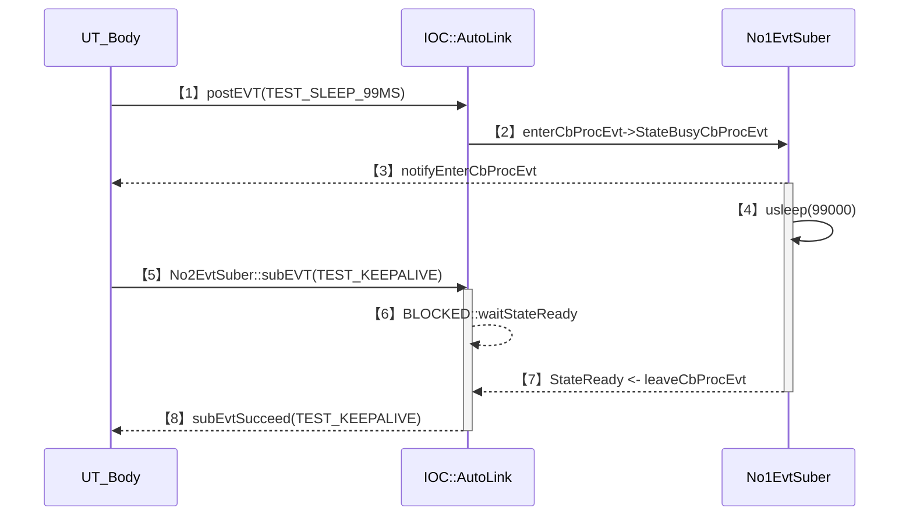

# About

* This is design document for IOC's UT_ConlesEventState.
* The architectural design section of Conles Event State is in [README_ArchDesign](../README_ArchDesign.md).

# Flowchart

## Case-04
  

## Case-05

